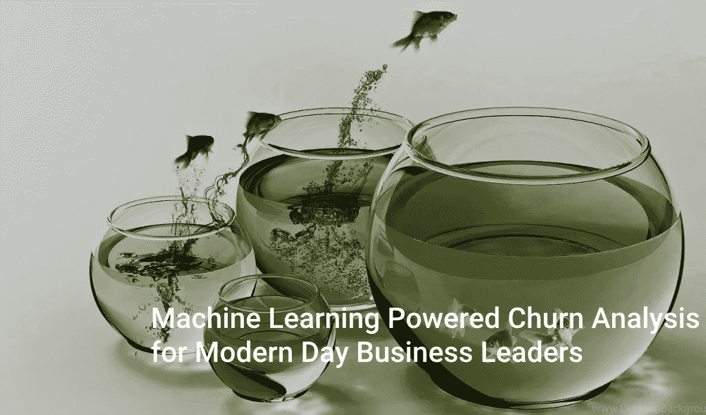
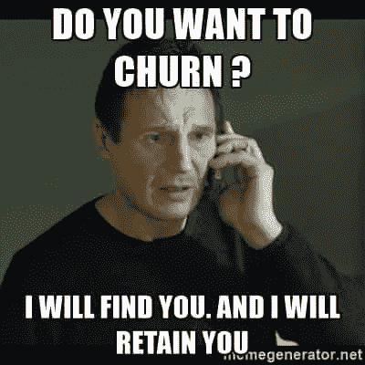
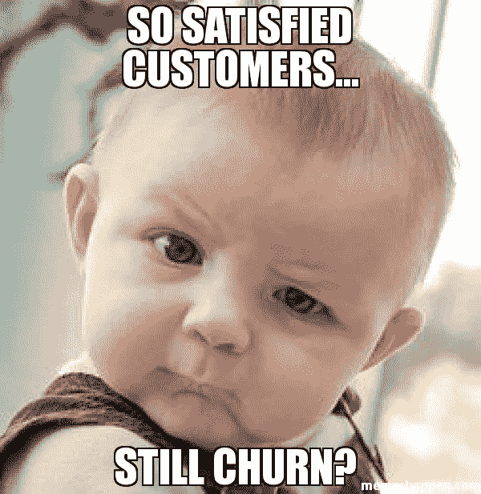
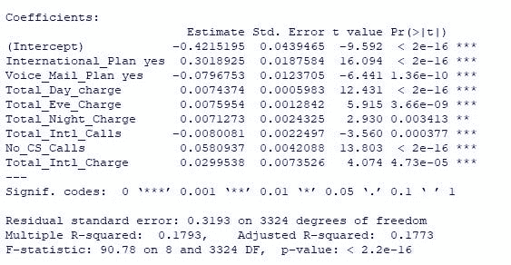
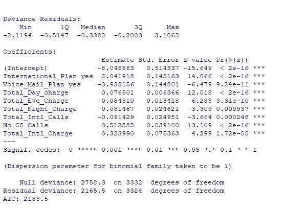
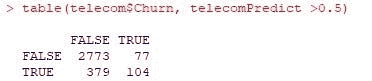
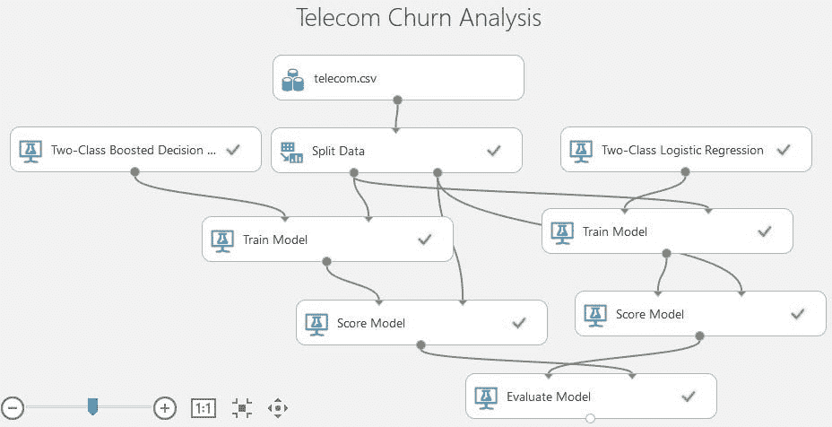
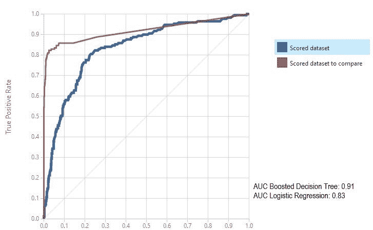

# 面向现代商业领袖的机器学习驱动的流失分析

> 原文：<https://towardsdatascience.com/machine-learning-powered-churn-analysis-for-modern-day-business-leaders-ad2177e1cb0d?source=collection_archive---------2----------------------->

Original image from [www.desktopbackground](http://www.desktopbackground).org. Recolored and rebranded by the author. For images, unless the source is specifically mentioned, are created by the author: All copyright reserved. Please attribute during sharing.

*与* [*阿奴勒哈维尔马*](https://www.linkedin.com/in/anulekha-verma/) *合著。Anulekha 和我是在一次聚会上认识的。她是这里包含的示例实现的贡献者。*

**简介**

最近，在帕洛阿尔托的一次创始人聚会上，我遇到了一家成功的 SaaS 公司的首席执行官，他正在开发客户参与工具。当我们在讨论机器学习在 SaaS 企业中的应用时，话题很快转向了(客户)流失管理。消费者市场和企业部门的所有业务都必须处理客户流失问题，因为它可能最终会影响公司的收入数字，从而影响政策决策。

根据*《在混乱的边缘领先》*的作者，客户保持率增加 2%(或流失率降低)相当于成本降低 10%。难怪 SaaS 的公司(以及关心客户的公司)非常重视客户流失分析。此外，根据白宫消费者事务办公室的调查，获得一个新客户的成本是留住一个老客户的 6-7 倍。

这家公司的首席执行官一直在使用基于简单统计模型的传统追溯流失管理。他的团队已经列出了高消费倾向的顾客，并通过特殊的礼宾服务来满足他们的需求。这在应用程序的工作流程中引入了新的步骤，并影响了所有部门的整体生产力，尤其是涉及 UX 设计、A/B 测试和市场信息的团队。业务团队意识到，这种对流失客户的特殊处理不是一个可持续的过程，他们需要一个全面的流失管理策略，该策略考虑到风险(和相关的风险容忍度)、针对不同客户群的保留干预的水平和成本，更加系统和持续。

> *“竞争优势只有两种来源，比竞争对手更快地了解我们的客户的能力，以及比竞争对手更快地将这种了解转化为行动的能力”*
> 
> ——通用电气前董事长兼首席执行官杰克·韦尔奇

**客户流失率指的是一家公司的客户流失率，或者更简单地说，客户离开你的公司或服务的速度。**客户流失的例子包括

*   订阅的取消
*   关闭账户
*   不续签合同或服务协议
*   在另一家商店购物的决定
*   使用其他服务提供商

许多不同的原因都可能导致客户流失，客户流失分析有助于确定客户流失的原因(和时机),为实施有效的客户保留策略创造机会。这里有 6 个经过时间考验的步骤，确保你专注于留住你的客户——在本文中，我们将只关注第 2 步和第 3 步的部分内容。此时，请记住，这并不是要将客户流失归咎于产品或客户成功团队，而是要制定一个策略来提高客户保持率。

1.  收集可用的客户行为、交易、人口统计数据和使用模式
2.  利用这些数据点来预测可能流失的客户群
3.  创建一个模型，根据客户流失概率来确定业务的风险承受能力。
4.  设计一个干预模型，考虑干预水平如何影响流失率和客户终身价值(CLV)
5.  在多个客户群中实施有效的实验，以减少客户流失并提高客户保留率。
6.  冲洗并重复第 1 步*(认知流失管理是一个持续的过程，不是一年一次的练习)*。

我们还认为，风险分析-决策-市场细分的方法是一个足够通用的结构，可以用于许多业务问题，而不仅仅是流失分析。

## **等等，这到底是什么？**

预测性流失模型是一种简单明了的分类工具:查看过去的用户活动，并检查特定时间后谁是活跃的，然后创建一个模型，从概率上确定客户(或细分市场)离开你的服务或产品的步骤和阶段。

拥有一个预测性的客户流失模型，可以让你在留住客户的过程中获得认知和可量化的指标。这让你有能力了解离开的顾客的习惯，并在他们做出决定之前介入。如果没有这个工具，您将根据广泛的假设行事，而不是根据反映客户真实行为的数据驱动模型行事。

如果没有对客户及其行为的深入了解，就很难留住他们，因此创建该模型的第一步是从客户数据点了解您的客户行为。让我们看看我们需要什么样的数据来评估导致他们最终离开你公司的诱因。

**客户信息**

*   邮政区码
*   收入阶层
*   性别
*   职业
*   他们家里有孩子吗？
*   他们如何找到你的网站/产品？
*   他们会打开你的简讯和其他触发邮件或者点击任何链接吗？

**产品**

*   产品类型
*   各种产品
*   优惠券用法
*   产品偏好或组合

**购买历史**

*   购买频率
*   上次购买日期
*   购买的时间/季节
*   采购价值
*   支付方式
*   余额/商店信用

**客户互动**

*   服务问题
*   商店访问/在线
*   投诉解决方案
*   投诉优先级
*   他们如何抱怨——电子邮件、电话还是推特？
*   投诉频率

**这些只是一些样本领域开始，我们更喜欢。重要的是尽可能多地了解我们的客户，了解是什么事件导致他们离开并寻找下一个竞争对手。**您收集的相关数据越多，您的模型就越精确。如果你使用机器学习支持的客户流失模型，你可以使用比人类可能计算和处理的更多的变量。一旦你在一个地方有了这些不同但相关的客户数据，以便于操作和查询，你就会看到趋势浮现在你的眼前，这将使你对客户流失有所了解。所有被搅动的客户的综合数据也将帮助你对行为进行分组并建立模式。

## **数据准备**

一旦你为你的分析收集了足够的数据，下一步就是*数据准备*。这是数据分析中最耗时但最重要的一步。就像那句著名的格言所说的那样- *“垃圾进来，垃圾出去”*。你的分析将和它所基于的数据一样好。

您可以使用这三个标准来确保高质量的数据:

*   完成
*   干净的
*   精确的

**完成-** 你是否有所有相关的尺寸？有多少百分比的数据缺少值或为空？您可以通过数据探索来填充一些缺失的值，例如，基于客户地址的“州”值；基于产品项目等的“产品类别”。

**清除-** 同一个维度是否有多个值？例如 CA/Calif/California；医疗保健/医院/提供商；产品名称等的不同缩写。如果是的话，你可以做一些数据清洗来保证一致性。

**准确-** 某些交易是否存在负收入值或 0 美元收入？；日期冲突；“无”或“不适用”值等。在与风险承担者讨论之后，您可以决定是否在分析中包含或排除这些不良数据。

在预测+诊断分析中，在*数据准备*中还涉及一个步骤——创建目标变量。在流失分析的情况下，它可以是一个二元列，如*“会流失吗？”*。您可以通过分析历史数据来填写此变量的值。*例如，对于取消订阅的客户，值为 1/TRUE，对于续订*的客户，值为 0/FALSE。

**探索性分析**

****文末示例实现为技术上倾斜****

与传统的统计建模不同，基于机器学习的预测模型是由计算机算法生成的，而不是由统计学家基于他们对线性回归和相关技术的结果的解释来生成的。构建客户流失模型的一个关键技能是能够提出尽可能多的问题。通过这种方式，您可以在实现模型之前测试、重新测试和验证您的假设和数据。以下是一些基本的入门问题。

***1。可用数据点与流失之间的相关程度如何？***

从这个问题中，可能会找到这样的答案:“在上个季度离开的所有客户中，80%的人在周末提出了投诉”，或者“在上两个季度离开的所有客户中，56%的人从未使用过我们软件中的报告工具”。您的目标是使用这个探索性问题来揭示特定数据点与流失之间的一种或多种关联模式。与此同时，也向当前客户提出同样的问题，看看你的总体假设是否成立，或者它们只是散点图上的随机点:如果你的假设是真实的，那么你已经发现了一个需要关注的趋势，如果不是，继续问更多的问题。

使用机器学习模型还可以向您展示一些人类分析师通常看不到的相关性。

**2*。他们离开了产品生命周期的哪个阶段？***

这些顾客是什么时候离开的？在第一次试用结束时，当订阅过期时，或者某些功能太难使用，或者它是一个外部事件？他们离开前用了我们的软件多久？他们是不是打电话给客服，不满意就走了？对于没有离开并续订订阅的客户来说，有哪些关键趋势？

继续探索每一个数据点及其比率——机器学习模型通常比人类做得好得多，并发现意想不到的模式。

***3。不同客户群对终身价值(LTV)有什么影响？***

一个好的模型的结果是找到等同于提高或增加保留率和降低流失率的触发因素和行为。您的每个属性都可以映射到提升或下降商。例如，如果特定细分市场中的每个客户都有 100 美元的 LTV，而您的模型显示其中有 X 人正在离开，那么您可以轻松地突出这种流失对顶线的负面影响，帮助业务领导量化并优先考虑保留策略。

## 接下来会发生什么..

我们希望您将探索得筋疲力尽，并发现一些有趣的客户流失模式。您可能还发现了一两个高度相关的数据点，或者可能是一个较大的存储桶，其差异不如您预期的那样大。

如果你找不到至少三个高度相关的属性，你就没有对你的数据提出正确的问题，或者也许你一开始就没有正确的数据集。

一旦您确定了导致客户流失的客户群及其行为，您就可以为您的团队提出提高客户保留率的建议。设计、实现和推断智能实验的结果是另一篇文章的主题，但这里有一些快速的想法。

对于一家正在经历低收入人群流失的电信公司来说，他们使用的短信比实际电话更多，这可能是为了建立一个针对该细分市场的利基“计划”，以防止用户转向下一个提供商。

对于一个在线项目管理工具服务来说，在试用期内客户会迅速减少，可以在新客户入职时提供明确的培训课程，使试用期更有吸引力。

## **示例实现(Kaggle 电信数据集)**

为了本文的简单起见，我们将假设数据已经准备好输入预测引擎，并从简单的线性回归模型或逻辑回归模型开始做一些探索性分析。线性回归模型有助于找出哪组独立维度/预测因子擅长预测目标变量。此外，挑选出具有特别强影响力的变量。

这里有一个基于[电信 Kaggle 数据集](https://www.kaggle.com/c/churn-analytics-bda/data)的简单线性回归模型:

*lm(Churn ~ International _ Plan+Voice _ Mail _ Plan+Total _ Day _ Charge+Total _ Eve _ Charge+Total _ Night _ Charge+Total _ Intl _ Calls+No _ CS _ Calls+Total _ Intl _ Charge，data = telecom)*

客户流失是因变量。自变量后接“~”符号。“电信”是所用数据集的名称。你可以添加/删除自变量，这取决于它如何改变调整后的 R2 值——如果它增加了，它就是一个重要的预测指标；如果它降低了值，您可以将其排除。

输出:

Output of Linear Regression model in R for the dataset analyzed

为了解释哪些属性有很强的影响，我们看一下末尾星号的数量。***' —非常显著；**'-显著；*”重要；'.'没那么重要

我们看到，对于电信业务，像*“客户服务呼叫数量”*；*“国际计划优惠”*；*【国际通话费率】*等在被检查数据集的客户流失中扮演着重要角色。从商业角度来看，这需要进一步调查客户服务信息分析和/或提供有竞争力的计划来保持客户忠诚度。

使用逻辑回归模型也会产生类似的结果:

*glm(Churn ~ International _ Plan+Voice _ Mail _ Plan+Total _ Day _ Charge+Total _ Eve _ Charge+Total _ Night _ Charge+Total _ Intl _ Calls+No _ CS _ Calls+Total _ Intl _ Charge+，数据=电信，家庭=二项式)*

输出:

Output of Logistic Regression model in R for dataset analyzed

该模型将相同的预测因素视为对“流失”变量的强大影响。当我们使用[混淆矩阵](https://www.dataschool.io/simple-guide-to-confusion-matrix-terminology/)计算模型的准确性时，结果是 86.3%。

Confusion Matrix in R

*准确率=(真阴性+真阳性)/总记录数*

0.8632=(2773+104)/3333

该模型现在已经准备好在测试数据上实现了。在逻辑回归的情况下，这是使用*预测()*函数完成的:

*预测(telecomLog，type= "response "，newdata=telecomTest)*

在哪里

“telecomLog”是逻辑回归模型。

“远程测试”是测试数据集。

“响应”告诉预测引擎根据概率产生输出，在我们的情况下这是有意义的，因为我们想知道哪些客户具有高流失概率。

*Tableau visualization of insights derived from Logistic Regression Model implementation in R. The charts highlight a positive correlation between no. of customer service calls and churn probability as well as a stronger correlation influence of international plans and churn.*

现在，我们已经完成了探索性分析，并了解了具有影响的变量，我们可以深入研究基于**集合模型的方法**。如今，数据科学家正在使用多模型或集成方法来解决预测分析中的复杂业务问题，如客户流失。在这种方法中，在同一数据集上使用两种或更多种算法，比较结果以获得更高的准确性并防止过度拟合。

*Ensemble Modeling in Microsoft Azure Machine Learning*

在这里，我们已经使用微软 Azure 机器学习在[电信 Kaggle 数据集](https://www.kaggle.com/c/churn-analytics-bda/data)上使用两种算法预测流失:增强决策树和逻辑回归。

集成建模方法的更高精度降低了 [*误分类率*或*总体错误率*](https://www.dataschool.io/simple-guide-to-confusion-matrix-terminology/) *。*

错误分类率是指被识别为高风险客户的客户中有多少人实际上进行了**而不是**客户流失。通过避免向低风险客户发送特别促销/套餐，并专注于对高风险客户的干预，这可以为企业节省大量资金。下面是集合模型的精度比较:

The ROC curves of Boosted Decision Tree and Logistic Regression models

比较两个模型的 AUC(曲线下面积)值，我们看到两类提升决策树在识别错误分类方面比传统的逻辑回归模型表现得更好。增强决策树模型的错误分类率较低，为 5%，而逻辑回归模型的错误分类率为 16%。因此，通过集成方法，我们可以利用两种模型的优势——逻辑回归模型识别对目标变量有强烈影响的预测因素，而增强决策树更准确地识别高风险搅动者。

总之，预测复杂商业现象的整体方法是传统统计建模和整体建模等前瞻性方法的良好结合。

## 最后…

如果你真的想做出高质量的、风险可控的、以客户为中心的决策，而这些决策需要依赖于关于世界的结论，而不仅仅是可用的数据，那么你的团队中就需要决策科学家和工程师。客户流失管理对于任何业务都是必不可少的，基于机器学习的算法使其更加准确。如果你正在经营一家企业，但你对自己的流失分析没有信心，也许是时候联系一下**决策科学专家** *(这是对* [*电子邮件*](mailto:sayhello@calcul.ai) *美国)*。