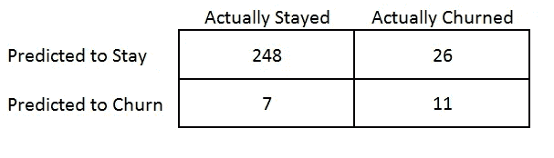
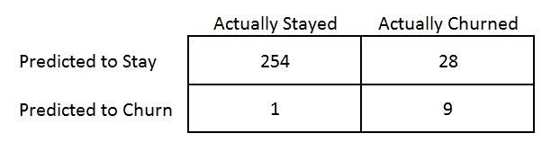
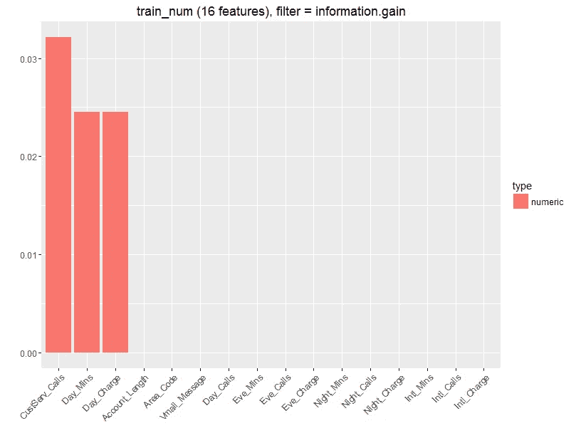

# 机器学习:预测客户流失

> 原文：<https://towardsdatascience.com/machine-learning-predicting-customer-churn-dd38a42774cf?source=collection_archive---------0----------------------->

这个模型的数据就是从这里得到的。这是一家身份不明的电信公司的客户数据。

用于预测流失的模型是 K 近邻。总体准确率为 90%。根据该模型预测会留下的 10 个客户中有 9 个最终留下，而根据该模型预测会流失的 10 个客户中有 9 个最终流失。

## 模型

KNN 是一个简单的算法。当出现新客户时，算法会在数据库中查找与目标客户最相似的客户。然后，它会根据那些相似的客户是否会流失来预测客户是否会流失。

其中包括一家电信公司的 976 名客户。其中 125 人被解雇，851 人留下。

为了制作模型，我将数据分成两部分。70%被放入训练集并用于创建模型。然后，该模型被用来预测另外 30%的人是否搅拌。

用于预测客户是否可获得的变量有:

1.  状态
2.  账户长度
3.  电话地区号
4.  电话
5.  国际计划
6.  Vmail 计划
7.  邮件信息
8.  日分钟
9.  日间通话
10.  日间费用
11.  前夕分钟前夕电话
12.  前夕费用
13.  夜晚分钟
14.  夜间通话
15.  夜间收费
16.  国际分钟
17.  国际呼叫
18.  国际收费
19.  客户服务器调用

KNN 只处理数字变量，所以对于这个模型，我将删除所有非数字变量。(有一些使用分类变量的技术，比如一键编码，但是我们在这里忽略它们)。

模特表现如何？结果如下:

Accuracy = 89%

## 优化模型

89%的初始准确性是不错的，但是如果我们仔细选择 k 值和用于进行预测的变量，模型可以变得更准确。

我最初用的是三的 K。这意味着该模型将寻找三个最相似的客户，并使用它们来预测客户是否会流失。

如果 K 太小，模型会“过拟合”。这意味着该模型将在您用来创建它的数据上表现良好，但当它遇到新的观察结果时，它将表现不佳。如果 K 太高，模型的表现也会很差。K 的最佳值是通过选择一个不太高也不太低的值来选择的。

The Accuracy is highest when k = 5

如上图所示，模型精度稳步增加，直到在 5 处达到峰值，然后开始下降。因此，k 的最佳值为 5。

使用 k = 5 后，模型性能提高到 90%

## 变量选择

并非所有变量都有助于预测客户是否会流失。例如，客户的电话号码在预测中完全没有用，因为它对每个客户都是唯一的。

一种被称为信息增益的技术被用来观察哪些变量在预测客户流失方面最重要。Information gains 单独查看每个变量，并询问“如果我们单独按该变量分割数据集，预测结果会容易多少”。

这表明客户服务呼叫、呼叫分钟数和使用的信用是最能提供信息的变量。这是可以理解的，一个经常给客服打电话的客户可能对服务不满意，所以更有可能流失。而打很多电话的人可能对服务很满意，因此不太可能流失。所以这三个变量告诉我们很多关于客户流失的可能性。

## 概率阈值

KNN 给出了特定客户流失的概率。默认情况下，阈值通常设置为 0.5。这意味着任何概率超过 0.5 的人都有可能流失。如果你降低概率阈值，更多的人将被预测流失，这给你更多的“风险客户”的目标。然而，这增加了没有风险的客户通过门槛并被预测为流失的可能性。

概率阈值的选择将基于业务环境，如果公司想要以大量客户为目标，则将设置低阈值。然而，如果公司想更有效地支出，就要设定更高的门槛，以更少的顾客为目标。

## 业务影响。

有了这个模型，人们可以预测哪些客户有流失的风险。然后，公司可以采取措施留住这些客户，例如:

1.  客户满意度调查可以发送给“风险客户”,以了解他们对公司的看法以及可能的投诉。
2.  可以向有风险的客户提供折扣或其他激励措施，以试图留住他们。
3.  保留营销:处于风险中的客户可以被特别添加到保留营销列表中，以便谷歌广告、脸书、Twitter 或电子邮件活动可以专门针对他们。
4.  客户流失的可能性低，可以从重新定位名单中删除，这可以节省营销成本。

如果公司对其客户进行了细分，并了解具有最高终身价值的客户类型。那么最有价值的处于风险中的客户就可以用上述技术来专门锁定。

## 结论。

信息很多，但洞察力很少。一个收集数据并知道如何从这些数据中获得洞察力的公司可以更深入地了解客户。

公司的生死取决于他们的客户，真正以客户为中心意味着了解你的客户，并以独特的方式对待每一个客户，尤其是最有价值的客户。关于你的客户的大量可用数据。没有理由以一刀切的方式对待所有顾客。

如果你在经营一家新公司，你想更多地了解你的客户。了解你最有价值的客户的特征，找出你的风险客户，或者学习如何正确地收集和分析关于你的客户的数据。在 sayhello@techinnover.com 打电话给我，或者在这里拜访我们 [*。*](http://www.techinnover.com)

*P.p.s 模型是在 R 中构建的，如果你想要一个包含所有代码的脚本，你可以在 twitter 上 DM 我* [*德林·阿德巴约*](https://medium.com/u/dc19a11f6084?source=post_page-----dd38a42774cf--------------------------------)