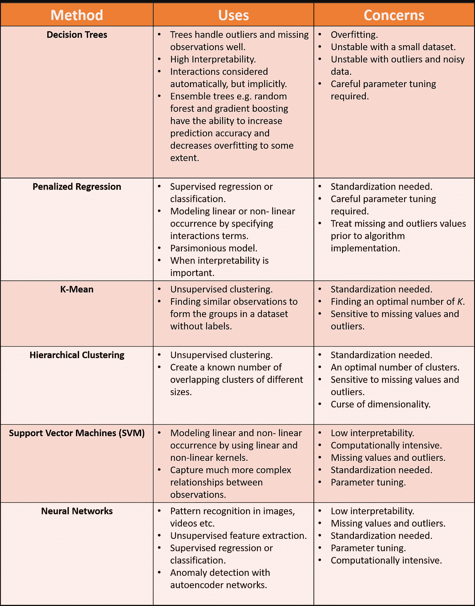

# 机器学习快速参考卡

> 原文：<https://towardsdatascience.com/machine-learning-quick-reference-card-cf92f6accd08?source=collection_archive---------4----------------------->

## 监督和非监督机器学习

在我最近的几篇[帖子](https://medium.com/@anujanagpal)中，我讨论了一些我在工作中经常使用的算法。然而，最重要的问题是何时使用这些算法。做事没有唯一正确的方法。您可以尝试不同的算法，通过模型比较来看看哪种算法最适合您的情况。

然而，拥有一张快速参考卡有助于缩小选择范围和做出决定。这也意味着这张参考卡做了一些概括/简化，但它为你指明了正确的方向。

你可以在这里下载这张[参考卡。](https://drive.google.com/file/d/0Bw3chZyB9zlvV29DWnFQTFYyaEYyc29IYUxNSm96cUVweHFZ/view?usp=sharing)

希望你喜欢这篇文章。敬请关注下一篇文章，了解更多机器学习基础知识。

快乐学习！