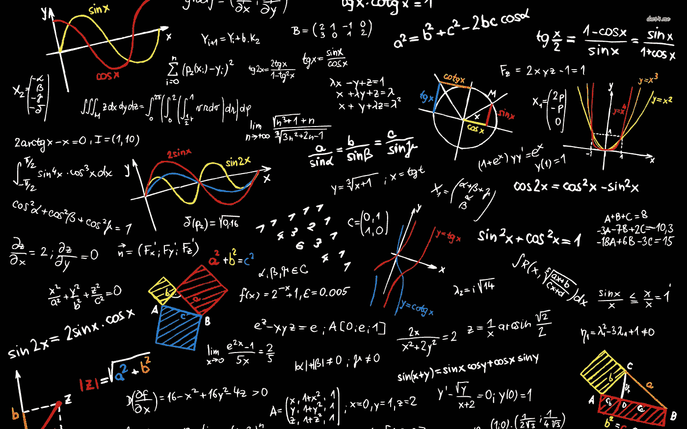
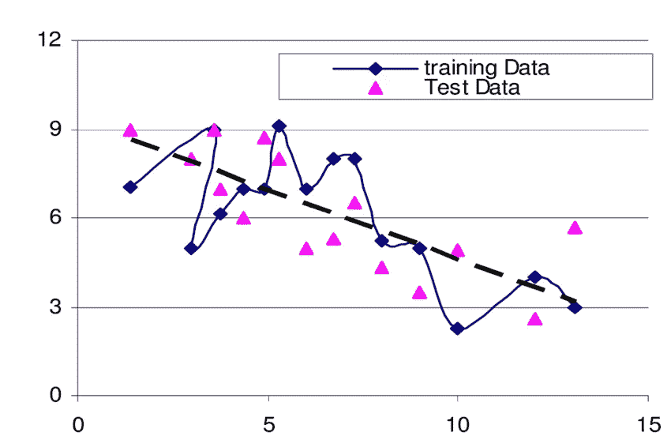

# 机器学习:岭回归详解

> 原文：<https://towardsdatascience.com/machine-learning-ridge-regression-in-detail-76787a2f8e2d?source=collection_archive---------9----------------------->



因为这里已经有足够多的关于线性回归的文章了，我就不再写了。相反，我将写一种标准化的回归类型——岭回归——它解决了数据过度拟合的问题。

## **岭回归的动机**

线性回归模型由以下等式给出:

```
**Y = Σ WⱼHⱼ(Xᵢ)**Here, 
**Σ** runs from *j = 0* to *j = D* where D is the total number of features.
**Wⱼ** is the *jᵗʰ* coefficient 
**Hⱼ** is the *jᵗʰ* feature function which takes **Xᵢ** observation
**Xᵢ** is the *iᵗʰ* observation
```

假设我们知道 **W** 系数的值，上面的等式给出了预测值。为了简化，让我们用𝔽( **X** 来表示上面的方程，其中 x 是观测值。

线性回归模型的成本函数由以下等式给出:

```
Cost Function = **RSS(W) = Σ [Yᵢ — 𝔽(Xᵢ)]²**
Here,
**Σ** runs from *i=0* to *i = N* where *N* is the total number of observations.
**Yᵢ** is the known value of *iᵗʰ* observation.
**𝔽(Xᵢ)** gives the predicted value of *iᵗʰ* observation.RSS stands for Residual Sum of Squares
```

代价函数总是作用于训练数据集。

线性回归模型的整个思想围绕着最小化上述成本函数值。成本函数值越低，线性回归模型越好。

通常，为了降低成本函数，我们增加模型中的特征数量。随着我们不断增加模型中的特征，模型开始很好地拟合训练数据集，并且成本函数值开始降低。

但是，随着特征数量的增加；我们的方程变成了一个高阶多项式方程；这导致了数据的过度拟合。

**为什么数据过度拟合不好？** 在过度拟合的模型中，训练误差几乎为零，这意味着模型在训练数据集上运行良好。但是，除了像真实的外部世界数据那样的训练数据集之外，这个模型在其他数据集上也能很好地工作吗？
通常可以看出，过度拟合的模型在测试数据集上表现较差，并且还观察到过度拟合的模型在额外的新测试数据集上表现较差。



Overfitted data & performing worse on test data set. [Source](https://www.researchgate.net/figure/A-sample-model-of-over-fitting_fig2_267840187)

从上面的图表中，我们可以看到过拟合模型在训练数据集上表现良好，并且训练数据集的成本函数为零。

但是当我们用上图中的测试数据集测试这个模型时，模型的表现一点也不好。对于测试数据，模型预测错误值与实际正确值相差甚远。这足以说明这种型号不适合在工业上使用。

**如何抓过拟合？** 通过可视化模型(如上)，可以很容易地看到模型中的过度拟合(观察模型如何很好地拟合训练数据集)。但是，随着我们的模型的复杂性增加，它进入了更高维度，这使得它很难在图表(或其他工具)上可视化。

除了总是试图可视化模型，我们还可以通过查看系数的值( **W** )来查看过拟合。通常当过拟合发生时，这些系数的值变得非常大。

岭回归用于通过测量系数的大小来量化数据的过度拟合。

要修复过度拟合的问题，我们需要平衡两件事:
1。函数/模型符合数据的程度。
2。系数的大小。

```
So,
Total Cost Function = Measure of fit of model + Measure of magnitude                    of coefficientHere,
Measure of fit of model = RSS(W)
Measure of magnitude of coefficient = ||W||²If Measure of fit of the model is a small value that means model is well fit to the data.
If Measure of magnitude of coefficient is a small value that means model is not overfit.**Total Cost Function = RSS(W) + λ*||W||²**We have added **λ** in total cost function as a tuning parameter to balance the fit of data and magnitude of coefficients.
```

## 计算岭回归的梯度下降

岭回归成本= RSS(W)+λ* | | W | | =(Y-WH)*(Y-WH)+WW

在矩阵符号中，它将被写成:
岭回归成本= (Y - HW)ᵗ (Y - HW) + WᵗW

取上述方程的梯度(微分):

```
Δ[RSS(W) + λ||W||]²
= Δ{(Y - HW)ᵗ(Y - HW)} + λ Δ{WᵗW}= -2Hᵗ(Y - HW)+2λW
```

设置上面的梯度为 0，我们得到

```
**W = (HᵗH + λI)-¹HᵗY**
```

因此，我们知道了 **W** 系数的值。

## λ值怎么选？

给定的数据集分为三组:
1。训练装置
2。验证集
3。测试装置


*Division of data into three different sets*

**训练集** 该数据集将用于获取λ的每个值的 **W** 系数的值。让我们假设λ值的每个值的 **W** 系数的值为 **W** λ。

**验证集** 将在验证集上评估 **W** λ的不同值。具有较低误差值的那个将被选择。

**测试集** 测试数据集将再次评估 **W** 系数的选定值。

上述方法仅在存在足够数量的数据时使用。

这就是最终选择λ值的方法。这个过程有点暴力。但是利用聪明的猜测和经验，可以减少猜测λ值的迭代。

## 结论

我们已经看到为什么过拟合在机器学习中是不好的，以及如何通过查看模型的 **W** 系数的值在模型中识别它。然后，我们看到了线性回归的新成本函数，它考虑了带有调整参数λ的数据的过度拟合。

然后，我们看到了关于新成本函数的计算公式 **W** 以及如何选择λ的值。