# 机器学习——一些骨骼

> 原文：<https://towardsdatascience.com/machine-learning-some-bones-dc5987c81cd2?source=collection_archive---------1----------------------->

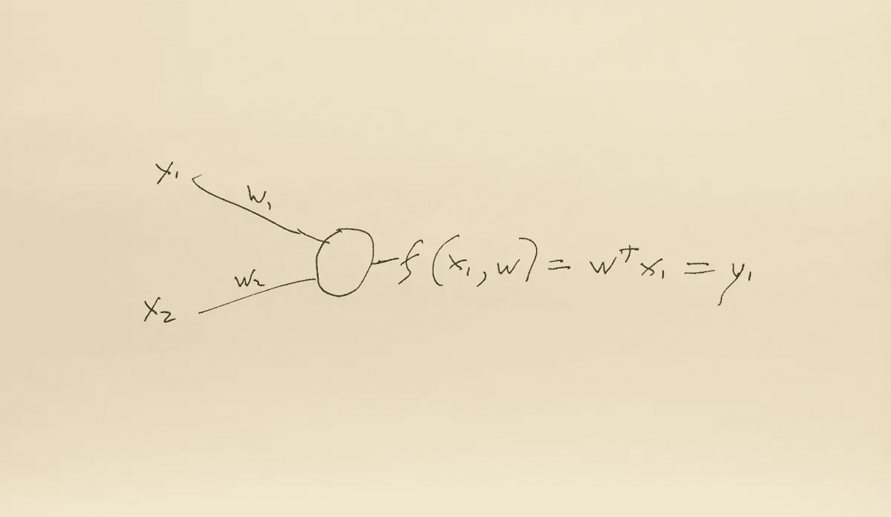

机器学习是一个松散的术语，它涵盖了许多活动。从软件工程的角度来看，它可以被看作是从模式识别发展而来的活动。它甚至可以更狭义地理解为给定输入值分配一个标签。一个被设计成从例子中学习的系统将包含一个分类器，该分类器将数据作为输入，并将一个标签分配给它作为输出。

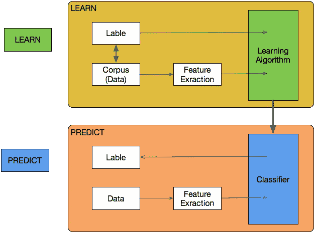

```
X = np.array([[1,2],[5,8],[1.5,1.8],[8,8],[1,0.6],[9,11]])
y = [0,1,0,1,0,1]
clf = svm.SVC(kernel='linear', C = 1.0)
clf.fit(X,y)
**print**(clf.predict([0.58,0.76]))
```

以上是使用 [SciKit-Learn](http://scikit-learn.org/) 库用 python 编写的机器学习程序的源代码。其实没什么大不了的！下面是计算一个数的平方根的 python 函数。

```
math.sqrt( x )
```

像所有的工具集一样，SciKit-learn 为开发人员、程序员和数据分析师提供了多种功能的组合。它是一种综合性的机器学习技术，旨在进行数据挖掘和数据分析。它自己工作得很好。它与张量流等其他技术配合得很好。它在其他程序中运行良好。

作为开发人员，我们经常使用许多工具，上面显示的例子是 python 内置的数学函数。我们可以在不知道它是如何工作的情况下使用该工具进行数学运算。我举的计算一个数的平方根的例子比我们想象的要复杂，但我们经常认为这是理所当然的，这并不妨碍我们胜任地使用它。剥一只猫的皮有许多方法，计算机程序和计算器也有许多方法找到一个数的[平方根](https://en.wikipedia.org/wiki/Methods_of_computing_square_roots#Approximations_that_depend_on_the_floating_point_representation)。

在开发软件时，了解您所使用的技术工具的基本框架确实会有所帮助。看到功能背后的内部结构，了解输入和输出之间的关系，了解正在发生的事情。我可以通过观察、代码片段、图表、公式和数学来理解这些复杂的东西。这篇文章虽然本质上是技术性的，却以轻浮的方式掠过了机器学习的表面。更全面的解释是存在的，我推荐三个:

[神经网络黑客指南](http://karpathy.github.io/neuralnets/)作者[安德烈·卡帕西](http://karpathy.github.io/)

[大脑 vs 深度学习第一部分:计算复杂性——或者为什么奇点离](http://timdettmers.com/2015/07/27/brain-vs-deep-learning-singularity/)很远

[神经网络和深度学习](http://neuralnetworksanddeeplearning.com/)作者[迈克尔·尼尔森](http://michaelnielsen.org/)

# 为什么要使用机器学习？

有些事情计算机程序做得很好，但对人类来说很难。从简单的计算，如平方一个数字；

```
**static** **void** main(String[] args) {
      **int** x = 5;
      x = x*x;
      System.out.println("x = " + x);
 }
}
x = 25
```

…稍微难一点的计算；

```
**public** **class** Main {
   **public** **static** **void** main(String[] args) {
      **double** x = 38.75645;
      x = x*x;
      System.out.println("x = " + x);
   }
}
x = 1502.0624166025
```

…到更复杂的过程，例如求一个数的平方。

虽然求一个数的平方很简单，但是求一个数的平方根的问题涉及更复杂的数学。

如同

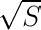

可以用下面的等式来表示

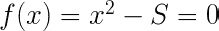

有许多算法可以用来寻找答案。牛顿发现的巴比伦方法就是一个例子；

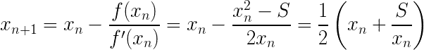

在 Javascript 中调用诸如 Math 函数这样的编程函数要容易得多；

```
var y = Math.sqrt(16);      // Returns the square root of 16, y = 4
```

编程语言使计算机能够很好地完成计算和数学等工作。然而，有些事情人类做得很好，而计算机却不擅长。计算机做得不太好的一个例子可能是基于不同的输入或理解语音做出决定。

机器很难像我们自然说话和打字那样理解语音和文本。人工神经网络(ANN)是克服这个问题的一种方法。为了理解他们如何克服这个问题，看看人工神经网络与传统的计算机程序有何不同是很有用的。


传统的程序通过使用中央处理器、读取指令和使用存储在特定地址的数据来遵循预定的程序而工作。不管它是否被写入；过程的、面向对象的或任何其他类型的语言。

运行一位代码，例如一个函数，会产生一个输出。编程语言倾向于运行一个进程，然后继续下一个进程。一个函数的结果导致另一个函数被调用。虽然一些程序允许并行过程同时运行，并且大体上重复过程，但是有一个逻辑流程，一件事情接着另一件事情。

大多数程序遵循相当复杂的指令，由许多相互联系的子程序组成，它们遵循一个可能有许多路径的逻辑流程。每一个岔路口和每一条路径都必须明确地写下来，复杂的决策需要复杂的指令。

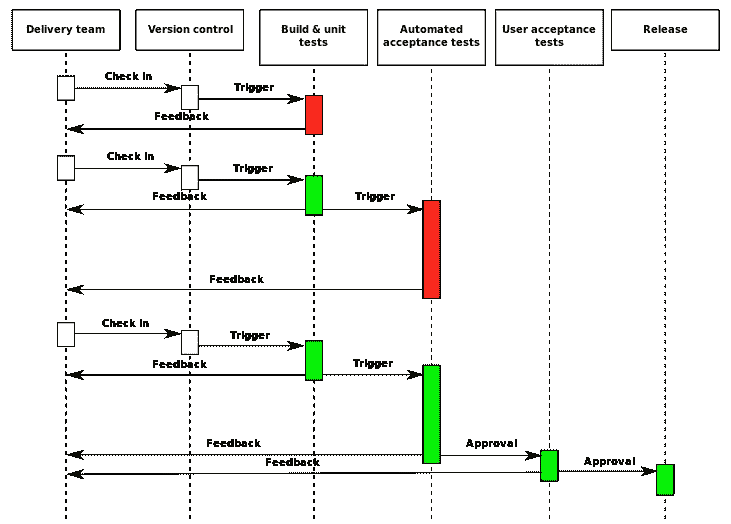

*The UML CI*

神经网络的工作方式与当前大多数计算机程序不同。顾名思义，它们由神经元组成。

神经元的输出可以表示为

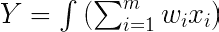

或者

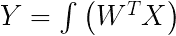

在这些等式中，W 是神经节点的权重向量，定义为


X 是输入向量，定义为

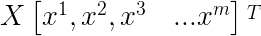

它们不通过使用中央处理器运行代码分支系统来处理一组复杂的编程指令。相反，它们使用输入的加权和来执行大量非常简单的程序，通常跨越大量处理器。


这些简单程序的网络提供了一个结果，可以适应微妙的变化，并对不太确定的信息做出反应。网络可以归纳并发现可能隐藏的模式。从这个意义上来说，它的工作方式与以其命名的生物模型相似。

# 计算过程

## 感知器

为了开始说明计算过程，我们将看一个非常简单的神经网络的例子。它是 60 多年前首次发明的，是一种感知机。它是一个“前馈”模型；输入被送入神经元，经过处理，然后输出。感知器从计算其输入的加权和开始

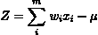

Activation function

感知器有五个部分:

1.  输入:X1，X2
2.  重量:W1 W2
3.  潜力:

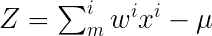

其中，μ为偏置。

4.激活函数: *f(z)*

5.输出:y = *f(z)*

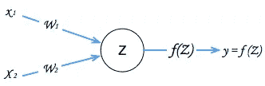

我们可以让感知机给我们一个问题的答案，这个问题有三个影响结果的因素。比如“这是美食吗？”。决定好坏的因素有:

“对你有好处吗？”
“好吃吗？”
“好看吗？”

我们给所有的问题和答案一个数值。我们给每个问题一个值，在这个例子中是一个布尔值，是或否，1 或 0。我们给答案取相同的值，好吃的= 1，不好吃的=-1。

我们收集一些数据，并把它们转换成数字。

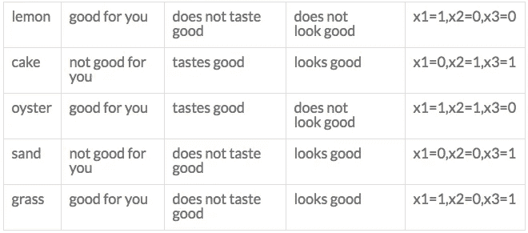

现在我们假设“对你有益”是最重要的因素，但是味道和外观也会影响答案。我们会考虑每个因素的重要性，并给予相应的权重。

让我们向我们的感知器传递三个输入

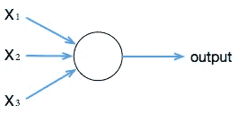

```
Input_0: x1 = 0
Input_1: x2 = 1
Input_2: x3 = 1
```

我们要做的下一件事是给这些问题一些权重，我们假设它们在重要性上是不一样的。我们猜测它们有多重要。

```
Weight_0: x1 = 6
Weight_1: x2 = 4 
Weight_2: x3 = 2
```

输入乘以权重

```
Input_0 * weight 0: 0 * 6 = 0
Input_1 * weight 1: 1 * 4 = 4
Input_1 * weight 1: 1 * 2 = 2
```

下一步是对所有输入和权重求和

```
output = sum(0+4+2) = 6
```

神经元的输出由加权和是否

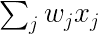

小于或大于阈值。就像权重一样，阈值是一个实数，它是神经元的一个参数。

下面是用于计算神经元输出的等式；


阈值用于确定神经元是否激活。

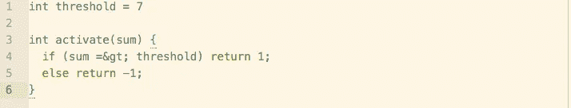

因此，将所有输入值和权重相加，我们的单细胞感知机会告诉我们什么是“好食物”。因为我们知道问题的答案，所以我们可以用答案来调整

现在所有这些都是非常基本的，很容易编写几行代码来计算出我们有三个条件，它们有一个值并经过加权，根据我们的阈值测量输出，然后它可以决定是真还是假。

人工神经网络的力量来自于大量神经元的联网。添加更多的输入和使用更多的层，我们可以为影响决策的因素添加微妙的值。更好的是，我们可以让网络学会调整这些因素。

# 人工神经网络

## 使用线性回归训练网络。

单层单神经元网络(使用线性激活函数)接收具有两个特征 x1 和 x2 的输入；每个都有重量。网络将输入和权重相加，然后输出预测。计算差值以测量误差，显示它在所有训练数据上的表现如何。

首先让我们看一个简单的问题。

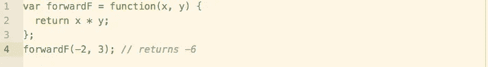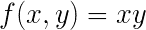

我们使用一个网络来改变输出，因为我们想要一个比-6 稍大的数字。我们在网络中前进，猜测 x 和 y 的值会给我们一个很好的拟合。

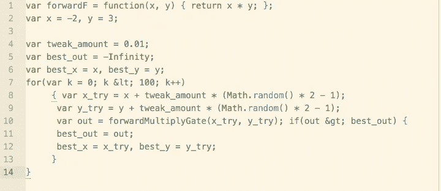

当我们试图回答少量数据中的几个问题时，这种方法非常有效。

## 数字梯度

我们可以不简单地调整单个输入的权重，而是着眼于输出的导数来改变两个或多个输入。通过使用导数，我们可以用输出来降低一个输入，增加另一个输入。导数的数学表示可以是

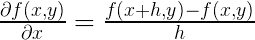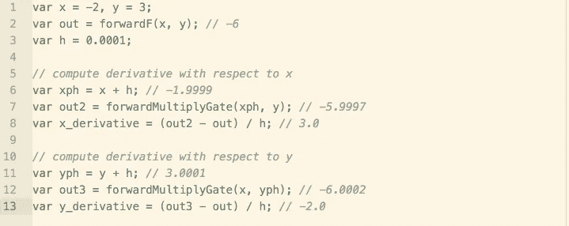

## 激活

人工神经网络通过神经元网络并行地集体处理信息。每个神经元本身就是一台简单的机器。它读取输入，处理输入，并生成输出。它通过获取一组加权输入，用一个函数计算它们的总和来激活神经元

以及将激活功能的输出传递给网络中的其他节点。

因为激活函数采用两个(相同长度的)数字序列(向量)来返回一个数字。该运算可以表示为(代数形式)。

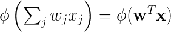

下面是线性激活函数的表达式

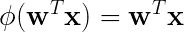

具有产生单一输出的线性特征的系统的模型表示为

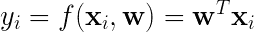

神经网络的一个特征是它的学习能力，所以它们可以很舒服地放在机器学习的标题下。该网络可以形成一个灵活且能适应的复杂系统。它可以根据得到的信息修改其内部结构。换句话说，它从接收到的信息中学习，并将其作为输出进行处理。在人工神经网络中，分类器试图识别网络中的错误，然后调整网络以减少这些错误。

一般来说，一个网络从一个输入和一个已知的输出中学习，所以我们可以给出成对的值(x，y ),其中 x 是输入，y 是已知的输出

*pairs = ((x=5，y=13)，(x=1，y=3)，(x=3，y=8))，…，((x= < em > n < /em >，y =<em>N2</em>))*

目的是找到最接近训练数据的权重(w)。一种测量拟合度的方法是通过将 *M(w)* 的值减小到最小值来计算数据集上的最小误差。

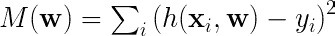

*在本系列的下一篇文章中，我将更深入地探讨反向传播，以及为什么通过查询函数对数据进行分类可以产生自然语言界面，从而彻底改变分析和商业智能。*

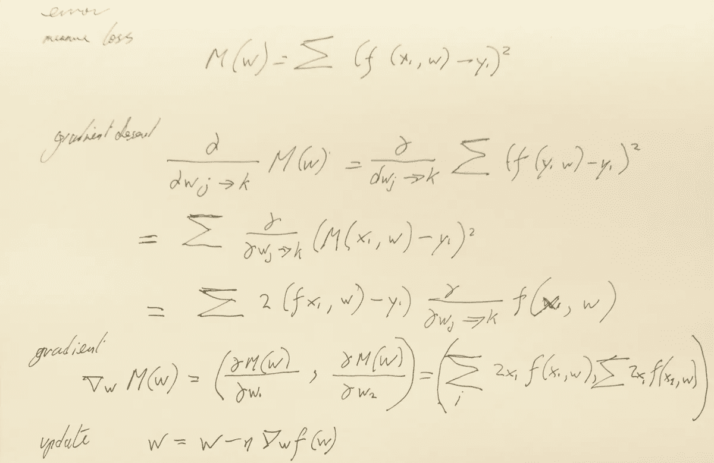

首次发布【2016 年 5 月 30 日