# 机器学习解决假新闻问题

> 原文：<https://towardsdatascience.com/machine-learning-tackles-the-fake-news-problem-c3fa75549e52?source=collection_archive---------14----------------------->

我最近有机会使用机器学习来解决美国媒体最前沿的一个问题，即识别假新闻的困难。具体来说，我的同学 David Masse 和我应用了两种 ML 方法来识别故意误导的新闻文章:逻辑回归和朴素贝叶斯分类器。使用包含 20，000 篇带标签文章的 [kaggle](https://www.kaggle.com/c/fake-news) 数据集，我们在预测测试集的标签时达到了 93%的准确率。这是练习自然语言处理以及构建强大分类模型的一些有效技术的绝佳机会。

自然语言处理是计算机科学领域，致力于处理和分析任何形式的自然人类语言(书面、口头或其他)。简单来说，计算机理解 0 和 1，而人类使用广泛的语言进行交流。NLP 旨在弥合这两个世界之间的差距，以便数据科学家和机器学习工程师可以分析大量的人类通信数据。

在假新闻问题的背景下，NLP 允许我们将文章分解成它们的组成部分，并选择重要的特征。然后，我们构建并训练模型来识别不可靠的文档。

# 清理时间！

对于许多数据驱动的项目来说，探索之后的首要任务是清理数据。我们正在处理来自各种来源的数千篇文章，有些文章比其他文章干净得多。正则表达式提供了一种限制我们允许包含在分析中的字符串类型的方法。例如，这行代码使用了 [re python 模块](https://docs.python.org/3/howto/regex.html#):

> clean _ article = re.sub("[^a-za-z0–9']"，' '，文章)

用空格替换所有非字母数字字符。^表示我们要替换的是指定集合的补集。一旦我们删除了不需要的字符，我们就可以进行标记化和矢量化了！

Scikit-learn 是一个令人难以置信的 python 机器学习包，它完成了大量繁重的工作。特别是，[计数矢量器](http://scikit-learn.org/stable/modules/generated/sklearn.feature_extraction.text.CountVectorizer.html)创建一个包含所有被分析文本的完整词汇表，并将每个文档转换成一个表示每个单词总计数的矢量。这将以稀疏矩阵的形式返回向量，因为大多数文章不包含大多数单词。矢量器允许集成预处理函数，以及您的首选标记器。

An example of vectorized articles, each row contains the occurrences of our initial 1000 feature words

在新闻分析的情况下，单独考虑每个单词过于简单，因此我们的矢量化允许双词或两个单词的短语。我们将特征的数量限制为 1000，因此我们只考虑将文档分类为真实或伪造的最重要的特征。

# 特征工程

特征工程与其说是简单的技术，不如说是一种复杂的艺术形式。它包括考虑数据集和属性域、决定最适合您的模型的功能以及最终测试您的功能以优化您的选择的过程。Scikit-learn 的矢量器提取了我们的 1000 个基本 n-gram 特征，我们开始添加元特征来完善我们的分类。我们决定计算每个文档中的平均单词长度和数值数量，这提高了我们的模型的准确性。

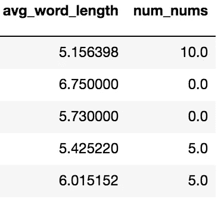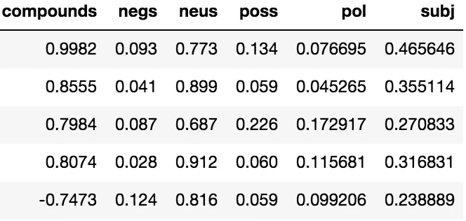

Left: Aggregate features, Right: Sentiment scores

情感分析代表了 NLP 的另一种分析工具，为文本主体中表达的一般情感分配数值。我们使用了两个软件包，TextBlob 和自然语言工具包的 Vader。这些都是对文本文档进行开箱即用情感分析的好工具。Vader 产生了衡量极性和中性的各种分数，而 TextBlob 提供了总体主观性以及它自己的极性衡量标准。我们原本希望，当计算误导性和真实的文章时，这些情绪的分布会非常不同，但是我们发现情况并非如此。

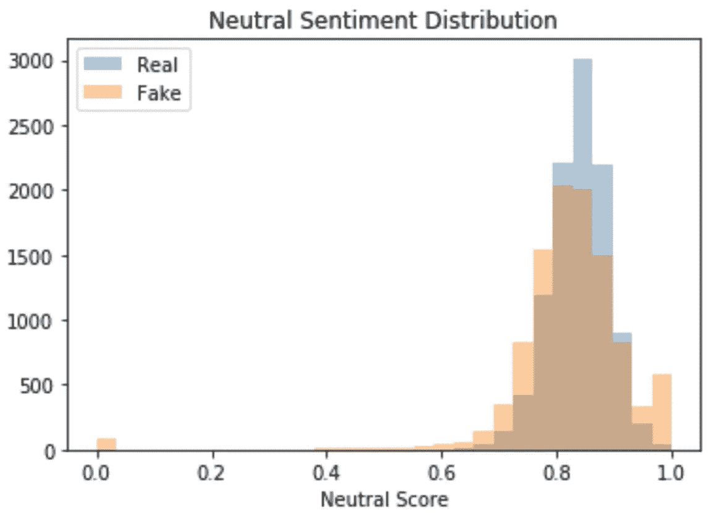

The distribution of neutral article sentiment via Vader, where 0 is fully neutral

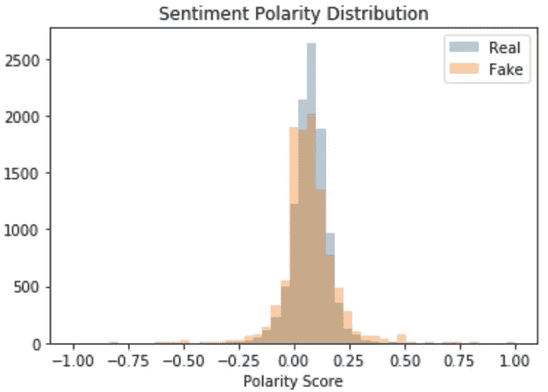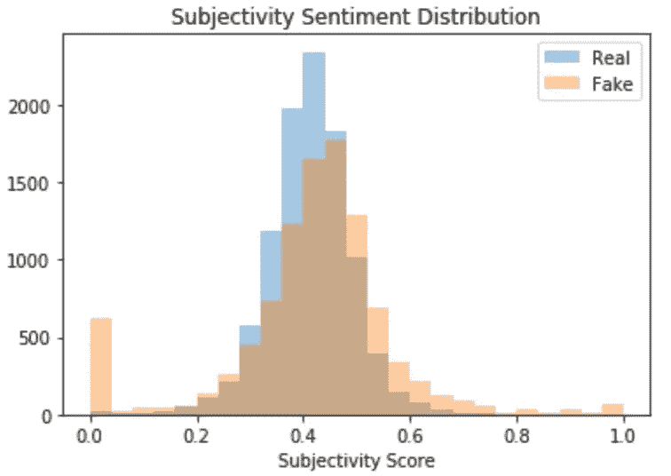

**TextBlob Sentiment Scores** (left: -1 polarity is negative and 1 is positive, right: 0 is very objective and 1 is very subjective)

从上面可以看出，仅仅从情感得分上看，很少有洞察力。然而，我们决定将它们保留在我们的模型中，因为当与我们的分类器结合时，它们会增加准确性。

# **逻辑回归**

我们在这里考虑的系统是二进制的，其中只有类是真的和假的。考虑到文章的相关特征，我们需要对文章不可靠的概率进行建模。这是多项式逻辑回归的完美候选，我们的模型依赖于 logit 变换和最大似然估计来模拟与预测变量相关的不可靠性概率。

换句话说，LR 直接计算后验 p(x|y ),学习将哪些标签分配给哪些特征输入。这是一个判别方法的例子，虽然这在技术上不是一个统计分类，但它给出了我们用来赋值的类成员的条件概率。SciKit-Learn 的[逻辑回归](http://scikit-learn.org/stable/modules/generated/sklearn.linear_model.LogisticRegression.html)模型提供了一种简单的方法来实现这一点。

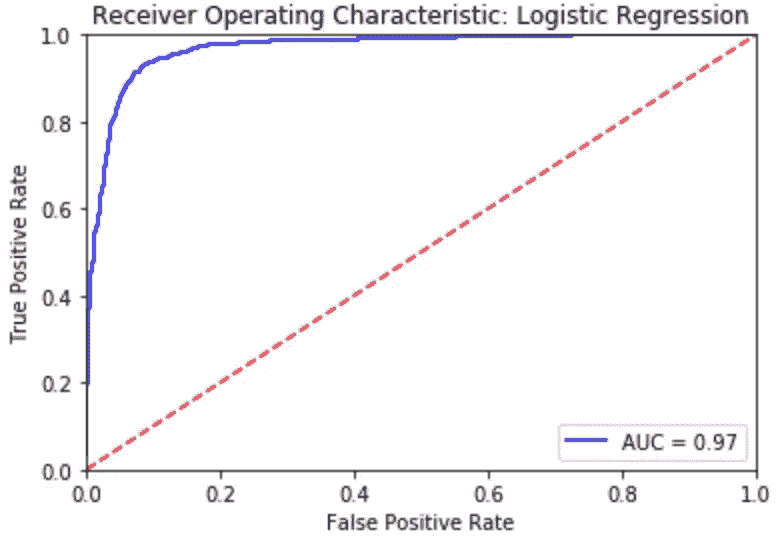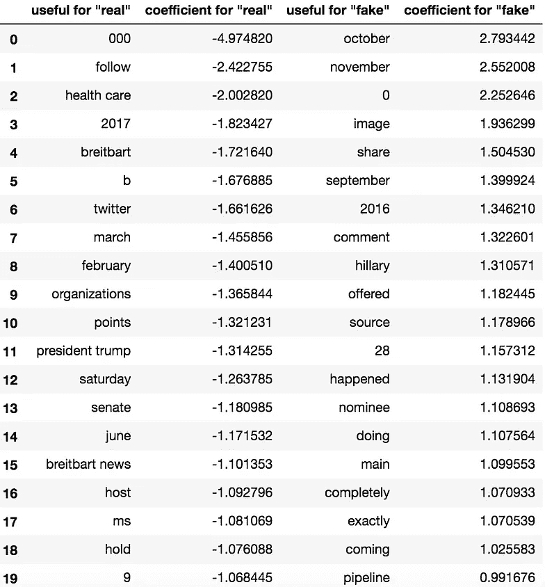

Left: ROC curve for the logistic regression. Right: 20 of the top features for the regression.

# 朴素贝叶斯分类器

我们的第二种方法是使用朴素贝叶斯(NB)算法，尽管它很简单，但对于这个应用程序来说效果很好。假设特征之间独立，NB 从每个标记的文章中学习联合概率 p(x，y)的模型。然后使用贝叶斯规则计算条件概率，根据最大概率分配标签，从而进行预测。相比之下，这是一个生成分类器的例子。

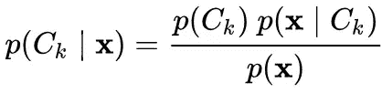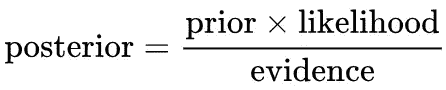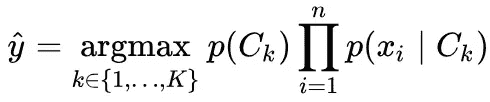

Bayes Classifier, using MAP decision rule

在这种情况下，我们考虑一个多项式事件模型，它最准确地代表了我们的特征的分布。正如预期的那样，结果与逻辑拟合获得的结果非常接近。

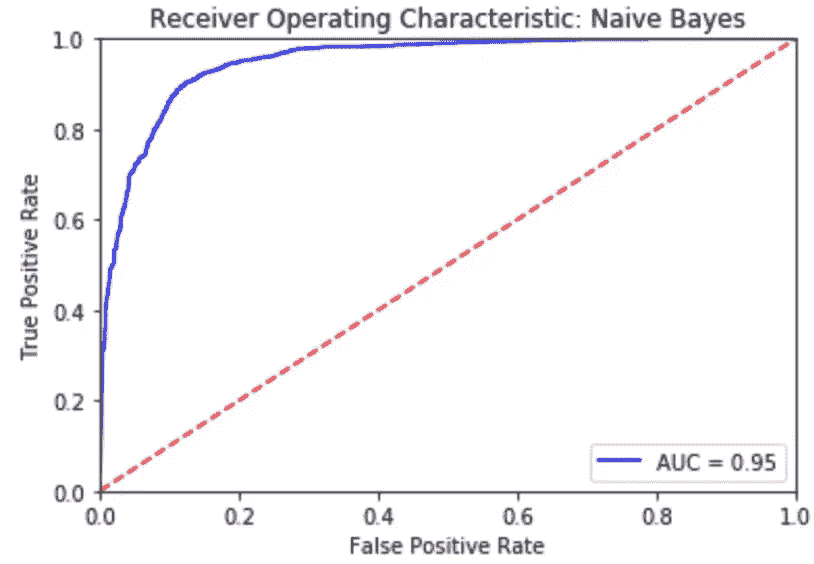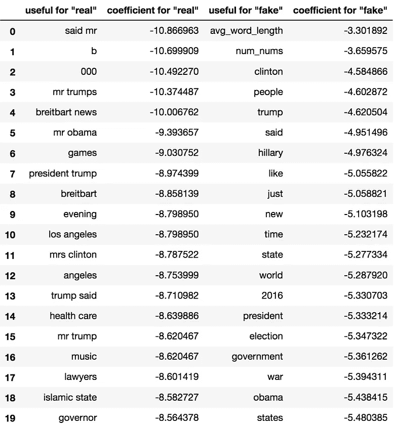

Left: ROC curve for the Multinomial Naïve Bayes. Right: 20 of the top features for the Naïve Bayes Classifier.

# 最后

使用机器学习可以有效地识别假新闻形式的错误信息的存在。即使没有上下文信息，如标题或来源，正文也足以做到这一点。因此，这些策略可以很容易地应用于其他没有附加描述符的文档。虽然情感特征本身不足以用于假新闻分类，但当与其他特征结合时，它们确实提高了我们的分类器性能。未来的工作可以与其他流行的模型进行比较，如支持向量机。

关于这两种方法之间关系的进一步阅读要感谢吴恩达和迈克尔·乔丹博士:

 [## 判别型与生成型量词的比较——逻辑回归和朴素贝叶斯的比较

### 神经信息处理系统电子会议录

papers.nips.cc](http://papers.nips.cc/paper/2020-on-discriminative-vs-generative-classifiers-a-comparison-of-logistic-regression-and-naive-bayes)