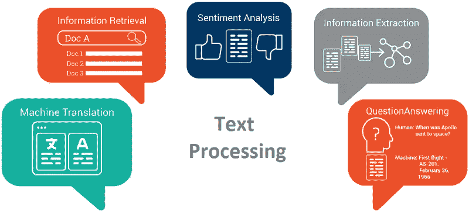
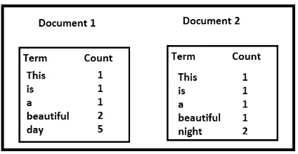
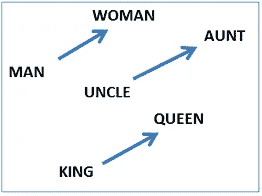
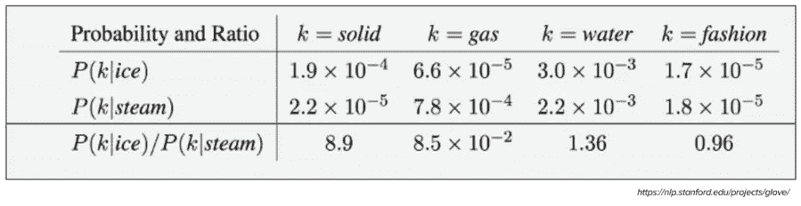
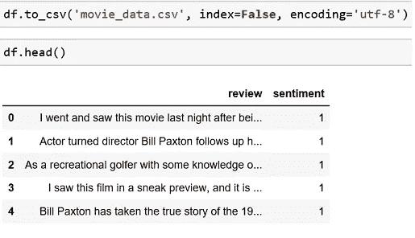
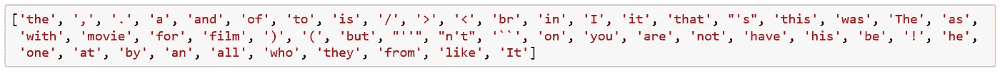
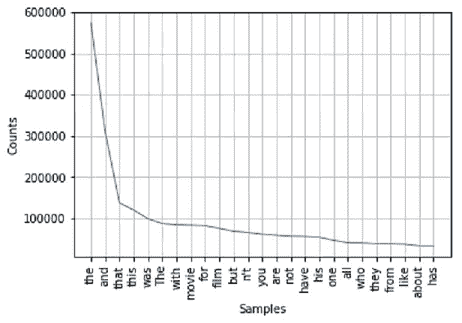
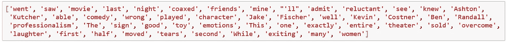
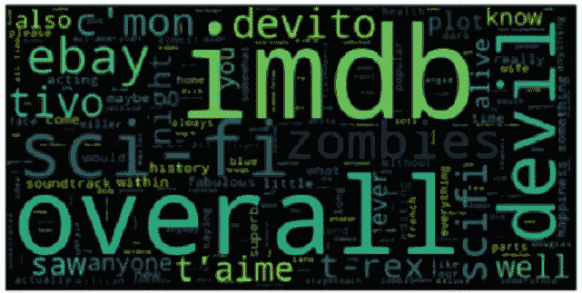
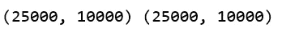

# 机器学习—文本处理

> 原文：<https://towardsdatascience.com/machine-learning-text-processing-1d5a2d638958?source=collection_archive---------0----------------------->

文本处理是许多 ML 应用程序中最常见的任务之一。下面是这种应用的一些例子。

```
• **Language Translation: Translation of a sentence from one language to another.**• **Sentiment Analysis: To determine, from a text corpus, whether the  sentiment towards any topic or product etc. is positive, negative, or neutral.**• **Spam Filtering:  Detect unsolicited and unwanted email/messages.**
```



Courtesy ([sigmoidal](https://sigmoidal.io/machine-learning-terminology-explained-top-8-must-know-concepts/))

这些应用程序处理大量文本来执行分类或翻译，并且涉及大量后端工作。将文本转换成算法可以消化的东西是一个复杂的过程。在本文中，我们将讨论文本处理中涉及的步骤。

## 步骤 1:数据预处理

*   标记化—将句子转换成单词
*   删除不必要的标点、标签
*   删除停用词—常用词，如“the”、“is”等。它们没有特定的语义
*   词干—通过删除不必要的字符(通常是后缀)来消除词形变化，从而将单词简化为词根。
*   词汇化——通过确定词类和利用语言的详细数据库来消除屈折的另一种方法。

```
The stemmed form of studies is: studi
The stemmed form of studying is: studyThe lemmatized form of studies is: study
The lemmatized form of studying is: study
```

因此，词干化和词元化有助于将像“研究”、“学习”这样的词简化为普通的基本形式或词根“学习”。关于词干化和词汇化的详细讨论，请参考[这里的](https://blog.bitext.com/what-is-the-difference-between-stemming-and-lemmatization/)。请注意，并非所有步骤都是强制性的，这取决于应用程序的使用情形。对于垃圾邮件过滤，我们可能会遵循上述所有步骤，但可能不会考虑语言翻译问题。

我们可以用 python 做很多文本预处理操作。

*   [NLTK](http://www.nltk.org/)——自然语言工具包是最著名和最常用的 NLP 库之一，可用于从标记化、词干提取、标记、解析等各种任务
*   [BeautifulSoup](https://www.crummy.com/software/BeautifulSoup/bs4/doc/) —用于从 HTML 和 XML 文档中提取数据的库

```
#using NLTK library, we can do lot of text preprocesing
**import nltk
from nltk.tokenize import word_tokenize**
#function to split text into word
**tokens = word_tokenize("The quick brown fox jumps over the lazy dog")
nltk.download('stopwords')
print(tokens)**
```

OUT: ['The '，' quick '，' brown '，' fox '，' jumps '，' over '，' The '，' lazy '，' dog']

```
**from nltk.corpus import stopwords
stop_words = set(stopwords.words(‘english’))
tokens = [w for w in tokens if not w in stop_words]
print(tokens)**
```

OUT: ['The '，' quick '，' brown '，' fox '，' jumps '，' lazy '，' dog']

```
#NLTK provides several stemmer interfaces like Porter stemmer, #Lancaster Stemmer, Snowball Stemmer
**from nltk.stem.porter import PorterStemmer
porter = PorterStemmer()
stems = []
for t in tokens:    
    stems.append(porter.stem(t))
print(stems)**
```

OUT: ['the '，' quick '，' brown '，' fox '，' jump '，' lazi '，' dog']

## 步骤 2:特征提取

在文本处理中，文本中的词代表离散的、分类的特征。我们如何以一种算法可以使用的方式对这些数据进行编码？从文本数据到实值向量的映射称为特征提取。用数字表示文本的最简单的技术之一是**单词包。**

**单词包(BOW):** 我们在称为词汇的文本语料库中制作唯一单词的列表。然后，我们可以将每个句子或文档表示为一个向量，每个单词用 1 表示存在，用 0 表示不在词汇表中。另一种表示可以是计算每个单词在文档中出现的次数。最流行的方法是使用**术语频率-逆文档频率(TF-IDF)** 技术。

*   **术语频率(TF)** =(术语 t 在文档中出现的次数)/(文档中的术语数)
*   **逆文档频率(IDF) =** log(N/n)，其中，N 是文档的数量，N 是术语 t 出现过的文档的数量。罕见词的 IDF 很高，而常用词的 IDF 可能很低。从而具有突出不同单词的效果。
*   我们计算一项的 **TF-IDF** 值为= TF * IDF

让我们举一个例子来计算文档中一个术语的 TF-IDF。



Example text corpus

```
**TF('beautiful',Document1) = 2/10, IDF('beautiful')=log(2/2) = 0
TF(‘day’,Document1) = 5/10,  IDF(‘day’)=log(2/1) = 0.30

TF-IDF(‘beautiful’, Document1) = (2/10)*0 = 0
TF-IDF(‘day’, Document1) = (5/10)*0.30 = 0.15**
```

正如你在文献 1 中看到的，TF-IDF 方法对“美丽”一词进行了严重的惩罚，但对“天”赋予了更大的权重。这是由于 IDF 部分，它赋予不同的单词更大的权重。换句话说，从整个语料库的上下文来看，“day”是 Document1 的一个重要单词。Python [scikit-learn](http://scikit-learn.org/stable/tutorial/text_analytics/working_with_text_data.html) 库为文本数据挖掘提供了高效的工具，并提供了在给定文本语料库的情况下计算文本词汇 TF-IDF 的函数。

使用 BOW 的一个主要缺点是它放弃了单词顺序，从而忽略了上下文，进而忽略了文档中单词的含义。对于自然语言处理(NLP ),保持单词的上下文是最重要的。为了解决这个问题，我们使用另一种叫做单词嵌入的方法。

> **单词嵌入:**它是一种文本表示，其中具有相同含义的单词具有相似的表示。换句话说，它在一个坐标系统中表示单词，在该坐标系统中，基于关系语料库的相关单词被放置得更靠近。

让我们讨论一些众所周知的*单词嵌入*模型:

## **Word2Vec**

[Word2vec](https://arxiv.org/abs/1301.3781) 将大量文本作为其输入，并产生一个向量空间，每个唯一的单词在该空间中被分配一个相应的向量。单词向量被定位在向量空间中，使得语料库中共享共同上下文的单词在空间中彼此非常接近。Word2Vec 非常擅长捕捉意思并在任务中展示它，如计算类比问题，形式为 *a* 对 *b* 如同 *c* 对*？*。比如*男*之于*女*如同*叔*之于*？* ( *大妈*)使用基于余弦距离的简单矢量偏移方法。例如，以下是说明性别关系的三个单词对的向量偏移量:



vector offsets for gender relation

这种矢量构图也让我们回答“国王—男人+女人=？”提问并得出结果“女王”！当你想到所有这些知识仅仅来自于在上下文中查看大量单词，而没有提供关于它们的语义的其他信息时，所有这些都是非常了不起的。更多详情请参考[这里](https://blog.acolyer.org/2016/04/21/the-amazing-power-of-word-vectors/)。

## **手套**

单词表示的全局向量或 [GloVe](http://doi.org/10.3115/v1/D14-1162) 算法是对 word2vec 方法的扩展，用于有效地学习单词向量。GloVe 使用跨整个文本语料库的统计来构建显式的单词上下文或单词共现矩阵。结果是一个学习模型，它通常可以产生更好的单词嵌入。

考虑下面的例子:



*目标词:*冰、
蒸汽、*探测词:*固体、气体、水、时尚

设 *P(k|w)* 为单词 *k* 在单词 *w* 的上下文中出现的概率。考虑一个与*冰*强相关，而与*汽*不相关的词，比如*固*。 *P(固|冰)*会比较高， *P(固|汽)*会比较低。因此 *P(固体|冰)/ P(固体|蒸汽)*的比值将会很大。如果我们取一个与*蒸汽*相关而与*冰*不相关的词，比如*气体*，那么 *P(气体|冰)/ P(气体|蒸汽)*的比值反而会很小。对于一个既与*冰*又与*蒸汽*相关的词，比如*水*我们预计比率接近 1。更多详情请参考此处的[和](https://blog.acolyer.org/2016/04/22/glove-global-vectors-for-word-representation/)。

> 单词嵌入将每个单词编码到一个向量中，该向量捕获文本语料库中单词之间的某种关系和相似性。这意味着甚至像大小写、拼写、标点符号等单词的变化都会被自动学习。反过来，这可能意味着可能不再需要上述的一些文本清理步骤。

## 步骤 3:选择 ML 算法

根据问题空间和可用数据，有多种方法为各种基于文本的应用程序构建 ML 模型。

用于垃圾邮件过滤的经典 ML 方法，如“朴素贝叶斯”或“支持向量机”已被广泛使用。深度学习技术正在为情感分析和语言翻译等 NLP 问题提供更好的结果。深度学习模型的训练非常慢，并且已经看到，对于简单的文本分类问题，经典的 ML 方法也以更快的训练时间给出类似的结果。

让我们使用到目前为止讨论的技术，在 [IMDB](http://ai.stanford.edu/~amaas/data/sentiment/) 电影评论数据集上构建一个**情感分析器**。

## 下载 IMDb 电影评论数据

IMDB 电影评论集可以从[这里](http://ai.stanford.edu/~amaas/data/sentiment/)下载。这个用于二元情感分类的数据集包含用于训练的 25，000 条高度极性的电影评论，以及用于测试的 25，000 条评论。这个数据集被用于非常受欢迎的论文[‘学习用于情感分析的词向量’](http://ai.stanford.edu/~amaas/papers/wvSent_acl2011.pdf)。

## 预处理

数据集被结构化为测试集和训练集，每个都有 25000 个文件。让我们首先将文件读入 python 数据帧，以便进一步处理和可视化。测试和训练集被进一步分成 12500 个“正面”和“负面”评论。我们阅读每个文件，并将负面评价标记为“0 ”,正面评价标记为“1”

```
#convert the dataset from files to a python DataFrame**import pandas as pd
import os****folder = 'aclImdb'****labels = {'pos': 1, 'neg': 0}****df = pd.DataFrame()****for f in ('test', 'train'):    
    for l in ('pos', 'neg'):
        path = os.path.join(folder, f, l)
        for file in os.listdir (path) :
            with open(os.path.join(path, file),'r', encoding='utf-8') as infile:
                txt = infile.read()
            df = df.append([[txt, labels[l]]],ignore_index=True)****df.columns = ['review', 'sentiment']**
```

让我们将收集的数据保存为。csv 文件供进一步使用。



Five reviews and the corresponding sentiment

要获得文本中单词的频率分布，我们可以利用`nltk.FreqDist()`函数，该函数列出了文本中使用最多的单词，提供了文本数据中主要主题的大致概念，如以下代码所示:

```
**import nltk
from nltk.tokenize import word_tokenize****reviews = df.review.str.cat(sep=' ')****#function to split text into word
tokens = word_tokenize(reviews)****vocabulary = set(tokens)
print(len(vocabulary))****frequency_dist = nltk.FreqDist(tokens)
sorted(frequency_dist,key=frequency_dist.__getitem__, reverse=True)[0:50]**
```

这给出了文本中使用的前 50 个单词，尽管很明显，一些停用词，如`the`，在英语中频繁出现。



Top 50 words

仔细看，你会发现许多不必要的标点符号和标签。通过排除单个和两个字母的单词，像`the`、`this`、`and`、`that`这样的停用词在下面所示的词频分布图中占据顶部位置。



让我们删除停用词，以进一步清理文本语料库。

```
**from nltk.corpus import stopwords****stop_words = set(stopwords.words('english'))
tokens = [w for w in tokens if not w in stop_words]**
```



Top 50 words

这看起来像一个干净的文本语料库，像`went`、`saw`、`movie` 等等。如预期的那样占据了前几名。

另一个有用的可视化工具`wordcloud`包通过在画布上随机放置单词来帮助创建单词云，大小与它们在文本中的频率成比例。

```
**from wordcloud import WordCloud
import matplotlib.pyplot as plt****wordcloud = WordCloud().
generate_from_frequencies(frequency_dist)****plt.imshow(wordcloud)
plt.axis("off")
plt.show()**
```



## 构建分类器

在清理之后，是时候构建分类器来识别每个电影评论的情感。从 IMDb 数据集中，划分 25000 个测试集和训练集:

```
X_train = df.loc[:24999, 'review'].values
y_train = df.loc[:24999, 'sentiment'].values
X_test = df.loc[25000:, 'review'].values
y_test = df.loc[25000:, 'sentiment'].values
```

`**scikit-learn**`提供一些很酷的工具对文本做预处理。我们使用`TfidTransformer`将文本语料库转换为特征向量，我们将最大特征限制为 10000 个。有关如何使用`TfidTransformer`的更多详情，请参考此处的。

```
**from sklearn.feature_extraction.text import TfidfTransformer
from sklearn.feature_extraction.text import TfidfVectorizer****vectorizer = TfidfVectorizer()
train_vectors = vectorizer.fit_transform(X_train)
test_vectors = vectorizer.transform(X_test)
print(train_vectors.shape, test_vectors.shape)**
```



Training and Test set: 25K with 10K Features

有许多算法可供选择，我们将使用一个基本的朴素贝叶斯分类器，并在训练集上训练模型。

```
**from sklearn.naive_bayes import MultinomialNB****clf = MultinomialNB().fit(train_vectors, y_train)**
```

我们的情感分析仪已经准备好并接受过训练。现在，让我们在测试集上测试我们的模型的性能，以预测情感标签。

```
**from  sklearn.metrics  import accuracy_score****predicted = clf.predict(test_vectors)****print(accuracy_score(y_test,predicted))*****Output 0.791***
```

哇！！！基于基本 NB 分类器的情感分析器做得很好，给出大约 79%的准确度。您可以尝试改变特征向量长度和改变`TfidTransformer`的参数，以查看对模型精度的影响。

**结论:**我们已经详细讨论了 NLP 中使用的文本处理技术。我们还演示了使用文本处理和构建情感分析器，用经典的 ML 方法取得了相当好的效果。

感谢阅读本文，喜欢就推荐分享。

## 延伸阅读:

[](https://www.analyticsvidhya.com/blog/2017/06/word-embeddings-count-word2veec/) [## 对单词嵌入的直观理解:从计数向量到 Word2Vec

### 在我们开始之前，看看下面的例子。你打开谷歌搜索一篇关于……

www.analyticsvidhya.com](https://www.analyticsvidhya.com/blog/2017/06/word-embeddings-count-word2veec/) [](https://machinelearningmastery.com/what-are-word-embeddings/) [## 什么是文本的单词嵌入？

### 词嵌入是一种词的表征类型，它允许具有相似意义的词具有相似的…

machinelearningmastery.com](https://machinelearningmastery.com/what-are-word-embeddings/)