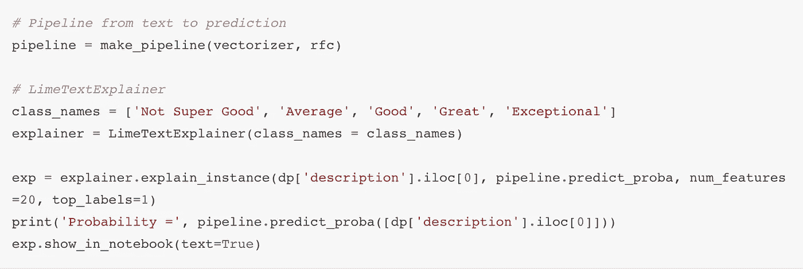
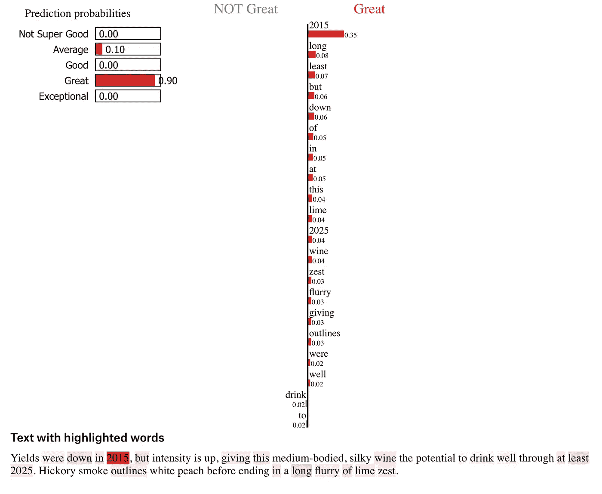
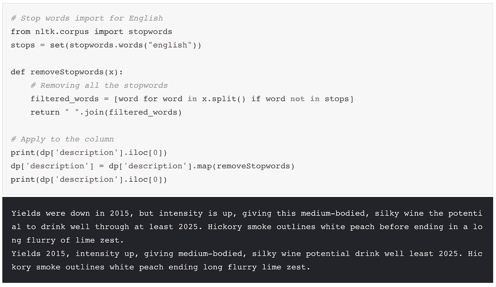
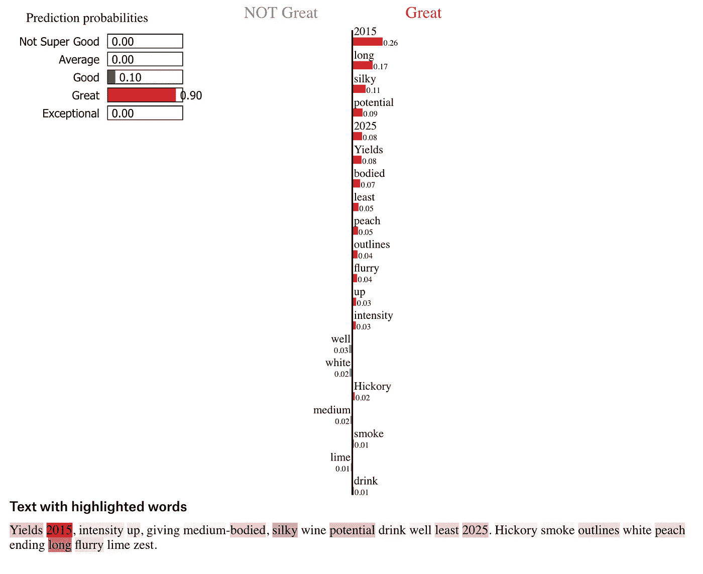

# 机器学习:解释你的模型的重要性

> 原文：<https://towardsdatascience.com/machine-learning-the-importance-of-explaining-your-model-29261677b0f4?source=collection_archive---------4----------------------->

以及为什么它可以提高精度！

一个月前，在做另一个有趣的个人项目时，我写了一篇关于[葡萄酒评级分类的文章](/wine-ratings-prediction-using-machine-learning-ce259832b321)。结论非常简单:这个模型达到了 97%的精确度，非常好。

在阅读了更多关于 ML 的文章后，我发现了这个名为 [Lime](https://github.com/marcotcr/lime) 的解释库，超级好用，非常有帮助。让我们回顾一下使用这种工具的步骤和优点。

# 模型解释

解释该模型最简单的方法是用矢量器和 RandomForestClassifier 创建一个管道。这样，可以用几行代码运行新文本的解释:

Notebook code: From pipeline to explanation

现在，运行它将会得到以下输出:

Lime Text Explanation output

G reat，解释超级简单易懂，你可以看到哪些词影响了决定，以哪种方式等等…
但是等等，什么？？？我们可以看到像“在”、“的”、“在”等常用词的例子…

TfidfVectorizer 应该会降低这些常用词的权重。一种猜测是，对于小文本，这是不够的，他们仍然在决策中的权重。即使只有百分之几，这些单词也不应该被计算在内。

# 有什么常用词？

L 在对矢量化进行实际分类之前，让我们改进模型并删除常用词。为此，我们将使用 nltk.corpus，这是一个流行的格式库:

Getting rid of common words (stopword)

N ew 解释:

Explanation after training the model without common words

# 结束注释

在中，除了提高模型的总体准确性之外，解释您的模型还有助于:

*   为您的模型编写自动化测试:
    您想要控制您的模型的精度- >只需安排一个运行解释和一些健全性检查的日常任务
*   证明你的模型/产品正在工作:
    在投入生产之前，或者在筹集资金之前，证明你的机器学习模型正在按预期工作，这可能会有所不同。尤其是当你的产品很大程度上依赖于它的时候。

以下是本文中描述的笔记本:

*   [https://github . com/olivierg 13/ML-Wine-Ratings-Analysis/blob/master/notebooks/Wine _ ML _ explain . ipynb](https://github.com/olivierg13/ML-Wine-Ratings-Analysis/blob/master/notebooks/wine_ml_explanation.ipynb)
*   [https://www . ka ggle . com/olivierg 13/wine-ratings-ml-explaints-using-lime](https://www.kaggle.com/olivierg13/wine-ratings-ml-explanations-using-lime)