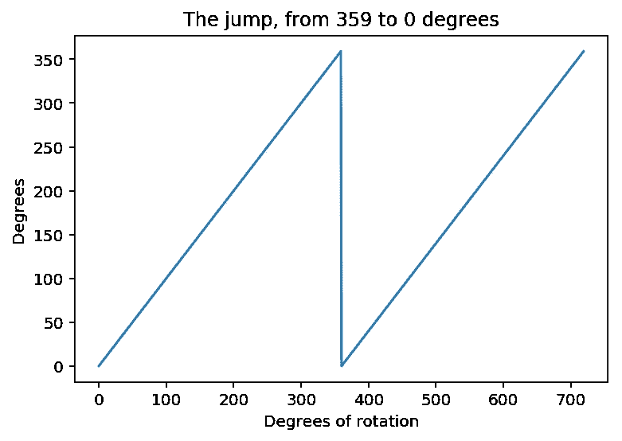
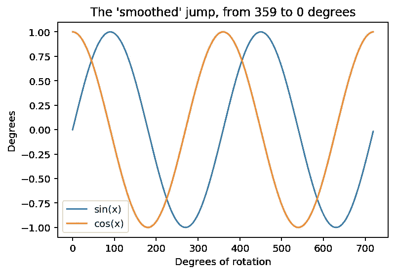

# 机器学习提示:使用旋转数据

> 原文：<https://towardsdatascience.com/machine-learning-tip-using-rotational-data-b67ded0a33ad?source=collection_archive---------6----------------------->


可能会出现需要使用旋转数据进行预测的情况，无论是作为特征还是作为目标。将学位直接插入到你的模型中似乎可行，但是要小心，这不是你想要的。

# 为什么机器学习算法讨厌学位

**简单来说，他们不顺利！**我的意思是度数刻度随着它的进行从 359 度瞬移到 0 度。看:



在这种格式中，梯度下降算法不知道 350 度与 0 度相距 10 度，因此永远不会产生鲁棒的模型。

# 拯救罪恶与罪恶！

为了克服这些问题，我们只需将度数转换成 **SIN** 和 **COS** 并使用它们作为我们的特征。现在没有传送，距离被适当地测量:



重要的是要记住，我们**可以**返回到我们的度数值，因为对于每组 SIN 和 COS 值，只有一个等价的度数值。在下一节中，我将向您展示神奇的 [**atan2**](https://docs.scipy.org/doc/numpy-1.13.0/reference/generated/numpy.arctan2.html) 函数，它将为您完成这种转换。

# 抓到一个。

一个缺点是，现在如果你想预测一个方向(即方向是你的目标特征)，你必须创建两个预测器:一个预测 SIN，一个预测 COS，然后使用**[**atan2**](https://docs.scipy.org/doc/numpy-1.13.0/reference/generated/numpy.arctan2.html)函数将它们组合起来。**

```
import numpy as npdegrees_array = np.arctan2(sin_array, cos_array) * 180 / np.pi# will be in the range -180 : 180, 
# use modulo to wrap it to the range 0 : 360degrees_array_fixed_range = np.mod(degrees_array, 360)
```

**查看使用两个预测器预测旋转值的完整示例:**

**[https://github . com/ZackAkil/optimizing-training-data-meetup/blob/master/CL-DS-PN % 20 optimizing % 20 data % 20-% 20 my % 20 solution . ipynb](https://github.com/ZackAkil/optimising-training-data-meetup/blob/master/CL-DS-PN%20Optimising%20data%20-%20My%20Solution.ipynb)**