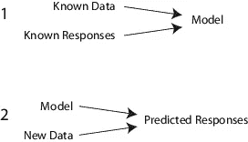
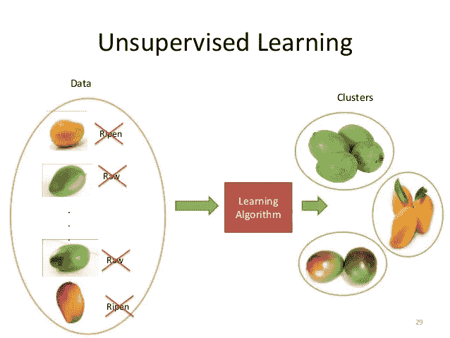

# 机器学习类型#2

> 原文：<https://towardsdatascience.com/machine-learning-types-2-c1291d4f04b1?source=collection_archive---------4----------------------->

Machine Learning Type : [reference](https://cybrml.com/2017/01/23/ml-in-cs-4-machine-learning-technical-review/)

1.  **监督学习**

Supervised Learning

在监督学习中，我们得到了数据集，并且已经知道我们的正确输出应该是什么样子。监督学习问题分为分类和回归。

*   回归:-在回归中，我们将训练数据拟合到连续函数中，并尝试在连续输出中预测结果，这意味着我们尝试将输入变量映射到某个连续函数。根据面积预测房价。这里价格是房子大小的函数，房子是连续产出。所以这是一个回归问题。
*   分类:-在分类输出中，预测离散值，如是或否、真或假、0 或 1、糖尿病与否、男性或女性、阳性或阴性等。例如在给定的健康数据中预测人是否患有糖尿病是分类的。

**2。无监督学习**

Unsupervised Learning : [reference](https://www.slideshare.net/sachinnagargoje1/introduction-to-machinelearningatsapthgiricollegebangalore)

与监督学习不同，我们提供数据集而不告诉数据的标签是什么(数据实际上是什么？)并要求从给定的数据集中找出结构。

聚类和鸡尾酒会算法用于发现给定数据集之间的结构。

**举例:**

聚类:

*   [Google news](https://news.google.com/news/?ned=us&hl=en) 使用聚类算法对与同一主题相关的新闻进行分类。
*   根据在电子商务应用中购买的物品对人进行分割是聚类算法的另一个例子。
*   以 1，000，000 个不同基因的集合为例，找到一种方法来自动将这些基因分组为在某种程度上相似或通过不同变量(如寿命、位置、角色等)相关的组。

非聚类:

*   “鸡尾酒会算法”，让你在混乱的环境中找到结构。(即在[鸡尾酒会](https://en.wikipedia.org/wiki/Cocktail_party_effect)上从声音网格中识别个人声音和音乐)。

**3。** **半监督学习**

半监督学习类型利用标记和未标记的数据进行训练。半监督学习介于无监督学习和监督学习之间。

**4。强化学习**

强化学习是让一个主体在世界中行动以最大化其回报的问题。例如，考虑教一只狗一个新把戏:你不能告诉它做什么，但如果它做对/错的事情，你可以奖励/惩罚它。它必须弄清楚它做了什么使它得到了奖励/惩罚，这就是众所周知的信用分配问题。我们可以使用类似的方法来训练计算机完成许多任务，例如玩双陆棋或象棋，调度作业，以及控制机器人肢体。

Reinforcement Learning :- [reference](http://robohub.org/artificial-general-intelligence-that-plays-atari-video-games-how-did-deepmind-do-it/)

**机器学习中使用的算法类型**

[reference](http://en.proft.me/2015/12/24/types-machine-learning-algorithms/)