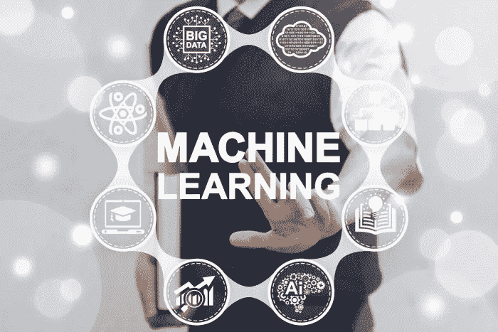
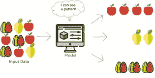
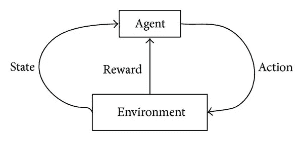
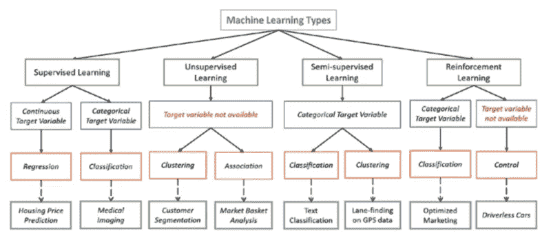

# 机器学习类型和算法

> 原文：<https://towardsdatascience.com/machine-learning-types-and-algorithms-d8b79545a6ec?source=collection_archive---------3----------------------->

不同类型的机器学习类型和算法，以及何时何地使用它们。

> 先决条件: [***需要进行机器学习？***](https://medium.com/@chethankumargn/why-machine-learning-for-achieving-artificial-intelligence-the-need-for-machine-learning-c69667b4a51f) ***(*** 便于理解 ***)***

Machine Learning

常用术语:

1.  ***带标签的数据:*** 它由一组数据组成，一个例子将包括一个文件夹中所有带标签的猫或狗的图像，所有基于大小的房屋价格等。
2.  ***分类:*** 分成有确定值的组，例如 0 或 1，猫或狗或橙等。
3.  ***回归:*** 估计变量间最可能的值或关系。根据面积对房子价格的估计。
4.  ***关联:*** 在大型数据库中发现变量间有趣的关系，其中发现的关联至关重要。

有四种类型的机器学习*(有些人可能会说三种，但在这里我们将使用四种 ***越多越好，对吗！！！*** ”)。*

1.  ***监督学习:"*给定输入的结果或输出在它本身"*** 之前是已知的 ***，机器必须能够将给定输入映射或分配到输出。一只猫，狗，桔子，苹果等的多个图像，这些图像都有标签。它被输入到机器中用于训练，并且机器必须识别它。就像一个人类小孩看到一只猫并被告知如此，当他在其他猫中看到一只完全不同的猫时，仍然把它识别为一只猫，同样的方法在这里被使用。****

**

*Supervised learning examples*

> *关键点:*

*   ****回归和分类*** 问题主要在这里解决。*
*   ****标注的数据*** 在这里用于训练。*
*   ****流行算法:*** 线性回归、支持向量机(SVM)、神经网络、决策树、朴素贝叶斯、最近邻。*
*   *它主要用于 ***预测建模*** 。*

***2。无监督学习:*“给定输入的结果或输出未知”，*** 这里输入数据给定，模型在其上运行。给定的图像或输入在这里被组合在一起，关于输入的见解可以在这里找到(这是最真实的可用数据)。主要算法有 ***聚类算法( )和*** 学习算法。*

**

*grouping of similar data*

> *关键点:*

*   *它用于 ***聚类问题(*** 分组 ***)、异常检测(银行中的异常交易)*** 需要找到给定数据之间的关系。*
*   ****无标签数据*** 用于无监督学习。*
*   ****流行算法:*** *k-means 聚类，*关联规则。*
*   *它主要用于 ***描述性建模。****

***3。半监督学习:**介于 ***监督和非监督学习*** 之间。其中组合用于产生期望的结果，并且在所有可用数据都是 ***标记和未标记数据*** 的组合的真实世界场景中是最重要的。*

***4。强化学习:**机器被暴露在一个 ***环境中，在那里它通过试错法*** 得到训练，在这里它被训练做出一个更加具体的决定。机器从过去的经验中学习，并试图捕捉最好的可能知识，以根据收到的反馈做出 ***准确的决策*** 。*

**

*Reinforced Learning workflow*

> *关键点:*

*   *基本强化被模拟为 ***马尔可夫决策过程****
*   *这里最常用的算法是 ***Q-Learning*** ， ***深度对抗网络。****
*   *其实际应用包括电脑玩棋类游戏如 ***象棋*** 和*围棋***自动驾驶汽车**也使用这种学习。*

*简而言之，请查看下图*

**

*Machine Learning Types*

> ****更多参考文献:****

1.  *[**人工智能是真实存在的还是只是这十年的炒作？？**](https://becominghuman.ai/artificial-intelligence-real-or-is-it-just-an-hype-of-this-decade-fear-what-learn-history-go-game-ac4476badf1b)*
2.  *[***人工智能:定义、类型、实例、技术*学名**](https://medium.com/@chethankumargn/artificial-intelligence-definition-types-examples-technologies-962ea75c7b9b)*
3.  *[**人工智能 vs 机器学习**](https://medium.com/@chethankumargn/artificial-intelligence-vs-machine-learning-3c599637ecdd)*
4.  *[**机器学习为什么要实现人工智能？**](https://medium.com/@chethankumargn/why-machine-learning-for-achieving-artificial-intelligence-the-need-for-machine-learning-c69667b4a51f)*

> ****接下来我有* **机器学习实现示例 5 分钟后** *接下来请务必关注我的* [***中***](https://medium.com/@chethankumargn)*[***LinkedIn***](http://www.linkedin.com/in/chethankumargn)*[***Twitter***](https://twitter.com/chethan1gn)如果你喜欢这篇文章，请鼓掌并分享它。*****

*****在这里加入我们的 [**WhatsApp**](https://chat.whatsapp.com/LLwBIyYYcABEV31ZFI7QR3) 社区。*****