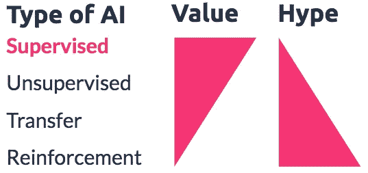
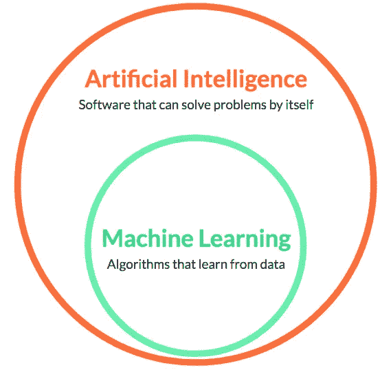

# 机器学习 vs .人工智能

> 原文：<https://towardsdatascience.com/machine-learning-vs-artificial-intelligence-192391ce6caf?source=collection_archive---------10----------------------->

## 它们并不相同，但通常可以互换使用

Photo by [Joshua Sortino](https://unsplash.com/photos/LqKhnDzSF-8?utm_source=unsplash&utm_medium=referral&utm_content=creditCopyText) on [Unsplash](https://unsplash.com/search/photos/data?utm_source=unsplash&utm_medium=referral&utm_content=creditCopyText)

> **在实践中**:机器学习和 AI 互换使用**。**通常这两个词都用来表示 [**监督学习**](https://en.wikipedia.org/wiki/Supervised_learning) 。
> 
> **理论上**:机器学习是 AI 的一个子领域:*一种*实现 AI* 的*方式。

# 机器学习和人工智能:对不同的人有不同的意义

很大一部分困惑是——取决于你和谁交谈——机器学习和人工智能对不同的用户有不同的含义。

现在，人工智能是一个比机器学习更性感的术语，所以在媒体和市场营销中，人工智能(AI)是最常用的术语。但是媒体所指的人工智能的范围非常广泛:

*   专家系统
*   工序自动化
*   机器学习
*   深度学习
*   强化学习
*   …以及更多

> 有趣的一面:媒体上关于人工智能的话题越热，它在商业中的实际应用就越少。

媒体上最热门的话题往往对企业最没有价值。这些通常仍是研究案例，很少用于日常应用。

# 学术界

对于学者和研究数据科学的人来说，**机器学习是更大的人工智能领域**的一个子领域。

人工智能指的是一个非常大的研究领域，包括许多旨在开发能够学习和解决问题的计算机的技术:

*   计算机视觉
*   监督和非监督学习
*   强化学习和遗传算法
*   自然语言处理
*   机器人技术(运动)
*   …

> **机器学习**是人工智能领域，涉及*自行从数据中学习*。

# 商业

在商业上，人工智能和机器学习通常指**同一个东西**。为什么？因为 AI 的大部分商业应用相当于**监督学习**，是机器学习的一个子领域。

> *“如今，人工智能创造的 99%的经济价值都是通过一种人工智能来实现的，那就是学习 A 到 B 或输入到输出的映射。”*

*所以实际上，商业中的*AI*和商业中的*机器学习*基本是一回事。*

# *所以…这取决于你问谁*

*   *机器学习是人工智能的一个子领域。*
*   *然而，在实践中，使用这两个术语的人往往表示同一个意思。*
*   *特别是在商业环境中，你可以使用这两个术语来指代*能够自己从数据中学习的机器。**

**最初发表于*[T5【www.datarevenue.com】](https://www.datarevenue.com/blog/the-difference-between-machine-learning-and-artificial-intelligence/)*。**