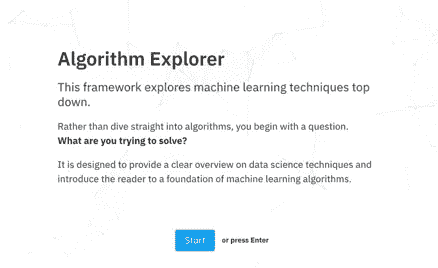

# 机器学习:从哪里开始…

> 原文：<https://towardsdatascience.com/machine-learning-where-to-begin-772667260529?source=collection_archive---------9----------------------->

# **简介**

在谷歌上搜索任何跟有“机器学习”一词的东西，都会得到一个庞大而令人生畏的资源列表，尤其是当你是从商业角度出发或者刚进入这个领域的时候。

我经常看到一页纸的机器学习“备忘单”，上面有选择算法的流程图。我喜欢这个概念，但他们假设先验知识，迎合那些已经精通可能的算法。

这就是这个工具的灵感来源。它不是直接一头扎进数学和算法的世界，而是从询问你试图解决什么样的问题开始。通过首先确定你想要达到的目标，你可以缩小寻找解决方案的范围。

一旦做出选择，该工具将介绍您可能希望在概述最常用算法之前探索的技术类型。

它并不完整，而是向读者介绍概念和术语的起点。我希望这是对好奇的头脑的欢迎，并可以在那些对该领域感兴趣的人和他们的数据科学同事或朋友之间架起一座桥梁。

网上有很多很好的资源，可以提供更多的细节。这个工具的目标是激励，甚至是授权，让你继续探索数据科学这个不可思议的世界！

# **框架—算法浏览器**

所以在这里，享受吧！

[点击这里访问算法浏览器](https://samrose3.github.io/algorithm-explorer/)

*注意:这也是一个正在进行的项目，我们希望根据社区的反馈进行迭代。请在这里分享想法或者报告 bug:*[*算法浏览器 github repo*](https://github.com/samrose3/algorithm-explorer/issues)

# **静态页面**

如果你想在框架之外参考这个工具的内容，下面的文章会介绍这些内容

[机器学习:试图预测一个数值](https://medium.com/@srnghn/machine-learning-trying-to-predict-a-numerical-value-8aafb9ad4d36)

[机器学习:试图对你的数据进行分类](https://medium.com/@srnghn/machine-learning-trying-to-predict-a-categorical-outcome-6ba542b854f5)

[机器学习:试图在你的数据中发现结构](https://medium.com/@srnghn/machine-learning-trying-to-discover-structure-in-your-data-2fbbc4f819ae)

[机器学习:试图提出建议](https://medium.com/@srnghn/machine-learning-trying-to-make-recommendations-ea2912cf468)

[机器学习:尝试检测异常值或异常行为](https://medium.com/@srnghn/machine-learning-trying-to-detect-outliers-or-unusual-behavior-2d9f364334f9)

# **非常感谢**

尽管我喜欢使用数据科学领域之外的各种技术和工具，但对我来说，寻求前端开发方面的帮助无疑是明智的。我想感谢[山姆·罗斯](https://samrose3.github.io/)的伟大工作(和耐心！)将我的原始想法转化为更易消费、更精简、更美观的东西。同样，我的绘画技巧还有很多地方需要改进，所以感谢玛丽·金给这部作品增添了艺术魅力！