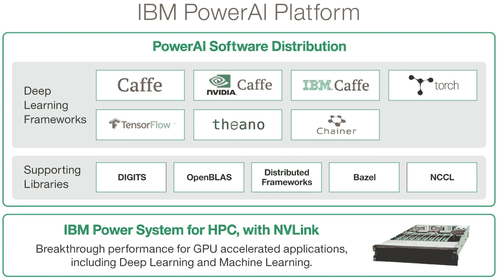
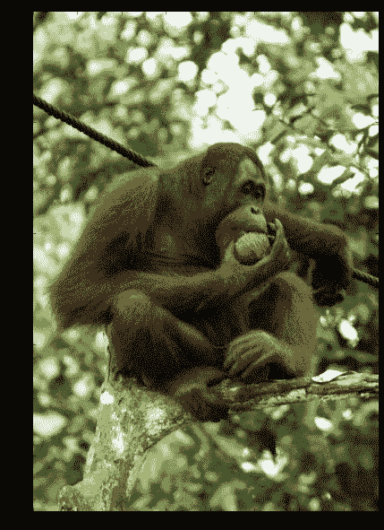

# 使用 IBM PowerAI 的机器学习中的图像分类基础(第 1 部分)

> 原文：<https://towardsdatascience.com/machine-learning-with-ibm-powerai-getting-started-with-image-classification-part-1-6219e3c6a9fa?source=collection_archive---------4----------------------->


[IBM Power Systems](https://www.ibm.com/power)

# 介绍

图像分类已经成为展示机器学习的关键试点用例之一。在这篇短文中，我试图描述如何使用 IBM PowerAI 实现这样一个解决方案，并在 IBM Power 系统上运行时比较 GPU 和 CPU 的性能。

# 人工智能

人工智能目前被视为计算机科学的一个分支，它处理让计算机执行像视觉识别、语音识别、认知决策、语言翻译等传统上被认为是人类智能的任务。

# 机器学习

机器学习通常被视为人工智能的一种应用，它致力于赋予系统学习和根据经验改进的能力，而无需显式编码所有任务。

# 深度学习

深度学习是机器学习的一个子集，其中系统可以利用带标签的训练数据(有监督的)或无标签的训练数据(无监督的)进行学习。深度学习通常使用分层的人工神经网络来执行任务。

# 人工神经网络

人工神经网络是受生物神经网络启发的系统，可以以惊人的精度执行某些任务，如图像分类。例如，对于图像分类，给动物的一组图像提供标记。这是训练数据。人工神经网络通过一系列步骤(或层)，帮助系统学习将未标记的图像(本文所示示例中的猩猩图像)分类为属于某个群体的能力，同时得出准确度分数。

深度学习在你的业务中有几个应用，从手机个人助理到自动驾驶汽车，快速变化的模式被用于实时分类物体。

# 什么是 IBM PowerAI？

IBM PowerAI 软件让您可以在包含 GPU 的 IBM POWER9 服务器上轻松运行所有流行的机器学习框架。CPU 是为串行处理而设计和构建的，包含少量内核，而 GPU 可以包含数千个更小的内核，并依赖于任务的并行处理。用于机器学习的任务是 GPU 的关键应用。看看 IBM Power System [AC922](https://www.ibm.com/us-en/marketplace/power-systems-ac922) 服务器，它被吹捧为市场上运行企业人工智能任务的最佳服务器之一。IBM PowerAI 目前包括以下框架；



Source: [https://www.ibm.com/us-en/marketplace/deep-learning-platform](https://www.ibm.com/us-en/marketplace/deep-learning-platform)

# 当前设置

对于这个演示，我在一个运行 Ubuntu on Power 的虚拟机上使用了一个容器( **ppc64le** )，托管在 [Nimbix Cloud](https://www.nimbix.net/) 上。

容器是图像的运行实例。映像是包含操作系统、软件和应用程序代码的模板，所有这些都打包在一个文件中。使用 Dockerfile 定义映像，docker file 是配置映像的步骤列表。构建 Dockerfile 是为了创建一个映像，运行这个映像是为了获得一个运行容器。要运行映像，您需要在虚拟机上安装和配置 Docker 引擎。

这是我用过的 Dockerfile ，由 [Indrajit Poddar](https://www.linkedin.com/in/ipoddar) 编写。这摘自 [this Github](https://github.com/ibmsoe/Dockerfiles/blob/master/powerai-examples/Dockerfile) 页面。

这用 Jupyter Notebook、iTorch 内核(我们将在第二部分讨论)和一些基本 TensorFlow 示例构建了一个映像。

**TensorFlow** 是一个面向机器学习应用的开源、可扩展库，基于可以构建和执行的数据流图的概念。一个图可以包含两个部分，节点和边(或张量)。它附带了一个 Python API，很容易组装网络、分配参数和运行训练模型。

以下步骤由[英德拉吉特·波德达尔](https://www.linkedin.com/in/ipoddar)演示。他在 Nimbix Cloud 上构建了一个测试映像，该映像将在部署后几分钟内运行上述服务。

以下命令用于验证 GPU 是否连接到容器。

```
root@JARVICENAE-0A0A1841:/usr/lib/nvidia-384# **nvidia-smi**Thu Feb 1 23:45:11 2018+ — — — — — — — — — — — — — — — — — — — — — — — — — — — — — — — — — — — — — — -+| NVIDIA-SMI 384.111 Driver Version: 384.111 || — — — — — — — — — — — — — — — -+ — — — — — — — — — — — + — — — — — — — — — — — +| GPU Name Persistence-M| Bus-Id Disp.A | Volatile Uncorr. ECC || Fan Temp Perf Pwr:Usage/Cap| Memory-Usage | GPU-Util Compute M. ||===============================+======================+======================|| 0 Tesla P100-SXM2… Off | 00000003:01:00.0 Off | 0 || N/A 40C P0 42W / 300W | 299MiB / 16276MiB | 0% Default |+ — — — — — — — — — — — — — — — — — — — — — — — — — — — — — — — — — — — — — — -+| Processes: GPU Memory || GPU PID Type Process name Usage ||=============================================================================|+ — — — — — — — — — — — — — — — — — — — — — — — — — — — — — — — — — — — — — — -+
```

我看到一个英伟达特斯拉 P100 图形处理器连接。以下命令显示了已安装的 Jupyter Notebook 实例以及稍后将用于身份验证的相关令牌。

```
root@JARVICENAE-0A0A1841:/usr/lib/nvidia-384# jupyter notebook list
Currently running servers:
[http://0.0.0.0:8889/?token=d0f34d33acc9febe500354a9604462e8af2578f338981ad1](http://0.0.0.0:8889/?token=d0f34d33acc9febe500354a9604462e8af2578f338981ad1) :: /opt/DL/torch
[http://0.0.0.0:8888/?token=befd7faf9b806b6918f0618a28341923fb9a1e77d410b669](http://0.0.0.0:8888/?token=befd7faf9b806b6918f0618a28341923fb9a1e77d410b669) :: /opt/DL/caffe-ibm
[http://0.0.0.0:8890/?token=a9448c725c4ce2af597a61c47dcdb4d1582344d494bd132f](http://0.0.0.0:8890/?token=a9448c725c4ce2af597a61c47dcdb4d1582344d494bd132f) :: /opt/DL/tensorflow
root@JARVICENAE-0A0A1841:/usr/lib/nvidia-384#
```

# 开始图像分类

## 什么是咖啡？

**Caffe** (用于快速特征嵌入的卷积架构)是在伯克利视觉和学习中心开发的。它是一个用于执行图像分类等任务的开源框架。它支持 **CUDA** ，卷积神经网络，具有预训练的模型，因此是这个演示的一个好选择。

我们将使用 Python 来执行所有的任务。以下步骤是通过 Jupyter 笔记本完成的。首先，让我们设置 Python、 [Numpy](http://www.numpy.org/) 和 [Matplotlib](https://matplotlib.org/) 。

```
import numpy as npimport matplotlib.pyplot as plt# display plots in this notebook%matplotlib inline# set display defaultsplt.rcParams[‘figure.figsize’] = (10, 10) # large imagesplt.rcParams[‘image.interpolation’] = ‘nearest’ # don’t interpolate: show square pixelsplt.rcParams[‘image.cmap’] = ‘gray’ # use grayscale output rather than a (potentially misleading) color heatmap# Then, we load Caffe. The caffe module needs to be on the Python path;# we’ll add it here explicitly.import syscaffe_root = ‘../’ # this file should be run from {caffe_root}/examples (otherwise change this line)sys.path.insert(0, caffe_root + ‘python’)import caffe
```

# 什么是咖啡因？

**Caffenet** 是一个卷积神经网络，用来与 **CUDA** 接口，主要目的是对图像进行分类。Caffenet 是 **Alexnet** 的变种。Alexnet 的创建者在 2015 年做了一个展示，这里是。在下面的代码中，我们下载了一个预先训练好的模型。

```
import osif os.path.isfile(caffe_root + ‘models/bvlc_reference_caffenet/bvlc_reference_caffenet.caffemodel’):print ‘CaffeNet found.’else:print ‘Downloading pre-trained CaffeNet model…’!../scripts/download_model_binary.py ../models/bvlc_reference_caffenet
```

这是输出。

```
CaffeNet found.
Downloading pre-trained CaffeNet model... 
…100%, 232 MB, 42746 KB/s, 5 seconds passed
```

然后，我们在 CPU 模式下加载 Caffe，并进行输入预处理。

```
caffe.set_mode_cpu()model_def = caffe_root + ‘models/bvlc_reference_caffenet/deploy.prototxt’model_weights = caffe_root + ‘models/bvlc_reference_caffenet/bvlc_reference_caffenet.caffemodel’net = caffe.Net(model_def, # defines the structure of the modelmodel_weights, # contains the trained weightscaffe.TEST) # use test mode (e.g., don’t perform dropout)
```

用的是 Caffenet 的‘caffe . io . transformer’。这是所有示例中使用的默认转换器。它根据提供的输入为图像创建一个变换的平均值。Caffenet 被设置为获取 BGR 格式的输入图像，其值在 0 到 255 的范围内。执行转换以加载 RGB 格式的值在 0 到 1 范围内的图像，作为 Matplotlib 所需的输入。

```
# load the mean ImageNet image (as distributed with Caffe) for subtractionmu = np.load(caffe_root + ‘python/caffe/imagenet/ilsvrc_2012_mean.npy’)mu = mu.mean(1).mean(1) # average over pixels to obtain the mean (BGR) pixel valuesprint ‘mean-subtracted values:’, zip(‘BGR’, mu)# create transformer for the input called ‘data’transformer = caffe.io.Transformer({‘data’: net.blobs[‘data’].data.shape})transformer.set_transpose(‘data’, (2,0,1)) # move image channels to outermost dimensiontransformer.set_mean(‘data’, mu) # subtract the dataset-mean value in each channeltransformer.set_raw_scale(‘data’, 255) # rescale from [0, 1] to [0, 255]transformer.set_channel_swap(‘data’, (2,1,0)) # swap channels from RGB to BGR
```

换句话说，计算机现在可以通过首先将图像转换为 RGB 值的数组来学习对图像进行分类。然后，扫描这些值以寻找已经与预训练模型中的另一个图像相匹配的值的模式。在比较时，会生成置信度度量，显示分类的准确程度。

这是输出。

```
mean-subtracted values: [(‘B’, 104.0069879317889), (‘G’, 116.66876761696767), (‘R’, 122.6789143406786)]
```

# 分类

这里，我们设置图像的默认大小。这可以根据您的输入进行更改。

```
net.blobs[‘data’].reshape(50, # batch size3, # 3-channel (BGR) images720, 720) # image size is 720x720
```

接下来，我们从 Wiki Commons 库中加载一只猩猩的图像。

```
# download the imagemy_image_url = “https://upload.wikimedia.org/wikipedia/commons/b/be/Orang_Utan%2C_Semenggok_Forest_Reserve%2C_Sarawak%2C_Borneo%2C_Malaysia.JPG" # paste your URL here!wget -O image.jpg $my_image_url# transform it and copy it into the netimage = caffe.io.load_image(‘image.jpg’)transformed_image = transformer.preprocess(‘data’, image)plt.imshow(image)
```

这是输出。

```
--2018-02-02 00:27:52--  [https://upload.wikimedia.org/wikipedia/commons/b/be/Orang_Utan%2C_Semenggok_Forest_Reserve%2C_Sarawak%2C_Borneo%2C_Malaysia.JPG](https://upload.wikimedia.org/wikipedia/commons/b/be/Orang_Utan%2C_Semenggok_Forest_Reserve%2C_Sarawak%2C_Borneo%2C_Malaysia.JPG)Resolving upload.wikimedia.org (upload.wikimedia.org)... 198.35.26.112, 2620:0:863:ed1a::2:bConnecting to upload.wikimedia.org (upload.wikimedia.org)|198.35.26.112|:443... connected.HTTP request sent, awaiting response... 200 OKLength: 1443340 (1.4M) [image/jpeg]Saving to: 'image.jpg'image.jpg           100%[===================>]   1.38M  5.25MB/s    in 0.3s2018-02-02 00:27:54 (5.25 MB/s) - 'image.jpg' saved [1443340/1443340]
```



现在，让我们对图像进行分类。

```
# copy the image data into the memory allocated for the netnet.blobs[‘data’].data[…] = transformed_image# perform classificationoutput = net.forward()​output_prob = output[‘prob’][0] # the output probability vector for the first image in the batch​print ‘predicted class is:’, output_prob.argmax()
```

输出为'**预测类为:365** '。

上面的输出将图像分类为类别 365。让我们加载 ImageNet 标签并查看输出。

```
# load ImageNet labelslabels_file = caffe_root + ‘data/ilsvrc12/synset_words.txt’if not os.path.exists(labels_file):!../data/ilsvrc12/get_ilsvrc_aux.shlabels = np.loadtxt(labels_file, str, delimiter=’\t’)print ‘output label:’, labels[output_prob.argmax()]
```

这是输出。上课是对的！

```
output label: n02480495 orangutan, orang, orangutang, Pongo pygmaeus
```

下面的代码可以帮助你找到其他的顶级类。

```
# sort top five predictions from softmax outputtop_inds = output_prob.argsort()[::-1][:5] # reverse sort and take five largest itemsprint ‘probabilities and labels:’zip(output_prob[top_inds], labels[top_inds])
```

这是输出。

```
probabilities and labels:
[(0.96807814, 'n02480495 orangutan, orang, orangutang, Pongo pygmaeus'),(0.030588957, 'n02492660 howler monkey, howler'),(0.00085891742, 'n02493509 titi, titi monkey'),(0.00015429058, 'n02493793 spider monkey, Ateles geoffroyi'),(7.259626e-05, 'n02488291 langur')]
```

# 分析 GPU 性能

这是在纯 CPU 模式下执行分类所花费的时间。

```
%timeit net.forward()
```

这是输出。

```
OUTPUT: 1 loop, best of 3: 3.06 s per loop
```

每个循环三秒钟相当长。让我们切换到 GPU 模式，执行同样的操作。

```
caffe.set_device(0) # if we have multiple GPUs, pick the first onecaffe.set_mode_gpu()net.forward() # run once before timing to set up memory%timeit net.forward()
```

这是输出。

```
OUTPUT: 1 loop, best of 3: 11.4 ms per loop
```

这是 3048.6 毫秒的改进！这篇博客的第一部分到此结束。我为语法错误道歉，如果有的话。

在下一部分中，我们将了解如何使用 NVIDIA Digits 训练您自己的模型，以及如何使用 Torch。

如果你喜欢这首曲子，那就鼓掌吧👏🏻(可以不止一次鼓掌)！你也可以在网上的某个地方分享，这样其他人也可以阅读。

免责声明:本网站上的帖子是我自己的，不一定代表 IBM 的立场、策略或观点。

作者:[乌彭德拉·拉詹](https://www.linkedin.com/in/upendra-rajan-b208602a/)