# 基于 PySpark 和 MLlib 的机器学习——解决二元分类问题

> 原文：<https://towardsdatascience.com/machine-learning-with-pyspark-and-mllib-solving-a-binary-classification-problem-96396065d2aa?source=collection_archive---------0----------------------->


Photo Credit: Pixabay

[Apache Spark](https://spark.apache.org/) ，曾经是 [Hadoop](http://hadoop.apache.org/) 生态系统的一个组成部分，现在正成为企业首选的大数据平台。它是一个强大的开源引擎，提供实时流处理、交互式处理、图形处理、内存处理以及批处理，速度非常快，易于使用，接口标准。

在这个行业中，有一个强大的引擎，可以做到以上所有的需求很大。你的公司或客户迟早会使用 Spark 开发复杂的模型，让你发现新的机会或规避风险。Spark 并不难学，如果你已经了解 Python 和 SQL，入门非常容易。今天就来试试吧！

# 探索数据

当我们[用 Python](/building-a-logistic-regression-in-python-step-by-step-becd4d56c9c8) 构建逻辑回归时，我们将使用相同的数据集，它与一家葡萄牙银行机构的直接营销活动(电话)相关。分类的目标是预测客户是否会认购(是/否)定期存款。数据集可以从 [Kaggle](https://www.kaggle.com/rouseguy/bankbalanced/data) 下载。

```
from pyspark.sql import SparkSession
spark = SparkSession.builder.appName('ml-bank').getOrCreate()
df = spark.read.csv('bank.csv', header = True, inferSchema = True)
df.printSchema()
```

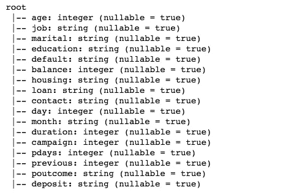

Figure 1

输入变量:年龄、工作、婚姻、教育、违约、余额、住房、贷款、联系人、日、月、持续时间、活动、pdays、先前、poutcome。

产出变量:存款

先看一下前五个观察结果。熊猫数据框比 Spark DataFrame.show()好看。

```
import pandas as pd
pd.DataFrame(df.take(5), columns=df.columns).transpose()
```

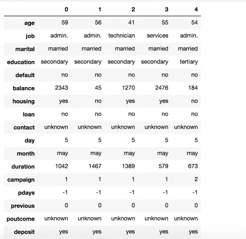

Figure 2

我们的班级非常平衡。

```
import pandas as pd
pd.DataFrame(df.take(5), columns=df.columns).transpose()
```

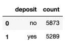

Figure 3

**数字变量的汇总统计**

```
numeric_features = [t[0] for t in df.dtypes if t[1] == 'int']
df.select(numeric_features).describe().toPandas().transpose()
```

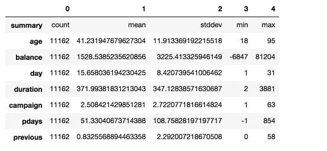

Figure 4

**自变量之间的相关性**。

```
numeric_data = df.select(numeric_features).toPandas()axs = pd.scatter_matrix(numeric_data, figsize=(8, 8));n = len(numeric_data.columns)
for i in range(n):
    v = axs[i, 0]
    v.yaxis.label.set_rotation(0)
    v.yaxis.label.set_ha('right')
    v.set_yticks(())
    h = axs[n-1, i]
    h.xaxis.label.set_rotation(90)
    h.set_xticks(())
```

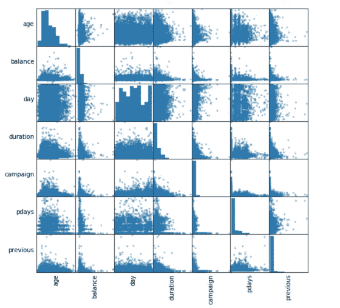

Figure 5

很明显，没有高度相关的数值变量。因此，我们将为模型保留它们。然而，日和月列并不真正有用，我们将删除这两列。

```
df = df.select('age', 'job', 'marital', 'education', 'default', 'balance', 'housing', 'loan', 'contact', 'duration', 'campaign', 'pdays', 'previous', 'poutcome', 'deposit')
cols = df.columns
df.printSchema()
```

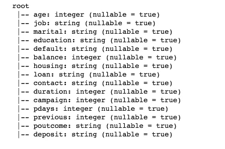

Figure 6

# 为机器学习准备数据

该过程包括类别索引、一键编码和 vector assembler——一种将多个列合并为一个向量列的特征转换器。

```
from pyspark.ml.feature import OneHotEncoderEstimator, StringIndexer, VectorAssemblercategoricalColumns = ['job', 'marital', 'education', 'default', 'housing', 'loan', 'contact', 'poutcome']
stages = []for categoricalCol in categoricalColumns:
    stringIndexer = StringIndexer(inputCol = categoricalCol, outputCol = categoricalCol + 'Index')
    encoder = OneHotEncoderEstimator(inputCols=[stringIndexer.getOutputCol()], outputCols=[categoricalCol + "classVec"])
    stages += [stringIndexer, encoder]label_stringIdx = StringIndexer(inputCol = 'deposit', outputCol = 'label')
stages += [label_stringIdx]numericCols = ['age', 'balance', 'duration', 'campaign', 'pdays', 'previous']
assemblerInputs = [c + "classVec" for c in categoricalColumns] + numericCols
assembler = VectorAssembler(inputCols=assemblerInputs, outputCol="features")
stages += [assembler]
```

上面的代码取自 [databricks 的官方网站](https://docs.databricks.com/spark/latest/mllib/binary-classification-mllib-pipelines.html)，它使用 StringIndexer 对每个分类列进行索引，然后将索引的类别转换为 one-hot 编码变量。结果输出将二进制向量附加到每一行的末尾。我们再次使用 StringIndexer 将标签编码为标签索引。接下来，我们使用 VectorAssembler 将所有的特性列合并成一个向量列。

**管道**

我们使用管道将多个转换器和估计器链接在一起，以指定我们的机器学习工作流程。管道的阶段被指定为有序数组。

```
from pyspark.ml import Pipeline
pipeline = Pipeline(stages = stages)
pipelineModel = pipeline.fit(df)
df = pipelineModel.transform(df)
selectedCols = ['label', 'features'] + cols
df = df.select(selectedCols)
df.printSchema()
```

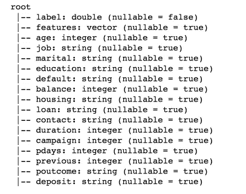

Figure 7

```
pd.DataFrame(df.take(5), columns=df.columns).transpose()
```

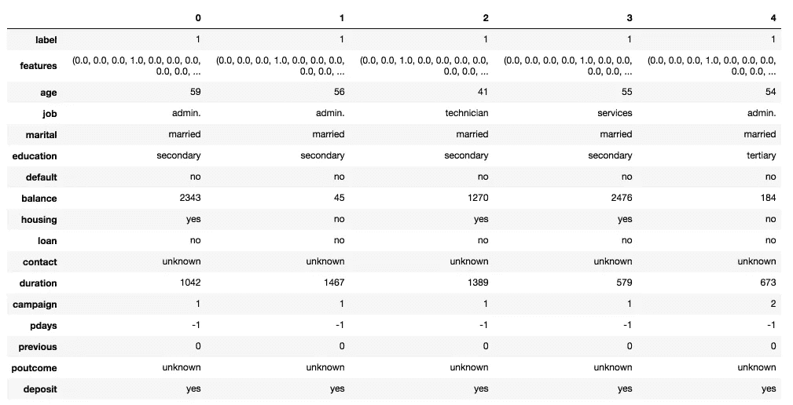

Figure 8

如您所见，我们现在有“功能”列和“标签”列。

将数据随机分为训练集和测试集，并为可重复性设置种子。

```
train, test = df.randomSplit([0.7, 0.3], seed = 2018)
print("Training Dataset Count: " + str(train.count()))
print("Test Dataset Count: " + str(test.count()))
```

***训练数据集计数:7764
测试数据集计数:3398***

# 逻辑回归模型

```
from pyspark.ml.classification import LogisticRegressionlr = LogisticRegression(featuresCol = 'features', labelCol = 'label', maxIter=10)
lrModel = lr.fit(train)
```

我们可以通过使用 LogisticRegressionModel 的属性获得**系数**。

```
import matplotlib.pyplot as plt
import numpy as npbeta = np.sort(lrModel.coefficients)plt.plot(beta)
plt.ylabel('Beta Coefficients')
plt.show()
```

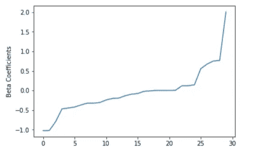

Figure 9

在训练集上总结模型，我们还可以得到**接收机操作特性和 areaUnderROC** 。

```
trainingSummary = lrModel.summaryroc = trainingSummary.roc.toPandas()
plt.plot(roc['FPR'],roc['TPR'])
plt.ylabel('False Positive Rate')
plt.xlabel('True Positive Rate')
plt.title('ROC Curve')
plt.show()print('Training set areaUnderROC: ' + str(trainingSummary.areaUnderROC))
```

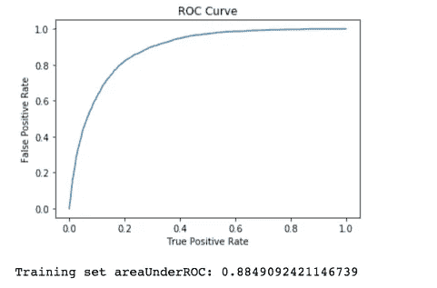

Figure 10

**精度和召回**。

```
pr = trainingSummary.pr.toPandas()
plt.plot(pr['recall'],pr['precision'])
plt.ylabel('Precision')
plt.xlabel('Recall')
plt.show()
```

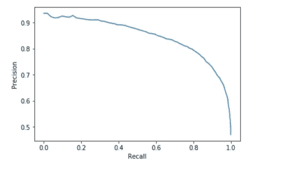

Figure 11

**对测试集**进行预测。

```
predictions = lrModel.transform(test)
predictions.select('age', 'job', 'label', 'rawPrediction', 'prediction', 'probability').show(10)
```

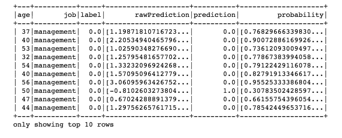

Figure 12

**评估我们的逻辑回归模型**。

```
from pyspark.ml.evaluation import BinaryClassificationEvaluatorevaluator = BinaryClassificationEvaluator()
print('Test Area Under ROC', evaluator.evaluate(predictions))
```

***ROC 0.88324614449619***下的测试区域

# 决策树分类器

决策树被广泛使用，因为它们易于解释、处理分类特征、扩展到多类分类、不需要特征缩放，并且能够捕捉非线性和特征交互。

```
from pyspark.ml.classification import DecisionTreeClassifierdt = DecisionTreeClassifier(featuresCol = 'features', labelCol = 'label', maxDepth = 3)
dtModel = dt.fit(train)
predictions = dtModel.transform(test)
predictions.select('age', 'job', 'label', 'rawPrediction', 'prediction', 'probability').show(10)
```

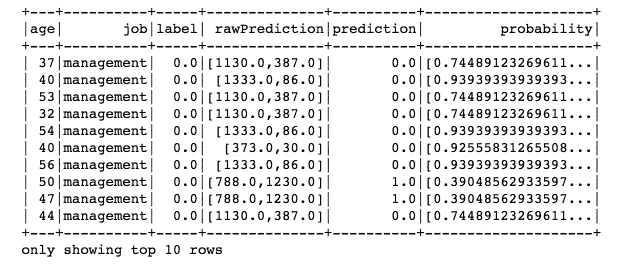

Figure 13

**评估我们的决策树模型**。

```
evaluator = BinaryClassificationEvaluator()
print("Test Area Under ROC: " + str(evaluator.evaluate(predictions, {evaluator.metricName: "areaUnderROC"})))
```

***ROC 下的测试区域:0.7807240050065357***

一个简单的决策树表现不佳，因为它在不同特征的范围内太弱。集成方法可以提高决策树的预测精度，如随机森林和梯度提升树。

# 随机森林分类器

```
from pyspark.ml.classification import RandomForestClassifierrf = RandomForestClassifier(featuresCol = 'features', labelCol = 'label')
rfModel = rf.fit(train)
predictions = rfModel.transform(test)
predictions.select('age', 'job', 'label', 'rawPrediction', 'prediction', 'probability').show(10)
```

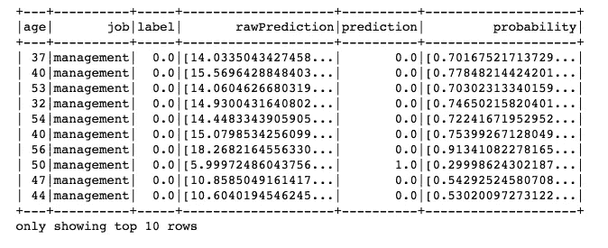

Figure 14

评估我们的随机森林分类器。

```
evaluator = BinaryClassificationEvaluator()
print("Test Area Under ROC: " + str(evaluator.evaluate(predictions, {evaluator.metricName: "areaUnderROC"})))
```

***ROC 下的测试区域:0.8846453518867426***

# 梯度增强树分类器

```
from pyspark.ml.classification import GBTClassifiergbt = GBTClassifier(maxIter=10)
gbtModel = gbt.fit(train)
predictions = gbtModel.transform(test)
predictions.select('age', 'job', 'label', 'rawPrediction', 'prediction', 'probability').show(10)
```

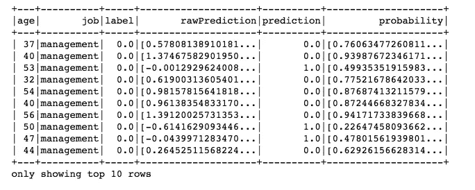

Figure 15

评估我们的梯度增强树分类器。

```
evaluator = BinaryClassificationEvaluator()
print("Test Area Under ROC: " + str(evaluator.evaluate(predictions, {evaluator.metricName: "areaUnderROC"})))
```

***ROC 下的测试区域:0.8940728473145346***

梯度提升树取得了最好的结果，我们将尝试用 ParamGridBuilder 和 CrossValidator 调整这个模型。在此之前，我们可以使用 explainParams()打印所有参数及其定义的列表，以了解哪些参数可用于调优。

```
print(gbt.explainParams())
```

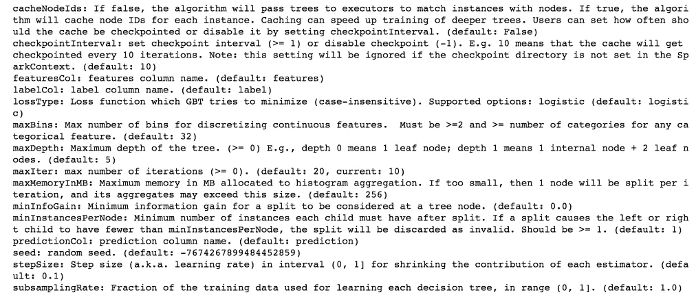

Figure 16

```
from pyspark.ml.tuning import ParamGridBuilder, CrossValidatorparamGrid = (ParamGridBuilder()
             .addGrid(gbt.maxDepth, [2, 4, 6])
             .addGrid(gbt.maxBins, [20, 60])
             .addGrid(gbt.maxIter, [10, 20])
             .build())cv = CrossValidator(estimator=gbt, estimatorParamMaps=paramGrid, evaluator=evaluator, numFolds=5)# Run cross validations.  This can take about 6 minutes since it is training over 20 trees!
cvModel = cv.fit(train)
predictions = cvModel.transform(test)
evaluator.evaluate(predictions)
```

***0.8981050997838095***

综上所述，我们已经学习了如何使用 PySpark 和 MLlib Pipelines API 构建二进制分类应用程序。我们尝试了四种算法，梯度提升在我们的数据集上表现最好。

源代码可以在 [Github](https://github.com/susanli2016/PySpark-and-MLlib/blob/master/Machine%20Learning%20PySpark%20and%20MLlib.ipynb) 上找到。我期待听到反馈或问题。

[参考:阿帕奇 Spark 2.1.0](https://spark.apache.org/docs/2.1.0/ml-classification-regression.html#linear-regression)