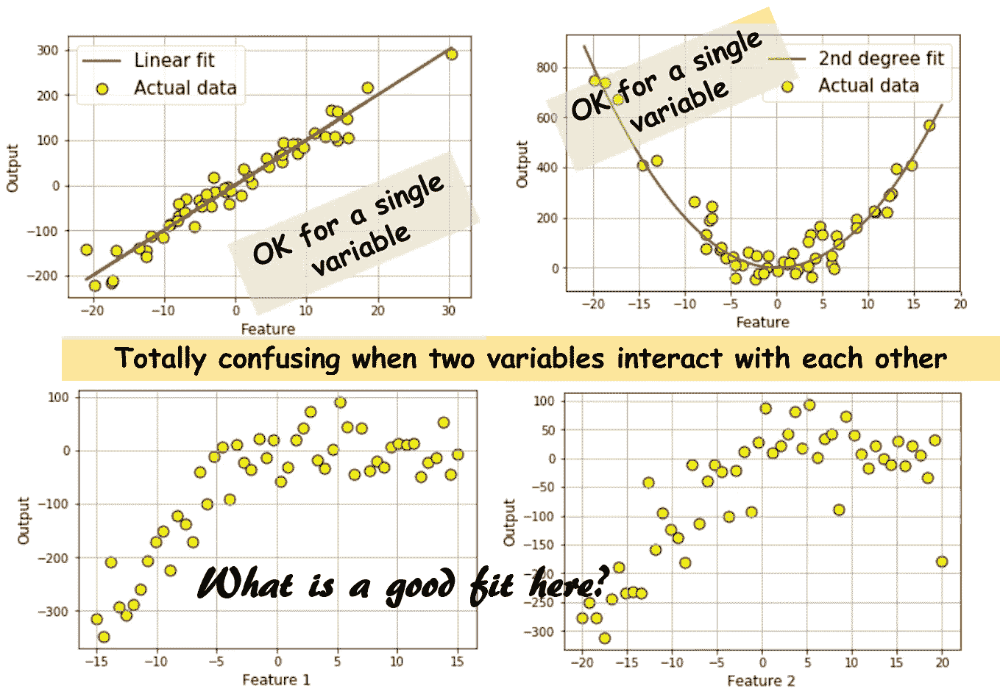
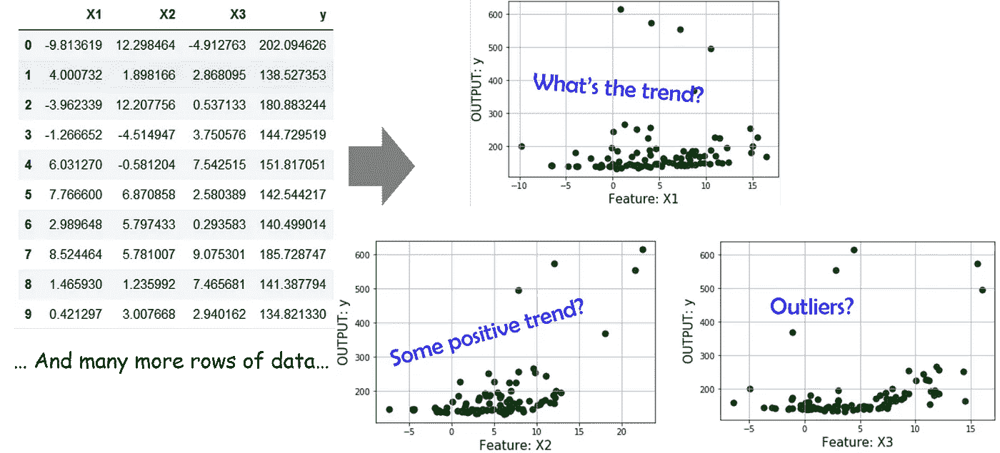
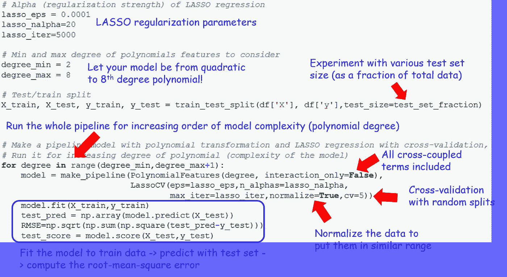
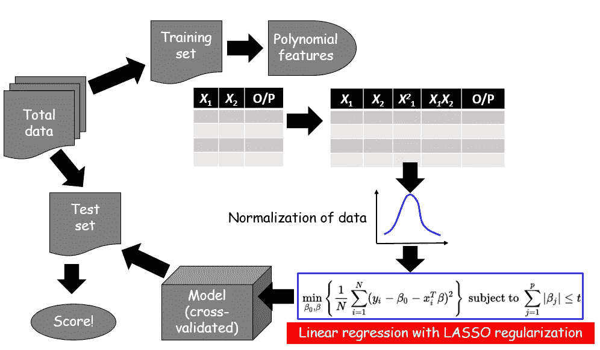
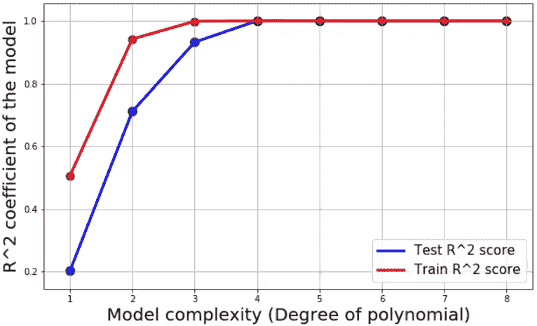
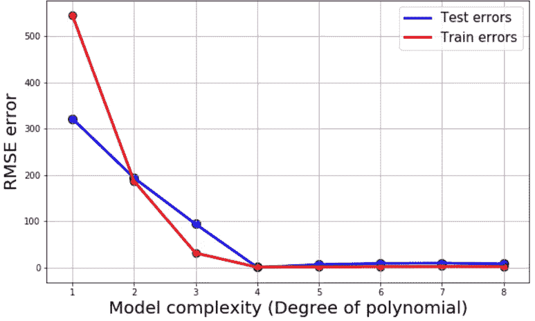
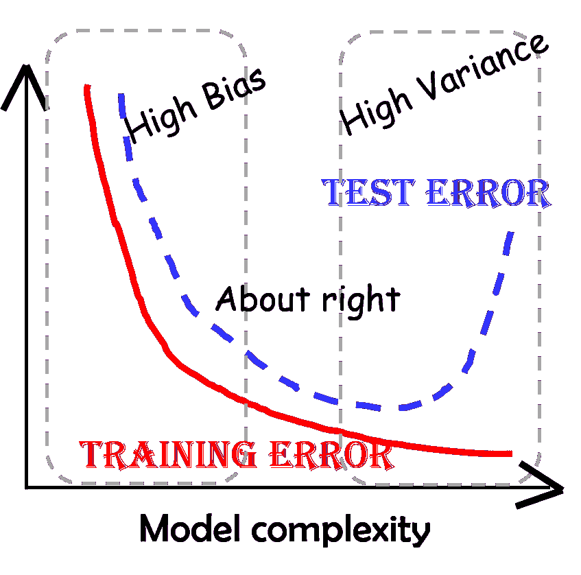
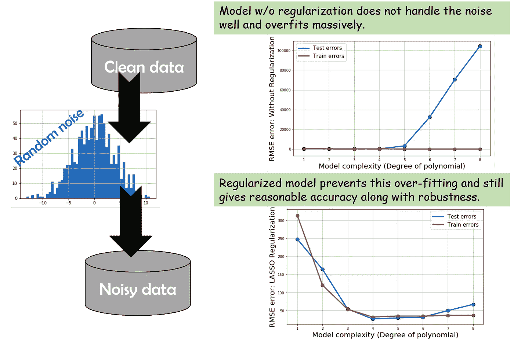

# 用 Python 进行机器学习:拟合非线性数据的简单而稳健的方法

> 原文：<https://towardsdatascience.com/machine-learning-with-python-easy-and-robust-method-to-fit-nonlinear-data-19e8a1ddbd49?source=collection_archive---------2----------------------->

## 使用 Python 库、管道特性和正则化进行非线性数据建模的简单而可靠的方法。


非线性数据建模是数据科学和分析领域的一项常规任务。很难找到一个结果随自变量线性变化的自然过程。因此，我们需要一种简单而可靠的方法来快速拟合一组测量数据和一组变量，假设测量数据可能是一个复杂的非线性函数。**这应该是数据科学家或机器学习工程师的常用工具**。

有几个相关的问题需要考虑:

*   我如何决定尝试拟合什么阶的多项式？多元回归需要包含交叉耦合项吗？有没有一种简单的方法**到**来自动化这个过程**？**
*   如何确保我**不会过度适应**数据？
*   我的机器学习模型**对测量噪声**是否鲁棒？
*   我的模型**容易扩展到更高维度和/或更大的数据集吗？**

## 如何确定多项式的阶次及相关难题

"*我可以绘制数据并快速浏览一下吗*？"

只有当一个人能够清楚地可视化数据时(特征维数是 1 或 2)，这才是可以的。对于特征尺寸为 3 或更大的尺寸，这要困难得多。如果影响结果的特性之间存在交叉耦合，这完全是浪费时间。让我用图表展示一下，



显而易见，策划只能让你到此为止。对于一个高维的相互作用的数据集，**如果你试图一次查看一个输出与一个输入变量的关系图，你会得出完全错误的结论**。而且，没有一种简单的方法可以一次可视化两个以上的变量。因此，我们必须借助某种机器学习技术来生成多维数据集。

事实上，有很多好的解决方案。

[](https://en.wikipedia.org/wiki/Linear_regression)**线性回归应该是第一个要查的工具，在你尖叫之前“*……但是这些是高度非线性的数据集……*”，让我们记住，线性回归模型中的‘线性’是指系数，而不是指特征的程度。特征(或独立变量)可以是任何次数，甚至是超越函数，如指数、对数、正弦。而且，使用这些变换和线性模型可以(近似地)模拟大量的自然现象。**

**因此，假设我们得到以下数据集，它有一个输出和 3 个特征。我们再次展示了这些情节，但是，不出所料，它们没有多大帮助。**

****

**因此，我们决定学习具有高达一些高次多项式项的线性模型来拟合数据集。很少有问题会立即浮现出来:**

**—如何决定什么样的多项式是必要的**

**—如果我们开始逐个合并一级、二级、三级术语，什么时候停止？**

**—如何确定任何交叉耦合项是否重要，即我们是否只需要 *X* 1、 *X* 2 或 *X* 1。 *X* 2 和 *X* 1 .X3 项也？**

**—最后，我们是否必须为所有这些多项式变换手动编写方程/函数，并将它们添加到数据集中？**

## **牛逼的 Python 机器学习库来帮忙**

**幸运的是， [scikit-learn](http://scikit-learn.org/) ，这个令人敬畏的机器学习库，提供了现成的类/对象来以一种简单而健壮的方式回答上述所有问题。**

**这里有一个简单的使用 scikit-learn 的[线性回归概述视频，这里有一篇](http://scikit-learn.org/stable/modules/generated/sklearn.linear_model.LinearRegression.html#sklearn.linear_model.LinearRegression)[不错的中型文章](/simple-and-multiple-linear-regression-in-python-c928425168f9)供您审阅**。但是在本文中，我们将涵盖比简单的线性拟合更多的内容，所以请继续阅读**。在我的 GitHub repo 上可以找到这篇文章的全部样板代码[。](https://github.com/tirthajyoti/Machine-Learning-with-Python/blob/master/Regression/Multi-variate%20LASSO%20regression%20with%20CV.ipynb)**

**我们首先从 scikit-learn 导入几个相关的类，**

```
# **Import function to create training and test set splits**
from sklearn.cross_validation import train_test_split# **Import function to automatically create polynomial features!** 
from sklearn.preprocessing import PolynomialFeatures# **Import Linear Regression and a regularized regression function**
from sklearn.linear_model import LinearRegression
from sklearn.linear_model import LassoCV# **Finally, import function to make a machine learning pipeline**
from sklearn.pipeline import make_pipeline
```

**让我们快速定义/概括一下我们接下来要使用/实现的必要概念。**

*****训练/测试分割*** :这意味着从我们拥有的单个数据集创建两个数据集。其中一个(训练集)将用于构建模型，另一个(测试集)将仅用于测试模型的准确性和稳健性。这对于任何机器学习任务来说都是必不可少的，因此**我们不会用我们所有的数据创建模型，并认为模型高度准确(因为它已经‘看到’了所有的数据，并且拟合得很好)，但当面对现实世界中新的(“看不见”)数据时，它表现很差**。测试集的准确性比训练集的准确性重要得多。这里有一篇关于这个主题的很好的中间文章供你参考。下面你可以看到谷歌汽车先驱巴斯蒂安·特龙谈论这个概念。**

*****自动多项式特征生成*** : Scikit-learn 为[从一组线性特征生成多项式特征](http://scikit-learn.org/stable/modules/generated/sklearn.preprocessing.PolynomialFeatures.html)提供了一种简洁的方法。您所要做的就是传递一个列表中的线性要素，并指定要生成多项式次数项的最大次数。它还让您可以选择生成所有的交叉耦合交互项，或者只生成主要特征的多项式次数。下面是一个[示例 Python 代码描述](http://scikit-learn.org/stable/auto_examples/linear_model/plot_polynomial_interpolation.html#sphx-glr-auto-examples-linear-model-plot-polynomial-interpolation-py)。**

*****正则化回归*** :正则化的重要性不能被夸大，因为它是机器学习中的一个核心概念。在线性回归设置中，**基本思想是惩罚模型系数，使其不会变得太大而过度拟合数据**，即，使模型对数据中的噪声极其敏感。有两种广泛使用的正则化方法，其中我们正在使用一种叫做套索的方法。这里有一个关于这两种正则化方法的很好的概述。**

*****机器学习管道*** :一个机器学习项目(几乎)绝不是单一的建模任务。在最常见的形式中，它包括**数据生成/接收、数据清理和转换、模型拟合、交叉验证、模型准确性测试和最终部署**。这里有一个 [Quora 答案](https://www.quora.com/What-is-a-pipeline-and-baseline-in-machine-learning-algorithms)很好地总结了这个概念。或者，[这里有一篇相关的媒介文章](https://medium.com/@yanhann10/a-brief-view-of-machine-learning-pipeline-in-python-5f50b941fca8)。或者，另一篇讨论管道实践重要性的[好文章。Scikit-learn 提供了一个](https://www.oreilly.com/ideas/building-and-deploying-large-scale-machine-learning-pipelines)[管道特性](http://scikit-learn.org/stable/tutorial/statistical_inference/putting_together.html)，它可以将多个模型和数据预处理类堆叠在一起，并将原始数据转化为可用的模型。**

**如果您有时间，请观看 PyData conference(2015 年，达拉斯)上的这段长视频(1 小时以上),了解所有相关内容。**

## **如何通过将所有这些放在一起建立一个健壮的模型？**

**这是样板代码快照。您必须对其进行修改，以便为您的数据集正确运行。**

```
**# Alpha (regularization strength) of LASSO regression**
lasso_eps = 0.0001
lasso_nalpha=20
lasso_iter=5000**# Min and max degree of polynomials features to consider**
degree_min = 2
degree_max = 8**# Test/train split**
X_train, X_test, y_train, y_test = train_test_split(df['X'], df['y'],test_size=test_set_fraction)**# Make a pipeline model with polynomial transformation and LASSO regression with cross-validation, run it for increasing degree of polynomial (complexity of the model)**for degree in range(degree_min,degree_max+1):
    model = make_pipeline(PolynomialFeatures(degree, interaction_only=False), LassoCV(eps=lasso_eps,n_alphas=lasso_nalpha,max_iter=lasso_iter,
normalize=True,cv=5))
    model.fit(X_train,y_train)
    test_pred = np.array(model.predict(X_test))
    RMSE=np.sqrt(np.sum(np.square(test_pred-y_test)))
    test_score = model.score(X_test,y_test)
```

**但是嘿，代码是给机器用的！对于普通人来说，我们需要便利贴。因此，这是相同的注释版本，带有注释和评论:)**

****

**为了进一步提炼，下面是更正式的流程…**

****

## **让我们讨论结果！**

**对于所有的模型，我们还捕获测试误差、训练误差(均方根)和惯用的 R 系数作为模型精度的度量。这是我们绘图后它们的样子，**

********

**这些图回答了我们之前的两个问题:**

*   **我们确实需要 4 次或 5 次多项式来模拟这种现象。线性、二次甚至三次模型对于拟合数据来说都不够复杂。**
*   **但是，我们不应该需要超越第五度和过于复杂的模型。想一想这个 [***奥卡姆剃刀边界***](https://en.wikipedia.org/wiki/Occam%27s_razor) 为我们的模型。**

****

**但是，嘿，这条曲线中熟悉的偏差/方差权衡(又名欠拟合/过拟合)形状在哪里呢？对于过于复杂的模型，为什么测试误差不会急剧上升？**

**答案在于这样一个事实:使用 LASSO 回归，我们基本上消除了更复杂模型中的高阶项。要了解更多细节，以及为什么会发生这种情况的一些奇妙的直觉推理，[请阅读这篇文章](https://dataorigami.net/blogs/napkin-folding/79033923-least-squares-regression-with-l1-penalty)或观看下面的视频。事实上，这是套索回归或 L1 范数惩罚的主要优点之一，它将一些模型系数精确地设置为零，而不是仅仅缩小它们。实际上，这会为您执行“**自动特征选择**”，即让您自动忽略不重要的特征，即使您开始使用高度复杂的模型来拟合数据。**

**我们可以通过不进行正则化并使用来自 scikit-learn 的简单的[线性回归模型类来轻松测试这一点。这是那种情况下的结果。熟悉的偏差-方差形状出现在模型复杂度与误差图中。](http://scikit-learn.org/stable/modules/generated/sklearn.linear_model.LinearRegression.html)**

****

## **那么，有噪声的数据会怎么样呢？**

**您可以[下载我的代码](https://github.com/tirthajyoti/Machine-Learning-with-Python/blob/master/Regression/Multi-variate%20LASSO%20regression%20with%20CV.ipynb)并尝试更改`*noise_magnitude*`参数，以查看向数据集添加噪声的影响。噪声使得模型很难无偏差，并且它还将模型推向过拟合，因为模型试图理解有噪声的数据模式，而不是发现真正的模式，它使自己适应噪声。基本上，简单的线性回归模型(w/o 正则化)在这种情况下会惨败。正则化模型仍然表现良好，但是即使正则化模型性能也开始出现偏差-方差权衡。这是总结，**

****

## **收场白**

**因此，简而言之，我们讨论了在存在噪声的情况下，将多变量回归模型拟合到具有高度非线性和相互耦合项的数据集的系统方法。我们看到了如何利用 Python 机器学习库来生成多项式要素、归一化数据、拟合模型、防止系数变得过大从而保持偏差-方差平衡，以及绘制回归分数来判断模型的准确性和稳健性。**

**对于具有非多项式特征的更高级类型的模型，您可以检查 scikit-learn's stable 的[内核回归](http://scikit-learn.org/stable/modules/kernel_ridge.html)和[支持向量回归机](http://scikit-learn.org/stable/modules/generated/sklearn.svm.SVR.html)模型。还有，看看这篇[关于高斯核回归](http://mccormickml.com/2014/02/26/kernel-regression/)的漂亮文章。**

**[](https://www.linkedin.com/in/tirthajyoti-sarkar-2127aa7/) [## Tirthajyoti Sarkar - Sr .首席工程师-半导体、人工智能、机器学习- ON…

### 佐治亚理工学院理学硕士- MS，分析这一 MS 计划传授理论和实践…

www.linkedin.com](https://www.linkedin.com/in/tirthajyoti-sarkar-2127aa7/) 

如果您有任何问题或想法可以分享，请通过[**tirthajyoti[AT]Gmail[DOT]com**](mailto:tirthajyoti@gmail.com)联系作者。你可以查看作者的 [**GitHub 资源库**](https://github.com/tirthajyoti) 中其他有趣的 Python、R 或 MATLAB 代码片段和机器学习资源。此外，如果你像我一样对机器学习/数据科学/半导体充满热情，请随时[在 LinkedIn 上添加我](https://www.linkedin.com/in/tirthajyoti-sarkar-2127aa7/)或[在 Twitter 上关注我](https://twitter.com/tirthajyotiS)。**