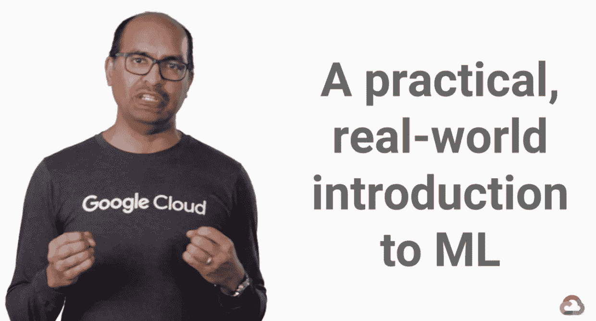

# Google 云平台上 TensorFlow 的机器学习:代码示例

> 原文：<https://towardsdatascience.com/machine-learning-with-tensorflow-on-google-cloud-platform-code-samples-7c1bc07cd265?source=collection_archive---------4----------------------->

在过去的几个月里，我的团队一直致力于在 Coursera 上创建两个 5 门课程的专业，名为“[谷歌云平台上的机器学习](https://www.coursera.org/learn/google-machine-learning)”和“GCP 上的高级机器学习”。完整的 10 个课程的旅程将带你从一个战略概述为什么 ML 的重要性，所有的方式来建立定制序列模型和推荐引擎。

The first course in our 10-course specialization on Coursera launched this week, but the labs for all 10 courses are already available for you to use as a starting point for your models.

这些课程提供了一个互动的，实用的，务实的方法来快速有效地开始做 ML。虽然有许多理论上的机器学习课程，但我这个专业的目标是提供实践培训，以便你可以立即投入运行。为了让你快速起步，课程附带了大量的[开源示例 TensorFlow 应用](https://github.com/GoogleCloudPlatform/training-data-analyst/tree/master/courses/machine_learning/deepdive)，你可以立即学习、培训/部署。

GCP 系列机器学习第一课。 [**谷歌如何做到 ML**](https://coursera.org/learn/google-machine-learning) ，现已在 Coursera 上直播。请去参加课程，并参加剩余的课程，因为它们每隔几周出现一次。

但是，即使你在等待令人敬畏的演示者团队来教授课程，专业化实验室的源代码已经可用。在这篇博文中，我将列出 GitHub repo 的每个文件夹中的可用内容:

## 01.谷歌如何做 ML

[data_analysis.ipynb](https://github.com/GoogleCloudPlatform/training-data-analyst/blob/master/courses/machine_learning/deepdive/01_googleml/data_analysis.ipynb) 向您展示如何对大型数据集进行数据分析:

[mlapis.ipynb](https://github.com/GoogleCloudPlatform/training-data-analyst/blob/master/courses/machine_learning/deepdive/01_googleml/mlapis.ipynb) 向您展示如何调用预先训练的 ML 模型:

## 02.启动到 ML

[repeatable _ splitting . ipynb](https://github.com/GoogleCloudPlatform/training-data-analyst/blob/master/courses/machine_learning/deepdive/02_generalization/repeatable_splitting.ipynb)说明了数据可重复拆分的重要性

[create_datasets.ipynb](https://github.com/GoogleCloudPlatform/training-data-analyst/blob/master/courses/machine_learning/deepdive/02_generalization/create_datasets.ipynb) 向您展示如何使用 Pandas 和 BigQuery 探索和创建数据集

## 03.张量流简介

[a_tfstart.ipynb](https://github.com/GoogleCloudPlatform/training-data-analyst/blob/master/courses/machine_learning/deepdive/03_tensorflow/a_tfstart.ipynb) 向您展示如何使用 TensorFlow 作为数值软件包

[b_estimator.ipynb](https://github.com/GoogleCloudPlatform/training-data-analyst/blob/master/courses/machine_learning/deepdive/03_tensorflow/b_estimator.ipynb) 向您展示如何在 TensorFlow 中编写简单的 ML 模型

[c_batched.ipynb](https://github.com/GoogleCloudPlatform/training-data-analyst/blob/master/courses/machine_learning/deepdive/03_tensorflow/c_batched.ipynb) 向您展示如何在 TensorFlow 中处理大型数据集

d_traineval.ipynb 向您展示如何使用 TensorFlow 进行分布式训练

[debug_demo.ipynb](https://github.com/GoogleCloudPlatform/training-data-analyst/blob/master/courses/machine_learning/deepdive/03_tensorflow/debug_demo.ipynb) 向您展示如何调试 TensorFlow 程序

[e_cloudmle.ipynb](https://github.com/GoogleCloudPlatform/training-data-analyst/blob/master/courses/machine_learning/deepdive/03_tensorflow/e_cloudmle.ipynb) 向您展示如何部署 TensorFlow 模型，并使用云 ML 引擎以无服务器的方式进行预测

## 04.特征工程

[a_features.ipynb](https://github.com/GoogleCloudPlatform/training-data-analyst/blob/master/courses/machine_learning/deepdive/04_features/a_features.ipynb) 说明了正确表示特征的重要性

[数据流](https://github.com/GoogleCloudPlatform/training-data-analyst/blob/master/courses/machine_learning/deepdive/04_features/dataflow)展示了如何使用 Apache Beam on Cloud 数据流进行预处理

[taxifeateng](https://github.com/GoogleCloudPlatform/training-data-analyst/blob/master/courses/machine_learning/deepdive/04_features/taxifeateng) 向您展示如何在 TensorFlow 模型中实现特征工程

## 05.ML 的艺术与科学

[a_handtuning.ipynb](https://github.com/GoogleCloudPlatform/training-data-analyst/blob/master/courses/machine_learning/deepdive/05_artandscience/a_handtuning.ipynb) 向您展示如何更改与 TensorFlow 模型相关的各种参数，以获得更高的精度

[b_hyperparam.ipynb](https://github.com/GoogleCloudPlatform/training-data-analyst/blob/master/courses/machine_learning/deepdive/05_artandscience/b_hyperparam.ipynb) 向您展示如何在 Cloud ML Engine 上自动调优 TensorFlow 模型，这样您就不必进行手动调优。

[c_neuralnetwork.ipynb](https://github.com/GoogleCloudPlatform/training-data-analyst/blob/master/courses/machine_learning/deepdive/05_artandscience/c_neuralnetwork.ipynb) 向您展示如何以最简单的方式在 TensorFlow 中使用分布式神经网络模型进行训练和预测。

[d_customestimator.ipynb](https://github.com/GoogleCloudPlatform/training-data-analyst/blob/master/courses/machine_learning/deepdive/05_artandscience/d_customestimator.ipynb) 向您展示如何采用您在论文中找到的模型，并以分布式和可扩展的方式实现。

## 06.结构化数据上的端到端机器学习

这套笔记本:

1_explore.ipynb 向您展示了如何使用 Pandas 和 BigQuery 来浏览数据

[2_sample.ipynb](https://github.com/GoogleCloudPlatform/training-data-analyst/blob/master/courses/machine_learning/deepdive/06_structured/2_sample.ipynb) 向您展示如何重复分割数据

[3_tensorflow.ipynb](https://github.com/GoogleCloudPlatform/training-data-analyst/blob/master/courses/machine_learning/deepdive/06_structured/3_tensorflow.ipynb) 向您展示如何在数据上构建一个估计器模型

[4_preproc.ipynb](https://github.com/GoogleCloudPlatform/training-data-analyst/blob/master/courses/machine_learning/deepdive/06_structured/4_preproc.ipynb) 向您展示如何使用数据流大规模预处理数据

[4_preproc_tft.ipynb](https://github.com/GoogleCloudPlatform/training-data-analyst/blob/master/courses/machine_learning/deepdive/06_structured/4_preproc_tft.ipynb) 向您展示如何使用 TF 大规模预处理数据。改变

[5_train.ipynb](https://github.com/GoogleCloudPlatform/training-data-analyst/blob/master/courses/machine_learning/deepdive/06_structured/5_train.ipynb) 向您展示如何在云 ML 引擎上训练 TensorFlow 模型

[6_deploy.ipynb](https://github.com/GoogleCloudPlatform/training-data-analyst/blob/master/courses/machine_learning/deepdive/06_structured/6_deploy.ipynb) 向您展示如何将训练好的模型部署到云 ML 引擎

[服务](https://github.com/GoogleCloudPlatform/training-data-analyst/tree/master/courses/machine_learning/deepdive/07_structured/serving)向您展示如何从 web 应用程序和数据管道中访问 ML 预测。

以上 7 个实验总结了前六个课程在一个现实问题上的经验，带您从数据探索到部署和预测。

## 07.生产 ML 模型

这一个没有实验—这是关于 ML 模型的设计和架构考虑。

## 08.图像分类模型

[mnist_estimator.ipynb](https://github.com/GoogleCloudPlatform/training-data-analyst/blob/master/courses/machine_learning/deepdive/08_image/mnist_estimator.ipynb) 向您展示如何使用 Estimator API 构建图像分类器

向您展示如何使用所有技巧(卷积层、扩充、批量标准化等)构建一个定制的评估器。)进入一个好的图像分类模型

[flowers _ from scratch . ipynb](https://github.com/GoogleCloudPlatform/training-data-analyst/blob/master/courses/machine_learning/deepdive/08_image/flowers_fromscratch.ipynb)向您展示如何将之前笔记本中的图像模型应用于“真实”图像。

迁移学习和 AutoML 的实验不在 GitHub 中，因为它们不涉及任何编码——只需点击！

## 09.时间序列和文本序列模型

[sinewaves.ipynb](https://github.com/GoogleCloudPlatform/training-data-analyst/blob/master/courses/machine_learning/deepdive/09_sequence/sinewaves.ipynb) 向您展示如何使用包括 CNN 和 LSTMs 在内的各种技术在 TensorFlow 中构建时间序列预测模型。

temperature.ipynb 说明了 LSTMs 有多难做对

txtcls1.ipynb 向您展示了如何使用各种技术(包括 CNN 和 LSTMs)从头开始构建文本分类模型

[txtcls2.ipynb](https://github.com/GoogleCloudPlatform/training-data-analyst/blob/master/courses/machine_learning/deepdive/09_sequence/txtcls2.ipynb) 向您展示如何在文本分类模型中使用预训练的单词嵌入。

[word2vec.ipynb](https://github.com/GoogleCloudPlatform/training-data-analyst/blob/master/courses/machine_learning/deepdive/09_sequence/word2vec.ipynb) 向你展示了如何从你自己的数据集中创建一个单词嵌入。

[poem . ipynb](https://github.com/GoogleCloudPlatform/training-data-analyst/blob/master/courses/machine_learning/deepdive/09_sequence/poetry.ipynb)向您展示如何使用 Tensor2Tensor 解决您自己的文本问题，无论是文本摘要还是文本生成

## 10.推荐引擎

显示了一个基于内容的推荐系统的例子

[wals.ipynb](https://github.com/GoogleCloudPlatform/training-data-analyst/blob/master/courses/machine_learning/deepdive/10_recommend/wals.ipynb) 向您展示如何在 TensorFlow 中构建协同过滤推荐系统

[wals_tft.ipynb](https://github.com/GoogleCloudPlatform/training-data-analyst/blob/master/courses/machine_learning/deepdive/10_recommend/wals_tft.ipynb) 通过添加 tf.transform 管道来自动映射唯一的用户标识和项目标识，使协作过滤模型可以投入生产。

随着 ML 的成熟，当然会有更多的实验室，上面的一些实验室可能是不必要的。GitHub repo 是一个动态存储库，我们计划保持它的最新状态，并反映建议的 TensorFlow 实践。因此，如果您正在构建自己的 ML 模型，笔记本(及其相应的模型目录)是一个很好的起点。

探索愉快！