# 机器学习—使用 Keras 进行单词嵌入和情感分类

> 原文：<https://towardsdatascience.com/machine-learning-word-embedding-sentiment-classification-using-keras-b83c28087456?source=collection_archive---------0----------------------->

在[的上一篇文章](https://medium.com/@javaid.nabi/machine-learning-text-processing-1d5a2d638958)中，我们讨论了自然语言处理(NLP)中文本处理的各个步骤，并且使用一些经典的 ML 技术实现了一个基本的情感分析器。

深度学习已经在包括 NLP、计算机视觉和游戏在内的各种任务上表现出优异的性能。为了进一步探索，我们将讨论和使用一些基于深度学习的高级 NLP 技术，来创建一个改进的情感分类器。

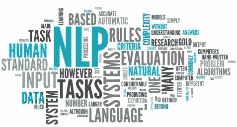

Courtesy ([KDnuggets](https://www.kdnuggets.com/2015/12/natural-language-processing-101.html))

## 情感分类问题

> 情感分类的任务是查看一段文本，并判断某人是否喜欢或不喜欢他们正在谈论的事情。

输入 X 是一段文本，输出 Y 是我们想要预测的情感，比如电影评论的星级。


如果我们可以训练一个系统根据上面的标签数据集从 X 映射到 Y，那么这样的系统可以用来预测一个评论者在看完电影后的情绪。

在本帖中，我们将重点关注以下任务:

*   构建深度神经网络进行情感分类。
*   学习单词嵌入:一边训练网络，一边使用 Word2Vec。

## 体系结构

深度学习文本分类模型架构通常由以下顺序连接的组件组成:

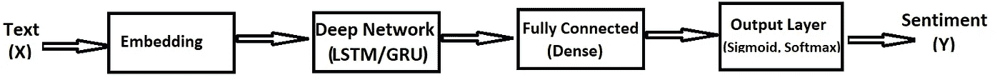

Deep Learning Architecture

*   嵌入层

```
***Word Embedding*** *is a representation of text where words that have the same meaning have a similar representation. In other words it represents words in a coordinate system where related words, based on a corpus of relationships, are placed closer together.* In the deep learning frameworks such as TensorFlow, Keras, this part is usually handled by an **embedding layer** which stores a lookup table to map the words represented by numeric indexes to their dense vector representations.
```

*   深层网络

```
Deep network takes the sequence of embedding vectors as input and converts them to a compressed representation. The compressed representation effectively captures all the information in the sequence of words in the text. The deep neywrok part is usually an RNN or some forms of it like LSTM/GRU. The dropout is added to overcome the tendency to overfit, a very common problem with RNN based networks. Please refer [here](/illustrated-guide-to-lstms-and-gru-s-a-step-by-step-explanation-44e9eb85bf21) for detailed discussion on LSTM,GRU.
```

*   全连接层

```
The **fully connected layer** takes the deep representation from the RNN/LSTM/GRU and transforms it into the final output classes or class scores. This component is comprised of fully connected layers along with batch normalization and optionally dropout layers for regularization.
```

*   输出层

```
Based on the problem at hand, this layer can have either **Sigmoid** for binary classification or **Softmax** for both binary and multi classification output.
```

## **数据集**

IMDB 电影评论集可以从[这里](http://ai.stanford.edu/~amaas/data/sentiment/)下载。这个用于二元情感分类的数据集包含用于训练的 25，000 条高度极性的电影评论，以及用于测试的 25，000 条评论。初始预处理后的数据集保存到`movie_data.csv`文件。首先，我们加载 IMDb 数据集，文本评论分别被标记为正面和负面情绪的 1 或 0。

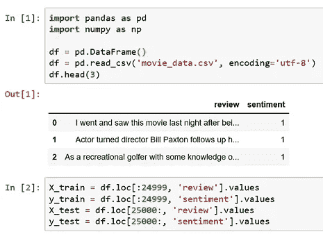

IMDb movie review dataset

## 学习单词嵌入

我们数据集的单词嵌入可以在训练关于分类问题的神经网络时学习。在将文本数据呈现给网络之前，首先对其进行编码，以便每个单词由一个唯一的整数表示。这个数据准备步骤可以使用 Keras 提供的 [Tokenizer API](https://keras.io/preprocessing/text/#tokenizer) 来执行。我们添加填充，使所有的向量长度相同`(*max_length*)`。下面的代码将文本转换为整数索引，现在可以在 Keras 嵌入层中使用。

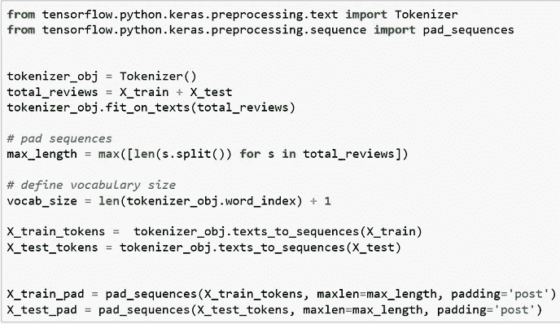

嵌入层需要词汇表大小`(vocab_size)`、实值向量空间大小`EMBEDDING_DIM = 100`和输入文档最大长度`max_length`的规范。

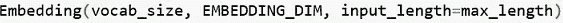

## 建立模型

我们现在准备定义我们的神经网络模型。该模型将使用一个嵌入层作为第一个隐藏层。嵌入层用随机权重初始化，并将在模型训练期间学习训练数据集中所有单词的嵌入。

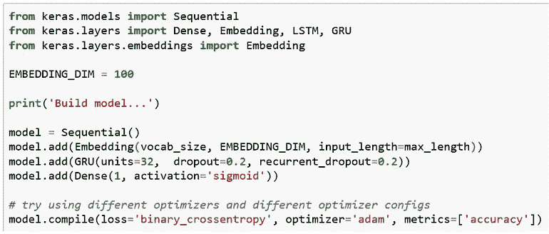

该模式的总结是:

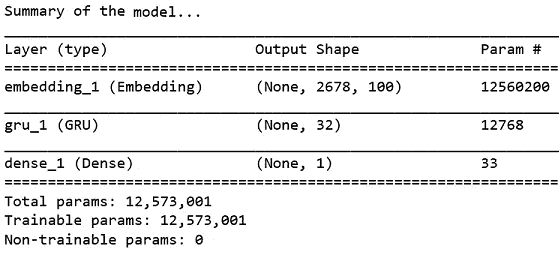

出于演示目的，我们使用了一个简单的深层网络配置。您可以尝试不同的网络配置并比较性能。嵌入参数计数`12560200 = (vocab_size * EMBEDDING_DIM)`。最大输入长度`max_length = 2678`。训练期间的模型将从输入文本中学习单词嵌入。可训练参数总数为 12，573，001。

## 火车模型

现在让我们在训练集上训练模型，并在测试集上交叉验证。我们可以从下面的训练时期看到，每个时期之后的模型都在提高精度。几个时期之后，我们达到了大约 84%的验证准确度。还不错:)

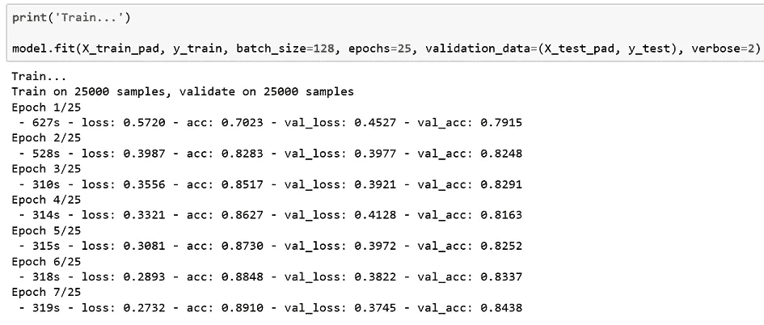

## 试验模型

我们可以用一些样本评论来测试我们的模型，以检查它是如何预测每个评论的情绪的。首先，我们必须将文本审查转换为令牌，并使用模型预测如下。


输出给出单词的预测是 1(正面情绪)或 0(负面情绪)。

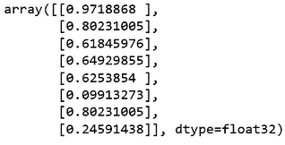

接近 1 的值是强烈的积极情绪，接近 0 的值是强烈的消极情绪。我可以清楚地看到，模型预测对于 *test_sample_7* 是错误的，而对于其余的样本却表现得相当好。

在上述方法中，我们学习单词嵌入作为拟合神经网络模型的一部分。

## 训练 word2vec 嵌入

还有另一种方法来构建情感澄清模型。我们可以先单独学习单词嵌入，然后传递到嵌入层，而不是训练嵌入层。这种方法还允许使用任何预先训练的单词嵌入，并且还节省了训练分类模型的时间。

我们将使用 Word2Vec 的 Gensim 实现。第一步是通过创建单词标记、去除标点符号、去除停用词等来准备用于学习嵌入的文本语料库。word2vec 算法逐句处理文档。

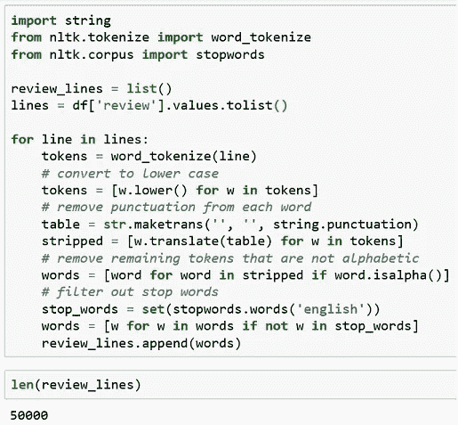

我们的文本语料库中有 50000 条评论。Gensim 的 [Word2Vec API](https://radimrehurek.com/gensim/models/word2vec.html#gensim.models.word2vec.Word2Vec) 需要一些参数进行初始化。

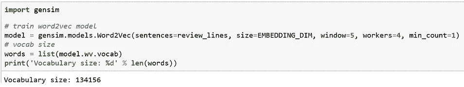

一.`sentences`–句子列表；这里我们通过复习句子列表。

二。我们希望用多少维度来表达我们的话语。这是单词向量的大小。

三。`min_count`–只有频率大于`min_count`的词才会被纳入模型。通常，你的文本越大越广泛，这个数字就越高。

四。`window`–只有出现在*窗口*-一个句子中某个术语的邻近区域内的术语，才会在训练过程中与之相关联。通常的值是 4 或 5。

动词 （verb 的缩写）`workers`–训练并行化中使用的线程数量，以加快训练速度

## 测试 Word2Vec 模型

在我们在 IMDb 数据集上训练模型之后，它建立了一个词汇表`size = 134156`。让我们尝试一些从电影评论数据集学习的单词嵌入模型。

与单词`horrible` 最相似的单词是:

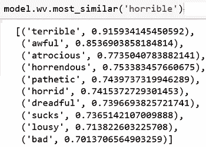

most similar words

试着对单词 vectors 做些数学计算— `woman+king-man=?`

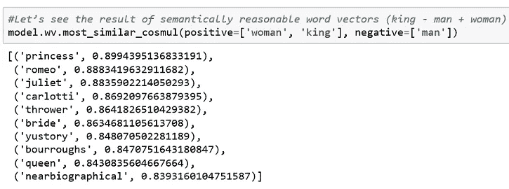

让我们找到那个奇怪的单词`woman, king, queen, movie = ?`

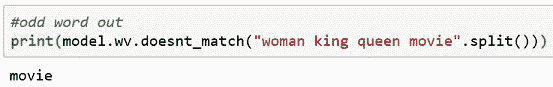

看到我们的 word2vec 模型从文本语料库中学习到的单词嵌入是非常有趣的。下一步是在我们的情感分类模型的嵌入层中直接使用单词嵌入。我们可以保存模型以备后用。

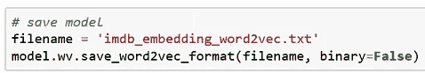

## 使用预先训练的嵌入

因为我们已经用 IMDb 数据集训练了 word2vec 模型，所以我们已经准备好使用单词嵌入了。下一步是将单词 embedding 作为单词目录加载到 vectors 中。单词 embedding 保存在文件`imdb_embedding_word2vec.txt`中。让我们从存储的文件中提取单词 embeddings。

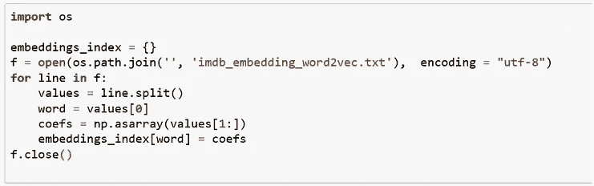

下一步是将单词 embedding 转换成标记化的向量。回想一下，评审文档在传递到嵌入层之前是整数编码的。整数映射到嵌入层中特定向量的索引。因此，重要的是我们在嵌入层中布置矢量，使得编码的字映射到正确的矢量。

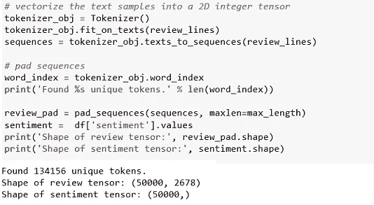

现在，我们将把每个单词的嵌入从加载的 word2vec 模型映射到 `tokenizer_obj.word_index`词汇表，并创建一个单词向量矩阵。

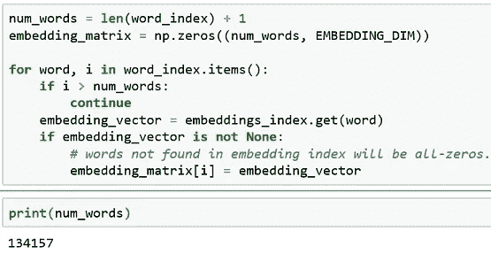

我们现在已经准备好将训练好的嵌入向量直接用于嵌入层。在下面的代码中，与先前模型的唯一变化是使用`embedding_matrix`作为嵌入层的输入并设置`trainable = False`，因为嵌入已经被学习。

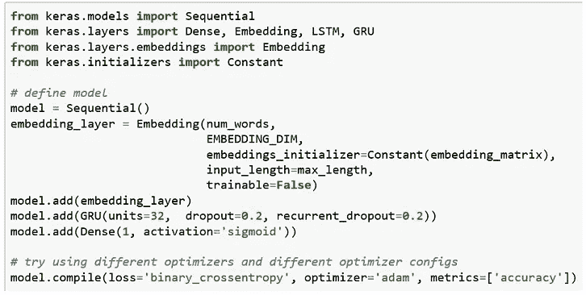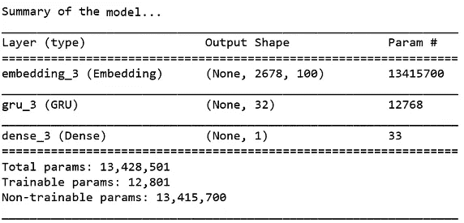

Model summary with pre- trained Embedding

仔细看，你可以看到型号`total params = 13,428,501`而不是`trainable params = 12801`。由于该模型使用预训练的单词嵌入，它具有非常少的可训练参数，因此应该训练得更快。

为了训练情感分类模型，我们使用`VALIDATION_SPLIT= 0.2`，你可以改变它来观察对模型准确性的影响。


最后，在训练和验证测试集上训练分类模型，我们随着每个历元的运行而获得准确度的提高。我们仅用大约 5 个时期就达到了 88%的准确率。

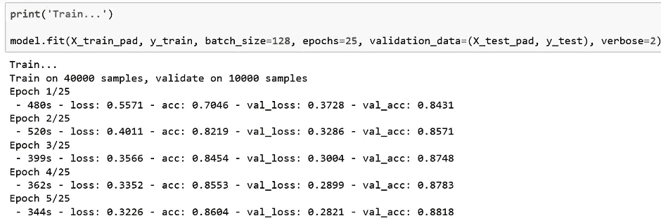

你可以尝试通过改变超参数、运行更多的历元等来提高模型的准确性。此外，您可以使用其他一些预先训练好的嵌入，这些嵌入是在非常大的文本数据语料库上准备的，您可以直接[下载](http://ahogrammer.com/2017/01/20/the-list-of-pretrained-word-embeddings/)。

## 结论

在这篇文章中，我们详细讨论了用于情感分类的深度学习模型的架构。我们还训练了一个 word2vec 模型，并将其用作情感分类的预训练嵌入。

感谢阅读，如果你喜欢，请为它鼓掌。

## 进一步阅读

[http://ruder.io/deep-learning-nlp-best-practices](http://ruder.io/deep-learning-nlp-best-practices/)

[](https://keras.io/getting-started/functional-api-guide/) [## 功能 API - Keras 文档指南

### 让我们考虑下面的模型。我们试图预测一个新闻标题在……上会有多少转发和点赞

keras.io](https://keras.io/getting-started/functional-api-guide/) [](https://machinelearningmastery.com/develop-word-embedding-model-predicting-movie-review-sentiment/) [## 如何开发预测电影评论情感的单词嵌入模型

### 单词嵌入是一种表示文本的技术，其中具有相似含义的不同单词具有相似的…

machinelearningmastery.com](https://machinelearningmastery.com/develop-word-embedding-model-predicting-movie-review-sentiment/) 

[Rajesh Arumugam 的 Python 自然语言处理实践，Rajalingappaa Shanmugamani，2018 年 7 月](https://www.oreilly.com/library/view/hands-on-natural-language/9781789139495/)