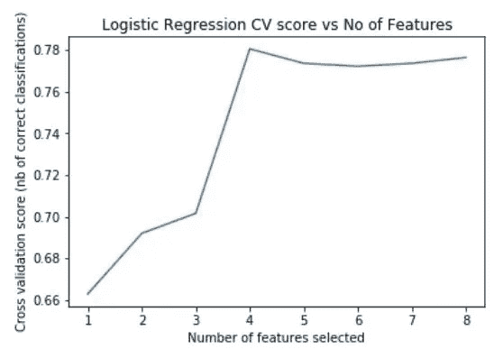
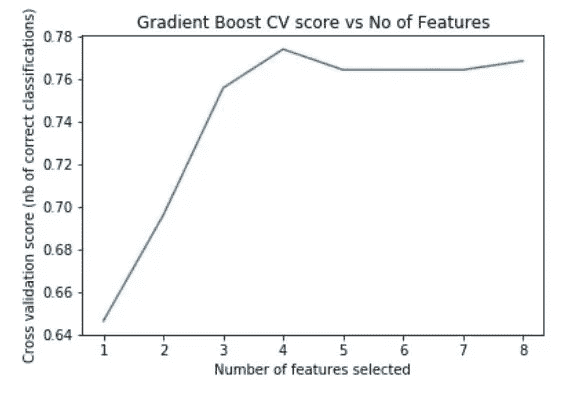
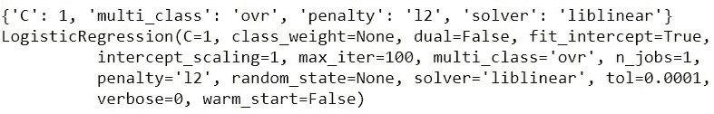

# 糖尿病数据的机器学习工作流程:第 2 部分

> 原文：<https://towardsdatascience.com/machine-learning-workflow-on-diabetes-data-part-02-11262b7f7a5c?source=collection_archive---------3----------------------->

在本系列的上一篇文章中，我们讨论了关于糖尿病数据集的机器学习工作流。并讨论了诸如数据探索、数据清洗、特征工程基础和模型选择过程等主题。你可以在下面找到之前的文章。

[](/machine-learning-workflow-on-diabetes-data-part-01-573864fcc6b8) [## 糖尿病数据的机器学习工作流程:第 1 部分

### “医疗环境中的机器学习可以帮助显著增强医疗诊断。”

towardsdatascience.com](/machine-learning-workflow-on-diabetes-data-part-01-573864fcc6b8) 

选择模型后，我们能够确定**逻辑回归**比其他选择的分类模型表现更好。在本文中，我们将讨论机器学习工作流的下一阶段，高级特征工程和超参数调整。

# 第 5 阶段—特征工程(再次访问)

并非所有的功能都必须是赢家。大多数时候，有些特性并不能改善模型。这种情况可以通过进一步分析与模型相关的特征来发现。"**一个高度预测的特征可以弥补 10 个哑弹**"。

正如在阶段 3 中提到的，在模型选择之后，应该进一步讨论特征工程。因此，我们将分析选择的逻辑回归模型，以及特征重要性如何影响它。

Scikit Learn 提供了有用的方法，通过这些方法我们可以进行特征选择，并找出影响模型的特征的重要性。

1.  [**单变量特征选择**](http://scikit-learn.org/stable/auto_examples/feature_selection/plot_feature_selection.html) :统计检验可以用来选择那些与输出变量关系最强的特征。
2.  [**递归特征消除**](http://scikit-learn.org/stable/modules/generated/sklearn.feature_selection.RFE.html) :递归特征消除(或 RFE)的工作原理是递归地删除属性，并在那些保留的属性上建立一个模型。它使用模型精度来确定哪些属性(和属性组合)对预测目标属性贡献最大。
3.  [**主成分分析**](http://scikit-learn.org/stable/modules/generated/sklearn.decomposition.PCA.html) :主成分分析(或称 PCA)利用线性代数将数据集转换成压缩形式。通常这被称为数据简化技术。PCA 的一个特性是可以选择变换结果中的维数或主分量。
4.  **特征重要性**:随机森林和额外树等袋装决策树可以用来估计特征的重要性。

在本教程中，我们将使用递归特征消除作为特征选择方法。

首先，我们导入 RFECV，它带有内置的交叉验证特性。与分类器模型相同，RFECV 具有 fit()方法，该方法接受特性和响应/目标。

## 逻辑回归—特征选择

```
from sklearn.feature_selection import RFECVlogreg_model = LogisticRegression()rfecv = RFECV(estimator=logreg_model, step=1, cv=strat_k_fold, scoring='accuracy')
rfecv.fit(X, y)
```

拟合后，它会显示一个属性 **grid_scores_** ，该属性会返回每个所选特征的精度分数列表。我们可以用它来绘制一个图表，以查看给定模型的最大精确度的特征数量。

```
plt.figure()
plt.title('Logistic Regression CV score vs No of Features')
plt.xlabel("Number of features selected")
plt.ylabel("Cross validation score (nb of correct classifications)")
plt.plot(range(1, len(rfecv.grid_scores_) + 1), rfecv.grid_scores_)
plt.show()
```



Fig — Feature importance of Logistic Regression

通过查看该图，我们可以看到，将 4 个特征输入到模型中会得到最佳的准确度分数。RFECV 展示了 **support_** ，这是找出对预测贡献最大的特征的另一个属性。为了找出选择了哪些特性，我们可以使用下面的代码。

```
feature_importance = list(zip(feature_names, rfecv.support_))new_features = []for key,value in enumerate(feature_importance):
    if(value[1]) == True:
        new_features.append(value[0])

print(new_features)
```

> ['妊娠'，'葡萄糖'，'身体质量指数'，'糖尿病血糖功能']

我们可以看到，给定的特征最适合预测响应类。我们可以对具有**原始特征**和 **RFECV 选定特征**的模型进行比较，以查看准确性得分是否有所提高。

```
# Calculate accuracy scores 
X_new = diabetes_mod[new_features]initial_score = cross_val_score(logreg_model, X, y, cv=strat_k_fold, scoring='accuracy').mean()
print("Initial accuracy : {} ".format(initial_score))fe_score = cross_val_score(logreg_model, X_new, y, cv=strat_k_fold, scoring='accuracy').mean()
print("Accuracy after Feature Selection : {} ".format(fe_score))
```

> 初始精度:0.7764400711728514
> 特征选择后的精度:0.2676486766

通过观察精度，在将所选特征输入模型后，精度会略有提高。

## 梯度增强-要素选择

我们还可以分析我们拥有的第二个最佳模型，即梯度增强分类器，以查看特征选择过程是否提高了模型准确性，以及在该过程之后它是否优于逻辑回归。

我们遵循与逻辑回归相同的程序

```
gb_model = GradientBoostingClassifier()gb_rfecv = RFECV(estimator=gb_model, step=1, cv=strat_k_fold, scoring='accuracy')
gb_rfecv.fit(X, y)plt.figure()
plt.title('Gradient Boost CV score vs No of Features')
plt.xlabel("Number of features selected")
plt.ylabel("Cross validation score (nb of correct classifications)")
plt.plot(range(1, len(gb_rfecv.grid_scores_) + 1), gb_rfecv.grid_scores_)
plt.show()
```



Fig — Feature importance of Gradient Boost

我们可以看到，拥有 4 个输入特征可以产生最高的精度。

```
feature_importance = list(zip(feature_names, gb_rfecv.support_))new_features = []for key,value in enumerate(feature_importance):
    if(value[1]) == True:
        new_features.append(value[0])

print(new_features)
```

> ['葡萄糖'，'身体质量指数'，'糖尿病胰岛素功能'，'年龄']

以上 4 个特征最适合模型。我们可以比较特征选择前后的准确率。

```
X_new_gb = diabetes_mod[new_features]initial_score = cross_val_score(gb_model, X, y, cv=strat_k_fold, scoring='accuracy').mean()
print("Initial accuracy : {} ".format(initial_score))fe_score = cross_val_score(gb_model, X_new_gb, y, cv=strat_k_fold, scoring='accuracy').mean()
print("Accuracy after Feature Selection : {} ".format(fe_score))
```

> 初始精度:0.764091206294081
> 特征选择后的精度:0.2666766667

我们可以看到，在特征选择之后，准确度有所提高。

然而**逻辑回归**比梯度推进更准确。因此，我们将在参数调整阶段使用逻辑回归。

# 阶段 6 —模型参数调整

Scikit Learn 为模型提供了合理的默认参数，从而给出了不错的准确度分数。它还为用户提供了调整参数的选项，以进一步提高精度。

在分类器中，我们将选择逻辑回归进行微调，其中我们更改模型参数，以便可能提高特定数据集模型的准确性。

我们可以使用 [GridSearchCV](http://scikit-learn.org/stable/modules/generated/sklearn.model_selection.GridSearchCV.html) 轻松执行穷举搜索，而不必手动搜索最佳参数，它会执行*“对估计器的指定参数值进行穷举搜索”*。

这显然是一个非常方便的工具，但当要搜索的参数很高时，它会带来计算成本的代价。

> 重要提示:在使用 GridSearchCV 时，有些模型的参数相互之间不兼容。由于 GridSearchCV 使用所有给定参数的组合，如果两个参数不能相互配合，我们将无法运行 GridSearchCV。
> 
> 如果发生这种情况，可以提供一个参数网格列表来克服给定的问题。**建议您阅读您正在尝试微调的的类文档，以了解参数之间的相互作用。**

首先我们导入 GridSearchCV。

```
from sklearn.model_selection import GridSearchCV
```

逻辑回归模型有一些超参数，这些超参数不能相互作用。因此，我们提供了一个具有兼容参数的网格列表来微调模型。通过反复试验，找到了以下兼容参数。

> 逻辑回归类文档可以在这里找到[。](http://scikit-learn.org/stable/modules/generated/sklearn.linear_model.LogisticRegression.html#sklearn.linear_model.LogisticRegression)

```
# Specify parameters
c_values = list(np.arange(1, 10))param_grid = [
    {'C': c_values, 'penalty': ['l1'], 'solver' : ['liblinear'], 'multi_class' : ['ovr']}, {'C': c_values, 'penalty': ['l2'], 'solver' : ['liblinear', 'newton-cg', 'lbfgs'], 'multi_class' : ['ovr']}
]
```

然后，我们将数据拟合到 GridSearchCV，GridSearchCV 针对给定的参数组合对数据执行 K 重交叉验证。这可能需要一段时间才能完成。

```
grid = GridSearchCV(LogisticRegression(), param_grid, cv=strat_k_fold, scoring='accuracy')grid.fit(X_new, y)
```

在训练和评分完成之后，GridSearchCV 提供了一些有用的属性来寻找最佳参数和最佳估计量。

```
print(grid.best_params_)
print(grid.best_estimator_)
```



Fig — Best attributes of the Logistic Regression

我们可以观察到最佳超参数如下。

```
{'C': 1, 'multi_class': 'ovr', 'penalty': 'l2', 'solver': 'liblinear'}
```

我们可以将最佳参数输入逻辑回归模型，并观察其准确性是否有所提高。

```
logreg_new = LogisticRegression(C=1, multi_class='ovr', penalty='l2', solver='liblinear')initial_score = cross_val_score(logreg_new, X_new, y, cv=strat_k_fold, scoring='accuracy').mean()
print("Final accuracy : {} ".format(initial_score))Final accuracy : 0.7805877119643279
```

我们可以得出结论，超参数调整并没有增加它的准确性。也许我们选择的超参数并不具有指示性。但是，欢迎您尝试添加更多的参数组合。

> 最重要的方面是进行超参数调整的过程，而不是结果本身。在大多数情况下，超参数调谐提高了精度。

> 我们设法实现了 78.05%的分类准确率，可以说这是非常好的。

# 结论

我们已经到了文章系列的结尾。在这个系列中，我们经历了整个机器学习工作流程。我们讨论了完成分类任务所需的理论和实践知识。

我们讨论了机器学习的工作流程步骤，如数据探索、数据清理步骤、特征工程基础和高级特征选择、模型选择和使用 Scikit Learn library 的超参数调整。

现在轮到你了！现在，您应该能够使用这些知识来尝试其他数据集。

创建这篇文章的源代码可以在下面找到。

[](https://github.com/LahiruTjay/Machine-Learning-With-Python/blob/master/Machine%20Learning%20Workflow%20on%20Diabetes%20Data.ipynb) [## LahiruTjay/用 Python 学习机器

### 这个库包含了各种用 Python 完成的机器学习的例子。

github.com](https://github.com/LahiruTjay/Machine-Learning-With-Python/blob/master/Machine%20Learning%20Workflow%20on%20Diabetes%20Data.ipynb) 

如果你对这篇文章有任何问题，请不要犹豫，在下面留言或者给我发电子邮件:lahiru.tjay@gmail.com