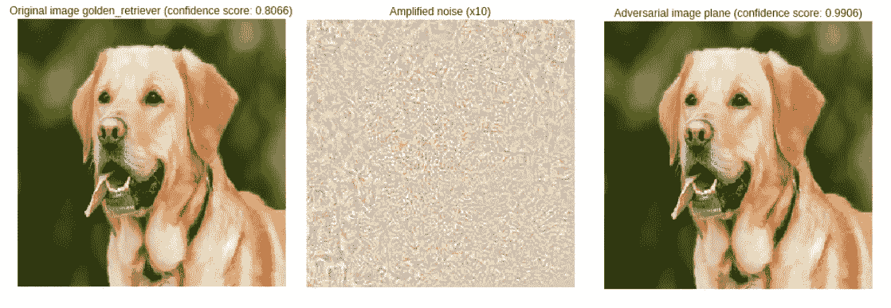
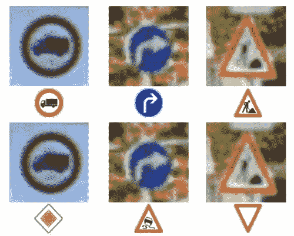
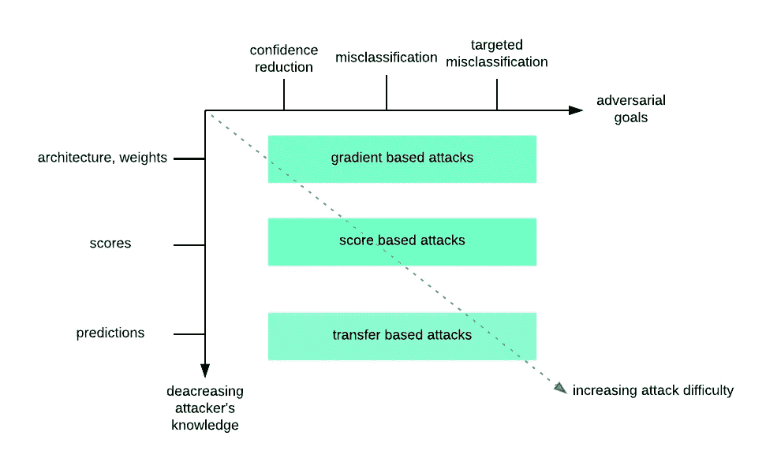
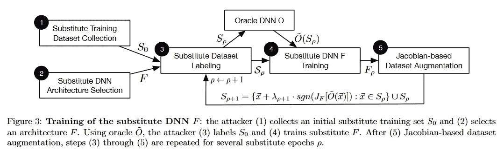
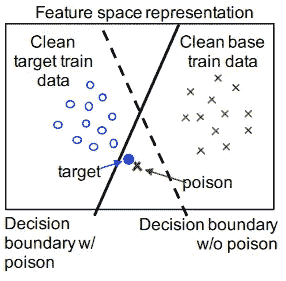
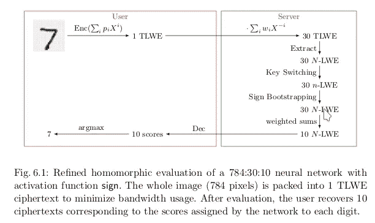

# ML 系统的安全概述

> 原文：<https://towardsdatascience.com/machine-learnings-security-layer-an-overview-cfc11841f34e?source=collection_archive---------14----------------------->

## 这是对机器学习系统安全性的浅显概述。在几个卷轴中，我们将浏览对立的例子，模型盗窃，数据集中毒和数据集保护。


# 🗡 ️Adversarial 的例子

对立的例子(AE)主题很吸引人，也是一个活跃的研究领域。它提出了与我们当前基于梯度的分类器架构的限制和安全性相关的基本问题。AE 是精心制作的数据，旨在被目标模型错误分类。它们“被设计成使模型出错”( [OpenAI](https://blog.openai.com/adversarial-example-research/) ，用对抗性的例子攻击机器学习)。右边的图像是一个对立的例子。



See the complete [notebook](http://github.com/maxpv/maxpv.github.io/blob/master/notebooks/Adversarial_ResNet50.ipynb)

最左和最右的狗之间的差异可能是不可感知的。这可能是由于我们的眼睛限制(或您的显示器的位深度)。然而，它们对各种模型都至关重要。最后一个图像实际上是由 Keras 中使用默认训练权重初始化的`ResNet50`将[视为](https://github.com/maxpv/maxpv.github.io/blob/master/notebooks/Adversarial_ResNet50.ipynb)的`plane`，并且一个 AE 可能会在另一个架构上工作。唯一的区别是小像素值，在第二张图片中放大了。

我们可以注意到`ResNet50`非常自信地认为左图中的狗是一只`golden_retriever` (~80%)，而精心制作的图像是一只可信度更高的`plane`(~ 99%)。因此，一个模型可能会被欺骗，以我们期望的置信度得分犯错误，我们通常只需要训练它足够长的时间。用任意的置信度分数进行错误分类会有什么影响？

推荐系统也被研究用于[对抗性推荐](https://arxiv.org/pdf/1809.08336.pdf)，通过不可辨别的虚假用户影响推荐系统。

## 安全

在大多数已知的模型中，任何图像都可以被制作成具有任意置信度得分的另一类。所以我们的狗可以被任意准确地错误分类成我们想要的任何东西。事实证明，在现实世界中也是如此，例如，如果我们把它们打印出来。一个著名的例子是欺骗汽车的传感器看到限速而不是停车标志。在某种程度上，模型的输出可以被操纵以做出期望的决策，或者由依赖于它的应用程序生成未处理的行为。



Prediction vs ‘puppeted’ prediction arxiv.org/pdf/1602.02697.pdf (page 3)

到 2017 年底，一些研究表明，在某些情况下，修改一个像素就足够了。如果你想了解更多，你可以阅读论文[欺骗深度神经网络的一个像素攻击](https://arxiv.org/abs/1710.08864)，欣赏[一分钟论文](https://www.youtube.com/watch?v=SA4YEAWVpbk)频道的高水平演示或检查这个 [Keras 实现](https://github.com/Hyperparticle/one-pixel-attack-keras)。

对抗性的例子是简单的攻击，不需要太多的计算。对于相对较小的图像，一个好的 GPU 可以在不到一分钟的时间内制作一个 AE。这是一个真正的安全问题，这可能是为什么我们可以在一些相关主题[论文](https://arxiv.org/abs/1602.02697)的末尾看到这些行:

> *根据合作协议编号 w 911 nf-13–2–0045(ARL 网络安全 CRA 公司),该研究也得到了陆军研究实验室的部分支持，并得到了陆军研究办公室的拨款 w 911 nf-13–1–0421。*

## 不同的威胁级别和技术

我们知道，对立的例子会影响分类器的决策界限。例如，我们可以在图像上添加随机像素，然后*改变*分类，或者明智地选择那些添加的像素，然后*选择*分类。根据威胁目标，我们表示:

*   置信度降低通过降低给定图像的模型置信度来增加类别之间的模糊性。
*   错误分类将输出类别更改为不同于原始类别的另一个类别。
*   有针对性的错误分类会强制特定输入的输出成为特定的目标类。

根据对手的知识，有三种方式来设计对抗性的例子。每个人都有自己假定的目标先验知识。了解:

*   模型整体包括其权重(*基于梯度*)，
*   只有每个班级的分数(*基于分数的*)，
*   只有预测(*转移型*)。

由 Papernot 绘制的简图。在对抗环境中深度学习的局限性(第 3 页)中:



Simplified copy of a diagram by Papernot. et al in The Limitations of Deep Learning in Adversarial Settings (page 3)

**基于梯度的攻击**的一个例子在于计算图像的损失梯度函数。接着向相反的梯度方向迈一小步。为了保持有效的 RGB 值，图像可能会在 0 到 255 之间被剪切，噪声值在 0 和一个小值 M 之间。这个值 M 决定了原始图像和对手图像之间的最大差异，因此 M 应该小于人类的颜色敏感度(通过监视器)。m 小于 5 应该可以。前一种技术被称为迭代最小可能类方法。存在其他类型的梯度技术，如快速梯度符号方法。你可以阅读[这篇论文](https://arxiv.org/abs/1607.02533)(第 2 部分，第 3 页)。我们可以注意到，它们都需要完全了解模型及其权重。

**基于分数的攻击**仅依靠预测模型的分数来估计梯度，然后应用先前的技术。**基于传输的攻击**完全依赖于输出标签。与基于分数和基于梯度相比，这是一个更真实的场景。您可以在模型盗窃一节中找到基于传输的攻击的示例。

## 防御

这里我们不会深入探讨，我鼓励你搜索吸引你的关键词，它本身就值得一篇博文。我们可以看到两大类防御:

*   *反应性*:目标是一个对抗的例子，在被我们的推理模型调用之前。
*   *主动*:目标是让模型更能抵御这种攻击。[Nicolas paper not 等人的黑盒攻击](https://arxiv.org/abs/1602.02697)。

被动防御的例子:

*   [磁铁](https://arxiv.org/abs/1705.09064)由自动编码器组成的“两个网络”模型，能够在送入分类器之前进行重组。这里需要几个自动编码器，所以资源很昂贵。

主动防御的示例:

*   [随机深度符号](https://arxiv.org/abs/1806.05789)卷积神经网络
*   标签平滑(2016)
*   混搭(2017)
*   对抗性训练，用对抗性例子的子集重新训练神经网络
*   Logit 配对:这是一个非常新的配对(2018 年)，“实现了 ImageNet 上白盒和黑盒攻击的最先进防御”

# 📡模型盗窃

尝试重建某人的 else 模型或检索用于训练该模型的数据。数据集和/或模型可能因其敏感或商业价值而保密。

> 模型保密性和公共访问之间的紧张关系激发了我们对模型提取攻击的研究。( [*来源*](https://www.usenix.org/system/files/conference/usenixsecurity16/sec16_paper_tramer.pdf) *)*

我们将简要总结 Nicolas Papernot 等人的[黑盒攻击](https://arxiv.org/abs/1602.02697)，如果你想深入了解这个主题，你可能会喜欢阅读它。这里描述的主要思想是创建一个用对手制作的替代数据集训练的局部替代神经网络。然后，使用基于梯度的技术，可以产生对立的例子。



不需要带标签的数据集，因为它的制作成本很高。使用远程 DNN 的输出来标注替代数据集。然后，通过一种称为*基于雅可比矩阵的数据集扩充*的技术对本地数据集进行局部扩充。以下是描述雅可比数据扩充的伪代码(完整代码可从 [github](https://github.com/tensorflow/cleverhans/blob/023c3061f073e09204285949c85122da42e43d63/cleverhans/attacks_tf.py) 获得)。

```
def jacobian_augmentation(dataset): 
  """ 
  - get_label: API call on the remote oracle 
  - alpha: step size 
  - jacobian: returns jacobian matrix of the substitute model 
  """ 
  jacobian_dataset = [] 
  for sample in dataset: 
    label = get_label(sample) 
    jacobian_sample = sample + alpha*sign(jacobian(substitute_model,label)) 
    jacobian_dataset.append(jacobian_sample) 
  return jacobian_dataset
```

基本上，每个例子都是通过在渐变方向上增加一个小的变化来增强的。

他们强调:

> *[…]该技术不是为了最大化替代 DNN 的准确性而设计的，而是为了确保它用很少的标签查询来逼近 oracle 的决策边界。*

架构的选择不是很重要，因为我们可以预先假设一些细节。CNN 很有可能被用于图像分类任务。也可以同时训练几个架构。

在 [Github](https://github.com/labsix/limited-blackbox-attacks) 上有一个类似攻击的实现。

# 💊数据集中毒

数据集中毒攻击的目的是在测试时操纵模型的行为。

毒害 3%的训练集设法降低了 11%的测试准确度。(2017)).

标签翻转攻击目标是最大化损失函数，如果训练样本的标签的子集被翻转，这基本上通过梯度上升来完成:



Ali Shafahi et al. 2018 (Figure 1-b)

> *攻击者首先从测试集中选择目标实例；成功的中毒攻击会导致此目标示例在测试期间被错误分类。接下来，攻击者从基类中抽样一个基实例，并对其进行难以察觉的更改以创建一个中毒实例；这种毒害被注入到训练数据中，目的是欺骗模型在测试时用基本标签标记目标实例。最后，在中毒数据集(干净数据集+中毒实例)上训练模型。如果在测试期间，模型将目标实例错误地认为在基类中，则中毒攻击被认为是成功的。* [*毒蛙！针对神经网络*](https://arxiv.org/pdf/1804.00792.pdf) 的干净标签中毒攻击

# 🔑数据集保护

# 完全同态加密



Fast Homomorphic Evaluation of Deep Discretized Neural Networks [eprint.iacr.org/2017/1114.pdf](https://eprint.iacr.org/2017/1114.pdf) (page 25)

全同态加密是一种通过加解密功能保留对数据操作的加密方案。如果在相加过程中保留该方案，则对总和加密或对加密成员求和将得到相同的结果。这意味着，您可以在本地加密数据并将其发送到服务器，让它仅使用受支持的操作符来执行某项工作，并返回加密结果。你不需要信任服务器，因为它不会理解自己在操纵什么。

让`ENC`和`DEC`分别实现加密和解密功能:

```
ENC(X1 + X2) = ENC(X1) + ENC(X2) (homomorphism) 
Since X1 + X2 = DEC(ENC(X1+ X2)) 
We have X1 + X2 = DEC(ENC(X1) + ENC(X2))
```

如果在这个领域你需要追随一个人，那就是[克雷格·金特里](https://researcher.watson.ibm.com/researcher/view.php?person=us-cbgentry)。他在 2009 年创立了第一个 FHE 计划。

> *克雷格近期的很多工作，包括《FHE》和《加密多线性地图》，都属于“基于点阵的加密”领域。与 RSA 和椭圆曲线密码等常用的密码体制不同，基于点阵的密码体制不可能(就我们所知)被量子计算机破解。*[IBM](https://researcher.watson.ibm.com/researcher/view.php?person=us-cbgentry)*)*

这里最重要的部分是，如果有一天这种加密方案存在，我们可以(几乎)不关心我们在远程机器上发送的数据的隐私。如果这台机器是恶意的，它只能给你错误的结果，但不能利用你的数据…除非…如果我们正在谈论一个 FH 加密的机器学习模型试图预测一些东西，没有什么可以保证你的模型一开始是空的，你的对手仍然可以对年轻的模型进行推理(通过观察边界决策等)。你应该看看 [CryptoDL](https://arxiv.org/abs/1711.05189) 。

# 数据集盗窃

也可以通过简单地查看模型的输出来恢复训练时使用的数据，[针对机器学习模型的成员推理攻击](https://arxiv.org/abs/1610.05820):

> *给定一个数据记录和对模型的黑盒访问，确定该记录是否在模型的训练数据集中。为了对目标模型执行成员关系推断，我们对抗性地使用机器学习并训练我们自己的推断模型，以识别目标模型对其训练的输入和未训练的输入的预测的差异。*

在这里可以找到一个实现。

*最初发表于*[data-soup.github.io/blog/](https://data-soup.github.io/blog/)