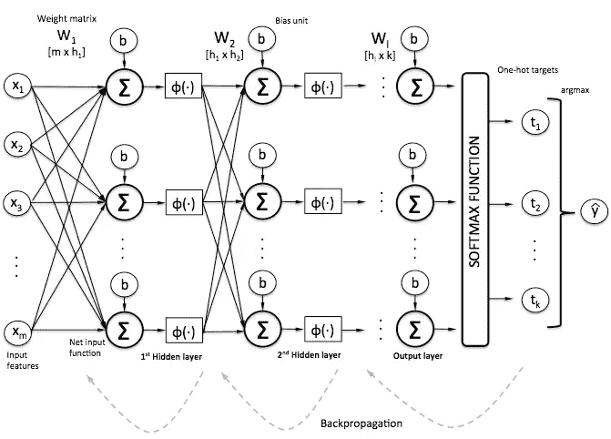
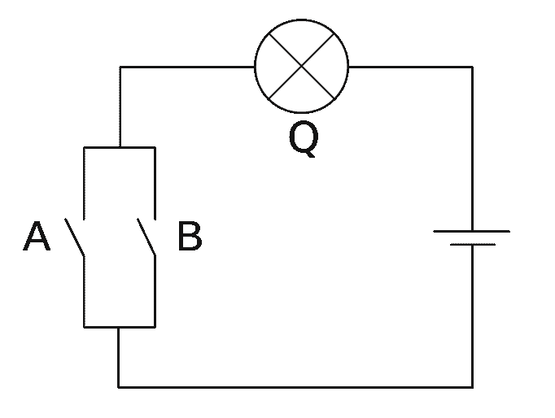
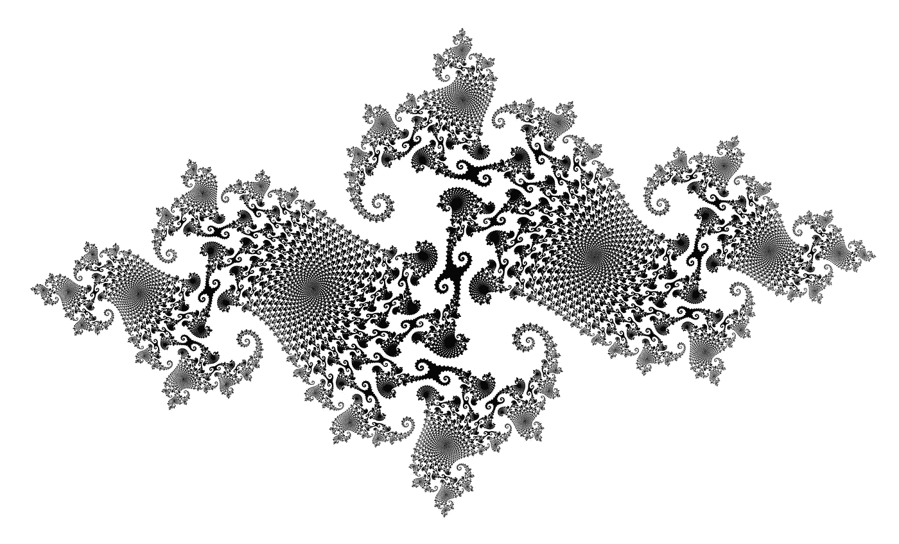
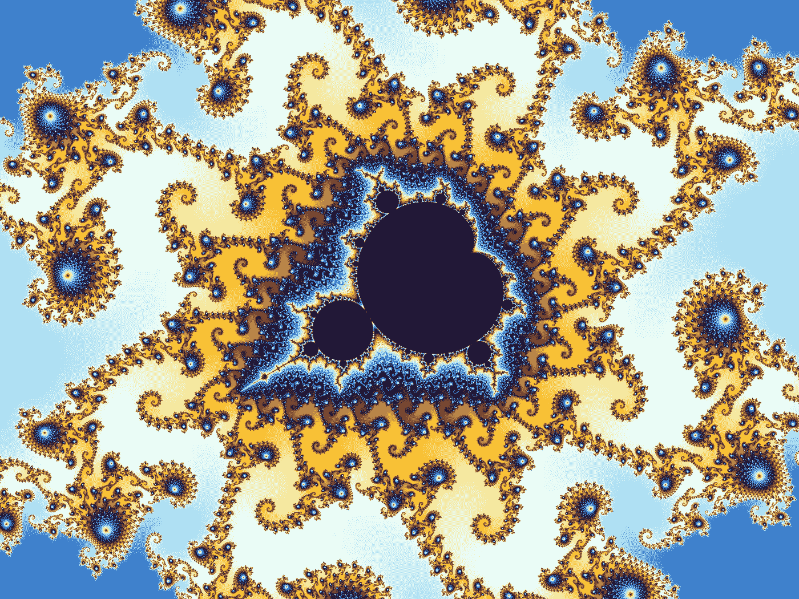

# 机器推理:区别特征

> 原文：<https://towardsdatascience.com/machine-reasoning-distinguishing-features-beff5159d957?source=collection_archive---------2----------------------->

辨别事物特征的能力是学习和推理的一个基本方面。鸟有翅膀，汽车有轮子，等等…

“区分”意味着这些特征在描述和分类事物时是有用的。


by Piyushgiri Revagar

在“[机器学习的基本模型](https://medium.com/towards-data-science/a-basic-model-for-machine-learning-an-overview-3854ea77e919)中，我们用符号模式观察了*机器推理*，并开始探索区别特征的概念。这是一个起点。我们在这里进一步探索更复杂形式的区别特征。

> print(r . distincting(' ABC ')
> print(r . distincting(' ABC '，relation='is not '))

```
[['a'], ['a', 'b'], ['a', 'b', 'c'], ['b'], ['b', 'c'], ['c']]
[['x'], ['x', 'y'], ['y'], ['n']]
```

我们可以很容易地将它缩小到特征集中最大的掩码:

> print(top _ mask(r . distinguished(' ABC '))
> print(top _ mask(r . distinguished(' ABC '，relation='is not '))

```
['a', 'b', 'c']
['x', 'y']
```

属性‘ABC’的模式确实具有模式**‘a b c’**，而那些不是‘ABC’的模式具有模式**‘x y’**。给定提供的模式，这些是事物的*区别特征。*

一旦你确定了一个新模式的显著特征，确定它是否是一个事物就相对简单了:

> s0 = Symbolic(' u o I a b c ')
> r . determine(s0，' a b c ')

```
(True, 'has distinguishing features')
```



## 神经网络呢

这与分类中使用的典型人工神经网络相比如何？分类是*决定一个输入是否是一个东西*的工作，所以这是一个恰当的比较。

在“[7 行代码中的深度学习](https://chatbotslife.com/deep-learning-in-7-lines-of-code-7879a8ef8cfb)”中，我们使用 Tensorflow 和 tflearn 对几个模式进行了分类，让我们重温一下这个并运行一些实验。

这里是[代码](https://github.com/ugik/notebooks/blob/master/tflearn%20toy%20ANN-3.ipynb)，我们将输入以下模式:

```
features.append([[0, 1, 9, 3, 6], [0,1]])
features.append([[0, 1, 7, 4, 2], [0,1]])
features.append([[0, 1, 5, 0, 9], [0,1]])
features.append([[1, 0, 4, 6, 7], [1,0]])
features.append([[1, 0, 3, 7, 8], [1,0]])
```

可以看到，符号模式 **[0，1]** 对应于类[0，1]，模式 **[1，0]** 对应于类[1，0]。让我们尝试对新数据进行分类:

```
[[0.967603862285614, 0.0323960967361927]]       **# wrong!**
[[0.6647899746894836, 0.33520999550819397]]
[[0.12406770884990692, 0.8759322762489319]]
[[0.9999886751174927, 1.133059231506195e-05]]   **# unclear**
[[0.9999721050262451, 2.794429565255996e-05]]   **# unclear**
[[0.9997043013572693, 0.00029572920175269246]]  **# wrong!**
```

当符号与训练数据 T26 对齐时，我们的 Tensorflow 2 层神经网络 T25 表现相当好(使用小数据)，但在第一次测试数据中[非常]不正确。它非常确信模式[0，1，0，6，2]没有被归类为[0，1]，但它被归类为[0，1]。在缺少任何一类区别特征的输入上，它产生了不合理的高概率，并且在最后一个模式上，它错过了偏移区别特征。给定足够的训练数据，卷积网络应该可以克服符号偏移问题——这是另一项实验的成果。

让我们看看我们的符号库是如何对相同的数据进行推理的。笔记本这里是[这里是](https://github.com/ugik/symbolic/blob/master/symbolicTutorial-distinguishingFeatures.ipynb)。我们将把相同的模式添加到我们的 Reason 类中，并向它询问区别特征。

```
0.95668 secs{'is': **[('0', ['_0']), ('1', ['_1'])]**, 
 'is not': **[('1', ['_0']), ('0', ['_1'])]**}
```

它推理出[0，1]和[1，0]是存在和不存在事物‘foo’的区别特征*，并完成了确定先前未见过的模式的简短工作:*

```
(True, 'has distinguishing features')
```

我们的神经网络不仅弄错了这种模式，它也没有告诉我们*为什么*对它进行了错误的分类。这是一个关键点——机器决定，特别是在*中，推理的过程*应该是可解释的(内省的)。有人可能会说，所谓的“T8”快速思考“T9”决策通常是不可解释的，但“T10”不同于“T11”。

将 CNN(卷积)结构应用于这些模式需要更多的实验，然而这将需要更多的训练数据。这是另一个重点——*从小数据学习*和’[一次性学习](http://web.mit.edu/jgross/Public/lake_etal_cogsci2011.pdf)。

正如在[概述](https://medium.com/towards-data-science/a-basic-model-for-machine-learning-an-overview-3854ea77e919)中提到的，我们希望能够应用自适应学习。我们需要我们的系统*在推理的时候*学习，纠正和强化输入。我们需要我们的模型不断发展，而不必随着每个新的输入而重建。

> 这些推理的特性存在于幼儿和动物的学习过程中。他们在场是因为你今天学到了一些新东西。



## 与众不同的特征或挑战

通常情况下，一个事物具有一组具有或关系的区别特征，而不是和关系。

东西(a)是一辆汽车——它有一个汽油发动机

东西(b)是一辆汽车——它有一个方向盘和一个汽油发动机

东西(c)是一辆汽车——它有方向盘、挡风玻璃和电动引擎

我们可以推理出“汽车”有方向盘、挡风玻璃和汽油发动机或电动发动机。这个区别特征在‘车’的判定上有或关系。

事实证明，这是一个很难解决的问题。先用我们的神经网络做实验，笔记本这里是[这里是](https://github.com/ugik/notebooks/blob/master/tflearn%20toy%20ANN-2.ipynb)。

我们首先定义我们的训练数据，我们将[0，1]和[1，0]模式组合到同一个[0，1]类中，以区分每一个的方式为另一个类提供训练数据。

请注意，类[1，0]的训练示例缺乏显著特征。接下来，我们尝试对新模式进行分类:

```
[[0.14985743165016174, 0.8501425385475159]]
[[0.0002913394710049033, 0.9997085928916931]]
[[0.6994397640228271, 0.30056023597717285]]      **# wrong**
[[1.0, 1.7667502999322605e-14]]
[[0.15181590616703033, 0.8481840491294861]]      **# wrong**
[[0.019126782193779945, 0.980873167514801]]      **# wrong!**
```

毫不奇怪，我们的 Tensorflow ANN 不知道[0，1]或[1，0]特征。在最后一次输入中，它对不正确的分类有很高的可信度(可能是因为 0 的存在，但是*也不能解释为什么*会这样推理。



[https://upload.wikimedia.org/wikipedia/commons/e/e8/Juliadim2.png](https://upload.wikimedia.org/wikipedia/commons/e/e8/Juliadim2.png)

## 集合论继续…

在我们的符号库中，我们再次使用集合论，这次是为了确定区别特征的或组合。

我们通过计算*模式列表*(对于一个属性)的不连续子集的集合，并计算每个子集的区别特征来达到子集的最佳组合。“最佳”是指我们在子集中寻找与其他特征相比最大/最全面的区别特征集合。

生成非连续列表子集的递归函数如下:

例如:

```
[0, 1] [2, 3, 4]
[0, 2] [1, 3, 4]
[0, 3] [1, 2, 4]
[0, 4] [1, 2, 3]
[1, 2] [0, 3, 4]
[1, 3] [0, 2, 4]
[1, 4] [0, 2, 3]
[2, 1] [0, 3, 4]
...
```

系列中不连续子集的数量产生了一个雄心勃勃的系列:

> 2, 3, 10, 15, 41, 63, 162, 255, 637, 1023, 2509, 4095, 9907, 16383, 39202, 65535, 155381, 262143, 616665, 1048575, 2449867, 4194303, 9740685, 16777215, 38754731, 67108863, 154276027, 268435455, 614429671, 1073741823, 2448023842, 4294967295

升级速度相当快。更多关于这个系列的信息可以在[这里](https://oeis.org/A226881)找到。


回到我们的符号库[示例](https://github.com/ugik/symbolic/blob/master/symbolicTutorial-distinguishingFeatures.ipynb)，我们再次提供模式，与之前的运行相同。

```
1.2334489999999931 secs{'is': [['0'], ['1']], 'is not': None}
```

它推理出符号[0]和[1]是有区别的特征，这是正确的，然而它需要进一步推理以理解[0，1]或[1，0]是有区别的。为此，我们将使用另一个函数:

> r . distinguisingor(' foo ')

```
16.00546700000001 secs**([('1', ['_0']), ('0', ['_1'])], 
 [('0', ['_0']), ('1', ['_1'])])**
```

它正确地推理出属性‘foo’中这些模式的区别特征是**【1，0】**或**【0，1】**，在这种情况下，它们的位置(偏移)也被记录，然而这对于特征的识别是次要的。

不像我们的神经网络，每个输入的位置*是关键的，使用这种方法区别特征的相对位置并不重要，例如(在模式前添加随机填充):*

```
{'is': **[['1'], ['0']]**, 'is not': None}
```

和我们的 OR 函数(带调试):

> dis1，dis 2 = r . distinguisingor(' foo '，debug=True)
> top_mask(dis1)，top_mask(dis2)

```
31.367725 secs
**0** [('6', ['_0']), ('1', ['_1']), ('0', ['_2']), ('4', ['_3']), ('6', ['_4']), ('7', ['_5'])]
**1** [('8', ['_0']), ('9', ['_1']), ('1', ['_2']), ('1', ['_3']), ('0', ['_4'])]
**2** [('7', ['_0']), ('8', ['_1']), ('0', ['_2']), ('1', ['_3']), ('9', ['_4']), ('3', ['_5']), ('6', ['_6'])]
**3** [('4', ['_0']), ('0', ['_1']), ('1', ['_2']), ('7', ['_3']), ('4', ['_4']), ('2', ['_5'])]
**4** [('2', ['_0']), ('9', ['_1']), ('0', ['_2']), ('1', ['_3']), ('5', ['_4'])]
[0, 1] -> [['1'], ['1'], **['1', '0']**, ['0']]
[2, 3, 4] -> [['0'], **['0', '1']**, ['1']](**['1', '0']**, **['0', '1']**)
```

简介:在与事物“foo”相关联的 5 个模式中，在所有不连续的子集(最小长度为 2)中，模式组[0，1]和[2，3，4] *产生最大的区别特征集合*。

换句话说:事物‘foo’的这些子群彼此有最多的共同点，它们的共性由它们的区别性特征来表示。这些是事物的或特征。



[https://upload.wikimedia.org/wikipedia/commons/b/b3/Mandel_zoom_07_satellite.jpg](https://upload.wikimedia.org/wikipedia/commons/b/b3/Mandel_zoom_07_satellite.jpg)

## 思考绩效

你可能已经注意到在一些例子中显示的运行时间，这是有意包含的。

```
31.367725 secs
```

对一个有 5 个图案的东西的区别特征进行推理，每个图案有 5-7 个符号，需要大约 30 秒，这对于计算来说是永恒的。集合论计算的本质是，模式数量或大小的增加将对性能产生*非线性影响*。

让我们快速看一下 10 种模式的不连续子集的数量(最小子集长度为 2):

```
10770
```

10，770 个可能的子集中的每一个都需要计算一组区别特征，这本身就涉及额外的集合论工作。

> 首先让机器运转起来，然后进行优化。

我们在进行实验时遵循这一法则，优化和提高性能的潜力总是存在的，我们首先想了解如何根据模式和表面基本概念进行推理。

这里有几种优化方法:

*   ipython *笔记本相对较慢*，但对实验很有帮助，它不是一个性能环境
*   消除*冗余的非连续子集*有简单的方法，例如[0，2] [1，3，4]与[1，3，4] [0，2]是冗余的
*   有一些方法可以避免对子集的整个分支进行计算，例如，如果子集[0，2] *没有产生有意义的区别特征*，那么它的所有超集([0，2，1]，[0，2，5]，[0，2，8]等等。)可以忽略
*   进程*有利于并行化*，没有理由为什么单独的线程/进程可以通过不同的集合组工作

直到下一次…