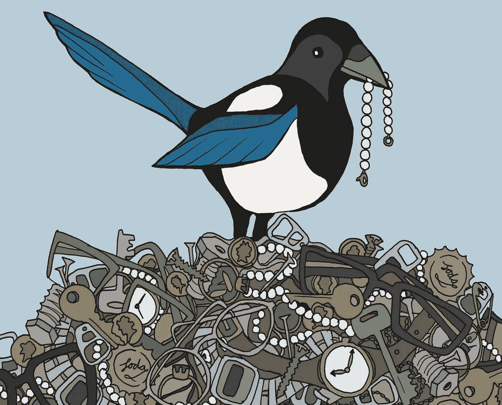

# 喜鹊数据科学

> 原文：<https://towardsdatascience.com/magpie-data-science-6cde66b95dde?source=collection_archive---------2----------------------->

This behaviour may be a stereotype for magpies, but it’s often observed in humans.

*避免被下一个闪亮的东西分心*

有一天，当我在办公室的小厨房里煮咖啡时，无意中听到一位同事抱怨一位离职的经理。我的同事说，他只是那些喜鹊经理中的一员。他的语气清楚地表明，做一名“喜鹊经理”即使没有做哈维·韦恩斯坦那么糟糕，也肯定是不可取的。

“喜鹊总管是什么？”我问。

你知道喜鹊是什么吗？“一种用闪亮的东西填满鸟巢的鸟——喜鹊经理是人类的版本。”

这似乎很适合他的描述——一件刚来时受到广泛称赞的办公设备，但现在却闲置着，因为人们又回到了以前使用的状态。可能我们大多数人都有类似的经历，经理们根据看起来最闪亮的东西而不是最有用的东西来做出购买决定。虽然喜鹊不一定是这种行为的罪魁祸首[，但很多人肯定是。](https://futurism.com/animal-stereotypes-magpies-and-shiny-objects/)

在数据科学中，当人们开始采用最新的包或工具时，同样的事情也会发生，只是因为它是最新的或带有最光滑的 UI，而不是因为它解决了一个需要解决的问题。

不幸的是，虽然可能有数据科学以外的经理在几乎没有进步的死水中工作，并且很少关注新的发展，避免受到最新和最闪亮的诱惑，但这对数据科学家来说绝对不是真的。相反，这是生活中的事实，数据科学家需要保持对事物的掌控，保持对新技术的了解。

与此同时，随着如此多的新工具和技术不断被发现和公开，很容易迷失方向。花上几个小时学习新工具独特的语法，就可以很容易地利用醒着的每一分钟来寻找最新最棒的方法，将算法速度提高几毫秒。决定哪些新技术和工具真正值得注意要困难得多。

一个直观的决定方式是寿命。虽然我们谈论的是相对较新的工具和技术，但这并不意味着我们需要在一切可用时立即行动——有机会让其他人先检查一下，看看哪些比其他人更有价值。

虽然人们认为数据科学是一个新的职业，但实际上它所包含的活动通常已经存在了至少十年——甚至深度学习算法在 2000 年代中期才开始在工业应用中获得成功。因此，许多解决特定问题的最成功的方法总是显而易见的。

另一件要做的重要的事情是考虑你投资学习一个新的软件包能得到什么回报。如果仅仅是用稍微华丽一点的界面就能做你已经能做的事情，也许好处并不值得花费。另一方面，如果你深入研究像 R 中的 ggplot2 这样的东西，你不仅仅会得到一种处理老问题的不同方法，你还会学到一种如何可视化数据的不同哲学。

没有时间去学习每一个新的软件包，或者每一项新的技术。一个聪明的数据科学家需要学会识别他们的时间用在哪里是最好的。闪亮不是一个足够好的理由来证明放弃你的时间。

在 leanpub 查看罗伯特德格拉夫正在编写的电子书，**t。**