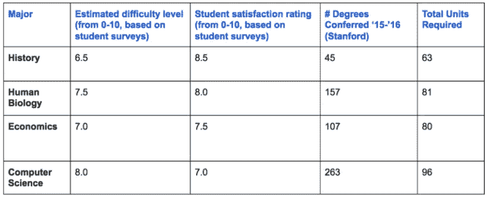
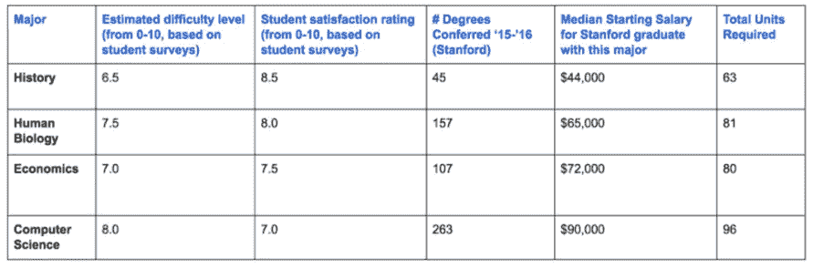
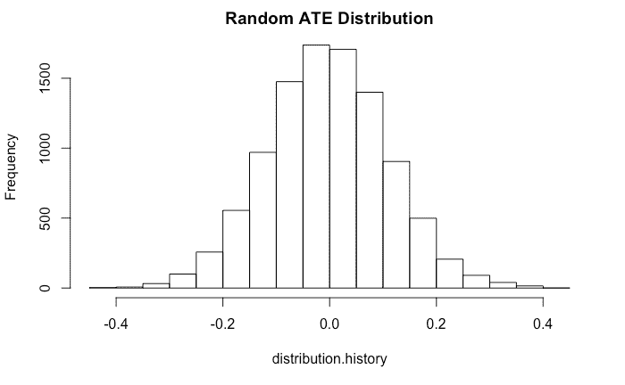
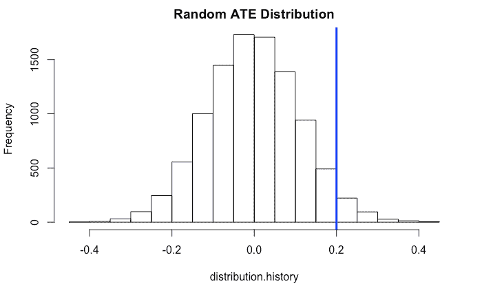
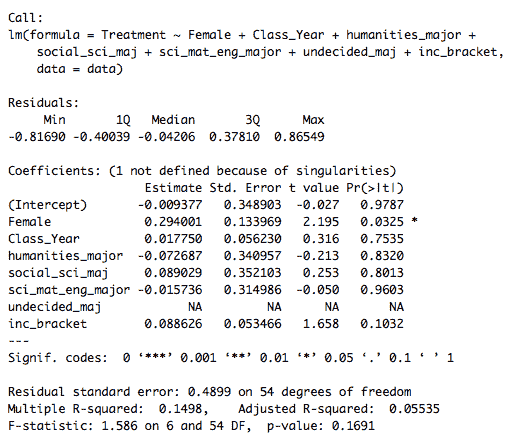
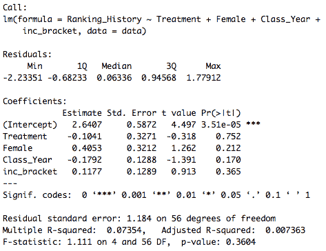
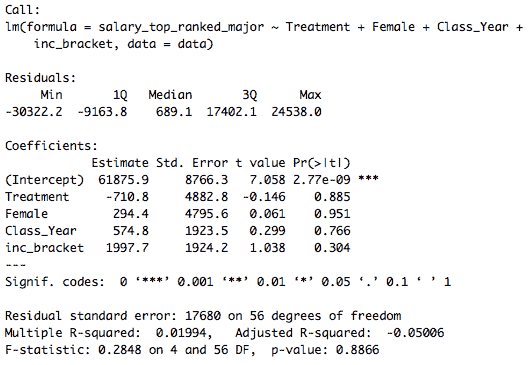
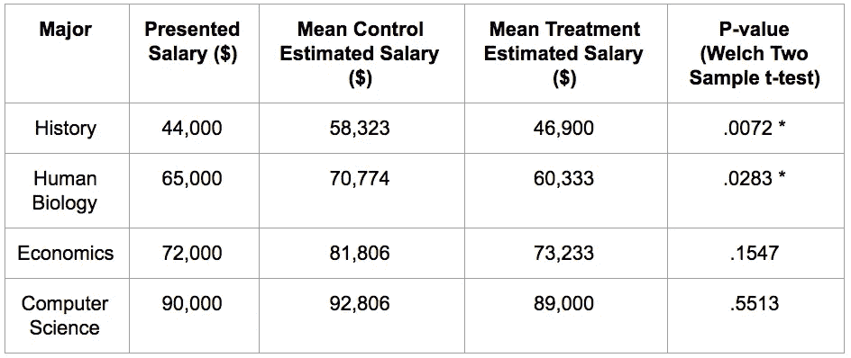

# 专业钱:测试薪资信息对大学专业选择的影响

> 原文：<https://towardsdatascience.com/major-money-testing-the-impact-of-salary-information-on-college-major-selection-8f8deb20ef84?source=collection_archive---------5----------------------->

## 作者:伊莱·比尔德纳、埃里克·奥利夫、帕拉克·昆杜和瑞安·霍兰德

*注:本文描述了斯坦福大学商学院* [*【实践中的影响衡量】*](https://explorecourses.stanford.edu/search?view=catalog&filter-coursestatus-Active=on&page=0&catalog=&q=MGTECON+383%3A+Measuring+Impact+in+Practice&collapse=) *课程中的一项实验。您可以在这里* *找到我们完整的项目数据、项目代码和 R Markdown 输出* [*。*](https://drive.google.com/drive/u/1/folders/0B63_GC8uFeBCZVJSTTVDckcyaFU)

# 都是关于专业的

这些天有很多关于飙升的大学工资溢价的谈论。根据布鲁金斯学会(Brookings Institution)汉密尔顿项目(Hamilton Project)的数据，高中毕业生职业生涯的平均收入为 58 万美元，而学士学位持有者的平均收入是这个数字的两倍多，为 120 万美元。麻省理工学院(MIT)经济学家大卫·奥特(David Autor)的另一项研究发现，美国男性的平均学士学位成本(扣除学费和放弃的工资)为负 59 万美元(T21 为负 30 美元)《纽约时报》记者大卫·莱恩哈特在报道奥托尔的研究时表达得很好:“是的，大学是值得的，而且还差得远呢。”

但是当谈到大学工资溢价时，平均工资掩盖了大量的差异。选择上大学是一个重大的经济决定；事实证明，选择大学专业是一个更大的问题。主修石油工程，你的平均工资是 11 万美元。主修幼儿教育，你的平均收入只有 28，000 美元。

如果选择专业“比决定是否上大学更重要”，正如乔治敦教育和劳动力中心的报告所言，为什么没有更多的学生选择像机械工程(60，000 美元)、计算机科学(83，000 美元)或应用数学(同样是 83，000 美元)这样非常赚钱的项目呢？

作为商学院的学生(因此也是高等教育的“超级用户”——不管是好是坏)，我们对这个问题的答案很好奇。所以我们决定设计一个实验。

# 实验:提供薪资信息会影响学生的专业偏好吗？

有一种假设——在 T2 的几项 T4 研究中得到支持——认为大学在教育学生选择专业方面做得很差。所以有一个问题:如果学生们更多地了解与不同学习课程相关的平均工资，这会影响他们的专业偏好吗？

为了验证这一点，我们在斯坦福大学校园里设计并实施了一项随机实验。因为我们无法接触到一群统一的一年级学生(他们还没有选择专业)，所以我们起草了一份调查，询问斯坦福大学的本科生向新入学的同学推荐四个专业——计算机科学、经济学、人类生物学和历史——的可能性有多大。(这四个专业是斯坦福大学最受欢迎的专业之一。)

为了检验我们的假设，我们准备了两个版本的调查。在第一个版本(我们的“控制”)中，我们向学生提供了一个简单的表格，报告(编造的)主要难度和满意度水平，以及(实际)授予的学位数量和所需的总单元数。(我们编造了难度和满意度的数字，这样就不会有一个专业主导所有标准——从而鼓励受访者考虑权衡。)在调查的第二个版本(我们的“处理”)中，我们提供了所有相同的信息——只是增加了一个额外的列，传达了每个专业第一年的平均(近似真实)工资数字。

*Survey table: “Control” group*

*Survey table: “Treatment” group*

在两个版本的调查中，我们都问到:“想象一下，一个即将入学的斯坦福学生向你咨询选择哪个专业。你会怎么给这四个专业排名？”作为补充说明，值得一提的是，我们没有要求学生对专业进行“评级”(比如，从 0 到 10)，而是要求他们强制排名。我们这样做是为了鼓励受访者仔细考虑权衡，并避免评分者之间的可靠性问题(例如，约翰的“3”与丽莎的“3”相同吗？)

# 数据收集:这一切都与权力有关(和不知情的斯坦福学生搭讪)

在收集数据之前，我们首先问了一个更基本的问题:我们需要多少调查反馈？用更专业的术语来说，这个问题问的是*功率*，或者我们的实验能够让我们检测到治疗效果的概率——如果这种效果存在的话。虽然有太多的在线工具和统计软件包来帮助计算所需的功率，但我们转向了一种更手动的技术——一种我们在课堂上学到的技术。

在这种技术中，我们从生成样本(虚拟的)数据开始——在我们的例子中，只是一个主要排名的列表(实验“结果”)。然后，我们将样本数据的行随机分配为“治疗”或“对照”，然后通过从治疗行的平均等级中减去对照行的平均等级(结果)来计算“平均治疗效果”(或 ate)。

通过重复这一过程数千次，我们最终得到了这些(随机)比率的分布。请注意，该分布以零为中心，因为我们样本数据中的“治疗”完全是随机的，所以没有(真实的)平均治疗效果:

最后一步，我们预测我们期望看到的(真实的)治疗效果——或者更确切地说，我们希望检测到的效果。(在我们的例子中，我们预测了 0.2 个排名点的影响。)通过计算这个(预测的)实际 ATE 位于随机分布内的概率，我们得到 p 值。如果这个 p 值低于 0.05(表明在 95%置信水平下的统计显著性)，我们的实验应该(或多或少)足够有力。

*Random distribution with n = 400 and p-value ≈ 0.036.*

使用这一程序，我们确定我们需要大约 400 名学生的样本量来获得具有统计学意义的结果(同样，假设效果大小为 0.2 个排名点)。不幸的是，考虑到项目的时间限制(以及我们需要从商学院毕业)，与 400 名斯坦福大学本科生搭讪似乎不是特别可行。幸运的是，[测量影响](https://explorecourses.stanford.edu/search?view=catalog&filter-coursestatus-Active=on&page=0&catalog=&q=MGTECON+383%3A+Measuring+Impact+in+Practice&collapse=)[大卫·布鲁克曼](https://www.gsb.stanford.edu/faculty-research/faculty/david-broockman)教授同情我们，要求我们简单地收集 60 个数据点(每个治疗组 30 个)。至少，这似乎是一个合理的起点(尽管我们需要看到更接近 0.5 个排名点的效果才能在这个样本量上达到显著性)。

大约一个星期后，在学生会和体育馆外(礼貌地)追捕本科生后，我们得到了 60 份调查回复(30 份控制回复和 30 份治疗回复，都是在 Random.org[的随机数生成器的帮助下随机分配的)。](https://www.random.org/)

Good clean fun.

# 随机检查:寻找无意义

在考虑我们的待遇(显示工资信息)可能对我们的结果(主要偏好)产生的任何影响之前，我们首先进行了一项*随机检查。*

简而言之，随机化检查是一种工具，用于验证我们的随机化过程——将受试者分配到治疗组或对照组——是否有效。为了方便起见，我们已经收集了(作为调查的一部分)关于我们实验对象的额外信息——特别是关于他们的性别、斯坦福学年、所选专业和家庭收入的信息。然后，我们对这些*协变量*(可能预测研究结果的变量)在我们的治疗分配上进行回归，看是否有任何这样的协变量对治疗组有预测作用。如果我们的协变量可以预测治疗组成员，这将告诉我们我们的随机化失败了。虽然我们确实看到了一个协变量(性别)的轻微显著性，但回归的总体 p 值(p = 0.1691)并不显著:

# 数据分析:回归时间到了

随着我们的随机化验证，我们准备好挖掘数据。为了开始我们的分析，我们首先对每个专业的学生排名进行了回归分析。例如，我们对历史的回归是这样的:

由于在这里没有发现显著性(也没有发现任何其他单独的主要回归)，我们尝试了另外两种方法。首先，我们观察了薪水最高的专业(计算机科学)和薪水最低的专业(历史)的相对排名，以及这种差距是否从控制变成了治疗。在第二次回归中，我们观察了我们的待遇对受试者排名第一的专业的工资的影响。

*Regression output: Effect of treatment on high-to-low salary ranking differential*

*Regression output: Effect of treatment on salary of top-ranked major*

与直觉相反的是，这一最终回归显示，相对于对照组，治疗组排名第一的专业*的平均工资下降了*(大约 700 美元)。但是，这两种回归都没有提供任何接近显著的结果。例如，在最后一次回归中，我们 95%的置信区间——或者说，95%可能与真实效应重叠的值的范围——从超过 10，000 美元到正 8，860 美元，标准误差接近 5，000 美元。(我们的协变量虽然也不为零，但也不显著。)

因此，对于薪资信息是否会影响主要偏好这一指导性问题，一个令人失望(但并非完全不可预测)的答案是:我们不知道。

# 讨论:我们是如何得到如此无聊的结果的？

如果你已经做到了这一步(谢谢你，大卫)，你可能会奇怪我们怎么会得到这么无聊的结果。为了回答这个问题，我们将首先引导您进入第 2 部分(“数据收集:一切都与权力有关”)。

我们知道进入实验时，我们可能需要更大的样本量来(显著地)检测效果。我们的主要水平回归导致了 0.001-0.1 个排名点的(非常不显著)效应大小。如果这些效应是真实的，我们将需要成百上千的额外数据来自信地这么说。

另一个可能的陷阱是我们的实验设计:为了传达工资信息(给我们的治疗组)，我们将一列工资数据楔入一个已经很忙的表中——一个我们的测试对象可能很容易忽视或忽略的表。如果治疗对象没有注意到关于主要工资的信息，他们不太可能受到它的影响。

为了测试这一点，我们在调查中加入了一个叫做操纵检查的项目。作为最后一个调查问题，我们要求学生估计我们研究的四个专业的工资。(治疗受试者可以在他们的数据表中访问这些信息；对照组没有。)

对于历史和经济，我们的操纵测试似乎通过了；治疗组的受试者给出的答案与我们给出的数字接近，而对照组的受试者给出的数字则非常不同。但是对于人类生物学和计算机科学来说，我们的操纵测试失败了:治疗组并没有比控制组在工资估算上更准确。这表明(至少对这两个专业来说)受试者可能没有注意到我们提供的工资信息——或者他们可能不相信我们的数字，而是利用他们自己对真实工资水平的先入为主的概念。

*Manipulation check results (***Denotes statistical significance at the 95% confidence level)*

但是还有第三种解释。我们的实验是基于这样一个假设，即学生在选择专业时关心薪水。但也许这是不对的。也许学生更关心其他事情(他们是否喜欢这门学科，父母或朋友是否学习过该专业，该专业是否需要大量工作)，而不是工资。

一些现有的学术工作指出了这一解释。例如，Wiswall 和 Zafar 的一篇论文发现，“不同的品味”——而不是“预期收入”——是“选择专业的主导因素。”我会有多喜欢这门课程？课程有多难？我的朋友是专业的吗？这些问题的答案可能比对预期收入的估计更与大学生相关。

我们的实验还有很多地方可能出错。例如，考虑到我们要求受试者向朋友推荐一个专业，而不是自己考虑一个专业，我们的治疗效果可能特别微弱。但是，也许这个——找到一个可靠答案的困难——是我们这个小项目最大和最重要的收获。尽管在实验设计上花了不少精力，走街串巷收集调查反馈，并编写代码分析结果，但我们没有得出有意义的结果。正如我们所知，这通常是实验过程的一部分。改变行为，检测效果——这些事情很难。如果你要设计一个实验，你需要适应不回答的模糊性。

*感谢大卫·布鲁克曼，GSB 大学教授和测量实践中的影响的策划者。还要感谢 60 名斯坦福大学的本科生，他们每个人都花了 3 分钟来推动科学的发展(但主要是帮助我们毕业)。*