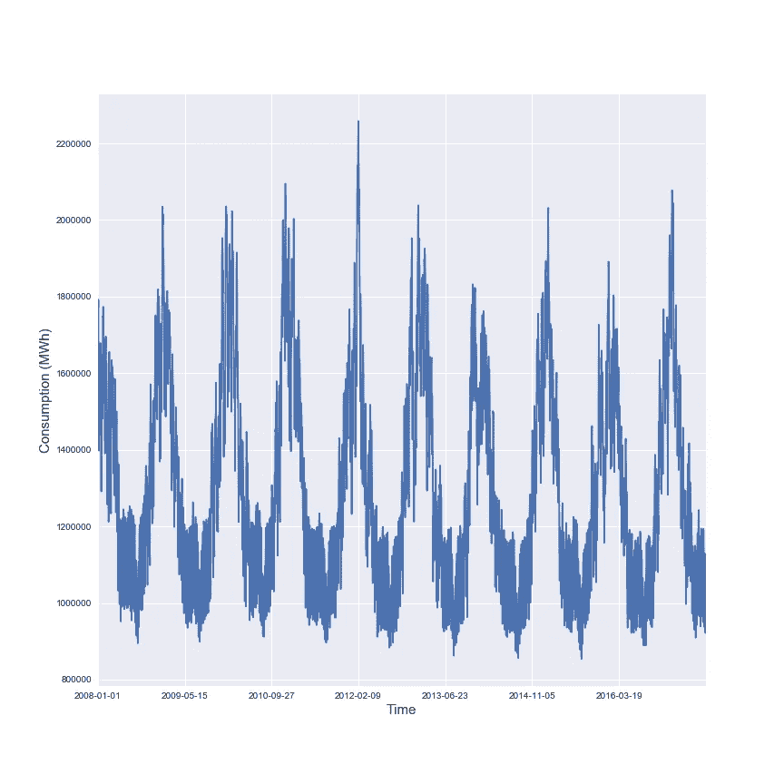
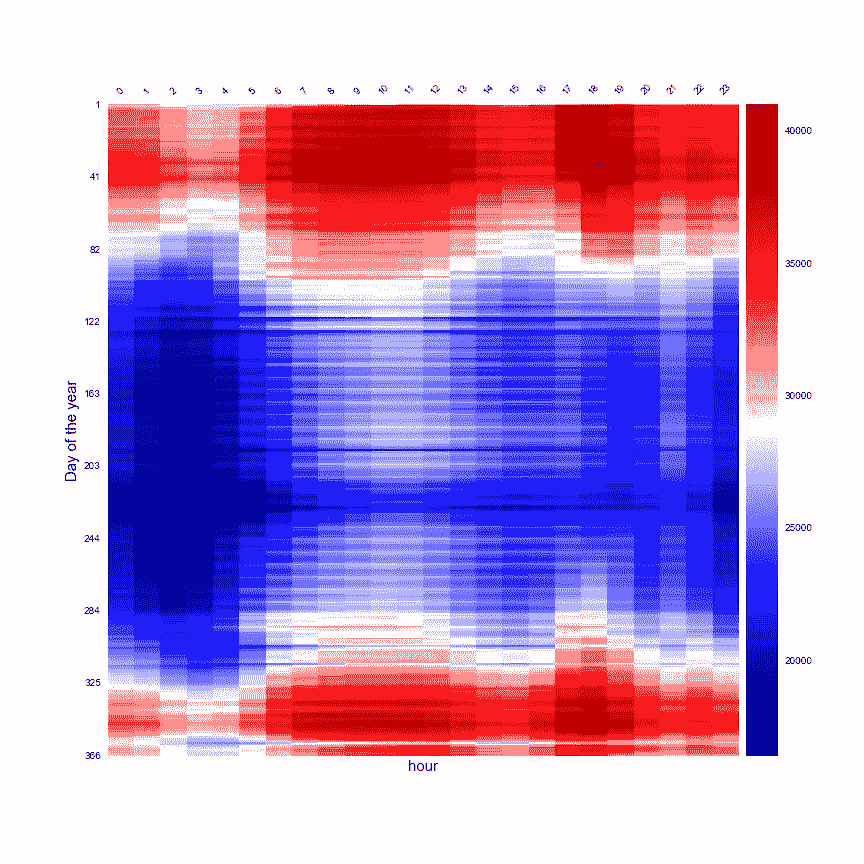
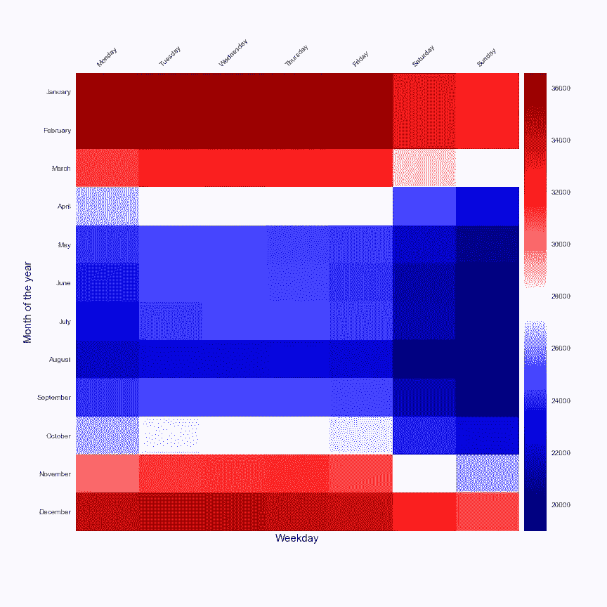
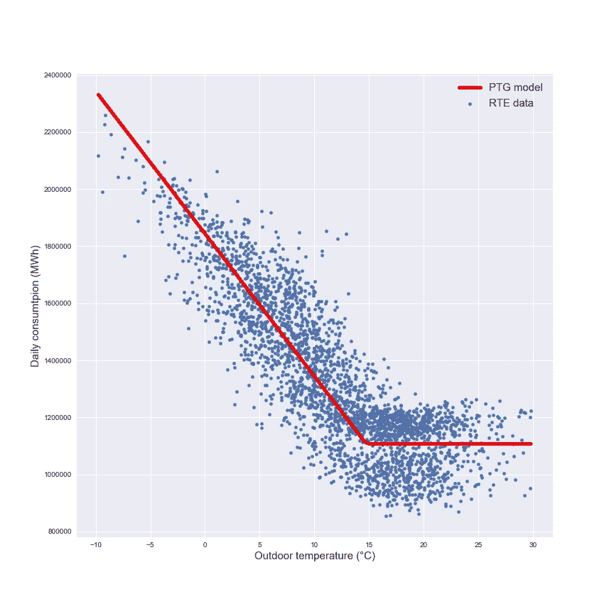
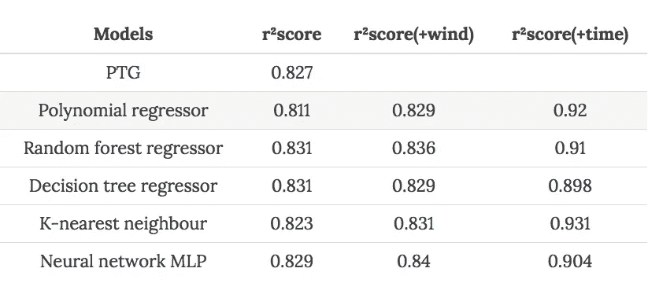
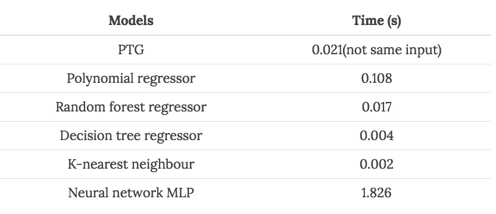
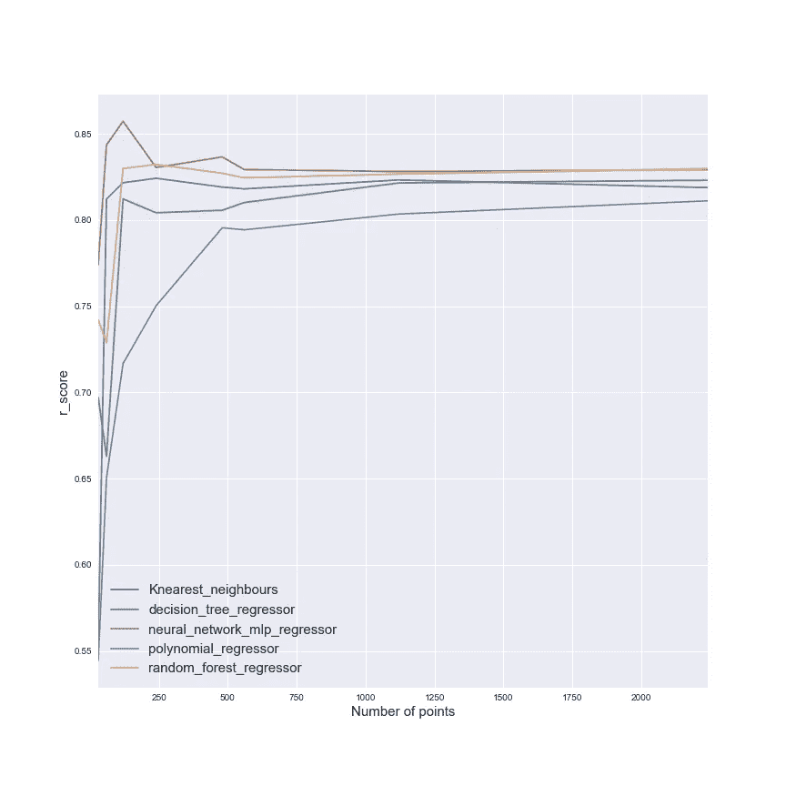
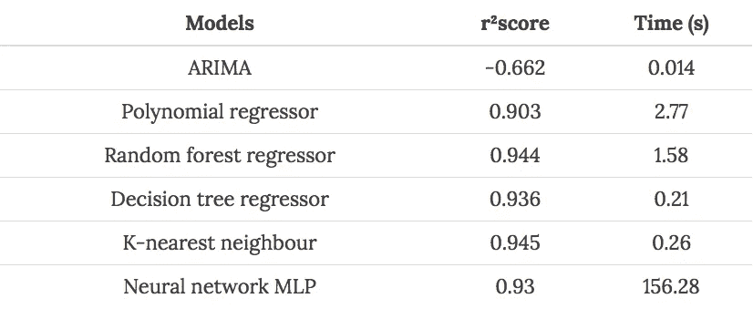

# 建立法国国家能源消费预测系统

> 原文：<https://towardsdatascience.com/make-a-forecast-system-of-the-french-national-energy-consumption-4f946b91381b?source=collection_archive---------5----------------------->

读者们好，在这篇文章中，我将解释我创建法国(大都市)能源消耗预测系统的方法。这种问题或多或少与我在 EDF Energy 的部分工作有关，但这项工作是我在业余时间完成的，以完成我的机器工程师纳米学位。

在这篇文章中，将会描述这个项目所使用的数据，解释用于进行每日消耗量预测的方法以及半小时版本。

# 数据集的探索

在这种情况下，创建模型的数据来自:

*   法国能源网络经理 RTE 他们已经创建了一个[开放数据平台](https://opendata.rte-france.com/pages/login/)来访问网络上的不同数据集
*   [GEOFLA 数据集](https://www.data.gouv.fr/fr/datasets/geofla-r/)给你这个城市和这个地区居民数量的信息
*   [地下天气。](https://www.wunderground.com/)我不得不从网站上删除这个数据源(我将重点放在机场的气象站上)，并选择在 RTE 测量的时间段内有足够数据的气象站。我将数据分析的重点放在室外温度和风速上。

对于天气状况，我选择创建一个国家气象数据集，其中基本上每个地区都有相关的气象站，这些气象站根据该地区的人口数量进行加权(该信息来自 GEOFLA 数据集)。为了进行数据分析，我选择将 RTE 消耗的平均功率转换为能量(MWh)。

下图显示了法国过去几年的平均能耗。

该图说明了法国能源消耗的季节性。

之后，为了进行每日规模的预测，我必须汇总数据。在下图中，显示了热图中以不同比例聚合的每日数据。

一年中某一天的小时效应研究

对一年中某个月和一周中某一天的消费的研究。

这两个数字很好地说明了每天的消耗量与一年中的某一时刻和一周中的某一天有关。但是这种认识不足以创建预测模型，用于预测能耗的一种非常流行的方法是研究日平均室外温度函数中的日能耗。这种技术被称为电源温度梯度的 PTG，你可以找到很多基于这种[方法](http://jmdaignan.com/2017/10/20/Maka-a-forecast-system-of-the-national-energy-consumption/%22http://www.ibpsa.org/proceedings/BS2015/p2854.pdf%22)的出版物。

下图显示了用于预测的模型。

该模型是分段回归，冬季部分由线性回归表示(包括供暖需求和电器)，夏季部分由恒定部分表示(仅电器)。这个模型将成为下一部分的参考模型。

# 日预报

为了创建模型，数据集将在训练集和测试集之间拆分，为这些集选择的样本将是随机的。这代表着:

*   训练集的 2337 个样本
*   测试集的 585 个样本

这是一个回归问题，因此将测试 scikit learn 的以下模型:

这是个人对不同模型的选择，还有很多其他模型可以尝试，但作为开始，我认为这已经足够了。我必须调整不同的模型并找到最佳的参数，我在训练集上使用了 k-fold 方法(我创建了 10 个 fold)来测试不同的参数。[我邀请您查看我的报告，了解不同型号的参数选择](http://jmdaignan.com/2017/10/20/Maka-a-forecast-system-of-the-national-energy-consumption/%22https://github.com/jeanmidevacc/udacity_mlen/blob/master/capstone/report.pdf%22)。

为了测试模型中输入的影响，我测试了不同的输入:

*   仅室外温度
*   室外温度和风速
*   室外温度和一年中的月份以及一周中的日期

为了便于输入的使用，我必须对集合进行归一化。为了评估模型的准确性，我使用了用于回归问题的 r 评分标准。但是这个指标不足以评估算法的质量，我将使用的第二个指标是创建模型的时间。下表显示了 r 分数随所用模型变化的情况。

该表允许给出以下结论:

*   PTG 是一个相当好的模型，对于一个仅基于室外温度的模型，分数是好的，但是基于树的模型和神经网络也提供了好的结果
*   风速的增加提高了分数，但是增益非常小
*   这一增加为每一个测试模型的分数提供了一个有趣的增益

但是正如我之前所说的，r 分数是不够的，在下表中，在将时间特征添加到初始输入的情况下，有时间来创建模型。

该表说明 PTG 具有良好的性能，而神经网络在速度方面非常差。多项式回归也应该避免。但是这两个指标不足以评价模型的效率。应该研究训练集大小的影响。下图说明了训练集的影响。

该图向我们表明，训练集的大小对多项式回归器有明显的影响，因此其他模型似乎影响较小(神经网络相当快地显示出良好的效率)。

# 半小时预报

对于这一部分，我们将使用以前发现的所有结果(本质上是时间特征的使用)。我将测试与每日预测相同的模型，并使用相同的指标。

我的基准模型将是 ARIMA 模型，这种模型在预测时间序列方面非常流行(但不需要随机化集合)。这些套件包括:

*   训练集的 112176 个样本
*   测试集的 28080 个样本

在我的问题中，模型的结果是坏的。下表总结了基准模型和其他测试模型的结果。

这张最终表格向我们展示了基准模型是很容易被击败的。神经网络的构建非常缓慢，但两个模型似乎非常适合用于我们的问题:

*   决策树回归器
*   K 近邻

# 结论

这项工作用于完成我的纳米学位，这是我的方法，不是唯一的方法，我认为有很多东西可以尝试，比如深度学习方法或强化学习方法。

我邀请你使用这个项目的[数据集](https://github.com/jeanmidevacc/udacity_mlen/tree/master/capstone)来尝试创建你自己的(更好？！)模型，如果您有任何意见，请写在下面。

*原载于 2017 年 10 月 20 日*[*【the-odd-dataguy.com*](http://the-odd-dataguy.com)*。*