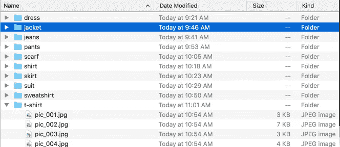
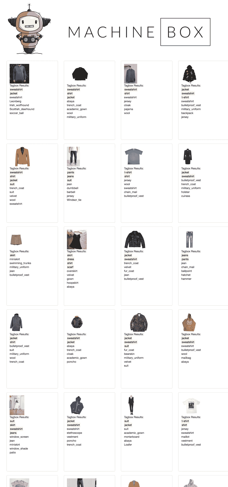

# 使用机器学习快速创建一个大规模、可搜索的在线服装店

> 原文：<https://towardsdatascience.com/make-a-massive-searchable-online-clothing-store-quickly-with-machine-learning-f9b09d3c4fa?source=collection_archive---------7----------------------->

[https://pixabay.com/en/people-woman-girl-clothing-eye-2563491/](https://pixabay.com/en/people-woman-girl-clothing-eye-2563491/)

你没有时间学习如何制作机器学习模型，你是一个忙碌的企业家！您需要快速获得最低限度可行的产品，并为您的客户解决一些用例。由于人工智能和机器学习的民主化，你可能会比以前更快地达到 MVP。

让我们假设你在你的网站上卖很多衣服，但是你不一定有时间给每一张新图片贴标签。

人们可能会在 Instagram 上提交他们穿着你的衣服的照片，或者你可能想简单地让编目过程变得容易得多。

这是机器学习的完美用例。这里有一个我会如何解决它的例子。

Training set

1.  获取尽可能多的你想分类的服装样本图片。例如，我下载了数百张牛仔裤、裤子、衬衫、t 恤、运动衫、裙子、连衣裙和围巾的照片。
2.  我用的是 startup 的对象识别模型 [Tagbox](https://goo.gl/KsqdjH) ，因为下载和运行只需要 3 分钟左右。另外，我可以[教它](https://blog.machinebox.io/introducing-tagbox-custom-tags-49c28b4bfdaf)它还不知道的东西，让它变得更聪明。
3.  然后，我使用一个小脚本来迭代我所有的照片，并告诉 Tagbox 它们是什么。
4.  现在有趣的部分来了。然后我去拿了一套新的完全随机的服装图片。重要的是，这个新的测试集没有任何相同的照片，因为那些用来教 Tagbox。我下载了这一套，运行一个脚本，通过 Tagbox 运行每个新图像，瞧:

A sample of my results

Tagbox 已经正确地将正确的关键字与正确的产品/图片关联起来。我现在可以处理无限数量的服装图片，并提取可搜索的标签来增强我的产品。

底线是我只花了大约一个小时构建基础设施来测试这种能力。这证明了像[机器盒子](https://goo.gl/KsqdjH)这样的开箱即用机器学习公司带来的人工智能民主化。