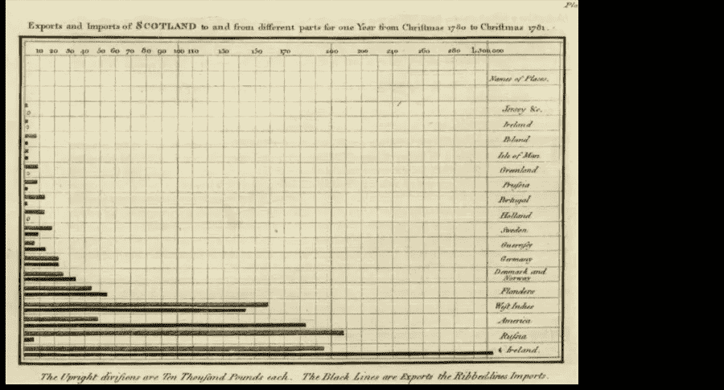
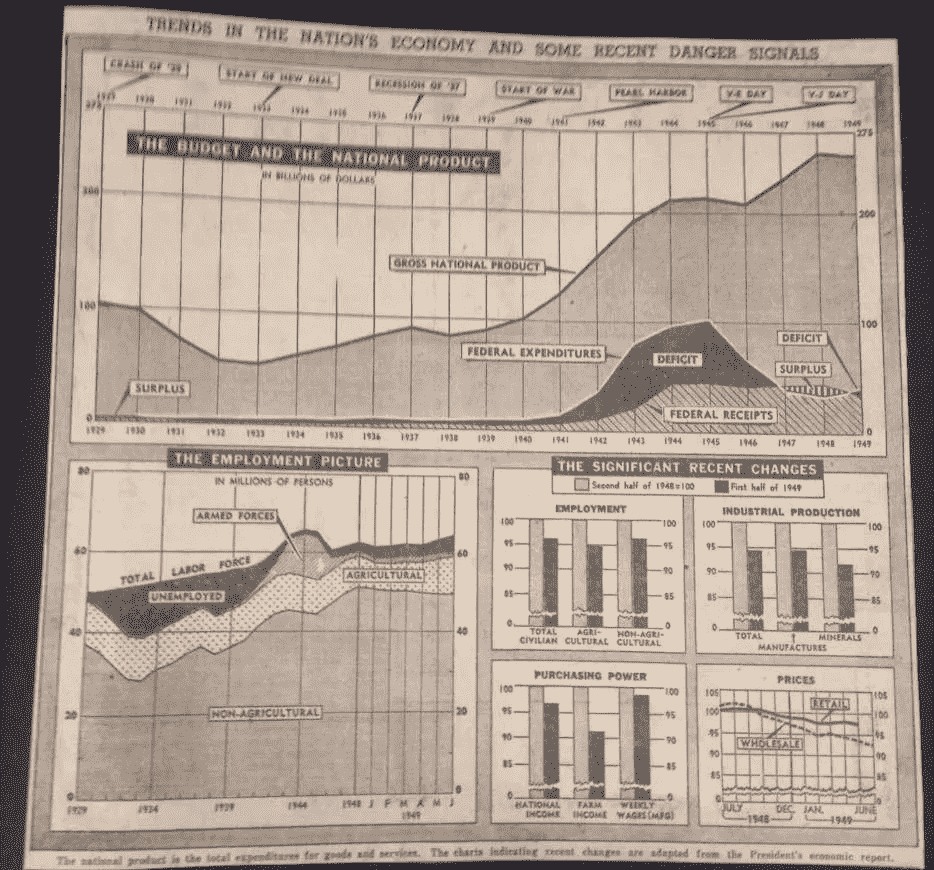
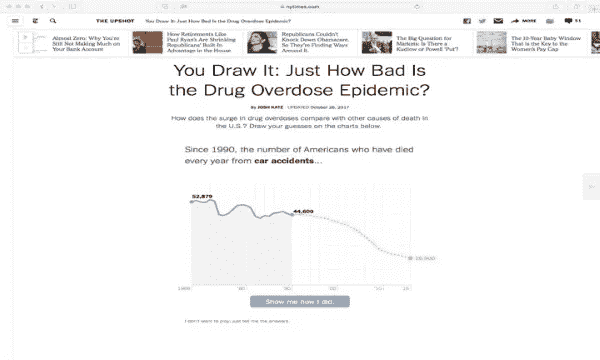
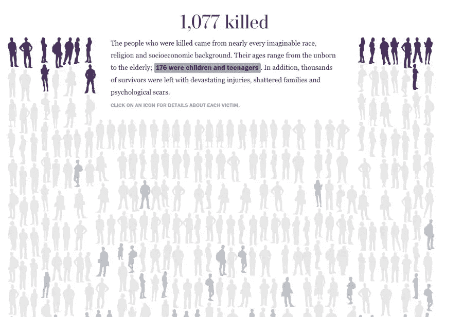
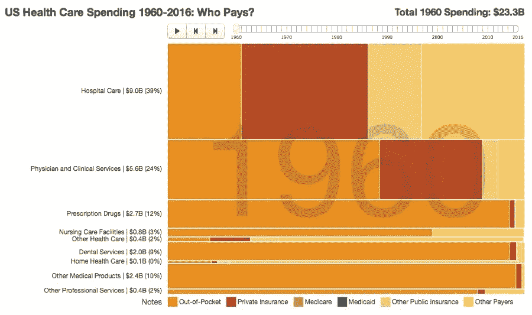
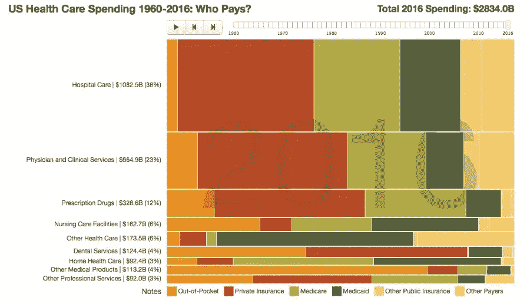
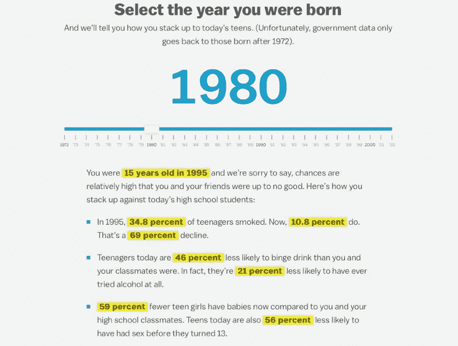

# 通过了解数据可视化的历史和最新趋势，对现实世界产生影响

> 原文：<https://towardsdatascience.com/make-a-real-world-impact-through-data-visualization-by-understanding-its-history-and-recent-trends-4fb0b22072ce?source=collection_archive---------7----------------------->

作者安迪·克拉科夫

可视化数据的想法——也就是说，将数字转换成插图，让所有人都可以获得发现——必须从某个地方开始，对吗？事实上，我们可以指出数据可视化开始的具体时间。

这是第一个出版的条形图，由威廉·普莱费尔于 1786 年为一本苏格兰贸易地图集创作。

First published bar graph, created by William Playfair in 1786 for an atlas on Scottish trade

Playfair 也因提出了线形/趋势图和饼状图的想法而受到好评。对于职业来说还不算太寒酸！

下面的地图也在数据可视化中发挥了重要作用。1854 年，在伦敦索霍区，爆发了一场严重的霍乱，如果不是约翰·斯诺确定是污水——而不是像一些人推测的那样，是糟糕的空气——导致了霍乱，我们也许不会知道。他创建的地图上，每座房子代表一个被霍乱侵袭的个体，这确实改变了我们“看待”疾病的方式(他提到的布罗德大街上的水泵是霍乱爆发的源头)。

Map of pump on Broad St. in London which was the source of the cholera outbreak of 1854

到 20 世纪 50 年代，数据可视化在美国报纸中足够普遍，至少有一家报纸——纽约时报——对数据感到足够舒适，即作为一种常见的方言，将我们今天称为仪表板的图表汇编在一起。

New York Times compilation of graphs which today would be referred to as a dashboard

(你可以在斯图尔特·汤普森的博客文章中看到更多关于 20 世纪 50 年代《纽约时报》图片的内容。

这些是数据可视化在塑造社会变革中发挥重要作用的早期例子。然而，我认为，自这些里程碑事件以来，数据可视化并没有发生很大的变化。是的，现在我们定期生产漂亮的数据交互，会让威廉·普莱费尔头晕目眩。但在更基本的层面上，数据可视化是否被社会部门用作教育和说服的工具？我们制作的地图和图表是否真正提高了人们对问题的认识，为政策决策提供了信息，并赋予了社区权力？

在这一点上，我认为记录有点不稳定。本质上，多年来我们已经认识到与数据交流不是一件容易的事情；你不能只是创建一个简单的图表，并把它放在自动驾驶仪上来执行你的命令。然而，这些天出现了一些重要的趋势，我们可以指出并集体学习。以下是我最近观察到的数据可视化的一些重要进展:

# 将数据转化为游戏和智力练习

谁说数据总要这么严肃？我注意到一种趋势，即组织将数字转化为游戏(或者智力练习，如果你想更精确地描述它的话)。以《纽约时报》的互动为例，他们邀请你，读者，猜测死亡原因的趋势，首先是艾滋病毒、枪支和车祸，然后是药物过量，然后看看你与猜测线图的移动有多接近。

Screenshot of interactive NYT data visualization which is an example of turning data into intellectual exercises

仔细想想，这个概念真的很基本:毕竟，它只是你正在画的一个趋势图。但关键是*你在*画它，而不仅仅是观察它，这样做，可能更有可能记住信息。一个简单执行的数据游戏是这个 [538 关于枪支的民意测验](https://projects.fivethirtyeight.com/guns-parkland-polling-quiz/)；另一个是由 Velir 与我们的客户之一——联邦基金——合作创建的，它询问并让用户回答问题[如果你们州的医疗保健得到改善](http://www.commonwealthfund.org/interactives-and-data/estimated-impact-interactive#?ind=a_Adults_ages_1964_insured_2017&loc=AL)对个人意味着什么。所有这些都表明，这种趋势有点超出了我们的舒适区，数据总是如此严重，并将数字转化为一些游戏的机会。

# 让大量的数字看起来有关联

事实证明，我们人类并不擅长真正理解一个大数字的大小，比如一百万，甚至一万。你可能认为我们会从媒体上如此频繁地阅读这些数字来理解这样一个范围。问题是，我们在日常生活中通常不会“看到”这样的数字。因此，大数字对我们来说就像是抽象概念，我们在智力上理解它们，但并没有真正“感觉”到它们。有鉴于此，数据可视化越来越有助于读者更好地理解大量数据。以《华盛顿邮报》的这个例子为例，你可以点击数字，向下滚动人物页面，看看 1077 名在大规模枪击中丧生的人的真实情况。

Screenshot of interactive data visualization of individuals killed by mass shootings

在一个更有趣的话题上，布丁研究了在纽约市音乐界成名的可能性(不太可能),大约 3000 支乐队在三年时间里在纽约市举办了多场演出。《华尔街日报》通过让读者滚动屏幕上的 2.92 亿个点，向读者展示了[赢得彩票的微小几率](http://graphics.wsj.com/lottery-odds/)。当我们构建数据可视化时，重要的是要记住，简单地说一个大数字可能不会产生你想要的影响。“展示”这个庞大的数字可能也是必要的。

# 动画数据

毫无疑问，我们都遇到过数据以某种方式“移动”的情况——从开始的一年开始构建的趋势图，一次出现一个的条形图。我曾经认为动画数据的概念是一个噱头，但后来我看到了它可能产生的影响。例如，当我在露西尔·帕卡德儿童健康基金会工作时，我曾经展示过一份关于加州各县青少年出生率下降的报告。谷歌让我很容易地制作出一个条形图来显示随着时间的变化(本质上，你正在看一个变大或变小的条形图)，我可以在我的演示中告诉人们这个简单的动画“技巧”是如何帮助人们更好地理解和保留数据的。

类似地，当我在加州医疗保健基金会时，我的沟通同事们开始整理总结国家医疗保健支出历史趋势的[年度可视化图](https://www.chcf.org/publication/us-health-care-spending-who-pays/)，许多在医疗保健政策领域工作的人对此很熟悉，甚至有所预期。随着时间的推移，这种可视化趋势变得清晰，也许比这些数据以简单的线形图呈现更清晰。例如，请注意橙色阴影区域，它代表自付费用。你可以看到，从 1961 年到 2016 年，这种下降有多明显。

Screenshot of visualization summarizing historical trends in national health care spending in 1960

Screenshot of visualization summarizing historical trends in national health care spending in 2016

说到医疗保健，这是另一个数据动画的例子，其中动画不是故事的核心，但当你浏览这篇关于[为什么美国在医疗保健支出方面领先世界](https://www.dataspeakslouder.com/healthcare/)的文章时，你会看到精心设计的平滑的可视化动画如何以更有效的方式讲述这个故事，让读者参与进来。

# 人性化的数字

另一个需要关注的趋势是人性化数据。从历史上看，我们倾向于将数据和故事分开，就好像你只能拥有其中一个，而不能两个都拥有。但这不是我们处理信息的方式。在某些情况下，我们被事实所说服，而在其他情况下，个人因素——例如，一张令人心酸的照片、一段有助于渲染数据的引言、一个受影响家庭的视频——有助于证明这一点。有鉴于此，重要的是我们用故事元素在更广阔的画布上描绘数据，这有助于使数字人性化。这里没有神奇的公式。一些数据故事以事实作为主要的叙事镜头，效果很好，而另一些故事则占据上风，到处插入数据以帮助增加清晰度。

例如，我所在的组织 Velir 与一家名为 Purpose 的通讯公司合作，展示了有多少美国员工是倒班工人，这意味着他们不知道自己每周的日程安排。我们主要通过数字讲述这个故事，但 Purpose 有引用甚至视频，我们可以将它们插入到包中，以帮助演示轮班工人面临的问题。

Data viz created by Velir for communication firm Purpose showing how many US employees are shift workers

# 读者输入

我在上面提到了将数据转化为游戏的趋势，这是为了创造一种更具参与性的体验。也有更简单的方法来邀请读者转换数据内容。在[这篇 Vox 文章](https://www.vox.com/a/teens#year/1980)中，例如，读者选择他/她出生的年份是为了改变故事中的数据。

Vox article data viz which allows reader to select year of birth to change data in story

《华盛顿邮报》在这篇关于[性别薪酬差距](https://www.washingtonpost.com/graphics/2017/business/women-pay-gap/?utm_term=.469d1c062658)的报道中采取了类似的方法。向下滚动选择一个职业，查看相关数据。通过提供一种精心策划但又量身定制的体验，这些故事让读者更有可能根据信息采取行动，因为他们已经被邀请根据自己的兴趣对信息进行个性化设置。

你可能会对自己说，这些例子中有许多是由主要新闻媒体创造的，这些媒体拥有讲故事的专业知识，并且越来越多地拥有一批他们可以求助的互动艺术家和数据可视化专家。毫无疑问，像《华盛顿邮报》和《纽约时报》等新闻媒体在可视化方面处于领先地位，用数据做其他社会部门组织难以完成的事情。但是我们不应该试图模仿——当我们做不到时，就放弃对数据显示的创造性。相反，我们应该更好地向领导者学习，将这些趋势转化到我们自己的工作中，即使是以最基本的方式。我们总是渴望帮助组织解决他们能做什么的难题，因此欢迎您联系我们。

最后，有一个我们都可以实现的重要趋势:**保持实用**。例如，在构建之前与用户交谈，以了解他们希望如何处理信息。在 Velir 的数据工作中，我们听到越来越多的客户希望创建可打印的数据视图，例如一个包含上下文信息和图表的单页 PDF 数据表。这里的想法是，虽然漂亮的交互看起来很棒，并且起着重要的作用，但我们的客户也需要一些有形的东西，在会议期间分发给人们，并带回他们的办公室。即使在这个数字时代，仍然很少有什么能比得上与一张纸互动。这可能是更有趣的发展之一——也就是说，我们越是推进数字信封，我们就越可能认识到可靠的方法仍然有重要的地位。

**关于作者**

Andy Krackov, VP, Data Strategy

Andy Krackov 是 Velir 的数据战略副总裁。他的专长是数据内容战略家，可以将数据翻译给多个受众，以便为决策提供信息，提高公众对问题的认识，赋予社区权力，并实现其他有意义的社会变革。他曾在与数据相关的国家和州委员会任职，在关于有效使用数据的主要会议上发表演讲，并为该主题的多个出版物撰写文章。他最初是《美国新闻与世界报道》的记者，拥有华盛顿大学的历史学学士学位和斯坦福大学的传播学硕士学位。

**关于 VELIR**

我们是一家完全整合的数字机构，总部位于马萨诸塞州萨默维尔市的波士顿郊外。我们拥有一支由 130 多名数字专业人员组成的团队，以我们为一些世界上最大和最有影响力的非营利组织、会员协会和财富 500 强企业所做的数字工作而闻名。我们在营销技术和数据可视化方面的能力是业内公认的最佳水平，这源于 17 年来对数字战略、创意设计、网络工程和应用程序开发的专注。我们已经完成了复杂的实施和大规模的品牌建设，包括拜耳，罗伯特·伍德约翰逊基金会，大都会艺术博物馆，美国退休人员协会，耶鲁大学和信息。我们被大波士顿商会和萨默维尔商会授予“年度小型企业”荣誉称号，并在波士顿和华盛顿州 DC 设有办事处。更多信息，请访问[www.velir.com](https://www.velir.com/home)。