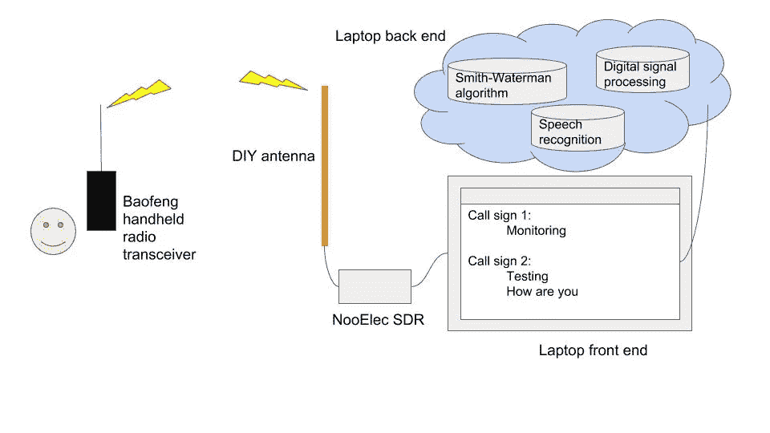
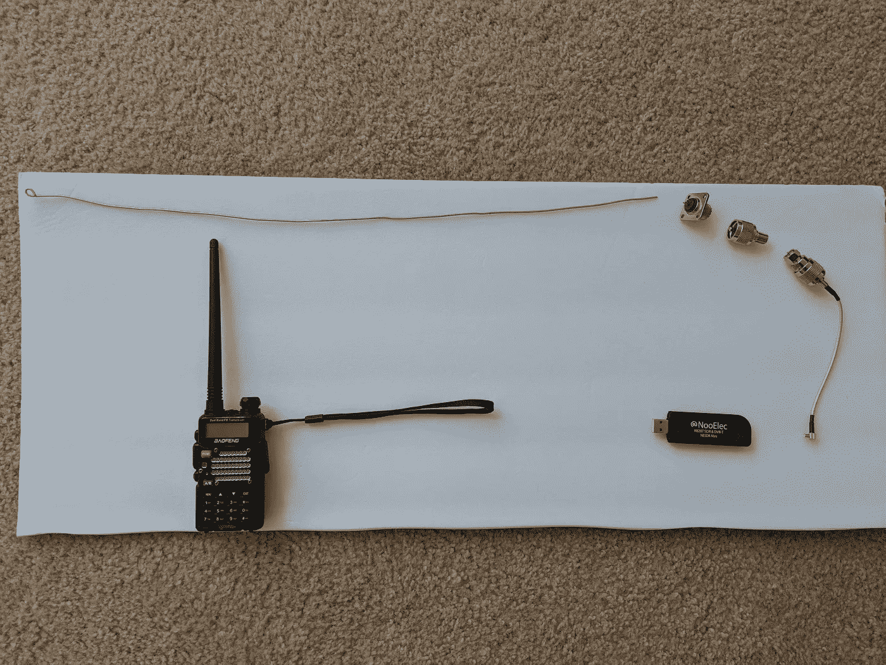
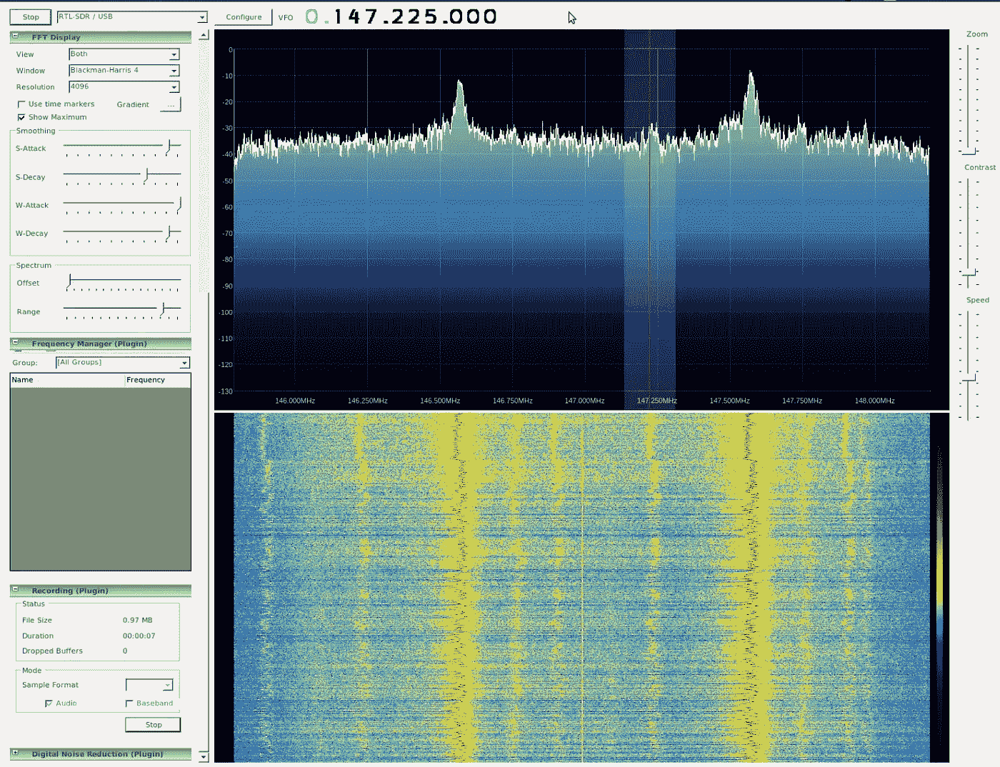
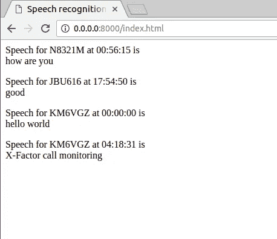

# “让业余无线电再次变得酷起来”，人工智能先生说。

> 原文：<https://towardsdatascience.com/make-amateur-radio-cool-again-said-mr-artificial-intelligence-36cb32978fb2?source=collection_archive---------13----------------------->

一个为业余无线电通信建立语音识别系统的项目。

# 系统设置:

我对着 Baofeng 手持无线电收发器说话，DIY 天线拾取无线电波，SDR 将无线电信号解调为标准音频信号，Google 语音到文本执行语音识别，Smith-Waterman 算法执行序列比对以在数据库中找到最可能的呼号，AJAX 用于本地 httpserver 以输出文本。系统图如下所示。



System diagram for the voice recognition system for amateur radio communication

这是演示。它成功地从数据库中找到最可能的呼号，并捕捉到“监控”消息。

Demo

# 硬件(天线、SDR 加密狗、调频无线电收发器):

我将 0.5 米(~波长/4)的铜线连接到连接器上，形成我的天线。我从亚马逊购买所有的连接器，从当地的五金店购买铜线。

天线的零件有

1.  直径为 0.15 毫米的 0.5 米铜线
2.  超高频母插孔焊料 SO-239
3.  射频同轴电缆适配器 F 母头至超高频公头 PL-259 连接器
4.  母到公连接器射频同轴适配器
5.  DHT 电子射频同轴电缆组件 N 公头至 MCX 公头直角 6 "

我用的是手持 FM 无线电收发器(宝丰 UV-5R v2+)进行业余无线电传输。NooElec SDR dongle 用于接收来自天线的信号，并将其发送到我的笔记本电脑。它们都可以在亚马逊上买到。

完整的硬件设置如下所示。



Hardware setup : antenna, SDR dongle, FM radio transceiver

# 软件定义无线电/数字信号处理:

根据维基百科，

> **软件定义无线电** ( **SDR** )是一种[无线电](https://en.wikipedia.org/wiki/Radio) [通信](https://en.wikipedia.org/wiki/Telecommunications)系统，其中传统上以硬件实现的组件(例如[混频器](https://en.wikipedia.org/wiki/Frequency_mixer)、[滤波器](https://en.wikipedia.org/wiki/Filter_(signal_processing))、[放大器](https://en.wikipedia.org/wiki/Amplifier)、[调制器](https://en.wikipedia.org/wiki/Modulator) / [解调器](https://en.wikipedia.org/wiki/Demodulator)、[检测器](https://en.wikipedia.org/wiki/Detector_(radio))等)。)而是通过个人电脑或[嵌入式系统](https://en.wikipedia.org/wiki/Embedded_system)上的软件来实现。

我用 SDRSharp 做所有的信号处理和转换。下面是一个正常工作的 SDRSharp 的屏幕截图



Digital signal processing

# 语音识别:

我使用谷歌语音转文本 API 进行语音识别。

以下是片段。

Speech recognition

但正如演示中所示，谷歌语音到文本似乎有点挣扎，并产生一些错误。这可能是由于背景中的噪声。我认为，如果一个人可以用从真实的业余无线电谈话中获取的训练集来训练一个深度网络，这可以得到改善。

# 史密斯-沃特曼算法；

语音识别系统很可能会出错。我通过保存一个呼号数据库来缓解这个问题。数据库可以用来自各种来源的数据来构建。比如飞机无线电通信，dump1090 就是一个很不错的程序，可以通过解码 1090MHz 上发送的消息来捕捉飞机的信息。可选地，可以简单地使用日志，该日志存储经常使用本地中继器的人的呼号。

一旦我们有了呼号数据库，我们就可以使用[史密斯-沃特曼比对](https://en.wikipedia.org/wiki/Smith%E2%80%93Waterman_algorithm)算法来找到最佳匹配。

以下是片段。

Swith-Waterman algorithm

# 异步 JavaScript 和 XML(AJAX):

为了实时更新，我使用 AJAX。AJAX 支持从包含呼号/演讲/时间戳的文件中自动获取信息。

我通过在终端中键入以下命令，在本地使用一个简单的 httpserver。

```
python -m SimpleHTTPServer
```

网页的代码片段如下所示。

AJAX

网页截图如下图。



Webpage output

# 最后的话

许多人说业余无线电爱好正在消亡。我觉得这很可悲，因为人们可以用它做很多有趣的事情，尤其是当它与更新的技术(如人工智能)结合在一起时。所以，我决定参与这个项目，并与大家分享。我希望你会觉得有趣。