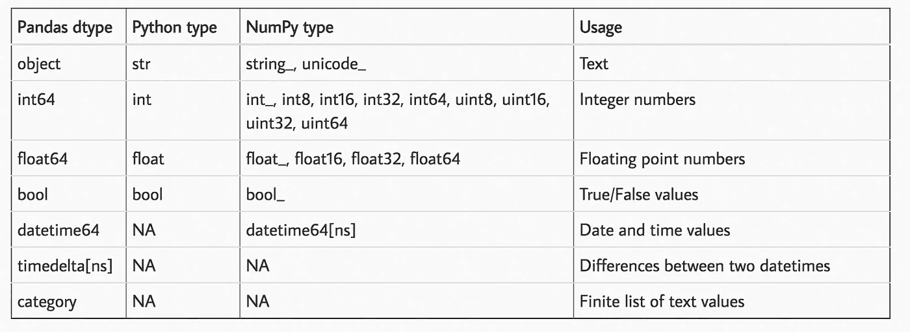
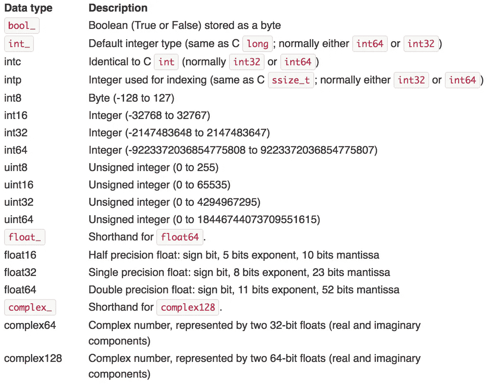
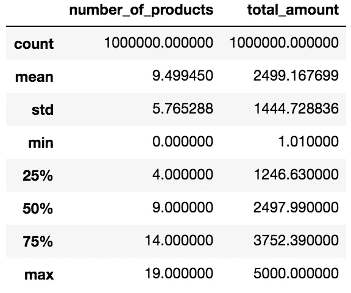
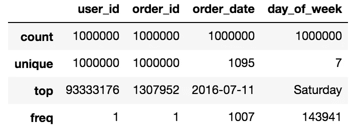

# 使处理大型数据帧变得更容易，至少对您的内存来说是这样

> 原文：<https://towardsdatascience.com/make-working-with-large-dataframes-easier-at-least-for-your-memory-6f52b5f4b5c4?source=collection_archive---------4----------------------->


## 将数据帧的大小减少多达 90%！

如今，在大数据世界中，我们经常使用大型数据集。虽然有某些工具可以促进对大量数据的处理(如 Spark)，但我们仍然在本地做大量工作，例如，我们希望建立一个原型模型(MVP，最小可行产品)。因此，我认为花点时间优化我们处理数据的方式可能是值得的——通过这样做——将其大小减少 90%。是的，可以那么多…

# 引擎盖下发生了什么？

不会有太多的理论，但还是有必要说几句。在幕后，pandas 将 DataFrame 的相同变量类型(如整数、浮点、对象)的列存储在块中。在表示数值(整数和浮点数)的块的情况下，这些列被组合并以 NumPy 的`ndarray`的形式存储，这使得访问它们非常快。

因此，让我们看看在 pandas 上可用的数据类型以及它们实际上代表了什么。下表概述了可用的类型及其用途。



Source: [http://pbpython.com/pandas_dtypes.html](http://pbpython.com/pandas_dtypes.html)

还值得一提的是表中可见的子类型。举个例子，我们有`int8`、`int16`、`int32`和`int64`。该数字表示该子类型使用多少位来表示特定值，这些位分别使用 1、2、4 和 8 字节的内存。下表可能更能说明我们实际上可以在这些数字数据类型中存储哪些值。



Source: [https://docs.scipy.org/doc/numpy-1.13.0/user/basics.types.html](https://docs.scipy.org/doc/numpy-1.13.0/user/basics.types.html)

知道`uint`(无符号整数)和`int`(有符号整数)之间的区别可能会很方便。两者的存储容量相等，但是无符号整数只允许存储正值。因此，在某些情况下，我们绝对可以利用这一点！

# 实际例子

在本文中，我将生成一个示例数据框架，用几种不同的数据类型来说明如何优化存储。`Pandas`通常在检测数据类型时做得很好，但是，有时，例如，当使用`read_csv()`或`read_sql()`时，数据类型没有以最佳方式分配。我创建数据帧如下:

我人为地将`user_id`和`order_id`等变量的类型设置为 string，因为这是实践中经常发生的情况。您还会遇到类型为`id123456789`的 id，其中删除字符串部分`id`不会产生任何影响，但会导致所需内存的显著减少。

作为第一步，我检查样本数据帧中存储的变量类型。一切都在意料之中。

```
>>> df.dtypesuser_id                object
order_id               object
order_date             object
number_of_products      int64
total_amount          float64
day_of_week            object
dtype: object
```

要查看每列占用多少内存，我们可以使用如下的`memory_usage`:

```
>>> df.memory_usage(deep=True) / 1024 ** 2Index                  0.000076
user_id               61.988831
order_id              61.035156
order_date            38.146973
number_of_products     7.629395
total_amount           7.629395
day_of_week           61.171283
dtype: float64
```

通过设置`deep=True`,我们获得了确切的内存大小(Mb ),保留默认选项`False`将提供一个近似值。乍一看很清楚，大部分内存用于存储字符串，这也是我们可以从优化中获得最大收益的地方。为了方便起见，我定义了一个助手函数来评估整个数据帧的大小(以 Mb 为单位)。

```
def memory_usage(df):
    return(round(df.memory_usage(deep=True).sum() / 1024 ** 2, 2))
```

让我们看看数据帧总共占用了多少空间:

```
>>> print('Memory used:', memory_usage(df), 'Mb')Memory used: 237.6 Mb
```

*优化数值变量*

首先，检查变量并找出我们正在处理的东西是有好处的。

```
>>> df.describe()
```



Summary statistics of numeric variables

结果并不令人惊讶，因为这正是初始化随机数据帧时定义变量的方式。检查完带有子类型的表后，我们可以手动将`number_of_products`的类型更改为`uint8`，因为这是适用于该变量的最小数据子类型(只有最大值为< 20 的正值)。当我们在这里处理一个浮动时，我也向下转换了`total_amount`。由于变量仍然具有很高的精度，在这种情况下我不需要(之前四舍五入到 2 位小数)，保持这种方式没有意义，所以我进一步将类型改为`float16.`

```
>>> df.number_of_products = df.number_of_products.astype('uint8')
>>> df.total_amount = df.total_amount.apply(pd.to_numeric, downcast='float')
>>> print('Memory used:', memory_usage(df_copy), 'Mb')Memory used: 230.93 Mb>>> type(df.total_amount[0])numpy.float64>>> df.total_amount = df.total_amount.astype('float16')
>>> print('Memory used:', memory_usage(df), 'Mb')Memory used: 225.21 Mb
```

通过所有这些操作，我们设法将数据帧的大小减少了 10Mb 多一点，这并不是我所承诺的。但还是继续吧！

*优化对象变量*



Overview of ‘object’ type variables

通过检查类型为`object`的变量，我们可以看到一些东西。首先，正如所料，id 是唯一的。第二，日期没有太多不同的值。然而，我们希望保持它们的`datetime`格式，因为这有助于更容易的 EDA。所以我们不会转换它们(这当然是可能的)。最后是`day_of_week`，它在逻辑上只能接受几个不同的值。我们在这里可以做的是将它转换成不同的变量类型——`category.`对于任何熟悉 R 的人来说，这将相当于一个`factor.`。这个想法非常简单，字符串变量被编码为整数，通过使用一个特殊的映射字典可以解码回它们的原始形式。当我们处理有限数量的不同字符串值时(例如重复的星期几、月份等),这是很有用的。).一个有用的经验法则是考虑对唯一值与观察总数的比率低于 50%的变量使用分类数据类型。否则，我们可能会比一开始使用更多的内存。

```
>>> df.day_of_week = df.day_of_week.astype('category')
>>> df.user_id = df.user_id.astype('uint32')
>>> df.order_id = df.order_id.astype('uint32')>>> print('Memory used:', memory_usage(df_copy), 'Mb')Memory used: 49.59 Mb>>> df_copy.memory_usage(deep=True) / 1024 ** 2Index                  0.000076
user_id                3.814697
order_id               3.814697
order_date            38.146973
number_of_products     0.953674
total_amount           1.907349
day_of_week            0.954408
dtype: float64
```

我们将数据帧的大小从 237.6 Mb 减少到 49.59 Mb，减少了大约 80%。但是当我们只考虑被修改的变量时，那么结果实际上是 94%！我会说这是一项出色的工作:)

另一个技巧是在通过`pandas.read_csv().`将数据加载到 Python 时考虑数据的类型。假设我创建的样本数据帧在一个 CSV 文件中，我们可以创建一个包含数据类型信息的字典，并将其传递给函数。

```
column_dtypes = {'day_of_week': 'category',
                 'user_id': 'uint32',
                 'order_id': 'uint32',
                 'total_amount': 'float16',
                 'number_of_products': 'uint8'}df = pd.read_csv('sample_dataframe.csv', dtype = column_dtypes)
```

一如既往，我们欢迎任何建设性的反馈。你可以在推特上或者评论里联系我。我希望你喜欢这篇文章，并会发现这些技巧在你的项目中很方便！