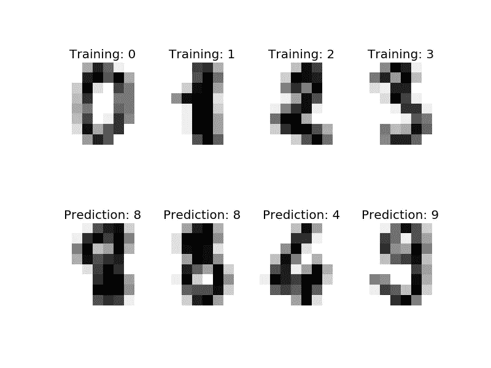
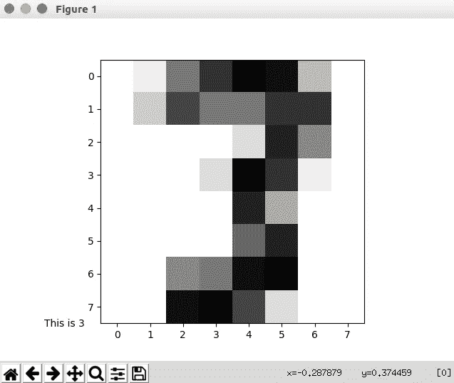
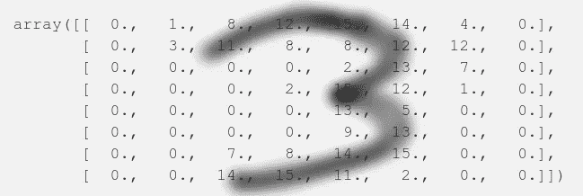
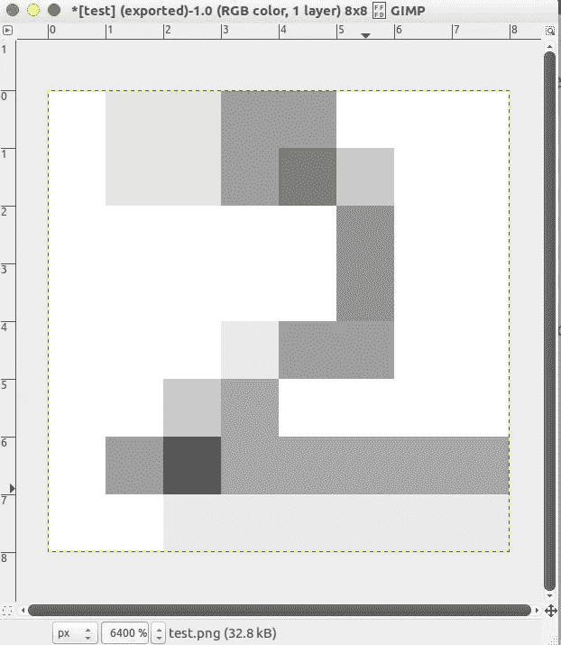

# 利用最近邻分类器制作手写数字识别程序

> 原文：<https://towardsdatascience.com/making-a-handwritten-digit-recogniser-program-using-nearest-neighbour-classifier-d33e76aa17b6?source=collection_archive---------2----------------------->



最近邻分类器是机器学习中最基本的算法之一。本教程描述了一个非常基本的方法，使一个数字识别程序。这里我们不会使用任何 python 机器学习库。所以让我们开始吧

# 导入所需的库

```
from sklearn import datasets
import matplotlib.pyplot as plt
import numpy as np
```

sklearn 的数字数据将用于本教程。

# 加载数据集

```
digits = datasets.load_digits()
```

# 将数据可视化

`digits.data`包含线性阵列中的图像(本例中为 64 x 1 ),而`digits.images`将它们存储在 8 x 8 阵列中。让我们展示一个数字

```
fig = plt.figure()
plt.imshow(digits.images[23],cmap = plt.cm.gray_r)
txt = "This is %d"%digits.target[23]
fig.text(0.1,0.1,txt)
plt.show()
```

这将给我们展示索引 23 处的图像



现在让我们看看这个图像作为一个数组是什么样子的。

`digits.images[23]`

这将给出如下输出

```
array([[  0.,   1.,   8.,  12.,  15.,  14.,   4.,   0.],
       [  0.,   3.,  11.,   8.,   8.,  12.,  12.,   0.],
       [  0.,   0.,   0.,   0.,   2.,  13.,   7.,   0.],
       [  0.,   0.,   0.,   2.,  15.,  12.,   1.,   0.],
       [  0.,   0.,   0.,   0.,  13.,   5.,   0.,   0.],
       [  0.,   0.,   0.,   0.,   9.,  13.,   0.,   0.],
       [  0.,   0.,   7.,   8.,  14.,  15.,   0.,   0.],
       [  0.,   0.,  14.,  15.,  11.,   2.,   0.,   0.]])
```

像素越暗，数字越大。如果您将光标移动到阵列上更大的数字上，您可以看到它正在生成一个 **3。**



# 训练和测试数据集

我们将选择前 100 幅图像作为我们的训练数据集。

```
x = 100 #length of training data setX_train = digits.data[0:x]
Y_train = digits.target[0:x]
```

测试数据集

```
pred = 813
X_test = digits.data[pred]
print "X_test's real value is %d"%digits.target[pred]
```

对于我们的程序，我们将找到测试图像与每个训练图像的*距离*，距离最小的图像就是预测值。我说的距离是 64 维中的欧几里德距离。要计算欧几里得距离，我们只需找到每个索引的数字之间的差异，对它们求平方，将它们相加，然后求平方根。所以，让我们定义`dist`函数。

```
def dist(x,y):
 return np.sqrt(np.sum((x-y)**2))
```

只要 x 和 y 有相同的维数，这个函数对任何维数的数组都有效。(我爱 python 的原因之一:P)。

现在让我们使用`dist`函数来预测测试数据。

```
l = len(X_train)
distance = np.zeros(l) 
for i in range(l):
 distance[i] = dist(X_train[i],X_test)
min_index = np.argmin(distance)
print "Preditcted value is ",
print(Y_train[min_index])
```

这将打印预测值，在本例中为 9。

# 我们模型的准确性

现在，让我们看看我们的模型预测得有多好。

```
l = len(X_train)
no_err = 0
distance = np.zeros(l)
for j in range(1697,1797):
 X_test = digits.data[j]
 for i in range(l):
  distance[i] = dist(X_train[i],X_test)
 min_index = np.argmin(distance)
 if Y_train[min_index] != digits.target[j]:
  no_err+=1
print "Total errors for train length = %d is %d"%(x,no_err)
```

我们的测试数据集有 100 个例子。在 for 循环中，它预测 j 索引处的图像数，并将其与实际值进行比较，然后打印错误总数。当`x = 100` **14/100** 值预测错误，且`x = 1696` **2/100** 值预测错误时。所以我们的模型预测图像有 98%的准确率。

# 预测自定义输入(如果您想向某人展示:P)

这是本教程的第 2 部分，我们将对自定义输入进行预测。您可以使用任何图像编辑器，这里我们将使用 **G.I.M.P.**

遵循以下步骤

1.  打开 GIMP
2.  Ctrl + N
3.  在下一个窗口中，将高度和宽度都设为 8。由于工作表非常小，您可能需要放大
4.  现在滚动。如果指针的大小正在改变，则进入下一步，否则按照[这个](https://docs.gimp.org/en/gimp-using-variable-size-brush.html)来改变指针的大小。
5.  将指针的大小减小到最小。
6.  转到工具→绘画工具→画笔或按 **P.**
7.  告诉那个人在文件里画一个数字。
8.  进入文件→导出并保存你的图像为 test.png。



This is test.png

访问图像 test.png 的 Python 代码

```
from scipy import misc
image = misc.imread("/path_to_test.png/test.png",flatten = 1)
```

现在，如果你打印`digits.images[0]`，你会看到白色像素相当于`0`，值越大，像素越暗，但是如果你打印标准形式的`image`，`255`代表白色，`0`代表全黑。因此，我们必须转换它，使白色对应于`0`，然后我们将重塑图像从 8 x 8 到 64 x 1

```
image1 = 255 - image
image2 = np.reshape(image1,64)
```

如果您查看任何 digits.images 示例，您将会看到最黑的像素对应于~15，但是您自定义输入中任何像素的最大值可以是 255，因此为了避免由于这种影响而导致的任何错误，我们将对数据进行标准化(即在 0 和 1 之间重新调整)。为此，我们将找到数组的最大数目，并将每个元素除以该最大数目。

```
# Training data
for i in xrange(len(X_train)):
 maximum = np.amax(X_train[i])
 X_train[i]/=maximum#Testing data
maximum = np.amax(X_test)
X_test/=maximum
```

现在我们可以走了。我们来预测一下:)

```
l = len(X_train)
distance = np.zeros(l) #This will store the distance of test from every training value
for i in range(l):
 distance[i] = dist(X_train[i],X_test)
min_index = np.argmin(distance)
# print X_test
print "Preditcted value is "
print(Y_train[min_index])
```

这会打印出来

```
Predicted value is 2
```

你可以制作更多的图像并预测它们。

所有的代码都可以在这里[找到](https://github.com/Salil-Jain/DigitRecognizer)[https://github.com/Salil-Jain/DigitRecognizer](https://github.com/Salil-Jain/DigitRecognizer)

谢谢你。