# 使用 Node.js 制作回复器并关注 Twitter 的 Bot

> 原文：<https://towardsdatascience.com/making-a-replier-and-follow-bot-for-twitter-using-node-js-23e0ba8e4e4f?source=collection_archive---------3----------------------->

## 如何“明智地”花时间做这个了不起的东西。

在我们开始之前，我想“警告”你，这个活动看起来很乏味，但实际上只是面具后面的儿童游戏。

先决条件:

*   **节点**和 **npm** 的当前版本。
*   下载并顺利运行 **jQuery 3.0** 。
*   一个最新版本的**自制软件**已经安装并运行。
*   一个演示版的推特账号。
*   文本编辑器；我建议**崇高文字**或者**原子**。

我建议创建另一个假的模拟账户，因为我们现在要做的是…这么说吧，推特先生不喜欢这样。

我们将要重复发布推文，每 10 秒发布一次，违反了几乎所有的规则。基本上，破坏了整个系统。所以如果这个账号被封了，你也不会丢失你宝贵的个人资料。

建议阅读 [**Twitter Bot 文档**](https://dev.twitter.com/docs) 。

## 序幕

在我们开始之前，让我们检查一下我们的**节点**和 **npm** 是否处于当前版本并且能够正常工作。到你的终端，连续输入这两行。

```
**$ node** -v
v7.10.0**$ npm** -v
4.2.0
```

## 创建文件

打开您喜欢的文本编辑器，创建一个包含两个文件的文件夹——**config . js**和 **bot.js** 。你可以给它们起任何你想要的名字，但是我更喜欢这两个名字，以便在本教程中更容易理解。

打开您的终端，将目录切换到您计划制作 bot 并存储所有相关文件的文件夹。

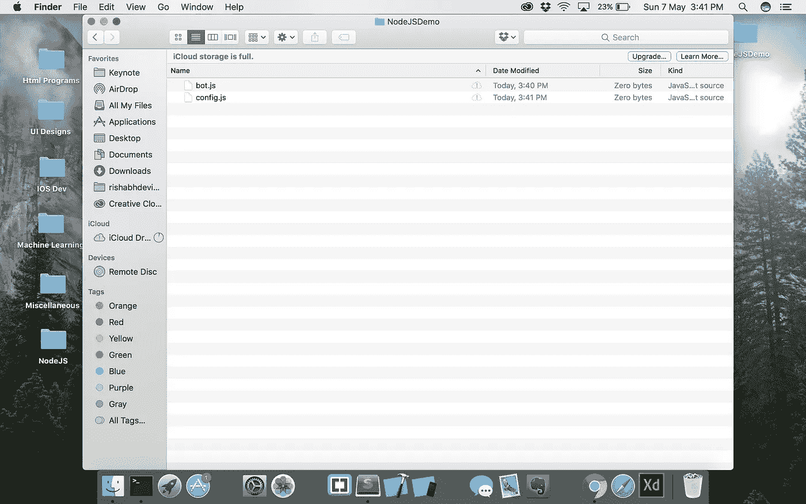

Two files **bot.js** and **config.js** in a file called **NodeJSDemo**.


Make sure to install your dependencies and packages in the target folder.

## 使用所需的包启动节点私有服务器

在命令提示符下输入下面一行来初始化一个名为 **package.json** 的新 JSON 文件。

```
**npm** init
```

系统会提示您填写几个字段。继续填写你的机器人的相关信息。

你可以按回车键跳过一些不必要的。

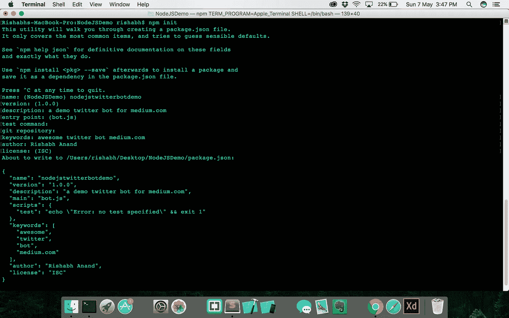

通过这样做，我们文件夹中的这个文件包含了我们的节点应用程序的简短介绍。关于作者、描述和文档、使用的依赖项、许可证和关键字的信息包含在该文件中。

## 导入我们的依赖项

打开您的浏览器，打开 [**npm 网站**](https://www.npmjs.com/) ，搜索 **Twit** 包文档，您会在页面上看到以下内容。

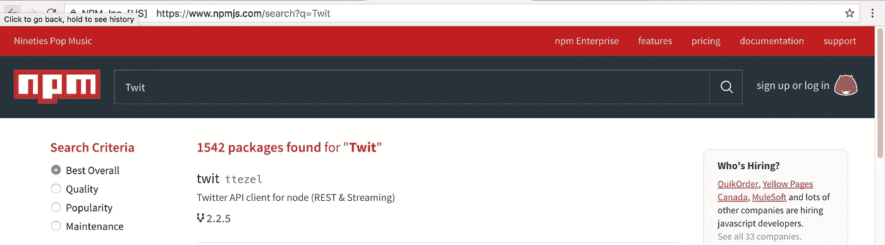

Go click on the first search result you see on the npm search list.

点击文章，进入 Twit 依赖的文档页面。在您的终端或命令行中键入安装命令，并等待它完全完成安装。

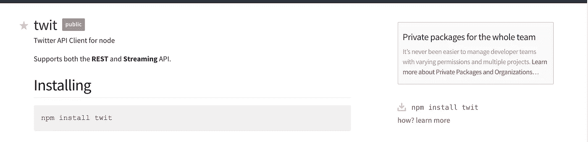

Type in the installation command in your command line or terminal

我建议在这个命令的末尾添加一个 **- save** 标志，这样以后用的时候就不需要重新安装了。它将被本地存储在磁盘上。

```
**npm** install twit **--save**
```

在安装 Twit 包时，您会看到在这个目录中有一个名为 **node_modules** 的文件夹。如果你打开它，它会显示其他更小的文件夹，包含 Twit 运行的依赖项和包，以及里面的 **README.md** 文件。

最后，我们完成了机器人初始化！现在，在推特网站上创建我们的机器人。

## 出发去推特吧！

打开你的浏览器，进入 [**Twitter 网站**](http://twitter.com) 。创建一个假的模拟帐户，并设置它。

进入 [**Twitter 开发者页面**](http://dev.twitter.com) 和向下滚动到页脚，点击**工具**下的**管理你的应用**。

创建一个新的应用程序，并输入必要的信息，如应用程序的名称，描述，网站(如果有的话)，以及任何其他我忘记提到的字段。

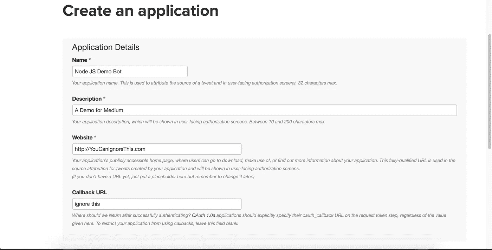

Fill in these fields. You can ignore the last two if you want. However, if you actually have an **OAuth key** and a website to host the bot, I urge you to type in your respective credentials

现在我们已经创建了我们的应用程序，我们现在需要获得我们的消费令牌和应用程序机密。转到**密钥和访问令牌**选项卡，复制这些**消费者密钥**和**消费者秘密**并将其粘贴到某个地方。我们将很快使用这些值。

如果你向下滚动，你会看到这个按钮叫做**创建**我的访问令牌。单击此按钮生成自定义访问令牌和访问令牌密码。复制并粘贴这些值。

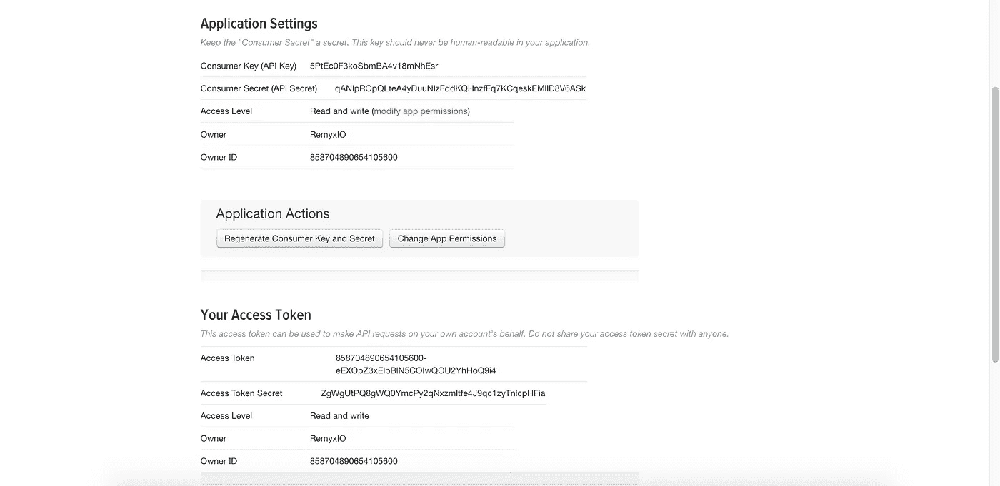

If you have followed the steps up until this point, you’ll have this show up on your screen. Each bit has its own separate access token and consumer key. Using these values, we’ll be able to communicate with the Twitter databases to extract relevant information about events.

假设您计划发布和开源您的 bot，那么您显然需要隐藏和保护您的消费者密钥和访问令牌，以避免误用和滥用。

为了完成这项工作，我们将从另一个文件初始化我们的机器人: **config.js** 。这样，我们就不需要在实际的可部署代码体中添加客户端值。

## 密码。最后…

打开您的 **config.js** 文件，将您之前复制到 **Bot** 对象中的访问令牌和消费者密钥的值粘贴为其各自的属性。

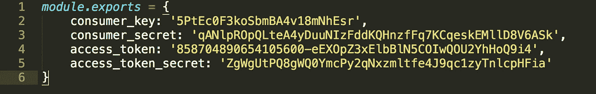

B**ot** object initialisation.

我们刚才写的是我们的机器人初始化脚本。它使用 bot 的**模块中的值和参数创建并调用我们的 Bot。**

它请求 Twitter 的 API 服务允许它从其数据库中检索相关数据，如 follow、tweet、remote 和其他活动。

## 调试和运行

要检查我们代码中的错误，请转到您的 **bot.js** 文件，并键入一个 **console.log** 命令。我们将运行这个 JS 文件来检查到目前为止提交的任何错误。我们还将添加几行代码来将 **Twit** 包和我们的 **config.js** 文件导入到我们的项目中。


This prints out our specifics to terminal.

我们现在将通过使用**节点**运行时服务器来编译程序。要使用 node 进行编译，我们只需输入:

```
**node** <program-name>.js
```

转到命令行或终端，将目录切换到包含我们文件的文件夹。输入上面的命令来运行你的机器人。如果一切运行良好，您将在命令行中看到以下内容:

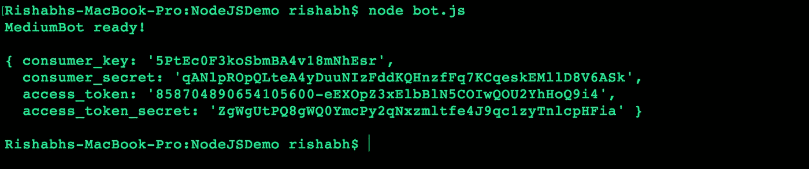

The contents of the **config.js** file that was imported earlier is printed out to terminal.

## 该发微博了！

现在，我们将编写处理实际内容的代码部分。首先我们必须创建一个 **Post** 对象，并用我们的消息或 tweet 填充它。我们编写了函数 **tweetStatus()** ，它接受一条**消息**作为输入参数，并发布这条消息。

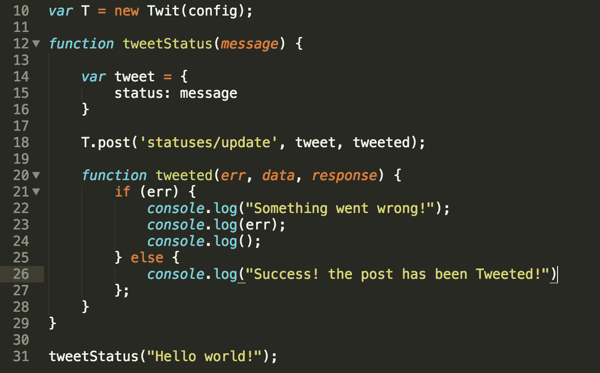

We have initialised a new Twit package build model. This helps post/tweet anything and everything you like. The function **tweetStatus()** has been written to facilitate the posting of a tweet.

通过这个，你可以通过改变 post JSON 中的**状态**的值来发布任何你喜欢的东西。无论是一个随机的笑话还是一个随机的数字，你都可以张贴任何你喜欢的东西！

编译并运行程序，看看它是否真的会发出“Hello world！”。

如果你查看一下 Twitter 开发者文档，你会发现在我们的 tweet 对象中有大量的参数要写。这让我们可以控制我们想要获得的帖子和想要丢弃的帖子。

## 运行程序

在我们编写 Twitter 聊天机器人的旅程中，我们已经到达了一个重要的里程碑。我们非常接近我们的目标。现在，我们要编译刚刚写好的程序。编译它将产生消息“Hello world！”发布到网上让全世界看到！按照上面显示的编译步骤，

```
**node** bot.js
```

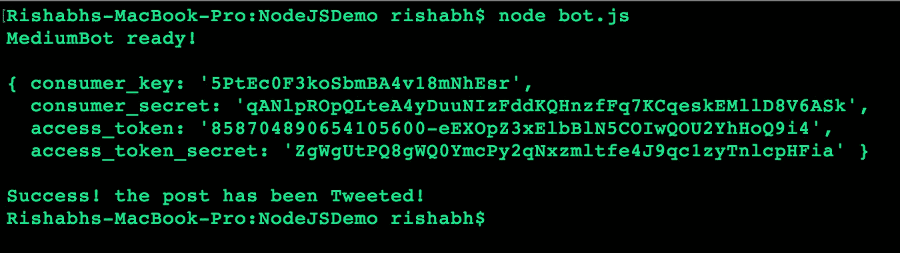

The terminal window should like this after compiling it. If your code crashes with an error, you must have gone wrong somewhere. Don’t worry! Retrace your footsteps and rectify the mistake.

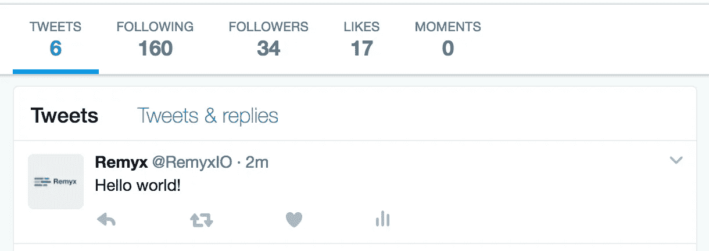

We have successfully tweeted the message **Hello World** without any error messages or crashes! If you are able to reach this point without banging your head on a wall or crying, Good Job!

这个函数相当简单。它所做的只是指定一个 tweeting 任务。假设有人提到你，跟踪你或者戳你。然后，你会想通过表达感激来回复。要做到这一点，我们可以编写我们的提及函数。

## 设置事件处理程序

JavaScript 是一种一切都异步发生的语言。类似地，我们将编写几行代码来指定当事件被触发时我们希望机器人做什么。

有一个叫做**流**的特殊事件，它允许我们在发起拉请求时即时捕捉 Twitter 上发生的事情。看起来是这样的:


The stream statement allows us to capture a snapshot of data that’s moving around in Twitter’s databases instantaneously. This helps us detect mentions or follow requests.

这个特殊的**流**函数检测是否有人关注了你的机器人或者在任何地方提到了它。现在让我们编写 **followed()** 和 **tweetEvent()** 函数。

## 我们的探测和反应功能

让我们写下回复任何关注或提及所需的函数，好吗？

它看起来像这样:

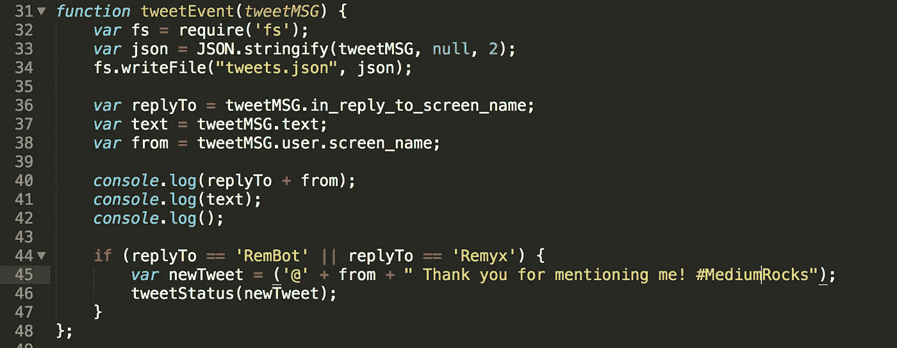

The **tweetEvent()** function detects whether our username was mentioned anywhere on Twitter and replies back. I’ve put in the screen names of my two start-up accounts. You need to add your bot’s username/screen name instead.

在 *if 语句*中添加您的屏幕名称。通过这种方式，任何包含屏幕名称的推文都将被我们的机器人注册，并相应地发送回复，感谢他们提到我们。它利用了我们之前编写的 **tweetStatus()** 函数。简单吧？

现在，我们的**接着是()**函数:

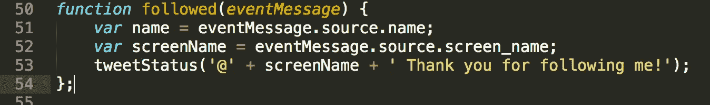

A fairly simple function, the **followed()** function registers any follow requests or users that follow our bot account.

我们完了。恭喜你！现在，最期待的时刻到了:运行程序。

## 运行和测试

对于这一部分，我建议你在另一台设备上再开一个 Twitter 账户。这样，你就可以通过实际跟踪你的机器人并多次提及它来检查机器人是否有响应，而不必每次做某事时都切换帐户。

我在手机上使用 Twitter 来执行测试过程。这使它变得更容易，因为我不需要在我的笔记本电脑上不断跳转帐户。运行程序:

```
**node** bot.js
```

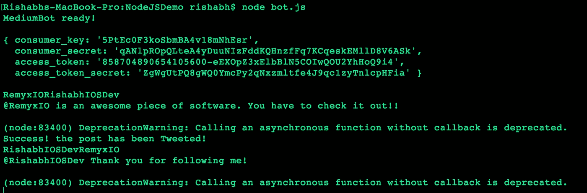

It gives detailed information about any follow events or mention events asynchronously. You can open the **tweets.json** file to look at the various components of a single tweet. It looks aesthetically unpleasing now but you can make it look way better if you add in line breaks and spaces.

使用另一个设备跟踪 bot 帐户。测试 bot 是否有任何可以修复的边缘情况。带它去兜一圈。如果你遇到任何你似乎无法克服的错误，请在下面留下评论，我会尽快回复你。

## “每 10 秒发布一次”部分

*(这是一个可选的片段，如果你的机器人需要每隔一小段时间(比如一个小时左右)发布一些东西，可以使用这个片段。)*

我们谈到每 10 秒左右发布一条推文。为什么不是每个设定的区间！？通过使用 **setInterval()** 命令，我们可以轻松地执行这个任务。

通过设置一个函数作为输入参数以及以毫秒为单位的时间间隔(1000 毫秒= 1 秒)，这个任务可以轻松完成！它看起来像这样:

```
**setInterval**(*tweetStatus*, *10000*)
```

## 简单地

如果有必要就打破它！机器人的目的没有界限！现在全靠你的想象力了。机器人被世界各地的公司和初创企业广泛用于与客户沟通。

当谈到整个客户关系部门的自动化时，机器人真的很有帮助。

利用它令人敬畏的力量来创造一些真正有用和直观的东西！超越并建立下一个超级机器人！在那之前，我们下一集再见！

[里沙卜·阿南德](https://medium.com/u/50c04ecf0ec5?source=post_page-----23e0ba8e4e4f--------------------------------)的原创文章