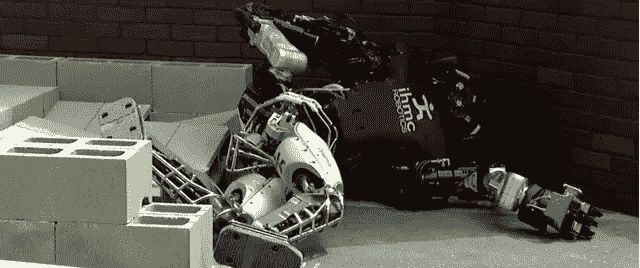
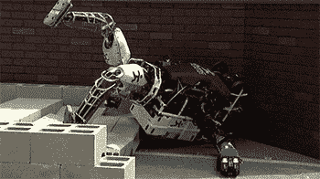
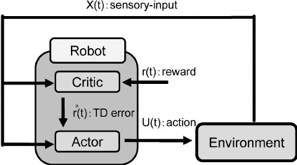
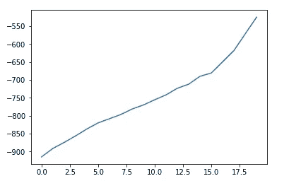
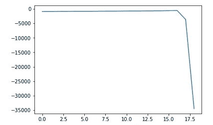

# 让机器人学会如何移动，第 2 部分——在真实的野生世界中强化学习

> 原文：<https://towardsdatascience.com/making-a-robot-learn-how-to-move-part-2-reinforcement-learning-in-the-real-wild-world-9427da7b9b21?source=collection_archive---------2----------------------->

## 解决物理世界的瓶颈。

这是一系列文章的第二部分。你可以在这里找到 [*简介*](https://medium.com/towards-data-science/making-a-robot-learn-of-to-move-intro-2bcf3c3330df)*[*第一部分*](https://medium.com/towards-data-science/making-a-robot-learn-how-to-move-part-1-evolutionary-algorithms-340f239c9cd2) *，关于* ***进化*** ***算法*** *。你可以在* [*这个****GitHub*******资源库****](https://github.com/normandipalo/intelligent-control-techniques-for-robots) **中找到所描述的算法和实验的代码。***

****

**近年来，强化学习得到了重新认可。各种突破和显著的成果获得了整个科学界，甚至流行文化的关注:从 **AlphaGo** 到 **DQN** 应用于雅达利，到[最近的**open ai****DOTA 2**bot。](https://blog.openai.com/dota-2/)**

**新的算法和架构已经以极高的速度发布，击败了最先进的结果并解决了新的任务。这些算法甚至在模拟的物理世界中表现得非常好，像人形和动物一样的模型学习行走、跳跃、躲避障碍，正如 [**DeepMind** 最近展示的](https://www.youtube.com/watch?v=faDKMMwOS2Q)。**

****

**A robot dealing with the physical world.**

**但这些结果中的大多数都有一个共同点:它们需要**巨大的计算能力**、**时间**，并且它们是在虚拟或**模拟世界**中执行的。为了获得好的结果，需要几十万集，由于最近高性能计算机的出现，这通常不是问题。但是强化学习遇到**时间** **代价**和**现实** **世界**的问题会怎么样？如果运行这些算法，例如运行一百集，它们会起作用吗？在某种程度上，这就是我们试图在机器人领域分析的。**

> **[……]我们工作的主要重点是在很短的时间内获得良好的结果。**

**正如我以前的帖子所解释的，我和我的一个同事试图解决的任务是找到方法**使机器人尽可能精确地跟随给定的轨迹**，而不知道它的物理参数。我们决定实现**智能** **控制**算法，将它们与经典的反馈控制器进行比较，首先是一个普通的 PD。所有算法与 PD 反馈控制器并行运行，试图提高其性能，从而创造出更智能的控制器。**

**由于机器人不知道它的动力学参数，它不知道哪个是正确的扭矩给它的关节以实现期望的运动。因此，运动中的误差是**而不是** **可微**，例如，在神经网络等函数逼近器的参数中，正如我在**部分** **1 中所讨论的。**这种问题是强化学习的常见设置，其中代理必须**尝试** **动作**和**通过感知它们对环境的未知影响来学习**，因此我们尝试在其他帖子中讨论的其他技术中实现一些 RL 算法。**

**为了使这篇文章更短更易读，我不会介绍零强化学习理论，但是在 Medium 上也有很多资源可以学习。**

**我们实现了两个主要算法。一个是 **Q** - **学习**，一个离散动作算法，我们用来在机器人移动时实时调整 PD 控制器的增益。第二个是**演员** - **评论家**，另一个非常流行的算法，用于寻找一个策略，这次是连续动作，控制关节上的扭矩。**

**实现的所有细节都在[GitHub 库](https://github.com/normandipalo/intelligent-control-techniques-for-robots)中。**

# **用于动态 PD 调谐的 q 学习。**

**移动机器人机械手意味着找到输入到关节的正确扭矩，该扭矩在一定范围内具有连续值。另一方面，Q-Learning 是一种算法，它学习一种状态下离散动作的 Q 值， *Q(s，a)，*以执行预期给出最高回报(更准确地说，遵循策略的最高总回报)的动作。它的普通版本不能处理大的动作空间，更不用说连续的动作空间了。但是我们对机器人移动时**动态调整 PD 控制器**增益的想法很感兴趣。PD 控制器根据期望和实际**位置**和**速度**之间的**误差**给出输入扭矩。虽然这种简单的线性控制器可以在固定 P 和 D 增益的情况下给出显著的结果，这些增益通常通过一些试错法进行调整，但其想法是让算法**根据机器人的运动实时调整它们**，理想情况下使控制器更加通用。经典 PD 是一种广泛使用的控制器，因为它简单且性能良好，但它无论如何都是一种线性反馈控制器，不利用任何关于轨迹或其他数据的信息，而是仅使用最后一个时间步中的误差值。**

****

**主要架构如下:动作只是简单地**增加或减少 P 和 D 增益**而与固定量无关。直觉是使用机器人的当前状态作为一种状态，以及最后步骤中错误的演变。为了逼近 Q 函数，我们使用了神经网络:如前所述，输入是状态值，而网络的输出是各种动作的 Q 值。总奖励仅在 10 步的**短时间范围内计算，因此算法的主要目标是在该范围**内获得**最高奖励，选择增益的更新。我们实现的奖励不是位置和速度的负误差(更高的误差- >更低的奖励)，而是先前步骤范围中的先前误差和当前误差之间的差。这样做是为了部分地**去相关**不同步骤范围内的性能:如果算法在特定步骤范围内的学习过程中表现不佳，那么在接下来的步骤中误差也将明显较大，因为机器人连续移动，即使在接下来的步骤中算法选择了一个好的动作，也可能在没有有效理由的情况下受到惩罚。因此，如果我们只考虑短暂的后续情况之间的相对改善(T21 ),我们实际上可以利用好的行动。****

**正如我在介绍中所写的，我们的工作重点是在很短的时间内获得好的结果，大约 100 集/完整的轨迹。否则，该算法可能变得对物理世界不可行，并且它被其他控制算法超越，如**模型** **预测** **控制**或**迭代学习**。**

**我们进行了大量调整架构和超参数的实验，但最终结果往往是算法不断增加增益。这是有道理的，因为在控制理论中众所周知，更高的增益往往会带来更好的性能，但高增益意味着高功耗，有时会超过电机限制。我们试图让算法学习更多不可预测的实时调整增益的方法，以更低的能量成本获得更好的性能，但这种特定的环境，具有给定的轨迹，并没有真正给出那些结果，同时证实了控制理论中一些已知的经验概念，在没有任何先验知识的情况下通过算法学习**。****

# ****确定性政策学习的行动者-批评家****

****我们实现的第二种类型的算法是行动者-批评家，用来学习确定性的行动策略(然后我们也用随机策略进行了实验)。这个想法很简单:受其他论文的启发，我们决定为每个关节独立开发一个演员-评论家架构，以学习一个确定性的策略，使机器人能够更精确地跟随轨迹，补偿 PD 控制器的弱点。最近的一篇[硕士论文](https://repository.tudelft.nl/islandora/object/uuid%3Ace85d671-8c62-460f-9277-6e0b1d9eb0ba)展示了使用类似架构的 6R 机器人的有趣结果，其整体性能优于控制理论中的经典学习算法。****

********

****为每个关节实现不同的行动者-批评家策略使得算法更具可扩展性，但是在这种分散架构中学习关节的复杂动态耦合也可能更具挑战性。****

****整体架构如下:为了从机器人状态中提取特征，我们开发了高斯径向基函数的 2D 阵列。高斯数是根据经验选择的，均值和方差也是如此。对于每个关节，这些阵列的输入是位置和速度误差。然后将 RBF 的各种输出作为输入发送到完全连接的层(即加权和),以产生用于关节的扭矩。这些权重然后由算法调整。****

****作为一个**试探性的** **信号**，添加到 actor 信号中以尝试不同的动作，我们使用了不同频率的正弦和，而不是经典的高斯白噪声，因为由于高次谐波，物理机器人实际上无法产生白噪声扭矩(白色的*指的是在频谱中具有所有种类的频率，而物理系统总是低通系统)。*****

*****我们的实验展示了这种算法是如何**非常** **不稳定，正如 RL 文献中所知的那样**。误差向低值的明显收敛会在最后的步骤中爆发。最近的许多论文，如著名的 **DDPG** 算法，提出了使学习更稳定的技巧，如**两个**和**网络**用于演员和评论家以不同的时间更新来计算**目标，**和****情节** **记忆，**是最近 RL 文献中非常著名的技术，允许通过将经验存储在数据结构中然后在随机结构中使用它们来解相关*******

**************

*******Look, the error is approaching zero…*******

**************

*******…expect for exploding at the next step.*******

*******而作为测试，我们的算法能够解决著名的**健身房** **环境、**如**山地车、**机器人上的学习阶段相当不稳定，并且该算法不能在短时间内提高机器人的性能，除了 1 或 2 个关节的机器人。我们尝试了许多不同架构和超参数的实验，但我们无法复制我们分析的论文的结果。我们怀疑，其中一个主要原因是，在那种情况下使用的机器人是由速度**控制的**，并且有一个内置的低级加速控制器，因此可以自行处理许多与惯性相关的问题，而我们是在没有任何其他低级控制器的情况下直接控制机器人加速的。*******

**************

*******Interesting comparison of PD torques (red) and Actor torques (green) that improved performances. Note how the algorithm learns to be in phase with the PD, but also to give negative peaks in the first oscillations to avoid over-shooting.*******

> *******所有的实验都证实了物理世界对于在模拟中表现良好的算法来说是多么具有挑战性。*******

*******我们当时没有进一步探讨这个问题，因为另一种方法，我将在下一篇文章中介绍，在很短的学习时间内产生了显著的效果，但我有兴趣在未来探索这项任务的不同技术。*******

*******所有的实验都证实了物理世界对于在模拟中表现良好的算法来说是多么具有挑战性。在机器人上执行实际轨迹所引入的时间延迟是一个瓶颈，当使用模拟的物理世界时，这个瓶颈经常被遗忘。在这些领域有活跃的研究，这通常会导致对**学习**的研究，即机器人学习新任务和能力的方法，只需几个例子，如最近的 OpenAI [博客](https://blog.openai.com/robots-that-learn/)和论文。*******

*******在下一篇文章中，我将展示一种不同的技术，基于**基于反馈的动态模型学习和基函数神经网络**，它给出了显著的结果。*******

*******你可以在[这个 **GitHub** **资源库**里找到所有实验的代码。](https://github.com/normandipalo/intelligent-control-techniques-for-robots)*******