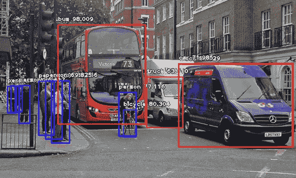

# 让所有人都可以使用人工智能

> 原文：<https://towardsdatascience.com/making-artificial-intelligence-accessible-to-all-d3b7351a61fa?source=collection_archive---------12----------------------->

我们很荣幸生活在一个让人工智能成为现实绝对必要的数据、计算和深度学习算法都变得丰富的时代。人工智能深度学习的发展导致了几乎所有技术领域令人难以置信的进步，并为未来带来了令人难以置信的前景。更好的医疗保健、无人驾驶汽车、智能飞行汽车、更容易获得的金融资源以及更明智的国家资源分配，只是未来十年可能实现的几个目标。

A Self-Driving Car by Waymo(A Subsidiary of Google). Source: Wikipedia

但就像早期的计算机技术一样，最先进的人工智能的使用被数百万开发者拒之门外。目前，当开发人员需要构建对象检测和识别系统时，即使是最流行的深度学习框架都需要很高的专业知识水平。深度学习算法基础的具体知识仍然是构建复杂人工智能系统的先决条件。因此，深度学习专业知识需要长时间的密集学习，对于大多数迷失在概念海市蜃楼中的新来者来说，这往往令人沮丧。“困惑”是许多新进入者用来描述他们情况的词，他们试图超越简单地训练 MNIST 和 CIFAR10 数据集以获得更好的准确性。

Source: makeuseof.com

同样，开发计算机软件最初需要对计算机和操作系统的整个体系结构有深刻的理解。这让早期的程序员感到沮丧，包括贝尔实验室的传奇开发人员。意识到抽象是工具的低级，许多专家创造了高级编程语言，包括 Fortran、C、C++等。这些语言比汇编语言更容易使用，但仍然需要很高的专业知识才能使用，因此，创新缓慢，计算机编程对大多数人来说遥不可及。几年后，像 Python、Java、.NET、PHP、Javascript 等等，使得这个星球上的每个人和组织都可以使用计算机编程。没有这些高级抽象，我们今天所知的数字世界将不复存在。

Guido Van Rossum created Python, A language that made programming more accessible

Olafenwa Moses 我喜欢把深度学习的当前状态想象成 C++早期的编程方式。

***如果每个人都能编码，那么每个人都可以用合适的工具构建 AI***。因此，我们都决定致力于创造工具，让任何人，从普通程序员到各个领域的行业专家，都能将人工智能集成到他们构建的每个解决方案中。

只有这样的工具存在，才能保证 AI 惠及所有人。我们设想一个智能的未来，每个应用、设备和系统都注入了人工智能。 ***获得人工智能是一项基本的基本人权*** *。*

有鉴于此，我们开始构建 ImageAI，这是一个非常简单易用的 python 计算机视觉库，它允许完全没有 ML 或 DL 经验的开发人员只需几行代码就可以构建最先进的 AI 系统。

 [## OlafenwaMoses/ImageAI

### ImageAI——一个 python 库，旨在使开发人员能够使用独立的计算机构建应用程序和系统…

github.com](https://github.com/OlafenwaMoses/ImageAI) 

在我们发布第一个版本以来的三个月里，ImageAI 已经被全球成千上万的开发者使用，其中许多人是第一次体验人工智能。使用 ImageAI，任何开发人员都可以在仅仅 10 行 python 代码中执行对象检测、提取和识别**！，**任何开发人员都可以用自己的定制数据集**训练图像识别模型，只需 5 行 python 代码！。**视频中的物体检测**只用了 7 行代码！**所有这些都有最先进的 RetinaNet、YoloV3、Resnet、Densenet、InceptionV3 和 Squeezenet 架构支持。

为了感受一下这是如何工作的，我将实际回顾一下其中的一些特性。

首先按照[官方文档](https://imageai.readthedocs.io)中的说明安装 [ImageAI](https://github.com/OlafenwaMoses/ImageAI) 及其依赖项。

第一，**10 行代码中的物体检测！**

下载 [yolo.h5 模型文件](https://github.com/OlafenwaMoses/ImageAI/releases/download/1.0/yolo.h5)并将其放在与您的相同的路径中。py 文件。现在，您可以在上面代码中的任何图像“image.jpg”上运行检测。

上面的简单代码会给你这个:

**视频中的物体检测用 7 行代码**

这会给你这个

ImageAI 还支持许多强大的功能，包括带有间隔回调的高级视频分析。它完全支持从 IP 摄像头和网络摄像头的对象检测。

所有这些惊人的功能都是完全免费和开源的。

可以通过[https://imageai . readthe docs . io](https://imageai.readthedocs.io)或者[https://imageai-cn . readthe docs . io](https://imageai-cn.readthedocs.io)了解更多(中文版)

我们选择接受的使命是推进人工智能，使其民主化，并让地球上所有规模的个人和企业实体都可以使用人工智能。

我们正在努力构建更多的人工智能工具，并在不久的将来将它们带到更多的平台上。

您可以通过以下网站了解更多有关我们使命的信息

 [## AI Commons

### 致力于改善和普及人工智能

科学](https://commons.specpal.science) 

我们可以一起建设一个更美好的世界，人工智能将不断改变我们的生活，并且人人都可以使用。

你可以通过 [@johnolafenwa](https://twitter.com/johnolafenwa) 和 [@OlafenwaMoses](https://twitter.com/OlafenwaMoses) 联系我们

电子邮件:guymodscientist@gmail.com 和 johnolafenwa@gmail.com