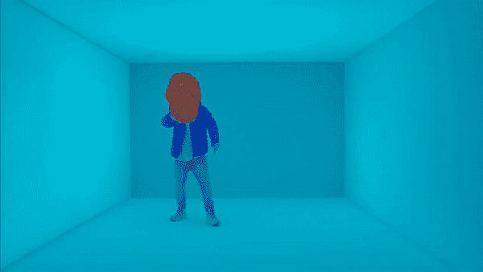
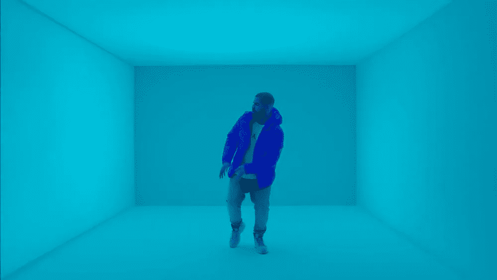
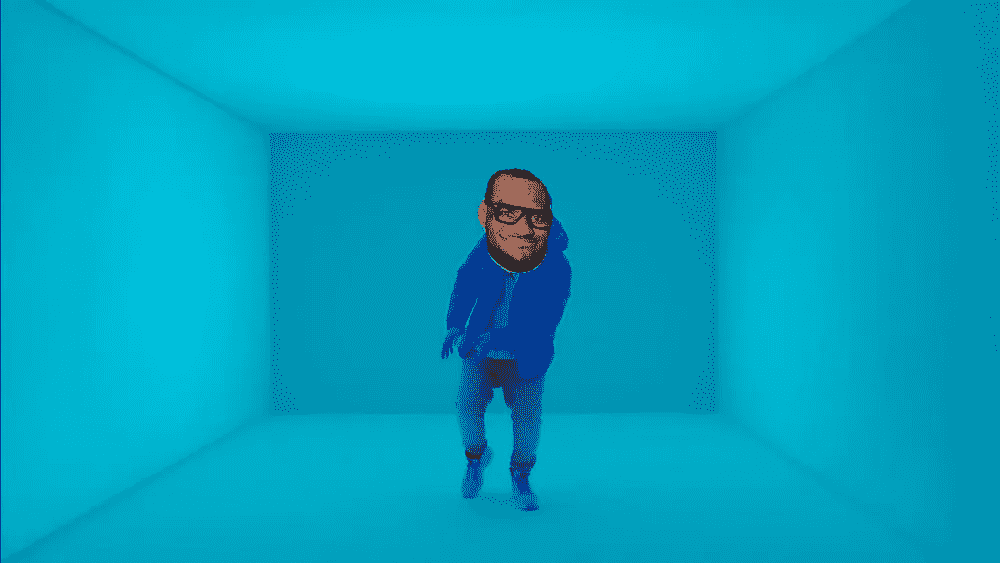

# 深度学习摇头动画

> 原文：<https://towardsdatascience.com/making-bobblehead-animations-using-deep-learning-1df2cb004429?source=collection_archive---------10----------------------->

多姿态估计目前是计算机视觉中最先进的深度学习方法，用于检测图像中的人类及其关节。在这篇文章中，我简要介绍了如何在德雷克的热线音乐视频上使用勒布朗·詹姆斯的脸制作一个有趣的小摇头 GIF，就像我上面制作的一样。基本上有 4 个主要步骤:

1.  下载你感兴趣的视频叠加。我选择了德雷克的热线金光闪闪的视频。

2.下载您想要覆盖在视频上的孤立人脸图像。我选择了勒布朗·詹姆斯的脸。如果你的脸部图像不方便地有背景，那么使用一些图像编辑工具来裁剪背景，直到你的图像看起来像这样:

You favourite celebrity’s face without the background

3.在视频的每一帧，检测人类和他们的关节。我用的项目是[https://github . com/ZheC/real time _ Multi-Person _ Pose _ Estimation](https://github.com/ZheC/Realtime_Multi-Person_Pose_Estimation)，是多姿态估计的 keras Python 实现。特别是，我们感兴趣的是使用代码来定位图像中人体对象的头部。

Example of using the code from [https://github.com/ZheC/Realtime_Multi-Person_Pose_Estimation](https://github.com/ZheC/Realtime_Multi-Person_Pose_Estimation) to perform human multi-pose estimation on an image.

4.一旦我们有了视频帧的面部屏幕坐标，我们就在这些坐标处将孤立的面部剪切图像覆盖在视频帧的顶部。

(Left) Original video frame. (Right) Face overlay video frame.

5.对视频中的每一帧重复步骤 3 和 4。之后我用 ffmpeg 把所有的帧组合在一起，做了一个无声视频。你将不得不做更多的工作来添加和同步原始视频剪辑的音频。但是在很大程度上，你现在已经完成了一个摇头娃娃动画的可行演示！

Final demo of a bobblehead animation using multi-pose estimation