# 让深度学习用户友好，成为可能？

> 原文：<https://towardsdatascience.com/making-deep-learning-user-friendly-possible-8fe3c1220f9?source=collection_archive---------4----------------------->

> 背景|来自[《哈佛商业评论》](https://hbr.org/2018/03/getting-value-from-machine-learning-isnt-about-fancier-algorithms-its-about-making-it-easier-to-use)(2018 年 3 月):*尽管学者们做出了许多机器学习的发现，……但公司正在努力部署机器学习来解决实际的商业问题。简而言之，大多数公司的差距不是机器学习不起作用，而是他们努力实际使用它的***。**

*在这里，我将介绍正在努力使**深度学习**(**机器学习**的一部分)更加用户友好，以便公司更容易使用。希望这些努力将有助于减少公司在深度学习时面临的“斗争”。*

*那么，有没有可能让深度学习(MLP、CNN、、、甘、……)变得更加用户友好呢？更加人性化，比如从 MS-DOS 升级到 Windows 2.0(还记得 MS-DOS 吗？CP/M 克隆)。或者像从集成开发环境(IDE)到图形编程环境(GPE)。*

*嗯，一切皆有可能…如果你付出足够的努力。*

# *深度学习已经变得更加容易使用*

*人们已经做出了很多努力，让深度学习变得更加容易:*

*   *DL 框架(Theano、Caffe、Tensorflow、MXNet)*
*   *元框架或 API (Keras，ONNX？)*
*   *可用于迁移学习的开放模型(ResNet、LeNet、VGG16、SqueezeNet、…)*
*   *Jupyter 笔记本*
*   *….*

*得益于深度学习中无处不在的开源文化，所有这些都是现成的、免费的。现在，开放文化已经转移到 DL 模型，非常高性能的 NN 已经通过深度学习模型动物园提供给所有人。这些让迁移学习变得“轻而易举”。*

*他们还做出了其他努力，使深度学习的潜力变得非常容易，而无需任何开发工作，也不需要 DS/DL 部门或专门的工程师:*

*-物体识别网络服务(YOLO……)*

*-谷歌汽车服务*

*但是这些提供黑盒服务…实际上是另一个黑盒中的一个黑盒。一些公司可能不在乎，并发现该服务非常有用/经济，但一些公司会在乎，并希望掌握深度学习过程。*

# *用户友好性？酷！！！但是为了什么？*

*尽管如此，目前，构建深度学习模型涉及到相当多的使用当前深度学习框架(Theano，Tensorflow，PyTorch，CNTK，Caffe2，…)或元 API ( Keras)和编程语言(Python，Java，R，…)之一的编程。这通常由经过专门培训的相当高级的用户来完成。*

*因此，深度学习的用户友好性可以采取以下形式:*

*   *没有编程→更好，尤其是对于不怎么编程或者不知道特定深度学习框架的人*
*   *直观的图形编辑器，用于设计/修改深度学习架构→更易于使用，更适合不太高级的用户*

*采取用户友好方式的其他动机是它可能产生:*

*   *更高的工作效率—用户更有效率和创造力*
*   *模型更容易理解，更容易修改/维护。*

*这意味着用户友好性也可能来自:*

*   *拥有高效的开发/实验环境*
*   *执行模型推理的集成环境，*
*   *DL 模型性能监控*
*   *易于部署训练好的模型*
*   *自动管理由 DL 模型构建过程产生的文件。*

# *目标用户*

*用户友好性带来了构建定制 DL 模型的有限灵活性。如果光标在两个相反的目标之间，即**可定制性** & **易用性**，被正确定位，它就可以工作。但是光标的位置取决于用户的类型。*

*谁可能需要用户友好性:*

*   *学生/自学者/教师*
*   *中小企业公司*
*   *希望掌握技术但需要一种工具来提高工作效率的工程师/研究人员*

*→需要更快地建立新的 DL 模型，并更快地修改它们*

*→需要进行大量实验:不同的架构、优化超参数、调整数据集……*

*谁不太可能需要它:*

*   *深度学习的研究人员*
*   *深度学习工程师，特别是在高级用途和生产环境中*

# *用户友好的深度学习工具*

*到目前为止，已经有一些尝试让深度学习更加用户友好。在这里，我将介绍三种已经走了很长一段路的方法:*

*   *来自深度认知的深度学习工作室*
*   *索尼的神经网络控制台*
*   *IBM 的神经网络建模器(以前的名称:IBM 深度学习 IDE 和 DARVIZ)*

*所有这些工具都有一个图形编辑器来编辑深度学习模型。它们都允许从 DL 层构建深度学习架构，如 2D 卷积、2D 最大池等*

*另外两个用户友好的候选项将不会被回顾，因为到目前为止，它们没有提供一个图形编辑器来编辑 DL 模型:*

*   *NVIDIA 数字*
*   *张量板(部分张量流环境)*

# *首先，一点历史*

*回到过去(90 年代)，当神经网络还处于初级阶段时，有一些带有 GUI 的神经网络模拟器，如:*

*   *阎乐存参与的 Neuristique(【http://leon.bottou.org/projects/neuristique】)的 SN 神经网络模拟器*
*   *斯图加特大学
    并行与分布式高性能系统研究所(IPVR)的 SNNS([http://www.ra.cs.uni-tuebingen.de/SNNS/](http://www.ra.cs.uni-tuebingen.de/SNNS/))*
*   *和其他人。*

*他们已经试图让神经网络建模更加用户友好。实际上，我使用 SNNS 作为我进入 NN 领域的第一步。这是一个很好的开源工具:*

*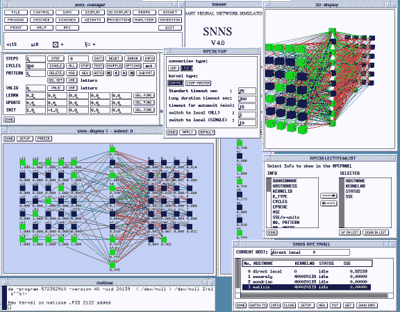*

*SNNS Neural Network simulator*

*在浅层时代之后，神经网络在深度学习端跳了进来，进入了深度时代。*

# *深度认知深度学习工作室(DLS)*

*Deep Leaning Studio 是一个非常有趣的平台，它有两种操作模式:云和桌面。*

*这里有 DLS:[http://deepcognition.ai/](http://deepcognition.ai/)*

## *深度学习工作室图形编辑器*

*DLS 有基本的用户友好的成分→深度学习模型编辑器，看起来像:*

*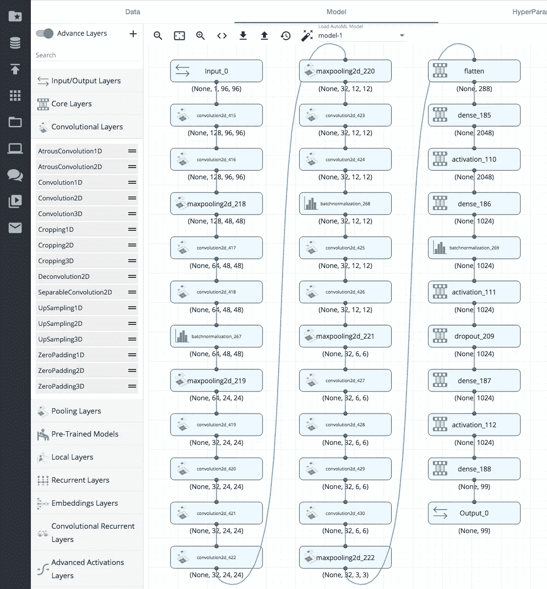*

*DL 模型编辑器的基本成分是构成 DL 模型的层(见左图)。要构建 CNN 的卷积部分，可以使用 Convolution2D、MaxPooling2D、BatchNormalization layer 等层。KERAS API 中定义的所有层都是可用的，另外还有一些层。通过将这些层拖放到编辑器工作空间上并定义这些层之间的连接图来构建模型。通过选择层，然后在编辑器屏幕右侧的侧面板中设置值，可以设置每个层的参数。*

*在这个视频中可以看到一个和 DLS 一起搭建 DL 模型的例子:【https://player.vimeo.com/video/198088116"*

*每次添加层或改变层的参数时，后台进程检查网络是否“连贯”。通过这种方式，如果你偏离了构建一个“不可能的”模型的轨道，你会在早期得到警告。*

*因此，深度学习工作室已经具备了让深度学习更加用户友好的条件。*

***基本特征***

*   *使设计/修改 DL 架构变得更容易*
*   *提供了 Keras API 的所有 DL 层，加上一些技术层(例如合并)*
*   *拖放和复制/粘贴有助于构建大型网络*
*   *允许每层的简单配置*
*   *自动检查构建的 DL 网络的一致性*
*   *预训练的 KERAS 层。提供 SqueezeNet！最后完全连接可以重新培训，使实施转移学习变得容易(添加参考)*

***高级特性***

*但是它有更多的特性，不仅仅是提供一个简单的编辑器，还提供了与环境其他部分的紧密集成。其中之一是:*

*   *当对数据预处理、体系结构学习超配对进行几次尝试时，恢复模型(实际上是恢复、数据预处理和超配对)非常有用。*
*   *集成预先训练的 Keras 模型*
*   *AutoML(见下文)*

## *DLS 环境*

*图形编辑器不是单独出现的。在 DLS 环境中还有 4 个零件(可通过选项卡访问):*

*   *数据-加载数据集并对其进行预处理*
*   *超参数-编辑训练超参数*
*   *培训—开始/停止和监控培训*
*   *结果—分析和比较几个实验的结果*
*   *推断/部署——测试模型并部署它*

*图形化的 DL 模型编辑器位于 model 选项卡中*

*所有这些功能都与构建 DL 模型有关*

*除此之外，环境的其他部分也提供了额外的+,将工具带入另一个维度:*

*   *笔记本—使用/编程 Jupiter 笔记本*
*   *环境—从命令行管理和使用 ML 环境*
*   *部署—管理使用 DLS 构建的已部署 DL 模型*

*加上一些更注重实用性的部分*

*   *项目—浏览和访问项目*
*   *文件浏览器—管理环境(云或本地)中的文件*
*   *数据集-预处理和加载数据集，以便作为模型输入*
*   *论坛—从支持人员和其他 DLS 用户那里获得帮助*
*   *视频—访问培训视频*
*   *支持——从深层认知中获得支持*

*所以 DLS 解决方案提供的不仅仅是一个 DL 模型编辑器。这里不是展示整个 DLS 环境的地方。因此，我将仅指出几个经过深思熟虑且非常有用的功能:*

*   *让几个项目同时训练，并且仍然能够在其他项目上工作*
*   *AutoML*
*   *提供了 Jupiter 笔记本和“命令行”编程*
*   *定义自定义损失函数(目标函数)的可能性*
*   *云和桌面是“相同的”(可能只是一些技术上的差异)，除此之外，桌面版本是免费的。*

## *AutoML*

*它自动为特定数据集生成易于训练的 DL 架构。这与谷歌 AutoML([https://TechCrunch . com/2018/01/17/Google-AutoML-lets-you-train-custom-machine-learning-models-without-having-to-code/](https://techcrunch.com/2018/01/17/googles-automl-lets-you-train-custom-machine-learning-models-without-having-to-code/))的方法不同。我能够在叶子形状识别数据集上测试它，它工作得非常好。*

## *生产时间—单击 REST—API 部署*

*一旦模型构建完成，DLS 允许将模型部署为 REST API。除了部署 REST API 之外，还生成并部署了一个简单的基于表单的 web 应用程序，用于快速测试和共享。可以从 deployment 菜单管理已部署的模型。*

*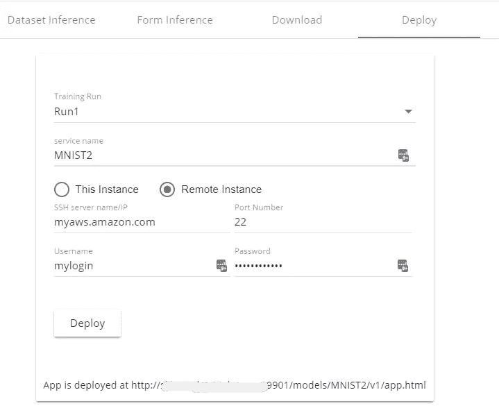**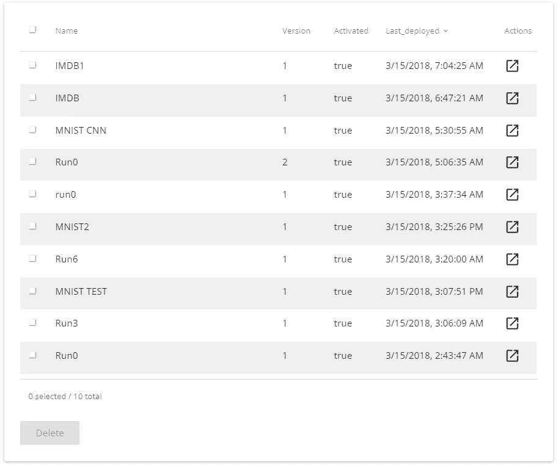*

## *Jupiter 笔记本电脑和预配置环境*

***木星笔记本***

*DSL 提供了在 Jupyter 笔记本电脑中编程或在所提供的环境(桌面或云)中运行现有笔记本电脑的可能性。*

*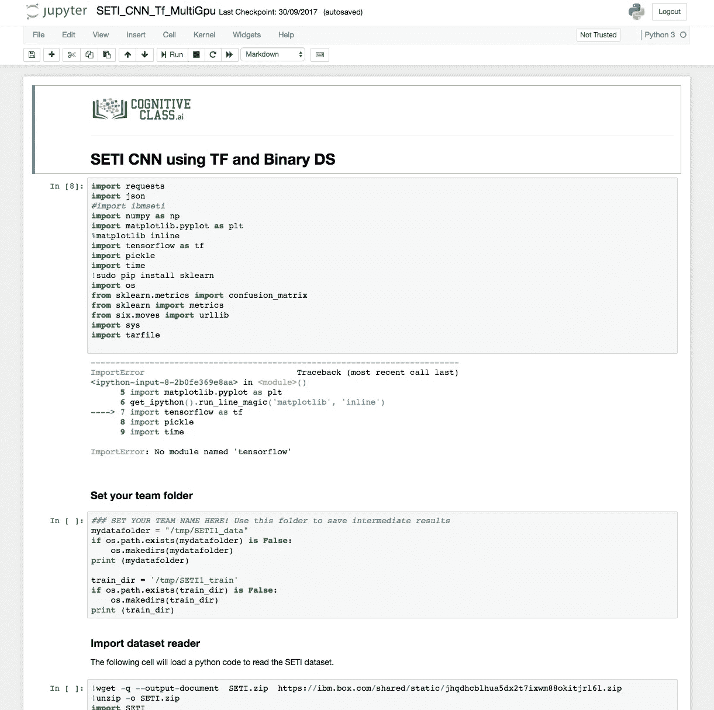*

*Jupiter Notebook environment provided by DSL (Notebook Panel)*

***预配置环境***

*深度认知为深度学习程序员引入了预配置环境。这个特性将 AI 开发者从设置开发环境的头痛中解放出来。这一点尤其重要，因为许多深度学习框架和库需要不同版本的包。这些包版本冲突经常导致调试时间的浪费。*

*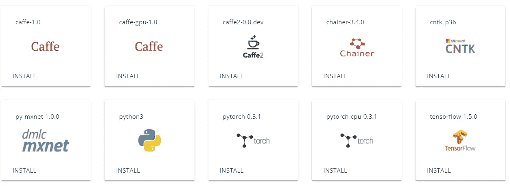*

*Environment panel in DSL*

*目前最新版本的 Tensorflow、Keras、Caffe 2、Chainer、PyTorch、MxNet 和 Caffe 已经推出。这些使得开发者能够非常快速地使用各种不同的 github AI 项目。这些环境是隔离的，支持 CPU 和 GPU 计算。*

*最终，这些将开发人员从 devops 工作中解放出来，帮助他们专注于真正的人工智能模型构建和优化工作。*

*Deep Learning Studio 中预先配置的环境不仅可以访问终端，还可以访问基于 VS 代码的开源组件的成熟的基于 web 的 IDE。*

*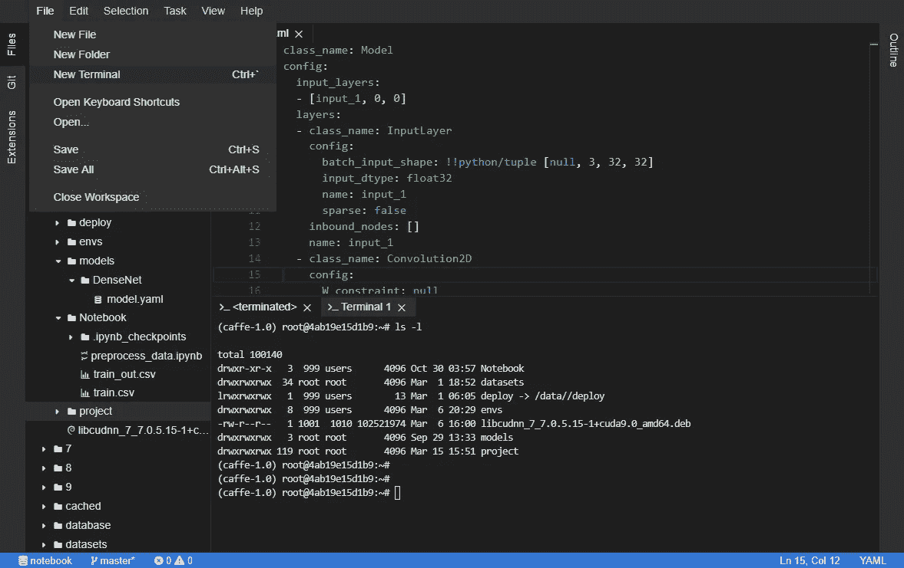*

*One programming Environment provided by DSL (Environment panel)*

*这两个特性(Jupiter 笔记本和预配置环境)是真正的资产。它们使得使用深度认知云和 GPU 来完成任何深度学习、机器学习或数据科学任务成为可能→不会将人们局限在仅编辑的解决方案中。*

## *出来的是什么*

*   *以 Keras H5 格式保存的训练模型*
*   *DLS 模型。yaml 格式，包含模型的 DLS 特定描述*

## *DLS 背后的技术是什么*

*   *阿帕奇 MXNet*
*   *Keras like API*

## *现在还缺少什么*

*   *可能加载其他预训练的 Keras 模型→无法使用动物园模型中的模型*
*   *将模型的代码导出到 Python/Keras*
*   *当存在分类问题时，使用混淆矩阵查看性能*
*   *一份详细的文档(这不是一个大问题，因为环境使用起来非常直观)*

# *索尼的神经网络控制台*

*索尼的神经网络控制台(NNC)似乎最初是一个内部工具，已经与相关的内部 DL 框架神经网络库([https://nnabla.org/](https://nnabla.org/))一起被制成产品，在这里[https://github.com/sony/nnabla](https://github.com/sony/nnabla)开源发布。因此，NNC 应该从这种内部经验中受益。*

*这里有 NNC:[https://dl.sony.com/](https://dl.sony.com/)*

## *神经网络控制台图形编辑器*

*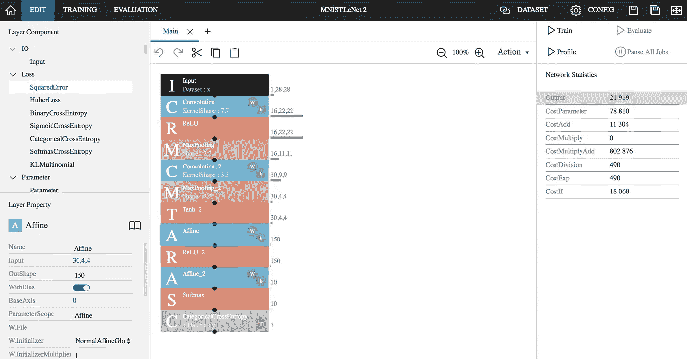*

*DL model GRAPHICAL EDITOR in Neural Network Console*

*NNC 的模特编辑和 DLS 的编辑工作方式差不多。可以添加到 DL 模型的层特定于索尼的 DL 框架神经网络库(NNL)。*

*以下是 DLS 的一些特点和差异:*

*   *提供了逻辑处理层— LogicalAnd、LogicalOr、…*
*   *提供了循环层(但没有提供示例)—可用于构建残差网络和递归神经网络*
*   *不同的数据预处理可以通过模型中的图层或数据集选项卡来完成。*
*   *超参数可以在配置选项卡中设置*
*   *评估选项卡有一个有用的混淆矩阵，用于分类问题*

# *神经网络控制台环境*

*与 DLS 类似，NNC 提供了一个超越 DL 模型编辑器的环境。*

*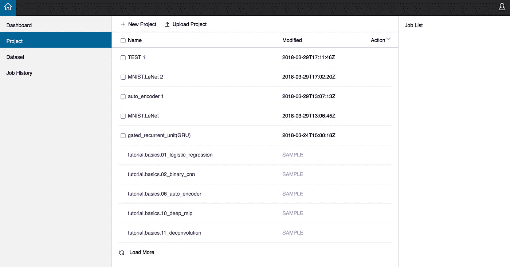*

*图形编辑器不是单独出现的。还有 4 个面板(在 NNC 环境中:*

*   *仪表板—监控资源使用情况*
*   *数据集-预处理和加载数据集，以便作为模型输入*
*   *作业历史记录—监控已结束的培训作业*

## ***NNC 的弊端***

*   *底层框架目前是相当“机密”的，几乎没有在索尼之外使用的迹象*
*   *层列表是受限制的并且是“非标准的”(正如 Keras 层 API 可能是)*
*   *预先训练的 DL 不能作为层使用，所以 transfert 可能不容易设置*
*   *无法加载经过训练的 KERAS 模型*
*   *没有提供用于轻松部署 DL 模型的机制*

*关于 NNC 的视频请看:【https://www.youtube.com/watch?v=-lXjnaUSEtM】T2*

# *IBM 的神经网络建模器*

*神经网络建模器已经有了几个名字:DARVIZ 和 IBM 深度学习 IDE(【https://darviz.mybluemix.net/#/】T4)。精彩的 IBM 营销或者我们应该称之为混乱。它现在是沃森工作室套房的一部分。*

*NNM 的目的与前两种工具不同。它意味着在最后产生代码(Theano，Tensorflow/Keras，Caffe 1)。现在，该代码将被 Watson Studio suite AFAIU 中的其他工具使用。*

*在这里有 NNM:[https://darviz.mybluemix.net/#/dashboard](https://darviz.mybluemix.net/#/dashboard)或者在沃森工作室[https://data platform . IBM . com/docs/content/analyze-data/ml _ dla as . html？观众=博士&背景=精炼厂](https://dataplatform.ibm.com/docs/content/analyze-data/ml_dlaas.html?audience=dr&context=refinery)*

## *神经网络建模器图形编辑器*

*给 NNC 提供了一个不错 DL 模型图形编辑器:*

*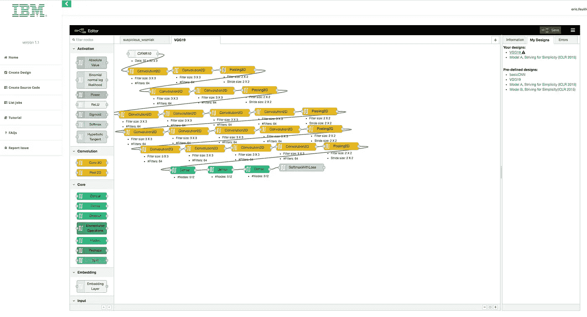*

*DL model GRAPHICAL EDITOR in Neural Network Modeler*

*以下是 DLS 的一些特点和差异:*

*   *自动最佳架构搜索*
*   *不同的数据预处理可以通过模型中的图层或数据集选项卡来完成。*
*   *超参数可以通过 Watson Studio 套件中的工具进行优化*

## *NNM 资产*

*   *集成到数据科学/机器学习套件中，因此可能会受益于套件的其他功能，如部署机制*

## *NNM 的缺点*

*   *仅生成 DL 模型的代码，所有其他功能都在 Watson Studio 套件中的某个地方(您必须拥有并了解该套件)*
*   *仅在云上可用(可能很快仅在 Watson Studio 套件中可用？)*

*有关 NNM 的更多信息，请参见这篇 Medium 文章:[https://Medium . com/IBM-Watson/accelerate-your-deep-learning-experiments-with-IBM-neural-network-modeler-DD 0 c 92 FBA 814](https://medium.com/ibm-watson/accelerate-your-deep-learning-experiments-with-ibms-neural-network-modeler-dd0c92fba814)*

*关于 DARVIZ(NNM 的旧称)的视频请看:【https://www.youtube.com/watch?v=mmRw_MuMPC4】T2 值得为**【孩子】**(是的！)呈现出来。出色的沟通和商业技巧！*

# *结论*

*深度学习的用户友好性即将实现。但是在不久的将来可能会走得更远。*

*索尼的 NNC 是一个很好的快速建立 DL 模型的解决方案，并提供了一个相当完整的环境。*

*IBM 的 NNM 是一个更受限制的解决方案，其主要目标是生成代码供其他地方使用。其他地方是 Watson Studio 套件，因此它的效率将取决于 WS 套件的效率以及它在 WS 套件中的集成。*

*深度认知的 DLS 是一个经过深思熟虑的解决方案，它提供了一个非常完整的环境，并且不局限于深度学习模型的图形编辑。它面向“事实上的”标准，这使得它比索尼基于“机密”框架的 NNC 更有趣。*

# *功能对照表*

*我已经在 socialcompare.com 网站上创建了一个功能对照表。目的是提供一个易读的表格来总结哪种产品具有哪些特性。其他人也可以做出贡献。*

* [## 深度学习编辑器| Tableaux comparatifs-social compare

### 比较深度学习工作室控制神经网络控制台控制深度学习 IDE 控制 NVIDIA 数字控制注释

socialcompare.com](http://socialcompare.com/fr/comparison/deep-learning-editor-4amg7j1f) 

以下是截至 2018 年 4 月底的屏幕截图:

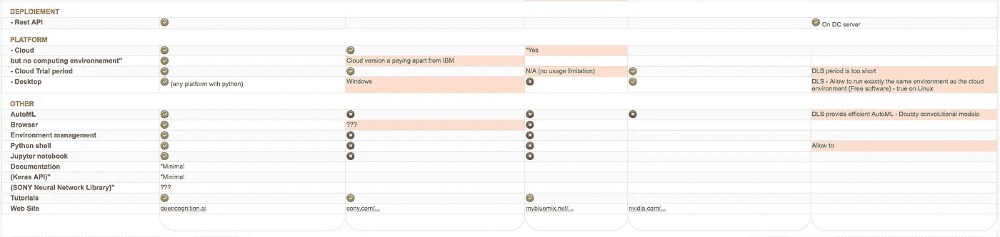*