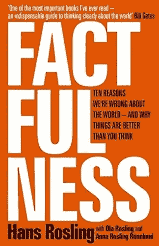

# 伟大假说的形成

> 原文：<https://towardsdatascience.com/making-great-hypothesis-588f93f52206?source=collection_archive---------5----------------------->

比尔和梅林达·盖茨最喜欢的书*factfulity*将如何超越你的数据科学实践

# 动机

到目前为止，数据科学教育主要关注数据争论、假设检验和因果推断。我们很少听说前一步——假设形成。

## **形成错误的假设代价高昂**

一旦你开始测试一个假设，你可以花费几个小时、几天、几个月甚至几年的时间来收集数据、清理数据、可视化数据、构建花哨的预测和因果模型，但都无济于事。你最喜欢的假设根本不成立——什么都不重要！

这标志着你身份危机的开始。你开始为你浪费的时间感到抱歉。你人生中第一次开始质疑自己的聪明。“也许我没有我 SAT/GRE/LSAT 第 99 分显示的那么聪明，”你害怕地说。但是你已经投入了这么多。真的可以这么轻易认输吗？你的手指无法抗拒轻微调整设计的冲动，看看 1000 版本是否是符合你理论的神奇设计。你认为你是一个诚实正直的公民。但是在你对意义的执着追求中，你已经把自己置身于 p-hacking 的土地上了。

## **它发生在我们最好的人身上**

问题是:我们怎样才能形成更好的假设？上周偶遇刚好合适的书: [*Factfulness*](https://www.amazon.com/Factfulness-Reasons-World-Things-Better/dp/1250107814/ref=sr_1_1?ie=UTF8&qid=1531773776&sr=8-1&keywords=factfulness) *。*它讲述了“我们对世界错误的 10 个理由，以及为什么事情比你想象的要好”。我个人犯了不少单子上的错误。我认为，形成更聪明假说的关键在于深入理解我们的系统性偏见。通过避开这些诱人但被误导的假设，我们可以为自己节省大量时间和痛苦。

## **免责声明**

这个博客帖子是一个备忘单，为自己使用和与朋友分享而创建。如果你觉得有用，我强烈建议你在亚马逊上购买这本书。我简直无法公正地评价我多年来读过的最伟大的平装本。我相信你会对基于数据的精彩故事感到高兴。你甚至可能会发现许多本备忘单中没有的见解。

# 1.差距本能

## **定义**

通过二元透镜看世界的人类冲动。

## 例子

最低 x%对最高 y%

> 巴西最富有的 10%的人赚取了总收入的 41%。令人不安，对吗？听起来太高了。我们很快会想象一个精英阶层从其他人那里窃取资源。媒体用最富有的人——通常不是最富有的 10%，但可能是最富有的 0.1%，即超级富豪——及其船只、马匹和巨大豪宅的图片来支持这种印象。

> 是的，这个数字高得令人不安。同时，已经很多年没有这么低了。统计数据经常被戏剧性地用于政治目的，但重要的是，它们还能帮助我们驾驭现实……事实上，即使在世界上最不平等的国家之一，也不存在差距。大部分人都在中间。

## 控制差距本能

*   当你听到一个缺口的时候，就要识别出来。
*   平均值可能具有欺骗性。尝试绘制分布图(随着时间的推移)。
*   大多数学者关注平均治疗效果，并使用异质性效果作为稳健性检查。在真实的商业环境中，你也许应该把异质效果放在前面和中间。

# 2.消极本能

## 定义

"认为世界正在变得更糟的巨大误解。"

## 例子

*   调查显示，人们认为极端贫困已经恶化，犯罪率上升。通过使用来自世界银行和联合国的几十个结果变量，作者表明这是不正确的。(我没有张贴这些情节，因为我可能侵犯了版权。但是我强烈建议你自己去看看。)比如 2017 年的赞比亚比 1891 年的瑞典好。

## 诱惑

*   “大多数事情过去都是更糟，而不是更好。但是对于人类来说，忘记事情真正的“过去”是什么样子是极其容易的"
*   选择性报告

## 如何控制我们的消极本能

*   认可选择性报告——因为关于逐步改善的故事并不畅销。
*   更多新闻！=更痛苦。"更多的坏消息有时是由于对苦难的更好监测，而不是世界的恶化."
*   认识到大多数人都把过去浪漫化了。
*   不要执着于水平，要好奇改变的方向。绘制一些时间序列数据，看看过去是否真的更好。

# 3.直线本能

## 定义

*   过度依赖线性模型
*   过度依赖线性外推

## 例子

“认为‘世界人口正在不断增加’的巨大误解"

## 诱惑

*   作者举了许多例子来说明世界上不同收入和职业的人是如何喜欢假设直线的。
*   个人认为，一个相关的原因是线性模型受到了很多学术上的关注。所以如果你使用线性模型，你可以调用许多花哨的证明和很酷的技术来为你的策略辩护；而非参数仍然相对研究不足。

## 解药

*   **作者:**请注意，数据可以以多种形状分布:直线、S 形弯曲、A 形滑动、驼峰、指数等。他们还谈到不同的社会和经济力量如何产生不同的形状。它们很有趣。自己去看吧:)
*   **我:**对产生这些数据的底层力量有了更深入的了解。[结构模型](/the-holy-grail-of-econometrics-3a45a2295ce5) s 虽然复杂而笨拙，但有时却非常有用。

# 4.恐惧本能

## 定义

> 恐惧是有用的，但前提是它指向正确的事物。恐惧本能是理解世界的可怕向导。它让我们把注意力放在我们最害怕的不太可能发生的危险上，而忽略了实际上最危险的东西。

## 例子

作者绘制了许多关于自然灾害、飞机和汽车事故、战争和冲突等的时间序列。

## 诱惑

*   将媒体报道频率误认为真实频率。
*   “风险=危险*暴露”。大多数人忘记了暴露的部分，并且不必要地担心他们很少暴露的事件。

## 解药

*   f(媒体报道)！=(事件)
*   “风险=危险*暴露”

# 5.尺寸本能

## 定义

我们倾向于夸大事情，尤其是当:

*   它与我们有关
*   一个统计数据被挑选出来

## 结果

> 规模本能的两个方面，加上消极本能，使我们系统地低估了世界上已经取得的进展。

## 例子

> 在关于全球比例的测试问题中，人们一致认为大约 20%的人的基本需求得到了满足。大多数情况下，正确答案接近 80%，甚至 90%。同时，我们系统地高估了其他比例。我们国家的移民比例。反对同性恋的人的比例。在每一种情况下，至少在美国和欧洲，我们的解释都比现实更加戏剧化。

## 解药

**将统计数据放在上下文中:**不要报告绝对数字，尝试报告百分比。

# 6.泛化本能

## 定义

需要进行一些概括。类别对于我们的功能来说是绝对必要的。它们给我们的思想提供了结构。想象一下，如果我们认为每一件物品和每一个场景都是独一无二的——我们甚至不会有一种语言来描述我们周围的世界。”但当我们过度概括时，这就成了一个问题。

## 负面后果

当你错误地将一组结果推广到另一组时，你就冒了风险

*   以为有商机，其实没有；
*   以为有商机就没有商机。

## 例子

> 每次怀孕都会导致大约两年的月经不调。如果你是月经垫的制造商，这对生意不好。所以你应该知道，而且应该为全世界每个妇女的婴儿数量下降而感到高兴。你应该知道，而且也应该为越来越多受过教育的女性离家工作感到高兴。因为在过去的几十年里，这些发展已经为你的产品创造了一个爆炸式的市场，在现在生活在 2 层和 3 层的数十亿经期妇女中。

## 解药

> 假设你不正常，其他人也不是白痴

*   寻找更好的方法将人们分类。
*   **跨组:**寻找相似之处，但不要将结果从一组归纳到另一组，除非你有足够的证据支持它
*   **组内:**寻找差异
*   注意轶事证据:他们通常是离群值
*   **注意没有数据的英文报告。**例如，多数可以是 50.00001%

# 7.命运本能

## **定义**

声称 X(人、国家、宗教、文化)注定有某种结局，因为这些都是不可改变的特性。

## 诱惑

*   事实上，国家、宗教和文化正在缓慢但稳定地转变。有时，人们会把缓慢的变化误认为没有变化。
*   许多畅销书都在延续这个神话，这也于事无补。

## 消极后果

刻板印象、歧视和错失的机会。

## 解药

*   变化慢！=无变化
*   已经抛弃了文化/宗教命运的讨论。

# 8.单一视角本能

## 定义

当我们在寻找一个能解释一切的解释时。

## 诱惑

人们，尤其是学者，喜欢简单、优雅的解决方案。

## 解药

> 拿个工具箱，而不是锤子

*   做你自己的魔鬼代言人。试着收集你最喜欢的叙述的反例。
*   **认识到现实是复杂的。**由此推论，要提防简单的想法和简单的解决方案。
*   **永远不要相信单一来源**——即使那个来源是某个领域的专家。认识到专家只是他们研究领域的专家。调查显示，作者在其他问题上也犯了同样的错误。
*   小心空想家。甚至民主也不是唯一的解决方案。

# 9.责备的本能

## 定义

"为不好的事情发生寻找一个清晰、简单的原因的本能."

## 例子

不缺例子:)所以我就略过了。

## 消极后果

*   夸大任何个人/团体的重要性。
*   有损于对问题的理解，也不利于提出建设性的解决方案。

## 解药

> 忍住责备所有人的冲动。因为问题是当我们识别出坏人时，我们已经不再思考了。如果你真的想改变这个世界，你必须了解它实际上是如何运作的，并且忘记打任何人的脸。

*   **“找原因，不找小人。”**
*   **“找系统，不找英雄。”**

# 10.急迫的本能

## 定义

“机不可失，时不再来！明天可能就来不及了！特价！仅限今天！”

## 诱惑

事实证明，这是一个有效的点击诱饵和增长黑客。它触及了我们最原始的恐惧本能。

## 消极后果

你在做次优的选择:在真正重要的任务上花费更少的时间和精力。

## 解药

*   **“坚持数据”**具有相关且准确的紧急程度衡量标准。
*   **“当心算命先生，**因为任何对未来的预测都是不确定的。”
*   **“警惕激烈的行动，”**因为副作用可能很难消除。更好的方法是进行小的、渐进的改进，并评估每一步的补救措施。

# 结束了

您已到达此备忘单的结尾。但从某种意义上来说，这只是一个开始。

在我自己的研究中，我已经发现自己陷入了几个这样的陷阱。我多么希望这本书是在我刚开始攻读经济学博士时写的。实际上，它可以拯救我多年的生命。谢天谢地，认识到自己的错误并从中吸取教训永远不会太晚:)有了这些见解，我就能避开诱人但不真实的假设。

你在实践中遇到过哪些陷阱？请在下面留下你的评论，这样我们就可以互相关注了。

下次见！