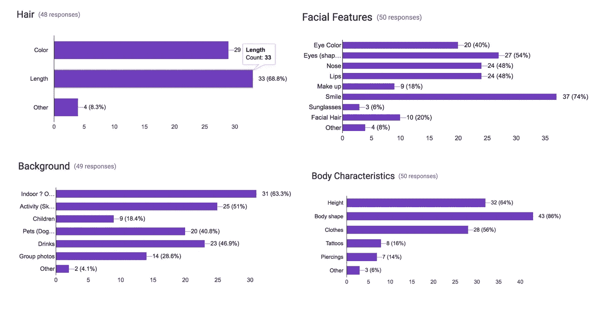

# 相亲:让有视觉障碍的人更容易接触到移动约会平台

> 原文：<https://towardsdatascience.com/making-mobile-dating-platforms-more-accessible-to-individuals-with-visual-impairments-3b77f8f8cbdd?source=collection_archive---------2----------------------->

想象一下，在看不到个体的情况下，在 Tinder 或 Bumble 这个已经疯狂的世界中导航。对于任何不熟悉屏幕阅读器输出的人来说，这听起来可能是这样的:

有人知道查德长什么样吗，他喜欢什么，或者你想在他身上左右滑动吗？不，我不这么认为。

作为一个有视力的人，我从来没有真正想过一个有视力障碍的人在移动约会领域可能会遇到的问题。我的盲人朋友坐在我的办公桌前，把他的手机递给我，让我对个人资料中的个人进行口头描述，这让我意识到使用带有屏幕阅读器的约会平台是一种多么糟糕的用户体验。

我半开玩笑地对我的朋友说，为了让他别来烦我，好让我回去工作，我打算写一个程序，自动为他的个人资料照片加标题。我们笑了几秒钟，然后我们想起我们都是计算机科学的博士生，实际上可以相对容易地完成这一点。让他截屏一个个人资料，将图像发送到服务器，做一些计算机视觉魔术，还有 Viola，这不会太难！，我们可以发送回一个标题，它可以提供更多关于谁实际上在个人资料中的信息。

这个想法是在新学期开始时产生的，我参加了几门机器学习课程，所以我向我的一个小组提议，我们做这个项目作为一个学期的项目。他们喜欢这个想法。

首先，我们决定对大学生进行一项调查，看看人们在约会档案中寻找什么样的信息。对于每个类别，人们可以在 tinder 档案中选择最多三个对他们来说重要的选项。

星号:这项调查的收集方式非常不正式，而且它也涉及一般的大学生群体，而不是更具体的视觉障碍人群。不要把这些图表视为彻底探索的科学结果，而是在他们评估约会档案时对年轻人大脑的简要观察。

Survey results from primarily college students on what they look for when they evaluate a tinder profile. The data is split into 4 graphs that show people are the most interested in seeing an individual’s hair color, body shape, whether they are indoor or outdoor, and if they are smiling or not.

不出所料，调查结果中出现了一些模式。当评估简档时，用户发现简档中关于个人的几个特征是重要的。他们通常想知道头发的颜色和长度，个人是否在微笑，照片是在室内还是室外拍的，以及个人的体型。

由于这是一门关于统计机器学习的课程，教学大纲只是勉强进入深度神经网络，所以我们采取了一种相对幼稚的方法来制作字幕。基本上，我们将任务分成几个二元分类器(长发/短发、浅色/深色头发、室内/室外、微笑/不微笑等)，每个小组成员负责一个分类器。下面的视频展示了我们开发的系统:

截屏拍摄后，我们会等待手机接收到一个新的截屏添加到截屏文件夹中的事实，这是一个明显的延迟。正如所展示的，这个系统仍然是一个原型。仍然有大量的错误需要克服和改进，但是我认为我们的系统在演示概念验证方面做得很好。

很明显，下一步是摆脱简单的分类器，而是使用在 image net 上训练的深度神经网络来为图像添加标题。一旦该版本实现，我将更新这篇文章，并给出一些更彻底和明确的结果，甚至可能是一些来自视觉障碍用户的反馈。

因此，不可避免地，你们中的一些人会问一个相对不敏感但并非完全不相关的问题:“这个人的长相到底有什么关系？反正他看不见他们。”这很重要，我保证。从一个人的个人资料中可以收集到比外表更多的信息。你可以从环境中获得信息，乍得，例如，是一个喜欢船和越野车和四轮车的户外运动者，也许这是你的事情，也许不是，但如果不能看到照片，信息是无法访问的。你也可以通过个人资料中的照片暗示个人生活方式的某些方面。如果个人资料包括五张赤膊健身房自拍，而你又不是特别喜欢去健身房，也许这些信息会帮助你决定这个人是否值得一试。

所以我想这个故事的寓意是，可悲的是，可访问性不是设计师在构建技术时通常会考虑的事情。这给许多人带来了挑战，也给技术世界制造了障碍。计算机视觉已经被证明是一种不可思议的工具，可以用来为有视觉障碍的人拆除一些障碍，然而它不应该走到那一步。在我看来，可访问性的最大问题之一就是简单的认知。在我的计算机科学课上，可访问性从未被提及。教授只需花 15 分钟介绍通用设计的概念(即我们应该设计出每个人都可以使用的东西)。