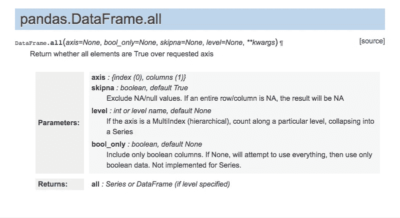
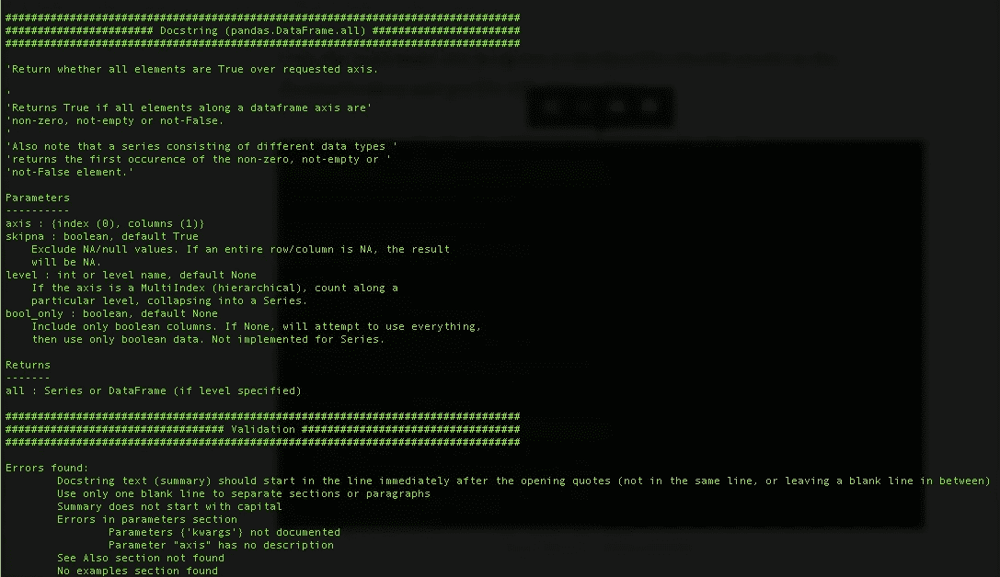
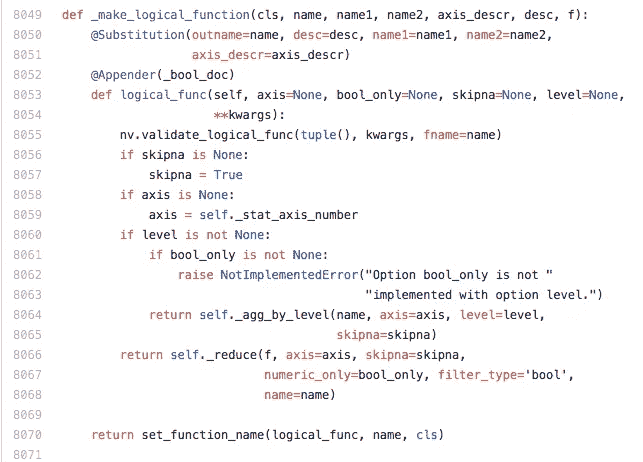
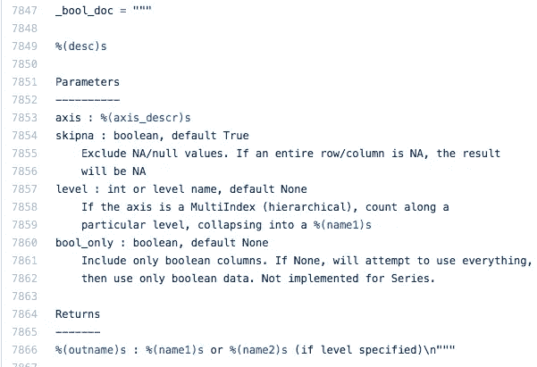
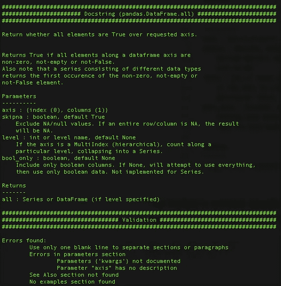
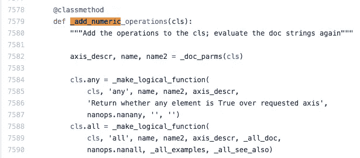
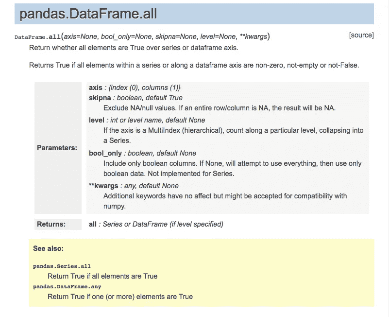
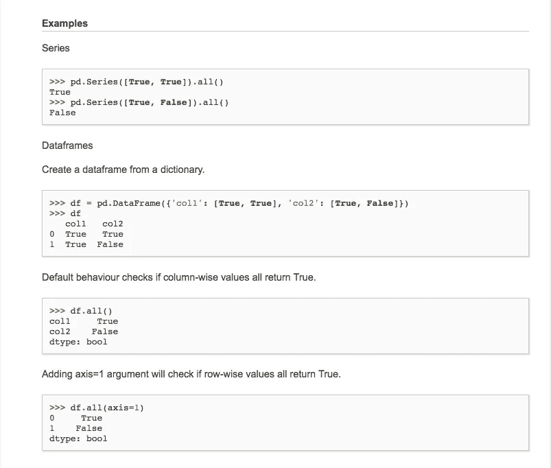
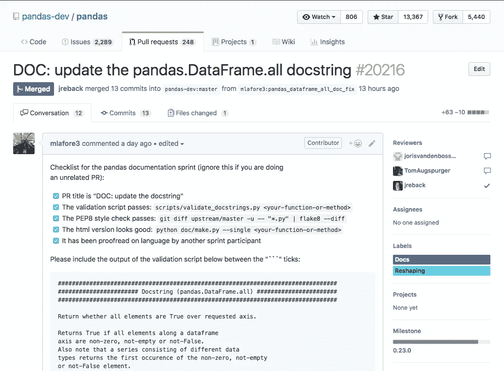

# 我对开源软件的第一个贡献

> 原文：<https://towardsdatascience.com/making-my-first-open-source-software-contribution-8ebf622be33c?source=collection_archive---------8----------------------->

开源软件汇集了许多无私的程序员，他们自由地向世界发布他们的代码。作为一名利用开源软件谋生的程序员，我一直想为开源社区做点贡献。在过去的这个周末，我在全球熊猫文献冲刺中实现了这个目标。

我知道我不必等待这个全球性的事件来做出开源的贡献。事实上，我经常爬上我经常使用的开源软件的发布板。然而，这是我第一次为开源项目做贡献，得到社区的支持和详细的指导真的很有帮助。也给了我一个很具体的任务，也有帮助。

pydata TO group 在多伦多的 hacklab space 举办了一次活动。组织者给我分配了熊猫。DataFrame.all 文档，但在开始之前，我必须设置我的环境。熊猫的网页上有很好的说明，可以在这里找到。

 [## 为熊猫做贡献-熊猫 0.22.0 文档

### 如果你不是开发人员，对文档做出贡献仍然有巨大的价值。你甚至不必…

pandas.pydata.org](http://pandas.pydata.org/pandas-docs/stable/contributing.html#creating-a-python-environment-pip) 

我更喜欢用 venv 管理我的虚拟环境，尽管有很多警告，但一切都运行得很好。我现在可以开始写文档了，开始如下:



我运行了下面一行代码来产生文档字符串输出。

```
python ../scripts/validate_docstrings.py pandas.DataFrame.all
```



在第一组散列标签下面是文档字符串当前的样子，在第二组下面是当前的错误列表。第一个错误是:

```
Docstring text (summary) should start in the line immediately after the opening quotes (not in the same line, or leaving a blank line in between)Use only one blank line to separate sections or paragraphs
```

我得到了一个与这个文档字符串相关的行，当我阅读代码时，遇到了困惑。



我期待的是更接近实际医生的样子。经过一些调查后，我意识到我正在失去装饰者的魔力。appender decorator 追加在 _bool_doc 变量中找到的内容。_bool_doc 变量本身引用了从替换装饰器中给出的参数中插入的变量。

当我跟踪 _bool_doc 变量时，我发现了第一个错误的来源。



%(desc)的变量占位符在左引号后有一个空行。这是不允许的。所以我去掉了这条空行，瞧！我已经排除了第一个错误。



我一直在努力纠正这些错误，然后面临一个挑战。我正在完成 DataFrame.all 的文档，但它实际上与 DataFrame.any 方法共享文档。因此，当我需要放入“另请参阅”和“示例”部分时，我必须向这些文档的实例化函数添加参数。这将允许这两个相关的方法共享它们文档的模板，但是在需要的地方有所不同。


我将示例和 see_also 参数添加到 _make_logical_function 中，并将它们作为变量传入。



这是一个传递给生成文档的参数的变量的例子。

请注意我是如何将 _all_doc、_all_examples 和 _all_see_also 变量添加到 cls.all 对象中的。

这些更改导致新的文档页面如下所示

python make.py -单身熊猫。DataFrame.all



肯定是一个进步。

下一步是准备合并这个分支。包括确保它编译并通过了 pep8 标准。

```
git diff upstream/master -u -- "*.py" | flake8 --diff
```

我提交了一个拉取请求，几分钟内就有了评论。评论的范围从风格上的改变到请求添加有关适用于系列数据结构的 all 方法的信息。三个独立的核心熊猫开发者评论了这个分支。虽然我经常在工作中经历这一过程，但和世界各地我从未见过的人一起做这件事真的很酷。

最终在 3 月 11 日上午 10:42，我的分支被合并，我正式成为 0.23.0 版本中熊猫项目的贡献者。



我希望对开源软件做出更多的贡献，也希望对实现细节和更多的文档做出贡献。


[https://pixabay.com/en/background-art-wallpaper-panorama-3104413/](https://pixabay.com/en/background-art-wallpaper-panorama-3104413/)