# 让你的神经网络说“我不知道”——使用 Pyro 和 PyTorch 的贝叶斯神经网络

> 原文：<https://towardsdatascience.com/making-your-neural-network-say-i-dont-know-bayesian-nns-using-pyro-and-pytorch-b1c24e6ab8cd?source=collection_archive---------2----------------------->

构建图像分类器已经成为新的“hello world”。还记得你第一次遇到 Python 的那一天，你的*打印“hello world”*感觉很神奇吗？几个月前，当我跟随[py torch 官方教程](https://pytorch.org/tutorials/beginner/deep_learning_60min_blitz.html)并为自己构建了一个简单的分类器时，我也有同样的感觉。

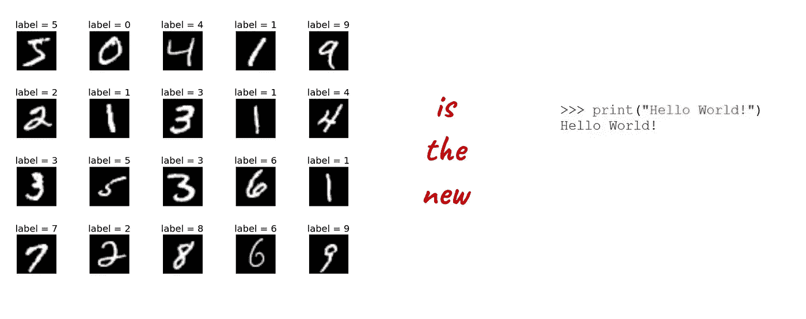

我被我的简单分类器的准确性震惊了。如果我没记错的话，在 [MNIST 手写数字数据集](https://en.wikipedia.org/wiki/MNIST_database)上，它在测试集上超过 98%。(作为旁注，这显示了当一个高度准确的图像分类器可以在几个小时内建立起来时，我们已经走了多远。ML 社区——是的，包括你——因为这种自由的知识和工具共享而令人敬畏

尽管分类器的准确度很高**，但有一个问题一直困扰着我:**

> 神经网络会吐出一个类别，即使我给它完全不相关的图像。

你知道该怎么做。训练一个猫和狗的分类器，扔出一个人的图像，网络会将它分类为猫或狗。(也许——如果网络有些幽默感的话——开心的人当狗，不开心的人当猫)。

Build your model to throw up its (metaphorical) hands when it’s not sure (Photo via [Pixabay](https://pixabay.com/en/upset-sad-confused-figurine-534103/))

我知道我对分类器的期望是不现实的。它完全按照程序运行。如果我将最终层(softmax)输出解释为概率，那么对于作为输入给出的任何图像，总会有一个具有最大值的类别。该网络根本不知道这样一个概念，即抛出双手说:“这看起来像是我没有接受过的训练。”

但这正是我想要我的神经网络做的。

在几乎所有现实世界的问题中，你想要的不仅仅是一个结果，你还需要对这个结果有信心/确定性的知识。如果你正在制造无人驾驶汽车，你不仅要检测行人，还要表达你对物体是行人而不是交通锥的信心。同样，如果您正在编写一个在股票市场上交易的机器人，您希望它能够识别情况何时超出其舒适区，这样它就可以停止行动，而不会破产。当一个人不确定的时候，很大一部分智慧是不行动的。因此，令人惊讶的是，对于许多 ML 项目来说，表达不确定性并不是它的目标。

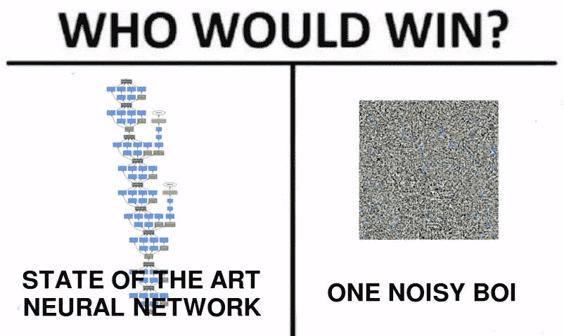

Probably one noisy boi (via [Tricking Neural Networks: Create your own Adversarial Examples](https://ml.berkeley.edu/blog/2018/01/10/adversarial-examples/))

我想通过构建一个 MNIST 分类器来探索这一方向，该分类器可以表达输入图像是特定数字的(不)确定性。当你向它展示数字时，这种分类器会有很高的准确性，但当你向它扔不相关的图像时，它会拒绝分类。**我的最终分类器对 MNIST 的准确率约为 97%，它拒绝对白噪声和大多数无关(非 MNIST)图像进行分类**。你可以[在这里访问代码](https://github.com/paraschopra/bayesian-neural-network-mnist)，并且可能想跟随 repo 中包含的 Jupyter 笔记本以及本教程。

# 贝叶斯神经网络如何工作

我不会在这里介绍贝叶斯分析的全部内容，但是我会提供足够的上下文让你理解，然后修改[代码](https://github.com/paraschopra/bayesian-neural-network-mnist)。

关键思想非常简单:在贝叶斯世界观中，**每件事都有一个概率分布**，包括模型参数(NNs 中的权重和偏差)。在编程语言中，我们有可以取特定值的变量，每次你访问这个变量，你都会得到相同的值。与此相反，在贝叶斯世界中，我们有类似的被称为**随机变量**的实体，它们在你每次访问它时都会给出不同的值。所以如果 X 是一个代表正态分布的随机变量，每次你访问 X，它都会有不同的值。

这个从随机变量中获取新值的过程被称为**采样**。得出什么值取决于随机变量的相关概率分布。与随机变量相关的概率分布越宽，其值的不确定性就越大，因为它可以按照(宽)概率分布取任何值。

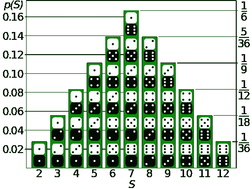

If your random variable is the sum of digits of two dice throws, at each throw you’ll get a value whose probability depends on the distribution above. This means the most likely sum that you can get is 7, and least likely is 2 and 12\. (From [Wikipedia](https://en.wikipedia.org/wiki/Probability_distribution))

在传统的神经网络中，你有固定的权重和偏差，它们决定了如何将输入转化为输出。在贝叶斯神经网络中，所有的权重和偏差都有一个概率分布。**为了对图像进行分类，你要对网络进行多次运行(正向传递),每次都使用一组新的采样权重和偏差**。您得到的不是一组输出值，而是多组输出值，每次运行一组。这组输出值代表输出值的概率分布，因此您可以找出每个输出的*的置信度和不确定度。正如您将看到的，如果输入图像是网络从未见过的，对于所有输出类，不确定性将会很高，您应该将网络解释为:“我真的不知道这个图像是关于什么的”。*

# 用 Pyro 和 PyTorch 编写您的第一个贝叶斯神经网络

该代码假设熟悉概率编程和 PyTorch 的基本思想。如果你对这些都不熟悉，我推荐以下资源:

*   [黑客的贝叶斯方法](http://camdavidsonpilon.github.io/Probabilistic-Programming-and-Bayesian-Methods-for-Hackers/)学习贝叶斯建模和概率编程的基础知识
*   【PyTorch 深度学习:60 分钟闪电战。特别是关于训练分类器的教程。

PyTorch 有一个名为 [Pyro](http://pyro.ai/) 的配套库，它提供了在 PyTorch 编写的神经网络上进行概率编程的功能。这种将神经网络“自动”转换成贝叶斯对等体的过程有两个步骤:

*   首先，它有助于将概率分布分配给网络中的所有权重和偏差，从而将它们转换为随机变量
*   其次，它有助于使用训练数据来推断概率分布，这样你就可以用它来对图像进行分类

推理是整个过程中最困难的一步。它基于著名的[贝叶斯定理](https://en.wikipedia.org/wiki/Bayes%27_theorem)，你可能以前见过。

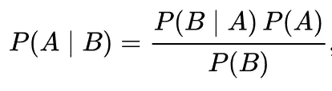

The deceptively simple equation that rules the world

深入这个等式的本质已经超出了本教程的范围，但是我会试着给你发生了什么的直觉。假设 *A* 是权重和偏差的初始概率分布(称为**先验，**通常是一些标准分布，如正态或均匀随机)，而 *B* 是训练数据(图像/标签的输入/输出对)。

你应该记住的贝叶斯定理的关键思想是，我们希望使用数据找出权重和偏差的更新分布 *P(A | B)* ( **后验**)。就像使用初始随机分配的权重和网络偏差一样，参数的初始分布(先验)会给我们错误的结果。只有在使用数据获得参数的更新分布后，我们才能使用网络对图像进行分类。

权重和偏差的概率分布通过贝叶斯定理更新，考虑到它们的初始值 *P(A)* 和那些初始分布的**似然**来描述输入数据 *P (B|A)* (它被理解为给定 A 的 B 的概率)。权重的更新分布 *P(A | B)* ( **后验**)取决于哪一个具有更强的吸引力——先验或可能性。(如果你对 P(B)项感到好奇，在本教程的后面部分你会明白的)。

我知道上面那段话可能会让严格的贝叶斯人吓哭。我知道这些定义并不精确。但是本教程并不是要介绍贝叶斯方法看待数据的全部荣耀。有完整的[书籍](http://www.stat.columbia.edu/~gelman/book/)和[课程](https://www.coursera.org/learn/bayesian)在上面，我无法在一个教程中对其进行公正的评价。本教程是关于贝叶斯神经网络的实际实现。我绞尽脑汁钻研 [Pyro 教程](http://pyro.ai/examples/)好几天，试图将他们的一个例子转换成分类器。我终于在 IBM Watson 的网站上找到了一个关于在 MNIST 上使用 Pyro 的简短教程。[我的代码](https://github.com/paraschopra/bayesian-neural-network-mnist)基于该教程，但我将其扩展到非 MNIST 和白噪声数据，以观察贝叶斯神经网络在面对它们从未见过的输入时是否真的能说“我不知道”。

尽管我将尝试解释 Pyro 的基础知识，但如果你通读他们的前三个教程，你会从本教程中获得很多价值——第一部分，[第二部分](http://pyro.ai/examples/intro_part_ii.html)和[第三部分](http://pyro.ai/examples/svi_part_i.html)。

# 准备好了吗？让我们直接进入代码

在导入 PyTorch、Pyro 和其他标准库(如 matplotlib 和 numpy)后，我们定义了一个 1024 个隐层的标准前馈神经网络。我们也加载 MNIST 数据。

在 Pyro 中， *model()* 函数定义了如何生成输出数据。在我们的分类器中，当我们用展平的 28*28 像素图像运行神经网络(在上面的*网络*变量中初始化)时，生成对应于每个数字的 10 个输出值。在*模型()*中，函数 *pyro.random_module()* 将我们的神经网络的参数(权重和偏差)转换为随机变量，这些随机变量具有由 *fc1w_prior* 、 *fc1b_prior* 、 *outw_prior* 和 *outb_prior* 给出的初始(先验)概率分布(在我们的例子中，正如您所看到的，我们用一个[正态分布来初始化这些)最后，通过 pyro.sample()，我们告诉 pyro 这个网络的输出本质上是分类的(即它可以是 0、1、2 等等。)](https://en.wikipedia.org/wiki/Normal_distribution)

理解这个部分——由 *guide()* 函数表示——对我来说是最棘手的事情。很长一段时间，我不明白为什么需要它，特别是因为它看起来非常像*模型()*函数。解释起来会很难，但我会尽力。(如果你不能理解我的解释，我推荐 [Pyro 教程](http://pyro.ai/examples/)或者下面我提供的关于这个主题的链接)。

再看一下贝叶斯方程:

在 *model()* 函数中，我们定义了 *P(A)* —权重和偏差的先验。方程的 *P(B|A)* 部分由神经网络表示，因为给定参数(权重和偏差)，我们可以对图像、标签对进行多次运行，并找出训练数据的相应概率分布。在训练之前，最初由于权重和先验都是相同的(都是正态分布)，对于给定的图像，获得正确标签的高概率的可能性将是低的。

事实上，**推理**是学习权重和偏差的概率分布的过程，其最大化了获得正确图像、标签对的高概率的**可能性**。

这个推理过程用 *P(A |B)* 表示，它是给定输入/输出对( *B* )时参数 *A* 的**后验**概率。我之前写过推论很难。那是因为你在分母中看到的术语 *P(B)* 。这个术语被称为**证据**，它只是在所有可能的参数值下观察到数据(输入/输出对)的概率，用它们各自的概率加权。

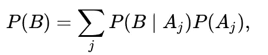

计算这个总数很难，原因有三:

*   假设，参数 *Aj* 的值可以从-无穷大到+无穷大
*   对于在该范围内的 *Aj* 的每个值*，您必须运行模型，以找到生成您观察到的输入、输出对的可能性(总数据集可能有数百万对)*
*   这种参数可以不是一个而是多个(j >> 1)。事实上，对于我们这种规模的神经网络，我们有大约 800 万个参数(权重数= 1024*28*28*10)。

我上面描述的后验概率的枚举方法类型除了非常琐碎的模型之外，对任何东西都不实用。如果我们可以进行随机抽样，而不是这种网格状的枚举，会怎么样呢？事实上，基于抽样的方法被广泛使用，它们被命名为[蒙特卡罗方法](https://en.wikipedia.org/wiki/Monte_Carlo_method)。特别地， [Metropolis-Hastings](https://en.wikipedia.org/wiki/Metropolis%E2%80%93Hastings_algorithm) 是蒙特卡罗抽样的流行算法。(它包含在 Pyro 和大多数其他概率编程语言中)。

不幸的是，对于复杂的贝叶斯模型，如具有 800 万个参数的神经网络，蒙特卡罗方法仍然收敛缓慢，可能需要数周才能发现完整的后验概率。

令人欣慰的是，有一种越来越受欢迎的方法叫做[变分贝叶斯](https://en.wikipedia.org/wiki/Variational_Bayesian_methods)，这种方法似乎非常适合寻找神经网络参数的后验概率，甚至对于大型数据集也是如此。为了理解这种技术背后的直觉，我强烈推荐观看下面的视频(直到前 40 分钟)。

变分贝叶斯方法的要点是，由于我们不能精确地计算后验概率，我们可以找到与它最接近的“表现良好”的概率分布。我所说的“表现良好”是指一种分布(如正态分布或指数分布)，它可以用一小组参数(如均值或方差)来表示。因此，在随机初始化“表现良好”的分布中的参数后，您可以进行梯度下降并每次稍微修改分布的参数(如均值或方差),以查看最终的分布是否更接近您想要计算的后验概率。(如果你在想我们如何知道结果分布是否更接近后验分布，如果后验分布正是我们想要计算的，那么你已经理解了这个想法。答案是，令人惊讶的是，我们不需要确切的后验概率来找出它和其他“良好”分布之间的接近程度。观看上面的视频，了解我们实际优化的贴近度:[证据下限](http://legacydirs.umiacs.umd.edu/~xyang35/files/understanding-variational-lower.pdf)或 ELBO。我也发现这个[系列](https://chrisorm.github.io/VI-Why.html) [的](https://chrisorm.github.io/VI-ELBO.html) [帖子](https://chrisorm.github.io/VI-MC.html)对题目有用)。

要直观地理解变分贝叶斯，请参见下图:

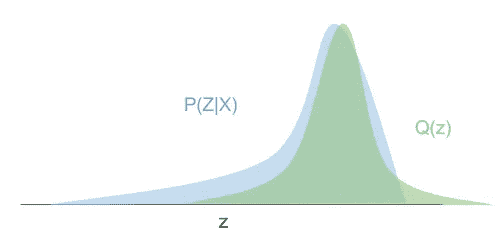

Via [A Beginner’s Guide to Variational Methods: Mean-Field Approximation](https://blog.evjang.com/2016/08/variational-bayes.html)

蓝色曲线是真正的后验概率，如果你进行我们之前讨论过的长时间(枚举)计算，你会得到它。这条曲线可以采取任意形状，因为它是枚举计算的结果。与此相反，因为它是一个像正态分布一样的良好分布，所以绿色曲线的整个形状可以用一个参数 Z 来描述。变分贝叶斯方法所做的是使用梯度下降方法将 Z 参数的值从初始随机初始化值更改为其结果分布最接近真实后验值的值。在优化结束时，绿色曲线不完全像蓝色曲线，但非常相似。我们可以安全地使用近似的绿色曲线代替未知的真正的蓝色曲线来进行预测。(如果这一切难以理解，我推荐看上面的视频。)

这就是向导功能的用武之地。它帮助我们初始化一个行为良好的分布，稍后我们可以优化它来逼近真实的后验概率。再看一看:

此 *guide()* 函数描述了 Z 参数(如权重和偏差的均值和方差)，可以对这些参数进行更改，以查看结果分布是否非常接近来自*模型()的后验分布。*现在，在我们的例子中，*模型()*看起来与*向导()*非常相似，但不一定总是如此。理论上， *model()* 函数可能比 *guide()* 函数复杂得多。

有了 *model()* 和 *guide()* 函数，我们就可以进行推理了。首先，让我们告诉 Pyro 使用哪个优化器来做变分推断。

您会注意到我们正在使用 PyTorch 的 Adam 优化器(要了解它和其他优化算法的更多信息，[这里有一个精彩的系列](http://ruder.io/optimizing-gradient-descent/))。我们用于优化的损失函数是 ELBO(这就像在通过反向传播训练非贝叶斯神经网络时使用均方误差或交叉熵损失)。

让我们写优化循环。

你会注意到这个循环差不多就是我们训练一个标准神经网络的方式。有多个时期/迭代(在本例中是 5)。在每一次迭代中，我们都要经历一个小批量的数据(图像、标签的输入/输出对)。变分推理的另一个好处是，我们不必一次输入整个数据集(可能有数百万)。由于优化器需要成千上万个步骤来寻找引导函数参数的最佳值，因此在每个步骤中，我们可以向其提供单独的小批量数据。这极大地加快了推理速度。

一旦损失似乎稳定/收敛到一个值，我们就可以停止优化，看看我们的贝叶斯神经网络有多精确。下面是这样做的代码。

在 *predict()* 函数中要注意的第一件事是，我们使用学习过的 *guide()* 函数(而不是 *model()* 函数)来做预测。这是因为对于*模型()*，我们只知道权重的先验，而不知道后验。但是对于优化迭代后的 *guide()* 来说，参数值给出的分布近似于真实的后验概率，因此我们可以用它来进行预测。

第二件要注意的事情是，对于每个预测，我们对一组新的权重和参数采样 10 次(由 *num_samples* 给出)。这实际上意味着，我们正在对一个新的神经网络进行 10 次采样，以进行一次预测。正如你将在后面看到的，这使我们能够给出输出的不确定性。在上面的例子中，为了进行预测，我们对给定输入的 10 个采样网络的最终层输出值进行平均，并将最大激活值作为预测数字。这样，我们看到**我们的网络在测试集**上 89%的时候是准确的。但是请注意，在这种情况下，我们强迫我们的网络在每种情况下做出预测。我们还没有使用贝叶斯定理的魔力来让我们的网络说:“我拒绝在这里做预测”。

这正是我们接下来要用下面的代码做的。

我就不赘述估计不确定性的完整代码了(你可以在笔记本里看到[)。本质上，我们正在做的是:](https://github.com/paraschopra/bayesian-neural-network-mnist)

*   对于输入图像，取 100 个神经网络样本，从最后一层得到 100 个不同的输出值
*   通过指数运算将这些输出(对数软式最大值)转换成概率
*   现在，给定输入图像，对于*的每个*数字，我们有 100 个概率值
*   我们将这 100 个概率值的中间值(第 50 个百分位数)作为每个数字的阈值概率
*   如果阈值概率大于 0.2，我们选择该数字作为网络的分类输出

换句话说，我们希望神经网络输出一个数字作为推荐，如果在多个概率样本中，该数字的中值概率至少为 0.2。这意味着对于一些输入，网络可以输出两位数作为分类输出，而对于其他输入，它可以不输出数字(如果我们给它非数字图像，这正是我们想要的)。

# MNIST 数据集上的结果

当我在包含 10，000 张图像的整个 MNIST 测试集上运行网络时，我得到了以下结果:

*   **网络拒绝分类的图像百分比:12.5%**(10000 张中的 1250 张)
*   **其余 8750 张“已接受”图像的准确率:96%**

请注意，当我们给网络一个拒绝分类的机会时，这种 96%的准确性远远高于强制分类时的 88%的准确性。

想象引擎盖下发生了什么。我从 MNIST 测试批次中随机绘制了 100 幅图像。对于这 100 张图片中的大部分，网络分类准确。

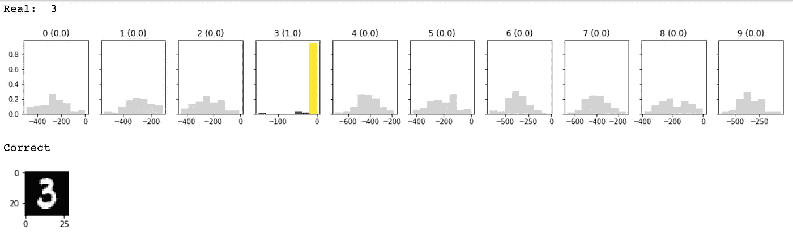

上面的图显示的是输入图像的真实标签是 3，对于 10 个数字中的每一个，显示了对数概率的直方图。对于标签 3，中值对数概率实际上接近 0，这意味着该图像为 3 的概率接近 1 (exp(0) = 1)。这就是为什么它用黄色突出显示。由于网络选择的标签与真实标签相同，所以显示“正确”。您还可以看到输入图像的实际样子。

在我对 100 张图像的多次运行中，网络进行预测的准确率为 94–96%。**网络通常选择不预测 10-15%的图像**，看着网络说“我不太确定”的一些图像很有趣。

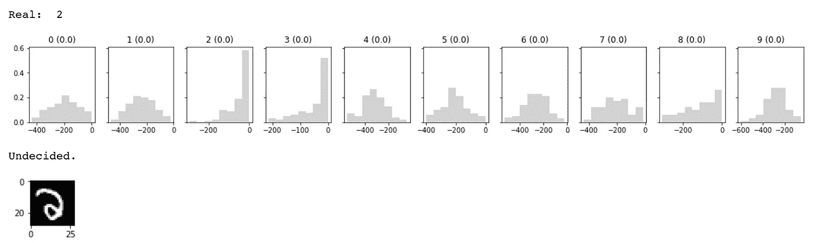

连我都很难看出这个数字是“2”。从直方图中可以看出，网络对于 2 个和 3 个标签都具有很高的不确定性。对于这种网络未确定的情况，所有*标签的对数概率分布都很宽，而在上图中“3”的准确分类情况下，您会注意到数字 3 的分布很窄，而所有其他数字的分布都很宽(这意味着网络非常确定它是 3)。*

又一个网络未定的案例。

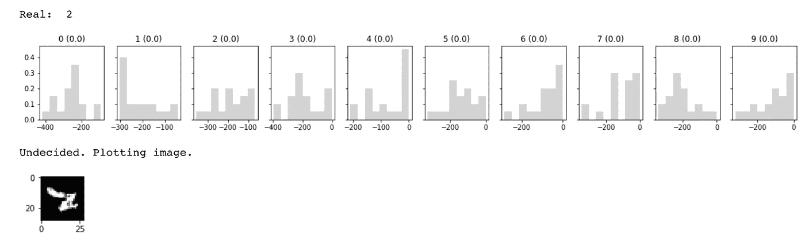

你看图像都被搞乱了。传统的神经网络可能会吐出一些东西，但我们的贝叶斯网络拒绝说出任何东西。

# 随机生成图像的结果

为了观察网络在输入纯白噪声时的表现，我随机生成了 100 张图像。

当这些图像被作为输入时，**网络拒绝对其中的 95%做出预测**。

这是一个典型的随机生成的图像的样子:

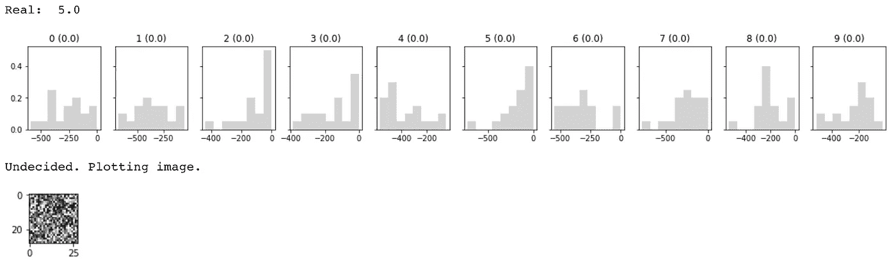

# 非 MNIST 数据集上的结果

我更进一步，下载了[非 MNIST](http://yaroslavvb.blogspot.com/2011/09/notmnist-dataset.html) 数据集，这是一个字母而不是数字的数据集。看起来是这样的:

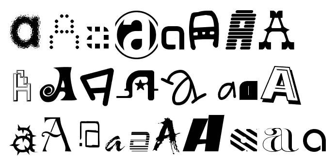

对于非 MNIST 测试集，**网络拒绝分类约 80%的图像**(测试集中总共 459 个中的 363 个)。

下面是一个非 MNIST 图像的例子。

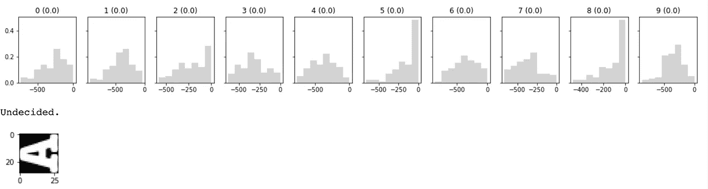

很高兴看到我们的网络在训练内容(MNSIT)上给出了很好的准确性，同时没有被定制设计来愚弄它的数据集所愚弄(不是 MNIST)。

# 结论和如何使我们的贝叶斯网络更好

在 MNIST 数据集上的[最新结果具有 99.8%的准确率。所以我们 96%的准确率(当我们想要做一个预测的时候)与此相差甚远。](https://en.wikipedia.org/wiki/MNIST_database)

有四种方法可以获得更高的精度:

*   我们使用了一个非常简单的模型:具有 1024 个神经元的单层神经网络。如果我们使用更先进的卷积网络，我相信我们可以提高我们的准确性。
*   如果我们继续运行我们的优化更长的时间，我们可以提高我们的准确性
*   如果我们对每幅图像采样更多的数据点(而不是 100 个)，结果可能会有所改善
*   如果我们使我们的接受标准从中值概率最小为 0.2 到可能第 10 百分位概率最小为 0.5，我们的网络将拒绝更多的图像，但是在接受的图像上，它可能具有更高的准确性

总的来说，我对结果很满意。我希望你玩[代码](https://github.com/paraschopra/bayesian-neural-network-mnist):)玩得开心

请随意评论这篇文章，我会尽力回答你的问题。如果你能够改进代码，请在 github 上向我发送一个 pull 请求。如果你在新的数据集或问题上使用 basic 代码，请发邮件给我，地址是 paras1987 <at>gmail <dot>com，我很乐意收到你的来信。</dot></at>

*感谢 Nirant Kasliwal、Divyanshu Kalra 和 S. Adithya 审阅草稿并提出有益的建议。*

PS:我最近制作了一个 20 分钟的视频，讲述是什么让深度学习如此有效。现在就去[看](https://www.youtube.com/watch?v=Y-WgVcWQYs4)！

## 喜欢这个教程吗？也可以看看我的其他教程:

*   [一个神经网络，多种用途。](/one-neural-network-many-uses-image-captioning-image-search-similar-image-and-words-in-one-model-1e22080ce73d)使用单一模型构建图像搜索、图像字幕、相似文字和相似图像
*   [让深度神经网络作画，了解它们是如何工作的。](/making-deep-neural-networks-paint-to-understand-how-they-work-4be0901582ee?source=your_stories_page---------------------------)用 100 行 PyTorch 代码生成抽象艺术，并探索神经网络如何工作
*   [通过机器学习为机器学习项目产生新的想法](/generating-new-ideas-for-machine-learning-projects-through-machine-learning-ce3fee50ec2)。使用预先训练的语言模型从 2.5k 句子的小型语料库中生成风格特定的文本。PyTorch 代码
*   [无梯度强化学习:使用遗传算法进化智能体](/reinforcement-learning-without-gradients-evolving-agents-using-genetic-algorithms-8685817d84f)。在 PyTorch 中实现深度神经进化为 CartPole 进化一个 agent 代码+教程]

**我发关于深度学习和 AI 的推特**。在[https://twitter.com/paraschopra](https://twitter.com/paraschopra)跟着我

 [## Paras Chopra (@paraschopra) |推特

### Paras Chopra 的最新推文(@paraschopra)。如果你想知道宇宙为什么存在，请跟我来…

twitter.com](https://twitter.com/paraschopra)