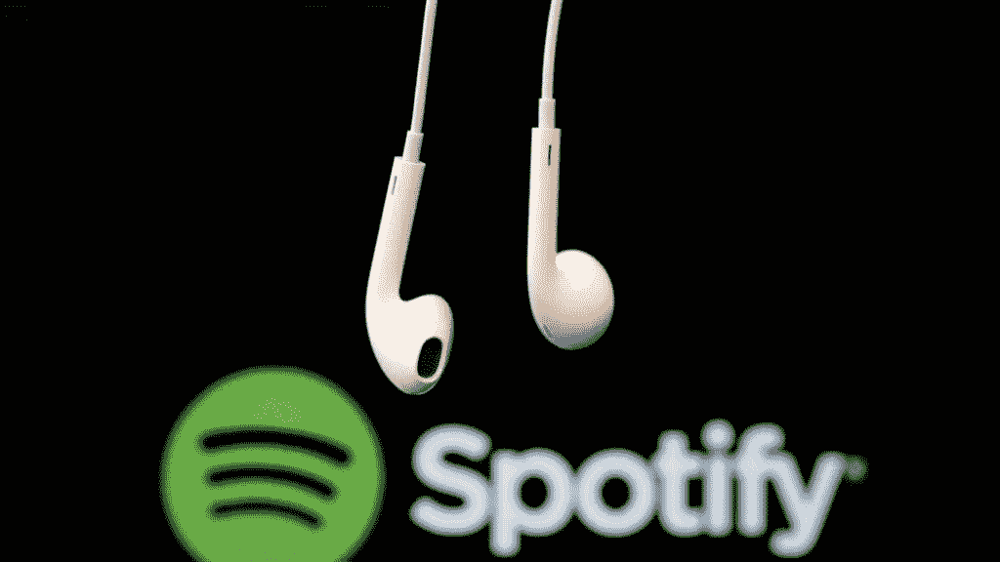
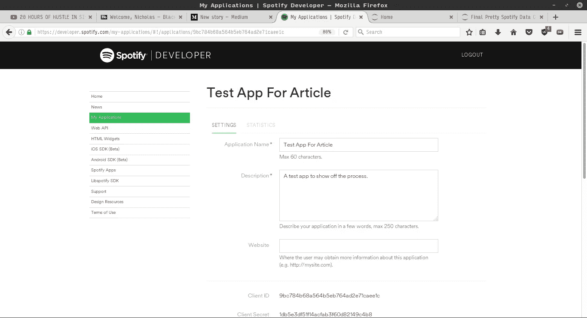
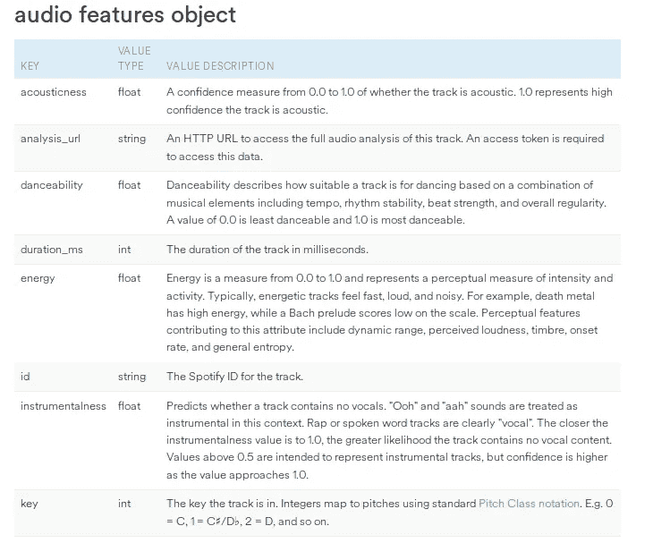
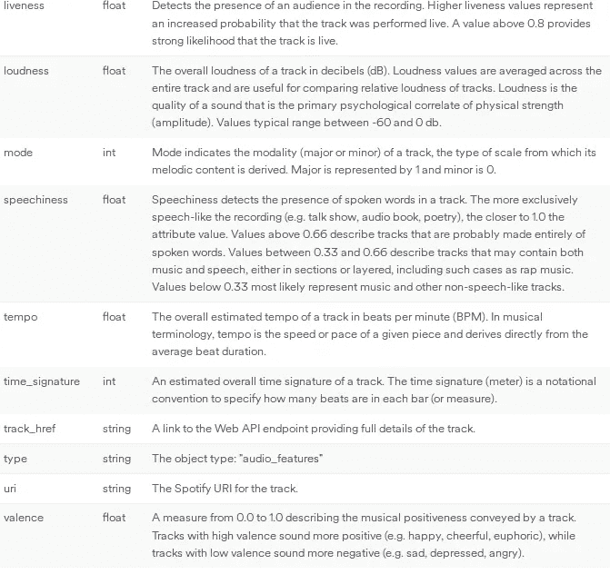
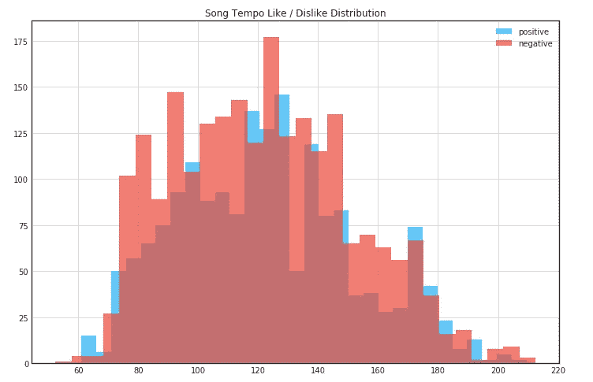
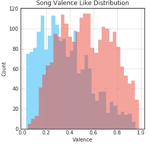
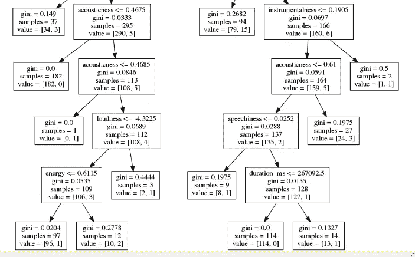

# 制作自己的 Spotify Discover 每周播放列表

> 原文：<https://towardsdatascience.com/making-your-own-discover-weekly-f1ac7546fedb?source=collection_archive---------1----------------------->



每周一醒来我都很兴奋。在你认为我是那些喜欢每天去上课的怪人之一之前，让我向你保证，我不是。然而，每周一，Spotify 都会发布一个名为 Discover Weekly 的播放列表。里面装满了我以前没听过的新歌。接下来几周，我几乎总能在上面找到我的新果酱。但是，他们是怎么做到的呢？

索菲亚·乔卡的这篇文章应该会让你对此有更好的理解，

[](https://hackernoon.com/spotifys-discover-weekly-how-machine-learning-finds-your-new-music-19a41ab76efe) [## Spotify 的 Discover Weekly:机器学习如何找到你的新音乐

### 个性化音乐推荐背后的科学

hackernoon.com](https://hackernoon.com/spotifys-discover-weekly-how-machine-learning-finds-your-new-music-19a41ab76efe) 

但是我想试着弄清楚我是否可以建立我自己的系统来做类似的事情！跟我一起去兜风吧！

如果你想继续，这是我的 Python 笔记本！

[](https://github.com/nab0310/SpotifyML/blob/master/spotify/Final%20Pretty%20Spotify%20Data%20Classifier.ipynb) [## nab0310/SpotifyML

### 在 GitHub 上创建一个帐户，为 SpotifyML 的发展做出贡献。

github.com](https://github.com/nab0310/SpotifyML/blob/master/spotify/Final%20Pretty%20Spotify%20Data%20Classifier.ipynb) 

# 创建您的第一个 Spotify 应用程序并设置您的环境

使用 Spotify API 的第一步是在 Spotify 开发者环境中创建一个应用程序。为此，首先进入 Spotify 开发者页面，登录并导航至“我的应用程序”页面。

 [## 我的应用程序| Spotify 开发者

### 创建和管理 Spotify 应用程序以使用 Spotify Web API。获取凭证以通过 Spotify 进行认证，并…

developer.spotify.com](https://developer.spotify.com/my-applications/#!/applications) 

一旦创建了一个新的应用程序，并给它一个漂亮的名字。单击创建屏幕，记下客户端 ID 和客户端密码，我们稍后会用到它们。



The screen after you create an application, take note of the Client ID and Client Secret.

在应用程序创建屏幕上，我们还需要设置重定向 URIs 字段。这是您的应用程序登录 Spotify 成功或失败后的位置。为了方便使用，我只是将它设置为 localhost:8888，这对于我的大多数应用程序来说都很好，但是如果你在一个完整的网站中实现这一点，请确保你有一个为 Spotify 回调定义的路径。

Spotify app 创建完成后，我们就可以开始钻研音乐的奇妙世界了！为了这个项目，我将 Python 与 [Jupyter Notebook](http://jupyter.org/) 结合使用，让我可以轻松地跨计算机开发，并给我一个漂亮的 UI 来查看我的图形。

> 注意:本文的其余部分我将使用 spotipy，Spotify API 的 python 包装器，以下是它们的文档供您阅读:

[](https://spotipy.readthedocs.io/en/latest/) [## 欢迎来到 Spotipy！- spotipy 2.0 文档

### 编辑描述

spotipy.readthedocs.io](https://spotipy.readthedocs.io/en/latest/) 

# 从 Spotify API 开始

在我们进行任何分析之前，我们需要学习如何登录，我是这样做的:

```
import spotipy
from spotipy.oauth2 import SpotifyClientCredentials
import spotipy.util as utilcid ="<Client ID from Earlier>" 
secret = "<Client Secret from Earlier>"
username = ""client_credentials_manager = SpotifyClientCredentials(client_id=cid, client_secret=secret) 
sp = spotipy.Spotify(client_credentials_manager=client_credentials_manager)scope = 'user-library-read playlist-read-private'
token = util.prompt_for_user_token(username, scope)if token:
    sp = spotipy.Spotify(auth=token)
else:
    print("Can't get token for", username)
```

这样做的第一件事是初始化一个 client_credentials_manager，它告诉 Spotify 要连接到哪个 Spotify 应用程序。一旦我们知道我们想要连接到哪个应用程序，我们就定义了一个范围。这个范围告诉 Spotify 我们的应用程序需要做什么，查看下面的链接了解更多信息。

[](https://developer.spotify.com/web-api/using-scopes/) [## Web API:使用范围

### 当您的应用程序寻求访问用户相关数据的授权时，您通常需要指定一个或多个…

developer.spotify.com](https://developer.spotify.com/web-api/using-scopes/) 

定义好范围后，我们就可以登录了。如果这行得通，这个脚本应该会把你重定向到一个奇特的 Spotify 登录页面。登录后，它会将您重定向到我们之前定义的重定向 URL。此外，笔记本会要求您将重定向到的 url 粘贴到提示中以继续。一旦你这样做，它接受请求，你就登录到 Spotify！

随着基本的 Spotify 东西的方式，我们可以转向该项目的数据分析部分。

# 数据采集

这是整个过程中最乏味的部分。我需要收集两个播放列表，一个装满我不喜欢的歌曲，另一个装满我喜欢的歌曲。

找到我喜欢的歌曲相对容易，我只是添加了我保存的所有歌曲和我喜欢的一些播放列表中的所有歌曲。但这只是成功的一半。

> 你有没有试过找出不好的音乐？？相信我:这很痛苦。

我首先拜访了一些音乐品味我不喜欢的朋友，并添加了一些他们最喜欢的歌曲。最终，我没有朋友了。但是，后来我想起来 Spotify 有流派分类播放列表！万岁。我加入了自己不喜欢的流派，还加了一堆歌。这最终让我开始思考我想要多少首歌。

*免责声明:我知道这不是收集数据的最佳方式，但我真的不想花时间去获得我不喜欢的歌曲的代表性样本，我只想获得足够好的东西。*

所有这些歌曲的收集都涉及到将歌曲从一个播放列表转移到另一个播放列表。下面是将歌曲从一个播放列表转移到另一个播放列表的代码片段:

```
sourcePlaylist = sp.user_playlist("<source user>", "<Source Playlist ID>")
tracks = sourcePlaylist["tracks"]
songs = tracks["items"] 
while tracks['next']:
    tracks = sp.next(tracks)
    for item in tracks["items"]:
        songs.append(item)
ids = [] 
print(len(songs))
print(songs[0]['track']['id'])
i = 0
for i in range(len(songs)):
    sp.user_playlist_add_tracks("<target user>", "<Target Playlist ID>", [songs[i]["track"]["id"]])
```

为了移动歌曲，您需要用户和播放列表 id。你可以从播放列表的链接中获得，这里有一个例子:【https://open.spotify.com/user/】T4<用户>/playlist/<playlistID>

*边注:在本文的最后，我会在你的好的和不好的播放列表中推荐大约 1500–2000 首歌曲。*

# 数据分析

## 获取音频功能

> 现在我们有了好歌和烂歌的播放列表，我们该如何分析它们呢？
> 
> 幸运的是，Spotify 为我们提供了一种方法——音频功能对象。

这是文档中的对象:

[](https://developer.spotify.com/web-api/get-audio-features/) [## 获取音轨的音频特征

### 获取由唯一的 Spotify ID 标识的单曲的音频特征信息。去找 https://api.spotify.com/v1…

developer.spotify.com](https://developer.spotify.com/web-api/get-audio-features/) 

这个对象是我们分析的基石。我们实际上无法访问原始音频波形或其他统计数据(即播放次数，我们听一首歌多长时间，等等。)让我们的分析更好。虽然这并不完美，但它有助于我们对歌曲中我们喜欢的特征得出一些基本的结论。

要获取一首歌的音频特征，我们需要使用 sp.audio_features( <songid>)调用。这需要我们传入一个歌曲 ID 来获取该音轨的特性。</songid>

> 问:但到目前为止，我们只有两首好歌和坏歌的播放列表，我们如何获得所有这些歌曲的歌曲 ID？
> 
> 我明白了。

```
good_playlist = sp.user_playlist("1287242681", "5OdH7PmotfAO7qDGxKdw3J")good_tracks = good_playlist["tracks"]
good_songs = good_tracks["items"] 
while good_tracks['next']:
    good_tracks = sp.next(good_tracks)
    for item in good_tracks["items"]:
        good_songs.append(item)
good_ids = [] 
for i in range(len(good_songs)- 500):
    good_ids.append(good_songs[i]['track']['id'])
```

首先，我们通过用户 ID(“1287242681”)和播放列表 ID(“5 odh 7 pmotfao 7 qdgxkdw 3j”)来抓取播放列表。一旦我们有了播放列表，我们需要遍历它来挑选出播放列表中的每首歌曲，然后从那首歌曲中挑选出 id。在这个块结束之后，我们将在 good_ids 数组中有好的歌曲 id。

现在，我们打电话从 Spotify 获取音频功能:

```
features = []
for i in range(0,len(good_ids),50):
    audio_features = sp.audio_features(good_ids[i:i+50])
    for track in audio_features:
        features.append(track)
        features[-1]['target'] = 1
```

音频功能调用的唯一奇怪之处是我们一次只能获得 50 首歌曲的功能。所以，我们可以把 id 分成 50 份，一次传递 50 份。在这里，我们将所有的音频特性和一个“目标”字段一起添加到一个数组中，以指定我们是否喜欢这首歌。

剩下的就是对坏的播放列表重复相同的步骤，我们可以开始做一些实际的分析了！

## 图上的图

为了开始查看我们的图形优势，我们需要做的就是将数据插入到熊猫数据框架中。

```
trainingData = pd.DataFrame(features)
```

我使用 matplotlib 进行绘图。以下是我的听力数据中一些有趣的对比。

*注:蓝色代表我喜欢的歌，红色代表我不喜欢的歌。*



Tempo comparison between songs I like and don’t



Valence comparison between songs I like and don’t

第一张图显示了歌曲的节奏。从图表中，我们可以看到我们不能真正用节奏来可靠地预测我是否会喜欢一首歌。下一张图叫做化合价。效价是衡量一首歌听起来有多快乐的标准。这张图表显示我更喜欢悲伤的歌曲，而不是快乐的歌曲。所有其他音频特性的其余图表可以在[笔记本](https://github.com/nab0310/SpotifyML/blob/master/spotify/Final%20Pretty%20Spotify%20Data%20Classifier.ipynb)中找到。

现在我们有了一些图表，让我们训练一个分类器，看看它在预测我喜欢的歌曲方面有多好！

## 使用不同的分类器并观察它们如何执行

在我们开始之前，只需要一点点定义。

> 分类器:试图根据不同的输入值将数据分类到几个不同的桶中。

这是不同分类器之间的一个很好的比较，以及它们如何围绕不同的数据形成。

[](http://scikit-learn.org/stable/auto_examples/classification/plot_classifier_comparison.html) [## 分类器比较-sci kit-了解 0.19.1 文档

### scikit-learn 中几种分类器在合成数据集上的比较。这个例子的目的是为了说明…

scikit-learn.org](http://scikit-learn.org/stable/auto_examples/classification/plot_classifier_comparison.html) 

如果你还想进一步了解不同类型的分类器，Google 是你的好朋友！

为了使任何分类器工作，我们需要将我们的数据分成训练和测试集，这样我们就有一些数据来训练我们的模型，还有一些数据来测试前面提到的模型。这可以通过一个名为 train_test_split()的 sklearn 函数来实现，该函数根据方法中指定的 test_size 百分比来拆分数据。下面的代码将数据分成 85%训练，15%测试。

```
from sklearn.model_selection import train_test_split
train, test = train_test_split(trainingData, test_size = 0.15)
```

在我们分割数据之后，我们将把它放入训练/测试 x 和 y 变量中，以输入到我们的分类器中。

```
#Define the set of features that we want to look at
features = ["danceability", "loudness", "valence", "energy", "instrumentalness", "acousticness", "key", "speechiness", "duration_ms"]#Split the data into x and y test and train sets to feed them into a bunch of classifiers!
x_train = train[features]
y_train = train["target"]x_test = test[features]
y_test = test["target"]
```

## 决策树分类器

决策树分类器是我要看的第一个分类器，因为它最容易可视化。下面的代码片段显示了如何使模型符合训练数据，根据测试数据预测值，然后显示模型的准确性。

```
c = DecisionTreeClassifier(min_samples_split=100)
dt = c.fit(x_train, y_train)
y_pred = c.predict(x_test)
score = accuracy_score(y_test, y_pred) * 100
print("Accuracy using Decision Tree: ", round(score, 1), "%")
```

这个分类器配置最重要的部分是 min_samples_split 值。这是基于特征的树分割的值。这是决策树的一小部分。



A snippet of the Decision Tree to show the decisions and number of samples in each bucket

决策树给我的准确率只有 80%，这很好，但我们可以做得更好。

## 近邻分类器

```
from sklearn.neighbors import KNeighborsClassifier
knn = KNeighborsClassifier(3)
knn.fit(x_train, y_train)
knn_pred = c.predict(x_test)
score = accuracy_score(y_test, knn_pred) * 100
print("Accuracy using Knn Tree: ", round(score, 1), "%")
```

K-最近邻分类器查看数据点的邻居，以确定输出是什么。因此，在我们的例子中，它接收一首新歌曲的音频特性，绘制它并查看它周围的歌曲，以确定我是否会喜欢它。这种方法只给了我们 80%的准确率，和决策树一样。我对这种类型的分类器不抱太大希望，因为我训练的数据没有很好地按照不同的特征分开。

## AdaBoostClassifier 和 GradientBoostingClassifier

```
from sklearn.ensemble import AdaBoostClassifier
ada = AdaBoostClassifier(n_estimators=100)
ada.fit(x_train, y_train)
ada_pred = ada.predict(x_test)
from sklearn.metrics import accuracy_score
score = accuracy_score(y_test, ada_pred) * 100
print("Accuracy using ada: ", round(score, 1), "%")from sklearn.ensemble import GradientBoostingClassifier
gbc = GradientBoostingClassifier(n_estimators=100, learning_rate=.1, max_depth=1, random_state=0)
gbc.fit(x_train, y_train)
predicted = gbc.predict(x_test)
score = accuracy_score(y_test, predicted)*100
print("Accuracy using Gbc: ", round(score, 1), "%")
```

这两种分类器的操作方式相似。它们都是从创建一个相对较弱的“学习者”(用来做预测的东西)开始，然后用分类的结果来修改“学习者”，让它更好地预测未来的事情。

AdaBoost 的工作原理是拟合学习者，然后在数据的每次迭代之间，它修改预测的方式，以便尝试以更高的精度对更困难的情况进行分类。当我运行这个分类器时，它有 84.3%的准确率。

梯度增强使用损失函数(预测值与真实值相差多远的度量)，并尝试在每次迭代中减少损失函数。当我运行这个分类器时，它有 85.5%的准确率。

*免责声明:每次运行分类器时，这些精度值都会发生变化，所以如果您没有得到与我相同的值，请不要担心。*

我们现在要做的就是选择对我们的训练数据具有最高准确度的分类器(对我来说是梯度提升),并测量它在现实世界中的表现如何！

# 结果

为了测试我的分类器，我在我的 Discover Weekly 上运行了 4 周。Discover Weekly 是 30 首歌，所以我总共测试了 120 首歌。为了做到这一点，重复我们加载好的和坏的播放列表的步骤，但之后，只需调用分类器的预测功能。

```
pred = gbc.predict(playlistToLookAtFeatures[features])i = 0
for prediction in pred:
    if(prediction == 1):
        print ("Song: " + playlistToLookAtFeatures["song_title"][i] + ", By: "+ playlistToLookAtFeatures["artist"][i])
    i = i +1
```

分类器挑选了 66 首它认为我会喜欢的歌曲。听了所有的歌，我挑出了 31 首我喜欢的歌。分类器和我个人喜欢分享了 23 首歌。因此，我的分类器识别出了 43 首它说我喜欢但不喜欢的歌曲。然而，它只错过了我喜欢的 8 首歌。尽管得到了一堆假阳性，我会称之为我的第一次钻研像这样的成功！

# 未来

最终我想开始使用谷歌的开源机器学习库 [Tensorflow](https://www.tensorflow.org/) ，并希望用他们提供给我的工具制作一个更好的模型。我最终还想将这个分类器整合到一个更大的系统中，每天为我挑选一个“每周发现”播放列表，这样我就可以不断地寻找新音乐。

*如果你喜欢这个，一定要看看我的* [*Github*](https://github.com/nab0310/) *或者至少是* [*Python 笔记本*](https://github.com/nab0310/SpotifyML/blob/master/spotify/Final%20Pretty%20Spotify%20Data%20Classifier.ipynb) *所有这些代码都是你可以随意摆弄的！此外，如果你认识在*[*Spotify*](https://medium.com/u/60a317bb70e4?source=post_page-----f1ac7546fedb--------------------------------)*工作的人，我很乐意与你联系！如果你有任何建议或者意识到我做错了什么，一定要在评论里告诉我！*