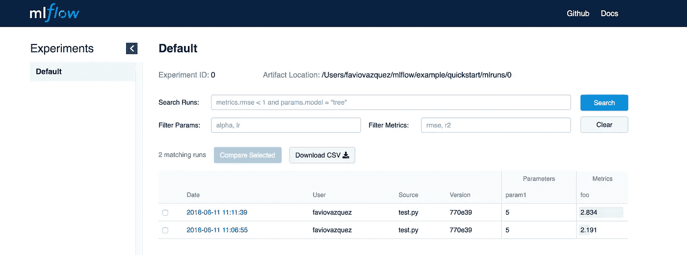
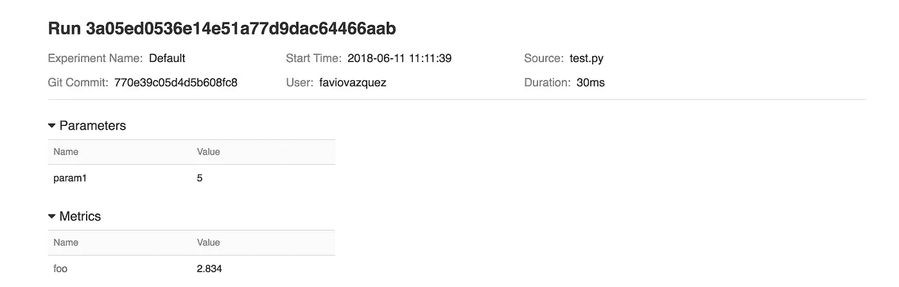
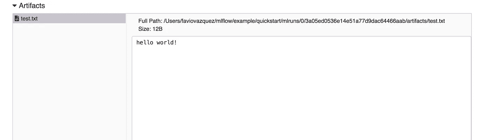
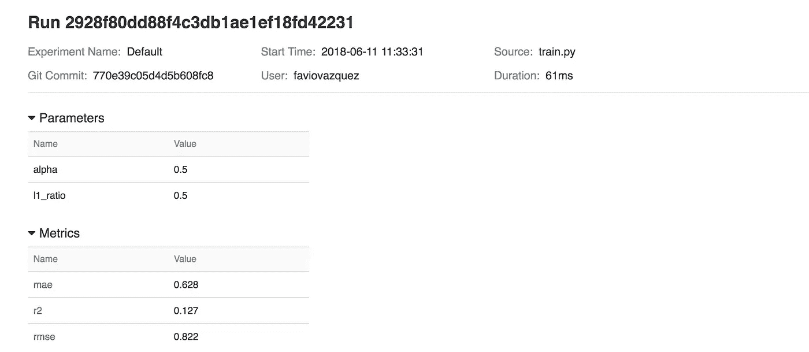
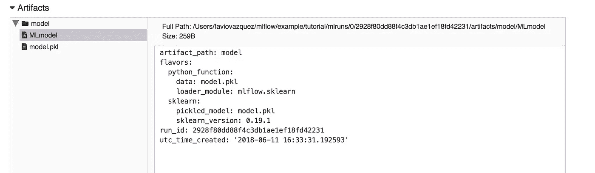

# 使用 MLflow 管理您的机器学习生命周期—第 1 部分。

> 原文：<https://towardsdatascience.com/manage-your-machine-learning-lifecycle-with-mlflow-part-1-a7252c859f72?source=collection_archive---------1----------------------->

## 重现性，良好的管理和跟踪实验是必要的，以方便测试他人的工作和分析。在第一部分中，我们将从简单的例子开始学习如何记录和查询实验，包装机器学习模型，以便它们可以在任何使用 MLflow 的平台上重现和运行。


# 机器学习生命周期难题


机器学习(ML)并不容易，但创建一个良好的工作流，让您可以重现、重新访问并部署到生产中，就更难了。在为 ML 创建一个好的平台或管理解决方案方面已经取得了很多进展。注意，t **his 不是数据科学(DS)生命周期**，后者更复杂，有很多部分。

ML 生命周期存在于 DS 生命周期中。

您可以在此处查看一些用于创建 ML 工作流的项目:

[](https://github.com/pachyderm/pachyderm) [## 厚皮动物/厚皮动物

### 厚皮动物-大规模可再生数据科学！

github.com](https://github.com/pachyderm/pachyderm) [](https://github.com/combust/mleap) [## 燃烧/泄漏

### mleap - MLeap:将 Spark 管道部署到生产中

github.com](https://github.com/combust/mleap) 

这些包很棒，但是不容易理解。也许解决方案是这三者的混合，或者类似的东西。但在这里，我将向您展示由 [Databricks](https://medium.com/u/5ae67e7eecef?source=post_page-----a7252c859f72--------------------------------) 创建的最新解决方案，名为 MLflow。

# MLflow 入门


MLflow 是一个完整的机器学习生命周期的开源平台。

MLflow 设计用于任何 ML 库、算法、部署工具或语言。将 MLflow 添加到您现有的*ML 代码中非常容易，因此您可以立即从中受益，并且可以使用您组织中的其他人可以运行的任何 ML 库来共享代码。MLflow 也是一个用户和库开发者可以扩展的[开源项目](https://github.com/databricks/mlflow)。*

## 安装 MLflow

安装 MLflow 非常简单，您只需运行:

```
pip install mlflow
```

这是根据创作者所说的。但是我在安装的时候遇到了几个问题。所以下面是我的建议(如果安装 ignore 后可以在终端中运行 mlflow 的话):

> 来自 Databricks: MLflow 不能安装在 Python 的 MacOS 系统安装上。我们推荐使用`brew install python`通过[自制](https://brew.sh/)包管理器安装 Python 3。(在这种情况下，安装 mlflow 现在是`pip3 install mlflow`)。

这对我不起作用，我得到了这个错误:

```
~ ❯ mlflow
Traceback (most recent call last):
  File "/usr/bin/mlflow", line 7, in <module>
    from mlflow.cli import cli
  File "/usr/lib/python3.6/site-packages/mlflow/__init__.py", line 8, in <module>
    import mlflow.projects as projects # noqa
  File "/usr/lib/python3.6/site-packages/mlflow/projects.py", line 18, in <module>
    from mlflow.entities.param import Param
  File "/usr/lib/python3.6/site-packages/mlflow/entities/param.py", line 2, in <module>
    from mlflow.protos.service_pb2 import Param as ProtoParam
  File "/usr/lib/python3.6/site-packages/mlflow/protos/service_pb2.py", line 127, in <module>
    options=None, file=DESCRIPTOR),
TypeError: __init__() got an unexpected keyword argument 'file'
```

解决这个问题的方法并不容易。我用的是 MacOS btw。为了解决这个问题，我需要更新 *protobuf* 库。为此，我安装了 Google 的 protobuf 库，其来源为:

[](https://github.com/google/protobuf/releases) [## 谷歌/protobuf

### protobuf -协议缓冲区-谷歌的数据交换格式

github.com](https://github.com/google/protobuf/releases) 

下载 3.5.1 版本。我之前有过 3.3.1。请遵循以下步骤:

 [## 安装协议

### 使用现代 Haskell 语言和库模式的协议缓冲 API。

google.github.io](http://google.github.io/proto-lens/installing-protoc.html) 

或者试着用自制的。

如果您的安装工作正常，运行

```
mlflow
```

你应该看看这个:

```
Usage: mlflow [OPTIONS] COMMAND [ARGS]...Options:
  --version  Show the version and exit.
  --help     Show this message and exit.Commands:
  azureml      Serve models on Azure ML.
  download     Downloads the artifact at the specified DBFS...
  experiments  Tracking APIs.
  pyfunc       Serve Python models locally.
  run          Run an MLflow project from the given URI.
  sagemaker    Serve models on SageMaker.
  sklearn      Serve SciKit-Learn models.
  ui           Run the MLflow tracking UI.
```

## MLflow 快速入门

现在您已经安装了 MLflow，让我们运行一个简单的示例。

```
**import** **os**
**from** **mlflow** **import** log_metric, log_param, log_artifact

**if** __name__ == "__main__":
    *# Log a parameter (key-value pair)*
    log_param("param1", 5)

    *# Log a metric; metrics can be updated throughout the run*
    log_metric("foo", 1)
    log_metric("foo", 2)
    log_metric("foo", 3)

    *# Log an artifact (output file)*
    **with** open("output.txt", "w") **as** f:
        f.write("Hello world!")
    log_artifact("output.txt")
```

将其保存到 train.py，然后使用

```
python train.py
```

您将看到以下内容:

```
Running test.py
```

就这样吗？没有。使用 MLflow，您可以通过编写以下内容轻松访问用户界面:

```
mlflow ui
```

您将看到(localhost:默认为 5000):



那么到目前为止我们做了什么？如果你看到代码，你会看到我们使用了两个东西，一个 *log_param，*log _ metric 和 *log_artifact。*第一个记录当前运行下传入的参数，如果需要的话创建一个运行，第二个记录当前运行下传入的度量，如果需要的话创建一个运行，最后一个记录一个本地文件或目录作为当前活动运行的工件。

通过这个简单的例子，我们了解了如何在生命周期中保存参数、指标和文件的日志。

如果我们点击运行的日期，我们可以看到更多的信息。



现在，如果我们单击该指标，我们可以看到它在运行过程中是如何更新的:


如果我们单击工件，我们可以看到它的预览:



# 物流跟踪


MLflow 跟踪组件允许您使用 REST 或 Python 记录和查询实验。

每次运行记录以下信息:

**代码版本:** Git commit 用于执行运行，如果它是从 [MLflow 项目](https://mlflow.org/docs/latest/projects.html#projects)中执行的。

**开始&结束:**运行的开始和结束时间

**源:**为启动运行而执行的文件的名称，或者如果运行是从 [MLflow 项目](https://mlflow.org/docs/latest/projects.html#projects)中执行的，则为运行的项目名称和入口点。

**参数:**键值输入你选择的参数。键和值都是字符串。

**指标:**值为数字的键值指标。在整个运行过程中，可以更新每个指标(例如，跟踪模型的损失函数如何收敛)，MLflow 将记录并让您可视化指标的完整历史。

**工件:**输出任意格式的文件。例如，您可以将图像(例如，png)、模型(例如，腌制的 SciKit-Learn 模型)甚至数据文件(例如，[拼花](https://parquet.apache.org/)文件)记录为工件。

可以有选择地将运行组织成*实验*，这些实验将特定任务的运行组合在一起。您可以通过`mlflow experiments` CLI、使用`[**mlflow.create_experiment()**](https://mlflow.org/docs/latest/python_api/mlflow.html#mlflow.create_experiment)`或通过相应的 REST 参数创建一个实验。

```
*# Prints "created an experiment with ID <id>*
mlflow experiments create face-detection
*# Set the ID via environment variables*
export MLFLOW_EXPERIMENT_ID=<id>
```

然后你开始一个实验:

```
*# Launch a run. The experiment ID is inferred from the MLFLOW_EXPERIMENT_ID environment variable***with** mlflow.start_run():
    mlflow.log_parameter("a", 1)
    mlflow.log_metric("b", 2)
```

## 跟踪示例:

一个使用[葡萄酒质量数据集](https://archive.ics.uci.edu/ml/datasets/wine+quality)的简单例子:包括两个数据集，分别与来自葡萄牙北部的红葡萄酒和白葡萄酒相关。目标是基于物理化学测试来模拟葡萄酒质量。

首先下载该文件:

[https://raw . githubusercontent . com/databricks/ml flow/master/example/tutorial/wine-quality . CSV](https://raw.githubusercontent.com/databricks/mlflow/master/example/tutorial/wine-quality.csv)

然后在文件夹中创建文件 train.py，内容如下:

```
*# Read the wine-quality csv file*

data = pd.read_csv("wine-quality.csv")

*# Split the data into training and test sets. (0.75, 0.25) split.*
train, test = train_test_split(data)

*# The predicted column is "quality" which is a scalar from [3, 9]*
train_x = train.drop(["quality"], axis=1)
test_x = test.drop(["quality"], axis=1)
train_y = train[["quality"]]
test_y = test[["quality"]]

alpha = float(sys.argv[1]) **if** len(sys.argv) > 1 **else** 0.5
l1_ratio = float(sys.argv[2]) **if** len(sys.argv) > 2 **else** 0.5

**with** mlflow.start_run():
    lr = ElasticNet(alpha=alpha, l1_ratio=l1_ratio, random_state=42)
    lr.fit(train_x, train_y)

    predicted_qualities = lr.predict(test_x)

    (rmse, mae, r2) = eval_metrics(test_y, predicted_qualities)

    print("Elasticnet model (alpha=*%f*, l1_ratio=*%f*):" % (alpha, l1_ratio))
    print("  RMSE: *%s*" % rmse)
    print("  MAE: *%s*" % mae)
    print("  R2: *%s*" % r2)

    mlflow.log_param("alpha", alpha)
    mlflow.log_param("l1_ratio", l1_ratio)
    mlflow.log_metric("rmse", rmse)
    mlflow.log_metric("r2", r2)
    mlflow.log_metric("mae", mae)

    mlflow.sklearn.log_model(lr, "model")
```

在这里，我们将为 SciKit-Learn 介绍 MLflow 集成。运行后，您将在终端中看到:

```
Elasticnet model (alpha=0.500000, l1_ratio=0.500000):
  RMSE: 0.82224284976
  MAE: 0.627876141016
  R2: 0.126787219728
```

然后在包含`mlruns`目录的同一个当前工作目录中运行 mlflow ui，并在浏览器中导航到 [http://localhost:5000](http://localhost:5000/) 。你会看到:



每次跑步你都会有这个，这样你就可以跟踪你做的每一件事。该模型还有一个 pkl 文件和一个 YAML，用于部署、复制和共享。

# **敬请关注更多**

在下一篇文章中，我将介绍项目和模型 API，我们将能够在生产中运行这些模型，并创建一个完整的生命周期。

请务必查看 MLflow 项目以了解更多信息:

[](https://github.com/databricks/mlflow) [## 数据块/ml 流

### mlflow -完整机器学习生命周期的开源平台

github.com](https://github.com/databricks/mlflow) 

感谢你阅读这篇文章。希望你在这里发现了一些有趣的东西:)

如果你有任何问题，请在推特上关注我

[](https://twitter.com/faviovaz) [## 法维奥·巴斯克斯(@法维奥·巴斯克斯)|推特

### Favio Vázquez 的最新推文(@FavioVaz)。数据科学家。物理学家和计算工程师。我有一个…

twitter.com](https://twitter.com/faviovaz) 

还有 LinkedIn。

[](http://linkedin.com/in/faviovazquez/) [## Favio Vázquez —首席数据科学家— OXXO | LinkedIn

### 查看 Favio Vázquez 在世界上最大的职业社区 LinkedIn 上的个人资料。Favio 有 15 个工作职位列在…

linkedin.com](http://linkedin.com/in/faviovazquez/) 

那里见:)