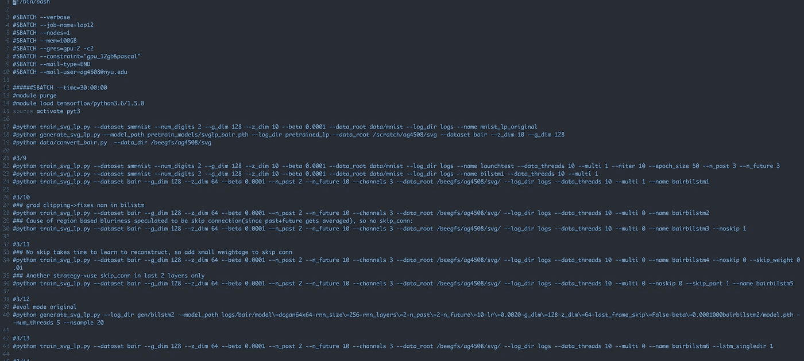

# 管理深度学习中的实验

> 原文：<https://towardsdatascience.com/managing-experimentation-in-deep-learning-ca6db050b104?source=collection_archive---------8----------------------->

使用深度学习包括运行无数的实验来测试一个人可能有的各种假设，以解决特定的问题，或者通过尝试多个超参数来获得更好的结果。随着时间的推移，这些实验的数量越来越多，管理它们甚至试图反映几周前做了什么可能会有点困难。在这篇文章中，我计划分享一些我使用的技巧或窍门(作为一名全职从事深度学习的研究生),以保持事情有序，防止自己迷失在一堆懒洋洋定义的日志文件中，如 exp0、exp1、newexp。

# 保持同步

我(我想也有很多其他人)在基于 GPU 的 linux 服务器上运行实验，然后将结果复制回主机进行分析。这种类型的数据可能包括 csv/txt 文件、tensorboard 日志或图像。

我发现 **rsync** 是一个完美的工具(我以前习惯于 **scp** )，它的主要优点是只同步源和目的地之间的差异。当培训正在进行中(预计需要很长时间)并且我们想要监控进度时，这是很有帮助的。我通常在生成模型上工作，所以我需要不时地通过浏览各个时期生成的东西来检查我的 GAN 是否变得疯狂了。

最简单的方法是:

```
rsync -av <username>@remote-host:<path_to_results_folder> .
```

在这里，`-a`将递归地传输所有内容，`-v`代表详细程度。这相当快。此外，如果你的服务器是通过网关，你需要事先登录。

使用 rsync 可以做很多事情，例如，在生产环境中部署模型，或者设置一个 cronjob 以固定的时间间隔提取日志。参考[这篇文章来看看后者是如何实现的。](http://mediatemple.net/blog/tips/many-uses-rsync/)

# 张量板

许多人都不知道 Tensorflow 的惊人可视化工具 [Tensorboard](https://www.tensorflow.org/programmers_guide/summaries_and_tensorboard) 可以作为一个独立的实用程序来绘制几乎任何东西的漂亮的交互式曲线。我通常坚持只绘制标量，以使事情变得更快更轻(传输和加载时间)。API[tensor board-py torch](https://github.com/lanpa/tensorboard-pytorch)在这方面真的很牛逼。我不知道为什么他们称它为“-Pytorch”，因为它很普通。通过`pip install tesorboardX`安装。

```
from tensorboardX import SummaryWriter
writer = SummaryWriter(log_dir=<path_to_log>)
for i in range(num_epochs):
    loss = forward_pass()
    writer.add_scalar('loss', loss)
```

我们结束了。接下来，启动 tensorboard 并查看剧情:`tensorboard --logdir <path_to_log>`。为了比较来自多个实验的损失(或任何其他度量)，`<path_to_log>`可以是`tb_log/<exp_name>`，其中`tb_log`是包含每个实验的子目录的目录。接着，启动 tensorboard 时的`logdir`标志的值会变成`tb_log`。

如果在远程服务器上，我建议将日志文件拉回到本地，然后从那里启动 tensorboard。上一节中的`rsync`命令可用于定期更新`tb_log`中的文件，同时保持 tensorboard 在后台运行。

或者，tensorboard 可以在远程服务器上启动，仪表板可以通过`public IP:port(6006 is default)`导航。如果远程服务器没有公共 IP 地址，可以使用 SSH 隧道。例如，如果我在默认端口 6006 上的某个 IP 为 10.11.12.13 的服务器上启动 tensorboard，我可以通过以下方式将其传输到我的本地计算机:

```
ssh -N -f -L localhost:6006:10.11.12.13:6006 username@10.11.12.13
```

其中`localhost:6006:10.11.12.13:6006`为`<destination_address>:<destination_port>:<source_address>:<source_port>`。

# 通过 gif 跟踪图像生成进度

为了容易地定性评估模型的进展，可以很容易地创建随时间生成的样本的 gif。

```
from torchvision import make_grid
import imageio
grid = []
for i in range(num_epochs):
    samples = forward_pass()
    # the following functions are in context of pytorch
    grid.append(make_grid(samples).permute(1, 2, 0).numpy())
imageio.mimsave('generations.gif', grid)
```

我们需要将生成的形状样本(batch_size，channels，height，width)转换为(height，width，channel ),因此首先将图像连接起来形成一个网格，然后转置维度并转换为 numpy 数组。

这使得人们不必仔细检查和比较为每个时期分别生成和保存的图像。


Source: [https://docs.floydhub.com/examples/dcgan/](https://docs.floydhub.com/examples/dcgan/)

# 测井实验

并不是我们运行的所有实验都在 excel 表中，即使这样，也很难在一个紧凑的二维表中捕获所有信息，即与每个实验相关的所有设置和更改。为了确保我过去运行的所有实验都被记录在某个地方，而不需要任何额外的努力(因为我不在乎在凌晨 3 点记录实验)，从 bash 文件运行所有实验(并不断注释掉以前运行的实验)。

这也让你可以自由地输入关于这些实验的任何注释或评论。您可以对某些超参数的不同值进行循环，以便一次运行多个实验。如果你的组织使用像 [Slurm](https://slurm.schedmd.com/overview.html) (像 [mine](https://wikis.nyu.edu/display/NYUHPC/Slurm+Tutorial) )这样的工作量管理器，那么遵循这种技术也更有意义。



Experiment Logging

我知道有很多令人惊讶的工具专门用来管理这个，比如[神圣](https://sacred.readthedocs.io/en/latest/index.html)，但是我更喜欢坚持老派的日志风格。

这些是我每天为了让生活变得更轻松而练习的一些事情。如果你认为这些是次优的，或者你有其他的锦囊妙计，让我知道，我很乐意学习:)

这是我很长一段时间以来的第一篇文章，也是机器学习领域的第一篇文章，我已经为此工作了一段时间。我计划分享我正在学习的和到目前为止学到的东西。反馈将有助于提高未来内容的质量。