# 曼加甘

> 原文：<https://towardsdatascience.com/mangagan-8362f06b9625?source=collection_archive---------3----------------------->

## 教电脑用漫画绘制新的和原创的漫画和动画脸

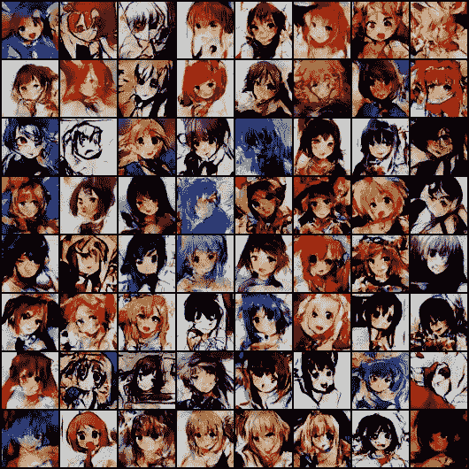

Manga and anime faces generated with a model trained for 100 epochs

漫画和动画因其复杂的艺术风格和引人入胜的故事而受到全世界的赞赏。这个游戏的粉丝群是如此庞大，以至于有成千上万的艺术家在那里绘制原创漫画和动漫角色，也有成千上万的人想要创造它们。然而，绘画需要大量的时间、努力、技巧和创造力。生成漫画和动画角色可以帮助弥补技能差距，并提供创造自定义角色的机会。我最终想实现我自己的 GAN 来绘制行业标准的漫画和动漫人物，但为了这个项目的目的，我想学习更多关于 GAN 的知识，并挑战自己绘制出我能做到的最佳质量的图像，因为现实中人类会接触到许多折衷的风格。

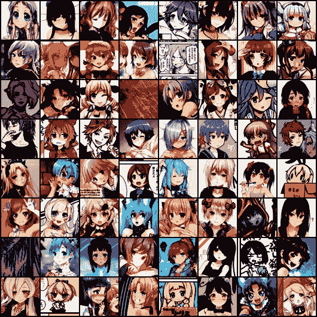

Real samples, some containing false positives before data cleaning

视频游戏行业是第一个开始认真试验使用人工智能生成原始内容的娱乐领域。除了目前计算机游戏和机器学习之间的重叠，鉴于现代 [AAA 视频游戏](https://en.wikipedia.org/wiki/AAA_(video_game_industry))的 3 亿多美元预算，投资视频游戏开发自动化肯定有巨大的成本激励。

# 数据准备

用大约 143，000 幅图像的数据集来训练这些图像。众所周知，要生成符合行业标准的图像，高质量的图像数据集即使不是最重要的，也是必不可少的。使用的图像是从 [Danbooru](http://danbooru.donmai.us/) 抓取的——一个图像板，可以访问大量足够的图像来训练图像生成模型。这些图像板允许上传风格、领域和质量高度不同的图像，并认为这是真人面部和动漫人物面部之间质量差距的重要部分。图像的质量如此多样化，以至于它们可以是抽象的，所以我希望通过产生具有独特风格的更清晰的数据集来继续这个项目。

抓取图像后，我用`[python-animeface](https://github.com/nya3jp/python-animeface)`来裁剪图像。这个[图像级联](https://github.com/nagadomi/lbpcascade_animeface)专门用于检测动画和漫画的人脸，也同样适用。这个过程是多线程的，有 12 个池，但下面是每个映像的基本情况:

```
import animeface
from PIL import Image

img = Image.open('data/anime_image_usagi_tsukino.png')
faces = animeface.detect(img)
x,y,w,h = faces[0].face.pos
img = img.crop((x,y,x+w,y+h))
img.show() 
```

我手动检查误报，因为一些图像。我最终消除了 3%的误报。

# 使用深度卷积生成对抗网络(DCGAN)的目标

人工智能研究人员到底为什么要构建复杂的系统来生成看起来有点不靠谱的卡通人脸图片？

这件事很酷的一点是，它需要理解这些图片才能生成它们——就像艺术家在画一张脸之前需要理解它需要什么一样。

看这张照片:

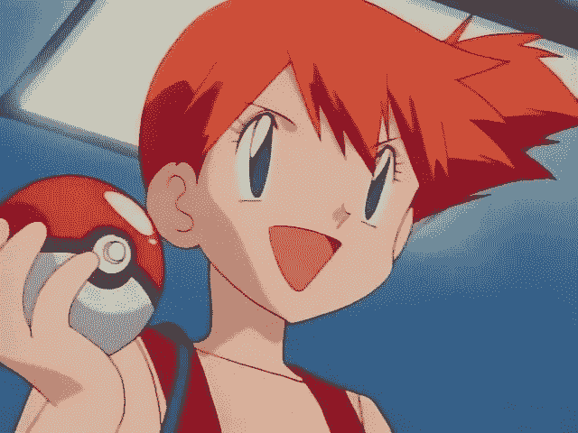

An anime face. Specifically, Misty from Pokémon, whose one of my favorite anime characters.

对于那些看动漫的人来说，你会立刻知道这是一张动漫脸的图片——一张源自日本的艺术风格的卡通脸。对计算机来说，这只是一个代表像素颜色的数字网格。它不明白这应该是一张动漫脸，更不用说代表什么概念了。

如果我们向计算机展示数以千计的这些日本风格的卡通面孔，在看到这些图片后，计算机能够绘制原始的动漫面孔——包括不同发型、不同眼睛颜色、不同性别、不同视角的面孔，以至于艺术家可以要求它绘制特定类型的面孔，例如“留着蓝色短发、戴着眼镜、戴着猫耳朵、脸上带着微笑的漫画或动漫女孩。”

如果计算机能够用相应的面部特征绘制这些脸，这意味着它们知道如何在没有任何明确指示的情况下绘制新的角色(至少在儿童水平上)。

作为一名开发人员和艺术家，看到研究人员追求这一点是令人兴奋的。这些生成模型让计算机以一种可以转化为前所未见的概念的方式理解数据，而无需理解该概念的含义。我们仍然处于基于机器学习的生成模型的早期，它们的实际用途目前还很有限，但它们非常有趣。看看人工智能是否能为艺术或娱乐业做出贡献，这将是一件有趣的事情。

> “我从认知系统中寻找的不仅仅是另一种形式的计算，而是在我们的生活中创造一种存在，并通过这种存在来激励我们。”
> 
> *—IBM 沃森副总裁兼首席技术官罗布·海*

# 模型是如何工作的？

DCGAN 由两个神经网络组成:一个生成器和一个鉴别器。这是一场看谁能胜过对方的战斗，结果是两个网络都变得更强大。

让我们假设第一个神经网络是一个首席动画师，他正在审查一部新动画的创意。为了防止诉讼，它被训练来识别在以前的展览或书籍中见过的图画。它的工作是观察面孔，看看是否有适合他们节目的新面孔。

一个[卷积神经网络](https://medium.com/@ageitgey/machine-learning-is-fun-part-3-deep-learning-and-convolutional-neural-networks-f40359318721)在这种情况下起作用，因为我们需要做的只是拆开一幅图像，将它分成几层并处理每一层，识别图像中的复杂特征，并输出一个值来指示图像中是否有真实的动漫脸。第一个网络是**鉴别器:**


Discriminator Network

接下来，让我们假设第二个网络是一个全新的动画师，他刚刚学会如何绘制新鲜的动画面孔，这样就不会有人因侵犯版权而被起诉。这位动画师将向一家大型动画公司的首席动画师推销一个新的创意。在第二个网络中，这些层被反转为正常的 ConvNet。这个网络不是像第一个网络那样拍一张照片输出一个值，而是取一个值的列表输出一张照片。

第二个网络是**发生器:**

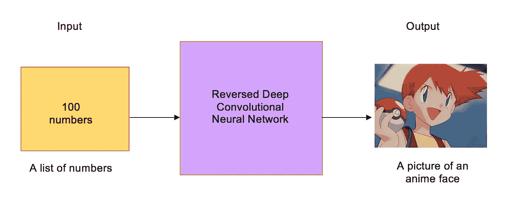

Generator Network

现在，我们有了一个寻找重复使用的面孔的主动画师(T6 鉴别师),和一个绘制新面孔的新动画师(T8 生成器)。决斗的时候到了！

## 第一回合

**生成器**将绘制一个…有趣的动漫脸副本，它不像一个新的行业质量的脸，因为它不知道动漫脸看起来像什么:

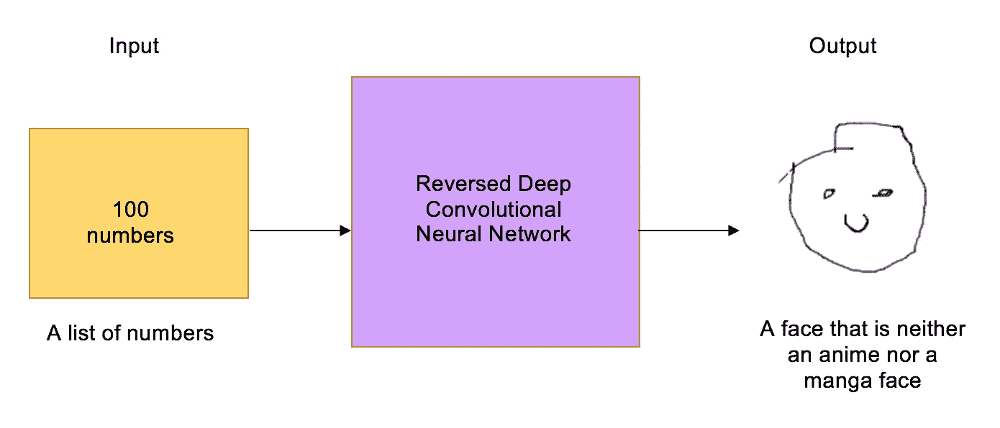

The Generator makes the first (…interesting) manga/anime face

但是现在**鉴别器**在识别图画的工作上同样糟糕，所以它不会知道区别:

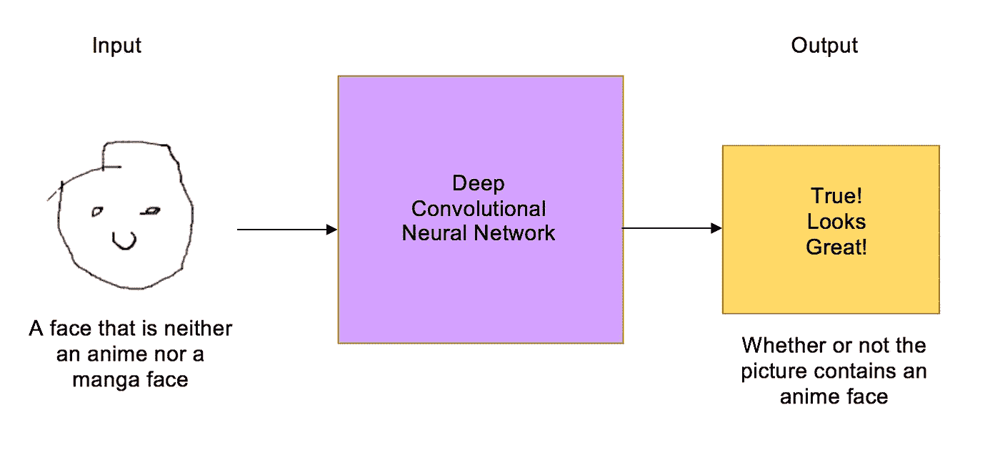

The Discriminator think’s it’s a fresh, industry quality face. Maybe for a YouTube show

现在我们必须告诉鉴别者，这实际上是一张不符合我们标准的脸。然后我们给它看一张真实完整的动漫脸，问它和假的有什么不同。鉴别器寻找新的细节来帮助它区分真假。

例如，鉴别者可能会注意到一张完整的动漫脸有一定的比例。利用这些知识，鉴别者学会了如何辨别真伪。它的工作变得更好了:

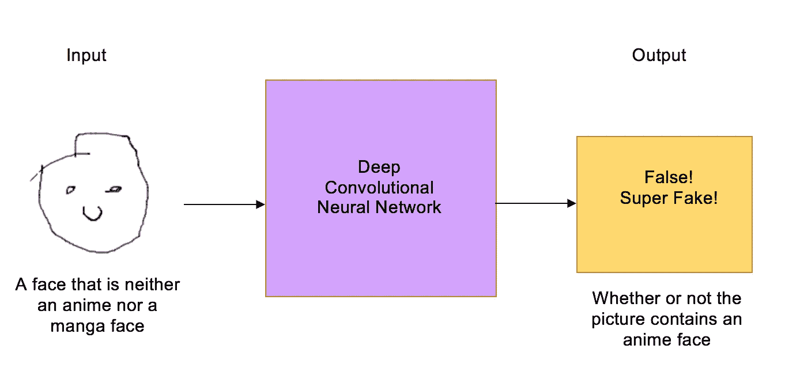

The Discriminator levels up! It now can spot very bad fake faces

## 第二轮

我们告诉生成器，它的动画和漫画图像突然被拒绝为假的，所以它需要加强它的游戏。我们还告诉它，鉴别器现在正在寻找人脸上的特定比例，因此混淆鉴别器的最佳方法是在人脸上绘制这些特征:

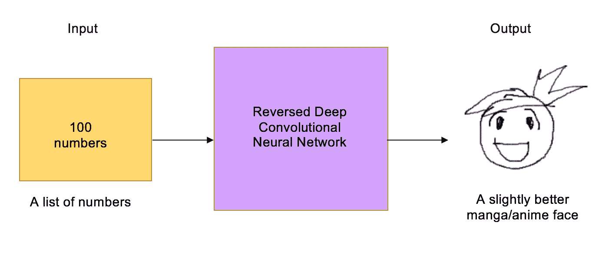

The Generator produces a slightly better drawn manga/anime face

假面又被认为是有效的了！现在鉴别者不得不再次看真实的脸，并找到一种新的方法来区分它和假的脸。

生成器和鉴别器之间的这种来回博弈会持续数千次，直到两个网络都成为专家。最终，发生器产生了新的、近乎完美的面孔，鉴别器变成了一个动漫鉴赏家和评论家，寻找最细微的错误。

当两个网络都经过足够的训练，使得人类对假图像印象深刻时，我们就可以将假图像用于任何目的。

# 结果

我在 100 个时代训练了我的网络，并设法绘制了一些具有独特风格的新面孔。我继续致力于我的实现，并计划用 DRAGAN 和不同的数据集进行实验，以提高生成的质量。

观察前四个时期，发生器的输出接近纯噪声。随着发电机学会做得更好，新面孔慢慢开始成形:

随着训练的深入，生成器会给每个角色画出更均匀的比例。下面是使用 IPython 和经过训练的模型生成的一些结果:

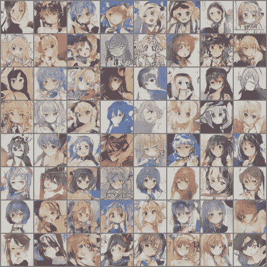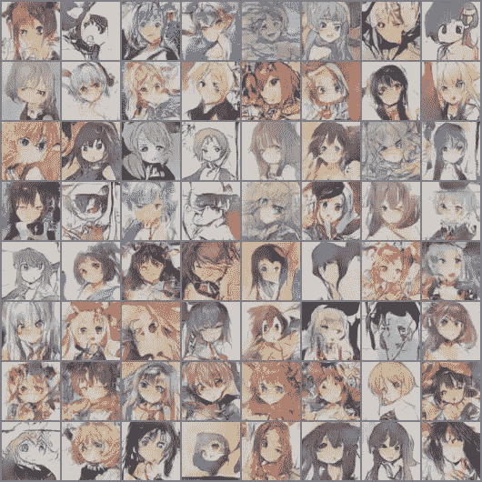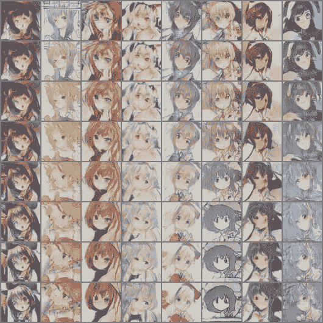

Image interpolation by changing the latent z vector

因为这些图片都有自己的标签，所以在运行网络时记住特定的属性会很有趣。我用不同的头发颜色作为参数再次运行了网络。这一次，鉴别器使用头发颜色来区分人脸，生成器在重新绘制人脸时会考虑到这一点:

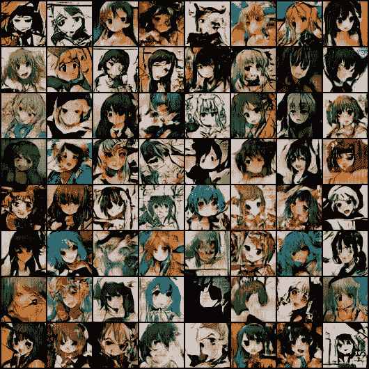

Characters with green hair

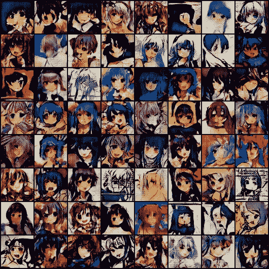

Characters with blue hair

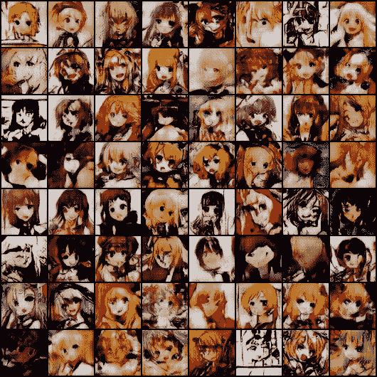

Characters with blonde hair

# 结论

这是一个有趣的项目，到目前为止，我学到了很多关于训练甘以及如何优化他们。如果你想了解更多关于 GANs 以及如何训练它们，我强烈推荐你访问[这篇文章](https://github.com/soumith/ganhacks)来了解未来的技巧，因为它们对学习过程非常有帮助。训练 GANs 时，回流训练数据肯定是可能发生的事情。通过使用大量的训练数据集和较短的训练时间，有可能减少这种情况发生的几率。这是一个棘手的问题，对它的研究仍在继续，但希望这能成为建立干净数据集以产生高质量结果的动力。

这个项目绝不是提议取代努力工作的动画师和艺术家——这是一门非凡的艺术，这是为了纪念那些献身于掌握这门艺术的人。这是为了找到计算机不仅可以理解如此复杂的概念的方法，并希望激发所有层次的人欣赏艺术并为艺术做出贡献。我希望这个项目刺激更多关于漫画和动画风格图像的生成模型的研究，并最终帮助业余爱好者和专业人士设计和创造艺术，让尽可能多的人享受。