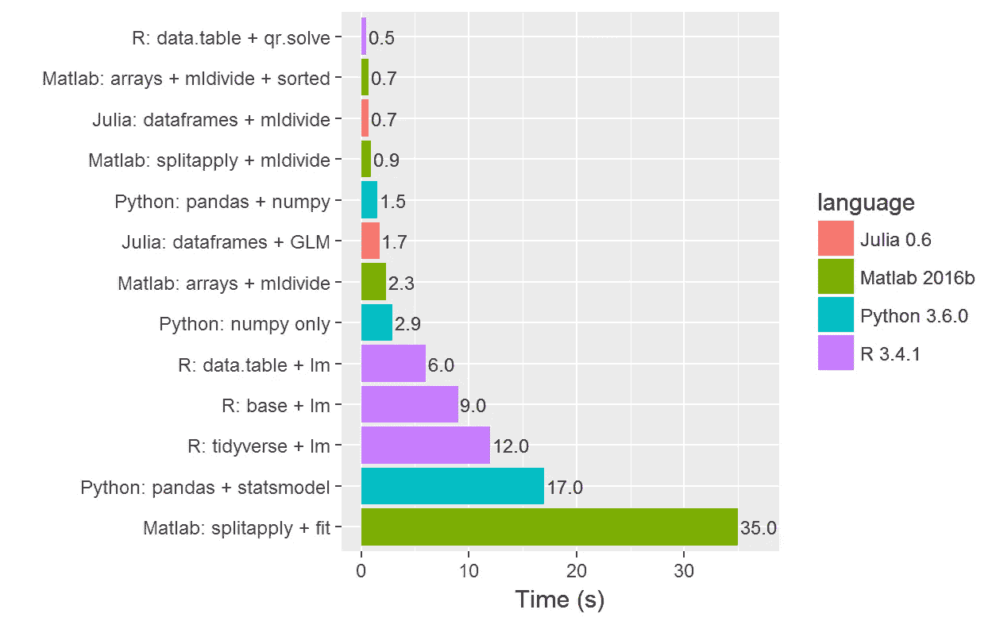
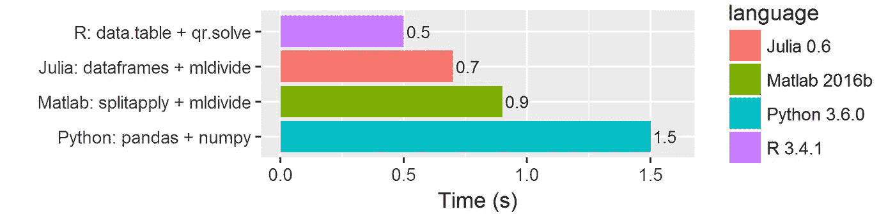

# 多种语言的多种模型

> 原文：<https://towardsdatascience.com/many-models-in-many-languages-620e9e1f3036?source=collection_archive---------5----------------------->

寻找最佳日常数据科学工具之旅。


Be fast, avoid the pitfalls I found! Or try them out anyway.

在过去的几年里，我一直在研究数据科学方法，试图学习机器学习以及如何有效地自动化自己。到目前为止，我在最后一点上还是非常失败，因为你变得越有效率，给你的工作就越多。但是，我没有把这些知识藏起来，而是分享一些，希望它能帮助你或世界上的其他人。

我仍在纠结的一件事是，我的任务应该使用哪种编程语言？也许你面临着同样的挣扎，或者也许你已经想出了你最喜欢的语言？就我个人而言，在这个星球上的学术生涯中，我是伴随着 c/c++和 Matlab 长大的，但我得到的印象是，你不再属于拥有这种特殊技能的“酷人”了。此外，我在工作中接触到许多语言，所以现在是时候提高我的知识了。

# 实验装置

在偶然发现了[多模型范式](http://r4ds.had.co.nz/many-models.html)，也被称为[拆分-应用-组合](http://vita.had.co.nz/papers/plyr.pdf)之后，我意识到这就是我每天在工作中所做的事情。因此，我已经开始确定哪种语言最适合这个特定的任务。

首先，用半随机生成的数据创建一个数据集，这可能类似于我每天处理的数据。数据集足够大，以至于当你做错的时候会明显地减慢计算速度。我已经把数据和结果放到了一个 [github repo](https://github.com/matthijscox/many-models) 中。我不会深入建模细节，但本质上我*只是*想要计算数据中许多组的多元回归的残差。

这相当复杂，所以让我们来看看我的代码需求:

*   应该是**快**！计算时间很少，不允许喝咖啡。
*   应该是**容易**写！节省你，人类，大量的时间。
*   理想情况下，它看起来优雅易读。这完全是一个有待讨论的问题。

接下来，我将比较这些语言中的多种实现:

*   **Matlab** (我的专长，但专有)
*   **Python** (全才)
*   **R** (数据科学爱好者)
*   朱丽娅(新来的，承诺速度！)

另外，我也在比较不同的概念:

*   使用**现成的**建模包 vs. **手写的**线性代数。
*   **自动**分割应用方法(在数据帧上)与**手动**编写循环(在数组上)。

# 搜索解空间



The timing results of all the various solutions I tried so far.

各种尝试之间的执行时间存在巨大差异。特别是在 Matlab 中，你可能会失败得很惨，这经常发生在没有经验的用户身上，进一步增加了它糟糕的声誉。然而，通过一些好的选择，你可以在 Matlab 中做得很好。

这篇文章的灵感，Hadley Wickam 的 tidyverse 解决方案，在他的书 [R for Data Science](http://r4ds.had.co.nz/many-models.html) 中详述，也做得不太好。我是 tidyverse 哲学的忠实粉丝，尤其是用于可视化的 ggplot，但显然不应该因为它的计算效率而选择它。

非常有效的方法是自己写出模型的线性代数，以及一个允许你自动进行分割应用的包。最终，data.table 包和一个矩阵 QR 求解器一起胜出。然而，正如一位同事急切指出的，这本质上是对核心 c/c++代码的包装。因此，也许并不是真正的 R 语言赢了。

我还想回到 Julia，它保证了开发的速度和简易性。它还没有打败 data.table，但是我只需要两次简单的尝试就可以让它表现出色！

最后，还有 Python。我最不喜欢这种语言，这可能解释了为什么我不能让它像其他语言一样在 1 秒内运行。如果你知道谁愿意帮助我，我将不胜感激！

最后，现成的 dataframe 方法通常优于跨阵列的初始 for 循环。如果付出额外的努力，后一种方法可以达到类似甚至更好的性能，但几乎没有回报。另一方面，编写自己的模型显然有助于缩短执行时间，因为上图中所有缓慢的解决方案都使用了通用的建模包。除非速度不成问题，否则我建议定制型号。

# 诗歌



Comparing the results of my favorite attempts in each language

在编写所有这些脚本和函数的时候，我想用另一种语言一遍又一遍地写同一首诗。每种语言的语法可能看起来不同，但总体概念是完全相同的。在这里，我想向您展示我最喜欢的解决方案的美妙之处。

在定义了残差计算函数之后，一切都在名为`*df*` *、*的数据帧(或表格)上运行，该数据帧包含两个组索引、两个预测器`*A*`和`*B*`以及一个估计器`*Z*`。对你们中的一些人来说，下面显示的片段是微不足道的，对其他人来说，它们可能看起来像黑色的魔法咒语。

我不会在所有语言中展示建模函数，但正如下面 R 中的代码示例所示，这几乎不比通过`residuals(lm(Z ~ poly(A,B,degree=3))`调用一般的线性建模函数`lm`更费力，但速度却快了 10 倍:

```
calc_poly_residuals <- function(A,B,Z) {
  # construct the model matrix
  M <- cbind(A*0+1, A, B, A*B, A^2, A^2*B, B^2, A*B^2, A^3, B^3)
  # calculate residuals after solving M*c = Z
  resid <- Z - M %*% solve(qr(M, LAPACK = TRUE), Z)
}
```

## 稀有

下面是 R data.table 解决方案。简短、抽象、快速:

```
df[,resid:=calc_poly_residuals(A,B,Z), by=.(num_group,cat_group)]
```

## 朱莉娅

Julia 解决方案只需要多一点代码:

```
by(df,[:num_group,:cat_group],df -> DataFrame(resid = calc_poly_residuals(df)))
```

## 计算机编程语言

显然，Python 更喜欢面向对象的语法:

```
df_grouped = df.groupby(['cat_group', 'num_group'])
resid = df_grouped.apply(calc_poly_residuals)
```

## 矩阵实验室

Matlab 喜欢在函数调用中使用单独的数组:

```
G = findgroups(df.num_group,df.cat_group);
resid = splitapply(@calc_poly_residuals,df.A,df.B,df.Z,G);
```

## 结论

首先，尝试所有这些语言和概念对我的学习很有帮助。虽然我仍然不知道我更喜欢用哪种语言来执行这些模型，但是现在我已经可以使用它们了。当我与我的雇主的其他数据科学团队互动时，这很方便，他们都有自己喜欢的。

相当惊人的是，手工制作自己的模型或算法回报显著！另一方面，您可以将数据处理留给外部包。这很符合我自己的喜好；忽略数据管理，深入思考算法和见解。