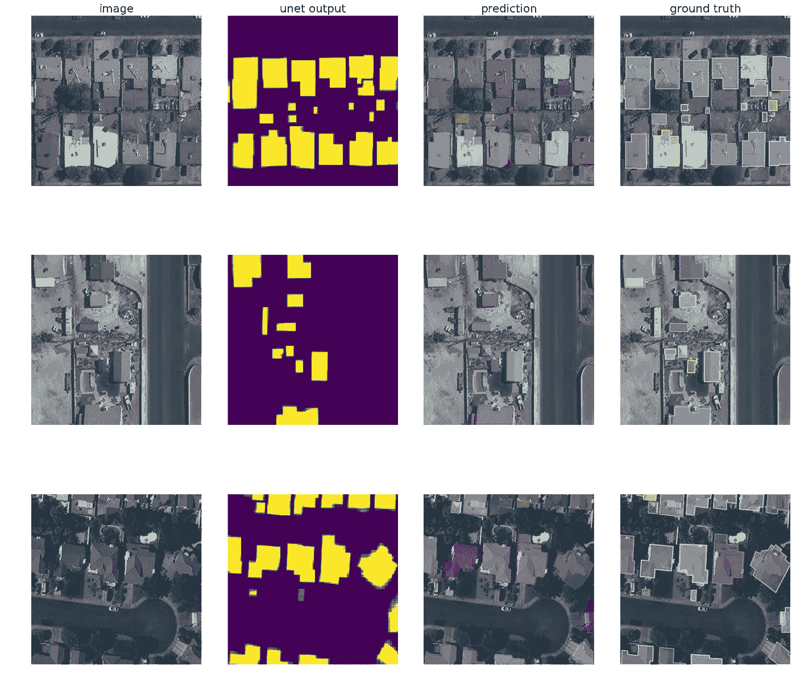
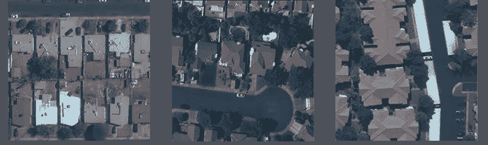
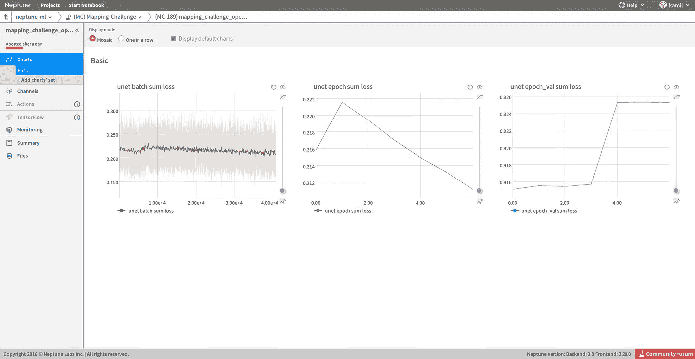
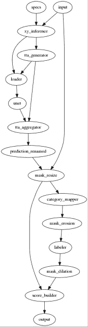
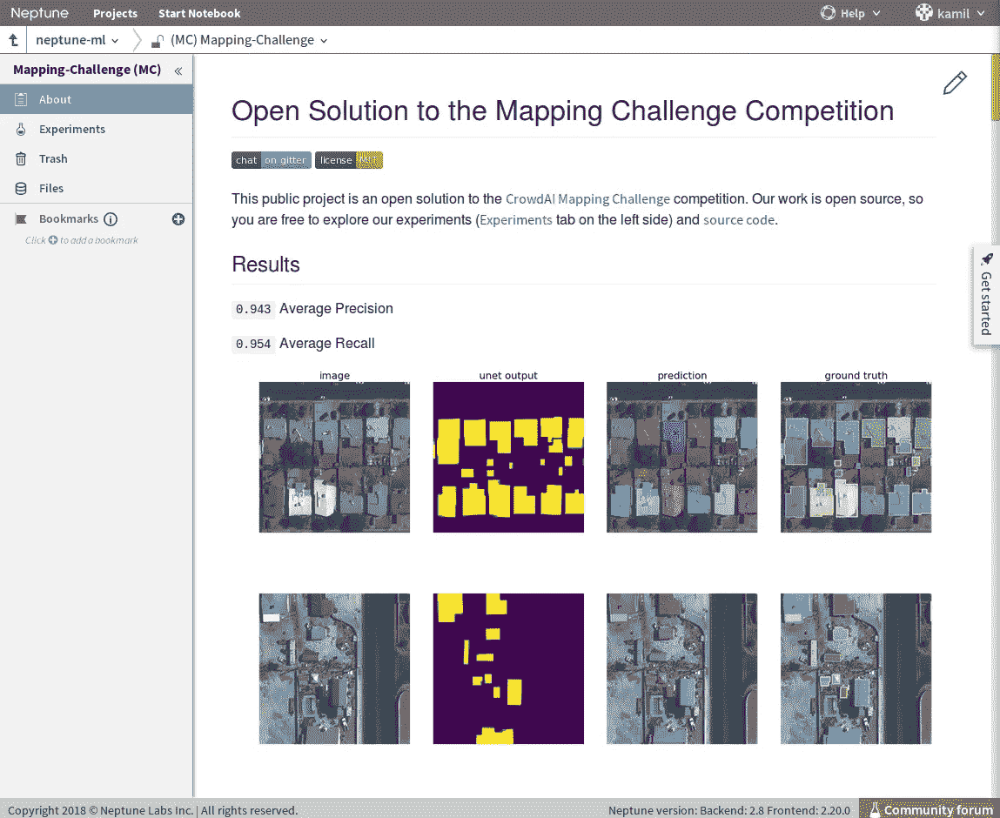
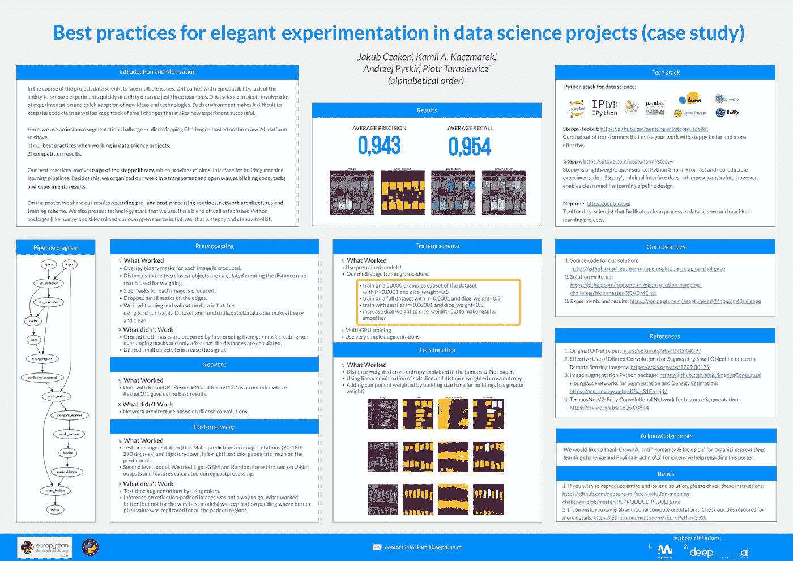
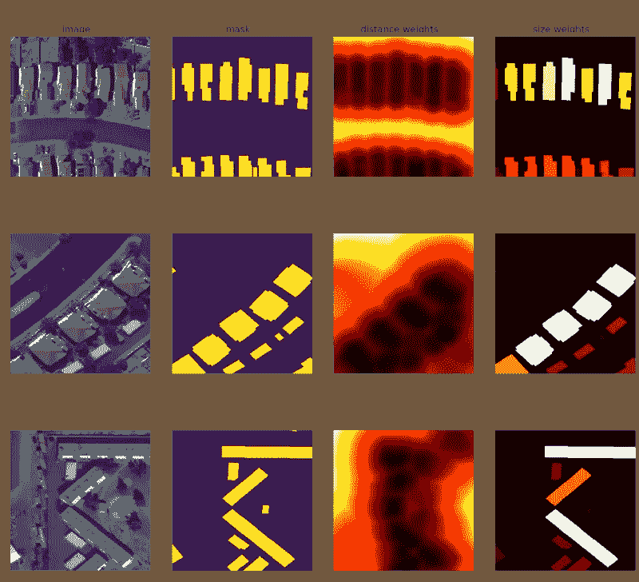

# 测绘挑战赛获胜解决方案

> 原文：<https://towardsdatascience.com/mapping-challenge-winning-solution-1aa1a13161b3?source=collection_archive---------11----------------------->

## 了解如何以惊人的精度在卫星图像上检测建筑物。开源实现的 DIY。由 [neptune.ml](https://neptune.ml) 为您带来，与 [deepsense.ai](https://deepsense.ai/) 一起赢得挑战并获得最佳社区贡献者奖🏆。

No cherry picked predictions. 1st column is input image; 2nd column is model’s prediction; 3rd column is model’s prediction superimposed on the input image; 4th column is ground truth superimposed on the input image. Each row is one example.

# 序言

卫星图像的深度学习越来越成为数据科学家的热门话题。卫星数据展示了在商业和研究领域的一些可能的应用。用例的范围从分类和本地化，到语义或实例分割。最后一个——*实例分割*——就是检测图像上的一个对象类，然后分割该对象的每个实例(想想:[选择图像上的所有猫](https://www.semanticscholar.org/paper/Object-Detection-Free-Instance-Segmentation-With-Jin-Chen/74d8cdd5f21fb499e0cc83c3e40f357a1acf8bed/figure/6))。

这篇文章是关于*实例分段*挑战的获胜解决方案，称为[映射挑战](https://www.crowdai.org/challenges/mapping-challenge)🌐在 [crowdAI](https://www.crowdai.org/) 和 [Humanity & Inclusion](http://www.hi-us.org/inclusion) 的主持下。在这里，我将分享我们的过程，工作方式，解决方案的内部和最终结果。关于技术栈也不会说太多😉

Project dashboard — we were rather busy with our experiments :)

# 为什么重要？

卫星图像提供了高质量的地球表面概览。这些数据可以用于公共利益。一个例子是研究项目:“ [*结合卫星图像和机器学习预测贫困*](http://science.sciencemag.org/content/353/6301/790) ”。来自斯坦福大学和美国国家经济研究局的研究人员使用深度学习方法(特别是迁移学习技术和 VGG 网络架构)来估计发展中国家一些国家的家庭消费和资产。

另一个例子是支持应对人道主义危机或自然灾害。[地图挑战赛](https://www.crowdai.org/challenges/mapping-challenge)如何为这一目标做出贡献？

> 我们正处于一个人道主义危机在规模和数量上都日益增加的时期(……)。通常，准确的地图要么不存在，要么因灾难或冲突而过时。*

尽管它们很重要，但新地图是手工绘制的，因此迫切需要自动化方法来帮助生成准确的实时地图。因此，竞赛的意义可以简单概括如下:

> 世界上许多地方还没有绘制成地图；尤其是(……)那些最容易遭受自然灾害的人。获得这些潜在危机区域的地图极大地提高了应急(……)行动者的反应能力。*

数据科学家可以实现这一挑战的实际目标是:

> (…)探索机器学习如何为自动分析卫星图像以生成(…)地图铺平道路。*

*(* 2018-09-12 从* [*比赛页面*](https://www.crowdai.org/challenges/mapping-challenge) *)检索的所有报价*

# 关于比赛的几句话

Example input images

如果你想参加围绕开放数据组织的机器学习挑战，只需前往[crowdAI.org](https://www.crowdai.org)并挑选你最喜欢的。前段时间，2018 年 4 月初，我们被[贴图挑战赛](https://www.crowdai.org/challenges/mapping-challenge)所吸引。我们专注于基于图像的机器学习，在此之前，我们参加了[数据科学碗 2018](https://www.kaggle.com/c/data-science-bowl-2018) ，在那里我们主要与 U-Net 和 [Mask R-CNN](https://arxiv.org/abs/1703.06870) 架构合作。在 DSB 2018 期间，我们开发了高度可参数化的 [U-Net 的干净实现。这个比赛也是关于分割的，但是在这里，我们使用卫星图像，而不是显微镜图像。出于以下几个原因，我们决定参加地图挑战赛:](https://github.com/neptune-ml/steppy-toolkit/blob/master/toolkit/pytorch_transformers/architectures/unet.py)

*   探索机器学习竞赛的新平台。我们都很了解卡格尔，但是克劳代和 T21 有不同的形象。
*   为更广泛的公众利益贡献我们的一份力量(参见:*为什么重要？*)。
*   通过定制编码器、多路输出和其他修改，进一步改进 [U-Net 实施](https://github.com/neptune-ml/steppy-toolkit/blob/master/toolkit/pytorch_transformers/architectures/unet.py#L9)。
*   扩展我们的开放数据科学项目组合。

# 团队—数据科学四重奏

数据科学四重奏参加了比赛，分别是:雅各布·查孔、卡米尔·卡什马雷克、安杰伊·皮斯基尔、彼得·塔拉谢维奇(*字母顺序*)。由于这是整个团队的工作，因此，为了简单起见，我将把进一步的成就提到整个团队，而不是任何特定的人。在这里， [neptune.ml](https://neptune.ml) 我们坚信，没有强大的团队合作，这一成功是不可能的。我们的 4 人团队，就像四人组[(GoF——这四位作者因他们的](https://en.wikipedia.org/wiki/Design_Patterns)[设计模式书](https://www.amazon.com/Design-Patterns-Elements-Reusable-Object-Oriented/dp/0201633612)而出名)，由热衷于机器学习的爱好者组成。我们来自两家公司:Jakub 和 Kamil 来自 [neptune.ml](https://neptune.ml) ，Andrzej 和 Piotr 来自 [deepsense.ai](https://deepsense.ai/) —机器学习和 ai 咨询公司。

# 我们是如何工作的？我们是如何设计流程的？

我们有定期的每周计划会议(报告进展和讨论未来的方向)，每天的站立会议(让每个人都知道最新的工作)，松散的沟通渠道，用于特别的对话和直接在代码中请求评论(当然还有代码审查)😄).

在参加挑战之前，我们有一些原则，我们渴望在我们追求的任何项目中实现。

**干净代码** —我们认为单项比赛只是迈向更大目标的一步。因此，我们不会为了在竞争中立于不败之地而牺牲工程质量。具有良好接口的设计良好的实现将在未来的竞争和商业数据科学项目中获得回报。

**️team 工作** —根据定义，数据科学项目是团队工作。不断重复新想法([有些效果很好，有些则不太好](https://github.com/neptune-ml/open-solution-mapping-challenge#network))的顺利进展是我们在此次竞赛中获得第一名的关键因素之一。任何人都可以提出想法，选择她最喜欢的任务，并思考他们对项目的贡献。这种开放的环境对我们的成功至关重要。

**快速实验** —多亏了清洁解决方案开发流程，我们能够顺利地重复想法。从第一天开始，所有实验都在我们的数据科学项目平台 [neptune.ml](https://neptune.ml) 上运行。与实验相关的所有工件都放在一个地方:结果、输出、保存的模型、代码、图表、超参数——非常方便，并且创建了一个比较结果和查看彼此工作的公共场所。这变得很方便，因为实验的数量很快就超过了 100 次(到目前为止，我们已经进行了超过 1000 次[实验](https://app.neptune.ml/neptune-ml/Mapping-Challenge?namedFilterId=mainListFilter)，这些实验都是公开的😎).

Single experiment with three interactive charts displayed.

**公开分享** — [neptune.ml](https://neptune.ml) 团队有远见地公开并展示与数据科学项目相关的整个过程。这就是为什么 code base 从第一天起就是开源的。每个人都可以观察它是如何增长的，何时开发新的模型，以及我们如何建立例程来有效地处理竞争数据。这是一个相当大的挑战，因为图像的数量:训练中有 280741 张，验证中有 60317 张，测试集中有 60697 张。此外，每个人都可以观察我们在海王星上运行的实验，浏览图表和结果。最后，我们让每个人都复制我们的结果，因为我们共享完整的信息和指导。我们将我们的想法命名为**开放解决方案**。

# 从事数据科学项目的实用建议

在这里，我们从团队的角度分享了哪些工作做得很好，以及我们在[当前挑战](https://app.neptune.ml/neptune-ml/Home-Credit-Default-Risk?namedFilterId=mainListFilter) ( *查看“成功解决方案描述”部分*)中继续做的事情:

*   **选择所有实验工件的单一平台**(保存的模型、代码、结果、超参数)。当事情变得复杂时，这会节省你大量的时间😉).

neptune.ml dashboard, where we keep all experiments. Notice competition metrics, Precision and Recall in the middle (two green columns).

*   **安排每周计划会议**以报告进展并讨论两个主题:接下来做什么(接下来 7 天的行动)和想法。我们的 [deepsense.ai](https://deepsense.ai/) 团队成员带来了许多关于损失功能和架构设计的技巧，这是讨论它们的合适场所。
*   为**每日同步**安排固定时间——15 分钟。这将让每个人都知道现在正在处理什么。
*   **把所有的任务和问题放在同一个地方**比如 GitHub [issues](https://github.com/neptune-ml/open-solution-mapping-challenge/issues) 和 [boards](https://github.com/neptune-ml/open-solution-mapping-challenge/projects/1) 或者 trello boards 和 cards。这应该由团队领导策划，由团队中的每个人维护。
*   每个团队成员都在 git 分支工作。一旦完成任务，她就向发布开发分支发布拉请求。一旦增量解决方案完成，发布开发分支将被合并到主开发分支。千万不要碰 master，除非是发布开发分公司的 PR。这确保您在 master 上对您的问题有增量解决方案。它还允许您跟踪项目历史。
*   实施对等代码审查。团队得到了关于软件工程的一般教育，特别是关于彼此的工作风格。

# 技术堆栈

## **硬件**

在硬件层面，我们在普通笔记本电脑上开发代码，或者在云中训练模型( [neptune.ml](https://neptune.ml) 处理与谷歌云平台的通信。用户可以选择她最喜欢的 GCP 机器，配备英伟达 K80 或 P100 GPU)或本地的英伟达 GeForce GTX 1070 GPU。在后一种情况下，我们使用 neptune.ml 来监控我们在本地计算的实验(参见下面的章节*“Neptune . ml”*了解更多细节)。

## **软件**

我们使用 Python 3.5，这是我们技术堆栈中最基本的部分。我们可以区分几个逻辑层，这将在下一节中描述。

**Python 包(有些是特定于项目的)**

在顶部，我们有一些 Python 包，我们每天使用它们来简化数据科学中的常见任务。下面列出了最重要的，并简单说明了为什么它们很重要😉。

*   [py torch](https://pytorch.org/)([v 0 . 3 . 1](https://pytorch.org/previous-versions/))。我们发现在 PyTorch 中开发深度模型既简单又直观。我们知道有很多博客文章和会议讨论比较了 Keras 和 PyTorch 。我们选择 PyTorch 是因为用户可以直观地开发定制架构。
*   ImgAug —用于图像增强，因为它提供了简单的 API 和大量的增强。看看我们对 ImgAug 的使用: [augmentation.py](https://github.com/neptune-ml/open-solution-mapping-challenge/blob/master/src/augmentation.py) 。
*   具体来说，在这次挑战中，我们与 [pycocotools](https://github.com/cocodataset/cocoapi/tree/master/PythonAPI/pycocotools) 合作，计算竞争指标。
*   scikit_image、opencv_python 和 imageio，用于对图像进行操作。

*(所有需求都在我们的资源库中*[*requirements . txt*](https://github.com/neptune-ml/open-solution-mapping-challenge/blob/master/requirements.txt)*)*

**Steppy 和 steppy-toolkit**

Final solution pipeline developed using steppy.

在赢得地图挑战赛之前，我们的团队参加了比赛和商业项目。当时很明显，需要一些简单和干净的接口来构建复杂的机器学习管道。 [Steppy](https://github.com/neptune-ml/steppy) 是一个轻量级的 Python 库，支持干净的机器学习流水线设计。它是海王星平台的补充，但在技术上是 100%独立的。 [Steppy-toolkit](https://github.com/neptune-ml/steppy-toolkit) 反过来是一套精心策划的变形金刚，让你的 Steppy 工作更快更有效。

[**Neptune . ml**](https://neptune.ml)

它是一个社区友好的平台，支持数据科学家创建和共享机器学习模型。Neptune 促进团队合作、基础设施管理、模型比较和可重复性。我们在 neptune.ml 上运行所有的实验，以确保我们能够重现它们，并在以后进行比较。Neptune 独立于上面提到的所有层，它只适用于任意的 Python 代码。

Mapping Challenge — neptune screen with project description, similar to GitHub README.md.

# 获奖解决方案描述

> [数据科学项目中优雅实验的最佳实践(案例研究)](https://gist.github.com/kamil-kaczmarek/b3b939797fb39752c45fdadfedba3ed9/raw/19272701575bca235473adaabb7b7c54b2416a54/EP_poster.pdf)

以上是联合 [neptune.ml](https://neptune.ml) 和 [deepsense.ai](https://deepsense.ai/) 对[PyData Europe 2018](https://ep2018.europython.eu/en/call-for-proposals/#PyData-EuroPython-2018)(euro python 2018 的一部分)的贡献的标题，在这里我提出了我们的最佳实验实践。我们将地图挑战的解决方案作为一个用例，因为我们相信我们的想法值得传播(就像 [TED 大会](https://www.ted.com/)😉).值得注意的是，我们是在宣布获奖者之前做的，包括*竞赛*和*社区贡献者*两个类别😊。在这张海报中，我们从技术的角度全面概述了哪些方法行之有效。

Click on the poster for full size pdf file.

## 获胜网络是 U-Net 的兴奋剂*

**我第一次观察到这个术语是在 ods.ai* *的* [*帖子里，他们在那里解释了他们对 DSB 18 的第一名解。*](https://www.kaggle.com/c/data-science-bowl-2018/discussion/54741)

Unet 使用 Resnet34、Resnet101 和 Resnet152 作为编码器，其中 Resnet101 为我们提供了最佳结果。这种方法在 [TernausNetV2 论文](https://arxiv.org/abs/1806.00844)中有解释(我们的[代码](https://github.com/neptune-ml/open-solution-mapping-challenge/blob/master/src/unet_models.py#L315-L403)💻).也看看我们的可参数化的 U-Net 的[实现(代码💻).](https://github.com/neptune-ml/steppy-toolkit/blob/master/toolkit/pytorch_transformers/architectures/unet.py#L9)

1st columns is input image; 2nd column is output from U-Net; 3rd column is prediction superimposed on the input image; 4th column is ground truth superimposed on input image.

## 损失函数

*   距离加权交叉熵在著名的 [U-Net 论文](https://arxiv.org/pdf/1505.04597.pdf)(我们的[代码](https://github.com/neptune-ml/open-solution-mapping-challenge/blob/master/src/models.py#L310-L336)中解释💻).强烈推荐阅读这篇论文😃
*   使用软骰子和距离加权交叉熵的线性组合([代码](https://github.com/neptune-ml/open-solution-mapping-challenge/blob/master/src/models.py#L384-L418)💻).
*   将由建筑物大小加权的分量(较小的建筑物具有较大的权重)添加到加权交叉熵，该加权交叉熵对属于小对象的像素的错误分类进行惩罚([代码](https://github.com/neptune-ml/open-solution-mapping-challenge/blob/master/src/models.py#L310-L462)💻).

## 实践中的损失函数——可视化

前面提到的三点产生了某种复杂的损失函数，因此可能很难理解它在实践中是如何工作的。下面是重量的可视化图，具体如下:

*   距离权重:高值对应于建筑物之间的像素。
*   尺寸权重:高值表示小建筑物(建筑物越小，颜色越深)。请注意，没有建筑物固定为黑色。

*(对于两种重量:颜色越深表示数值越高)*

1st column is input image, 2nd column is mask, 3rd column visualizes distances between buildings (darker color is higher value), 4th column visualizes weight assigned to the roof (smaller roofs are assigned higher values, background is fixed to black).

## 培养方案

当我们开始使用预训练的模型时，我们获得了最好的结果(平均精度和平均召回率)(这并不奇怪)。训练计划是这样进行的:

1.  用预先训练的权重初始化模型。
2.  使用`learning rate=1e-4`和`dice weight=0.5`在数据集的 50k 个样本上进行训练。
3.  用`learning rate=1e-4`和`dice weight=0.5`在全数据集上训练。
4.  用较小的`learning rate=1e-5`和`dice weight=0.5`训练。
5.  使用增加的`dice weight=5.0`进行训练，以使结果更加平稳。

为了方便起见，我们将所有的训练超参数放在一个配置文件中: [neptune.yaml](https://github.com/neptune-ml/open-solution-mapping-challenge/blob/master/neptune.yaml) 。由于这种方法，我们总是有一个单一的位置，在那里我们可以立即对培训有一个高层次的概述。

# 资源

我收集了一些有用的链接，你可以在那里寻找进一步的信息。

1.  [实验](https://app.neptune.ml/neptune-ml/Mapping-Challenge)连同输出文件、结果、图表和超参数。
2.  [GitHub 上的代码](https://github.com/neptune-ml/open-solution-mapping-challenge)
3.  [PyData Europe 2018(euro python 2018 赛道)上展示的海报](https://ep2018.europython.eu/conference/talks/best-practices-for-elegant-experimentation-in-the-data-science-projects)。
4.  [再现它！](https://github.com/neptune-ml/open-solution-mapping-challenge/blob/master/REPRODUCE_RESULTS.md) —也就是说明如何重现我们的结果，也就是训练模型，使您达到:`0.943 Average Precision`和`0.954 Average Recall`。
5.  [crowdAI 上的地图挑战赛页面](https://www.crowdai.org/challenges/mapping-challenge)。

# 承认

我们要感谢 [crowdAI](https://www.crowdai.org) 平台和 [Humanity & Inclusion](https://hi.org/en/index.snc) 非营利组织的维护者组织和举办了这次挑战。特别感谢来自 crowdAI 的 Sharada Mohanty 在整个比赛过程中给予的大力支持👏。

我们感谢人工智能咨询公司 deepsense.ai 在整个比赛过程中给予的大力支持和建议。

我们要感谢欧洲数据科学协会( [EuADS](https://euads.org/) )对顶级社区贡献者奖的赞助。

最后，我们与每一个挑战竞争对手的地图击掌。因为你们，我们真的玩得很开心😄

# 摘要

映射挑战是一个图像分割挑战，参与者被挑战*“使用机器学习构建缺失的地图”*。 [neptune.ml](https://neptune.ml/) 与 [deepsense.ai](https://deepsense.ai/) 一起开发了获胜的解决方案，该解决方案从比赛的第一天就开始开源。这种开放性让我们获得了*最佳社区贡献者奖*。我们的主要愿景是开放整个数据科学项目，即代码、任务、规划、实验结果以及机器学习项目中常见的所有内容。

# 现在怎么办？

测绘挑战还没有结束。我们将在🇮🇹.都灵举行的 IEEE 数据科学和高级分析国际会议上展示我们的解决方案除此之外，我们继续按照上面列出的原则参加机器学习竞赛(参见:*一节:我们是如何工作的？我们是如何设计流程的？*)。最近的一项活动是[盐鉴定挑战](https://app.neptune.ml/neptune-ml/Salt-Detection?namedFilterId=mainListFilter)，在那里我们进一步提高了我们的深度学习技能。

快乐训练🚀

请随时在评论中给出反馈或提出您的问题。