# 用 Python 绘制地理数据

> 原文：<https://towardsdatascience.com/mapping-geograph-data-in-python-610a963d2d7f?source=collection_archive---------1----------------------->

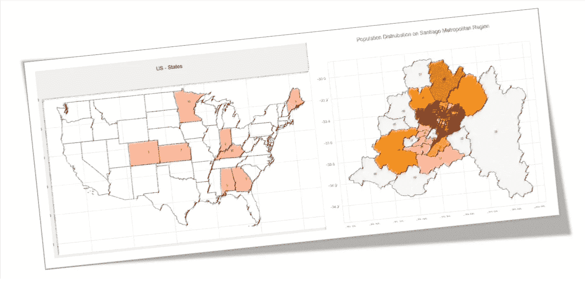

在数据科学领域工作时，一个很大的帮助是在地理地图上可视化您的数据，为此，有几个包可以处理它，例如 [GeoPandas](http://geopandas.org/index.html) 。

> 你可以学习如何使用 GeoPandas，阅读我的文章:[圣地亚哥的街道有多安全](/how-safe-are-the-streets-of-santiago-e01ba483ce4b)。

有时安装 Geopandas 包可能很复杂，这取决于您工作的环境。或者，简单地说，你需要控制你的代码！因此，在这篇文章中，我们将探索如何使用“形状文件”和基本的 Python 库来构建我们自己的“地理地图功能”。


## 1.形状文件

shapefile 格式由 Esri 作为(主要)开放规范开发和管理，在空间上将几何描述为“点”、“折线”或“多边形”。在 OpenStreetMap 术语中，这些可以分别被认为是'[节点](https://wiki.openstreetmap.org/wiki/Node)'、[路](https://wiki.openstreetmap.org/wiki/Way)和'[闭路](https://wiki.openstreetmap.org/wiki/Way#Closed_way)'。每个几何体都有一组关联的属性。概括地说，这些有点像 OSM 的标签。

shapefile 实际上是几个文件的组合，这些文件的格式表示地理数据的不同方面:

*   。shp —形状格式；特征几何本身。
*   。shx —形状索引格式；要素几何的位置索引，允许快速向前和向后搜索。
*   。dbf —属性格式；每个形状的列属性，dBase IV 格式。

还有几个 shapefile 格式的可选文件。其中最重要的是。描述所用坐标系和投影信息的 prj 文件。虽然不是 Esri shapefile 标准的一部分。lyr 文件通常包含在内，因为它包含如何在 [ArcGIS](https://wiki.openstreetmap.org/wiki/ArcGIS) 软件中显示数据(颜色、标签等)的规范。

> *更多信息见* [*维基百科*](http://en.wikipedia.org/wiki/Shapefile)

## 2.正在安装 Python 形状文件库(PyShp)

Python Shapefile 库(pyshp)为
Esri Shapefile 格式提供读写支持。Shapefile 格式是由 [Esri](http://www.esri.com/library/whitepapers/pdfs/shapefile.pdf) 创建的一种流行的地理
信息系统矢量数据格式。

要安装 *pyshp* ，请在您的终端中执行以下指令:

```
pip install pyshp
```

## 3.导入和初始化主 Python 库

```
import numpy as np
import pandas as pd
import shapefile as shp
import matplotlib.pyplot as plt
import seaborn as sns
```

**初始化虚拟化设置**

```
sns.set(style=”whitegrid”, palette=”pastel”, color_codes=True)
sns.mpl.rc(“figure”, figsize=(10,6))
```

如果您使用的是 Jupyter 笔记本电脑:

```
%matplotlib inline
```

## 4.打开矢量地图

如 1 中所述。，矢量地图是一组由多个文件组成的文件，其中 name.shp 是主文件，用于保存地理要素。重要的是，所有其他文件如' name.shx '，' name.dbf '等。，必须在同一文件夹中。

在本教程中，我们将使用与城市相关的地图(“Comunas”)，它们共同构成了圣地亚哥大都市地区。在 [INE(智利国家统计局)](http://www.ine.cl/herramientas/galeria-de-mapas/censo)，可以下载一组与地图相关的 shapefiles，这些文件是为最近一次 2017 年全国人口普查创建的:

*   Comuna.cpg
*   Comuna.shp
*   Comuna.dbf
*   Comuna.shp.xml
*   Comuna.prj
*   Comuna.shx
*   Comuna.sbn
*   Comuna.sbx

```
shp_path = “./Comunas_RM_Mapas_Vectoriales/Comuna.shp”
sf = shp.Reader(shp_path)
```

让我们检查一下函数 *shp 导入了多少不同的“形状”。读者:*

```
len(sf.shapes())
```

结果将是:52

这意味着在我们的形状文件中存在 52 个形状，一旦圣地亚哥大都会区有 52 个“comunas”，如下图所示(不要担心，在本文结束之前，您将学习如何直接从您的数据创建这样的地图):

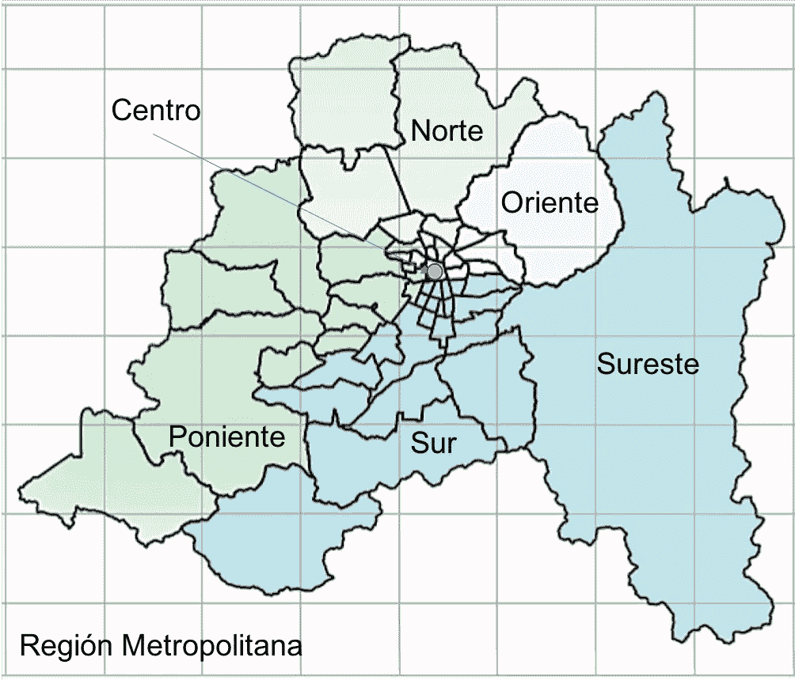

让我们也探索其中一个形状(或“记录”):

```
sf.records()[1]
```

结果将是一个包含 6 个元素的数组:

```
Out:['13',
 '131',
 '13115',
 'REGIÓN METROPOLITANA DE SANTIAGO',
 'SANTIAGO',
 'LO BARNECHEA']
```

元素[5]是“comuna”的名字，在这种情况下:“LO BARNECHEA”，一个位于安第斯山脉所在城市东部的“comuna”(也是我的家！；-)

你可以直接得到它的名字:

```
sf.records()[1][5]
```

圣地亚哥大都会区最中心的“comuna”正是圣地亚哥的 Comuna(小迷糊？)，在那里你可以找到大都会歌剧院、拉莫内达总统府(73 年被猛烈轰炸)、巴勃罗·聂鲁达故居等。

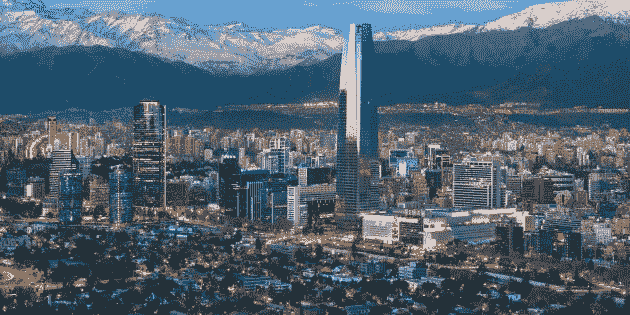

但是，让我们结束观光，看看圣地亚哥的 comuna 数据结构(id: 25):

```
sf.records()[25]
```

Out[]:

```
[‘13’,
 ‘131’,
 ‘13101’,
 ‘REGIÓN METROPOLITANA DE SANTIAGO’,
 ‘SANTIAGO’,
 ‘SANTIAGO’]
```

我们可以看到一些数据发生了变化，最重要的是“comuna”的名称，也就是现在的“SANTIAGO”。

> 请注意，您可以将本教程中描述内容应用于任何 shapfile。

## 5.在 Pandas 数据帧上转换 shapefile 数据

在最后一个例子中，我之前知道 Santiago 的 id 是“25”。但是如何找到这样的 id，从一个 comuna 的名字开始？让我们首先创建一个有用的函数，将我们的“shapefile”格式转换为更常见的熊猫数据帧格式:

```
def read_shapefile(sf):
    """
    Read a shapefile into a Pandas dataframe with a 'coords' 
    column holding the geometry information. This uses the pyshp
    package
    """
    fields = [x[0] for x in sf.fields][1:]
    records = sf.records()
    shps = [s.points for s in sf.shapes()] df = pd.DataFrame(columns=fields, data=records)
    df = df.assign(coords=shps) return df
```

因此，让我们转换数据帧上的 sf 数据，看看它是什么样子:

```
df = read_shapefile(sf)
df.shape
```

数据帧具有(52，7)的形状。这意味着我们每行有 7 个不同的特征(列)。请记住，我们之前看到了其中的 6 个功能。好像现在多加了一个。让我们看一个例子:

```
df.sample(5)
```

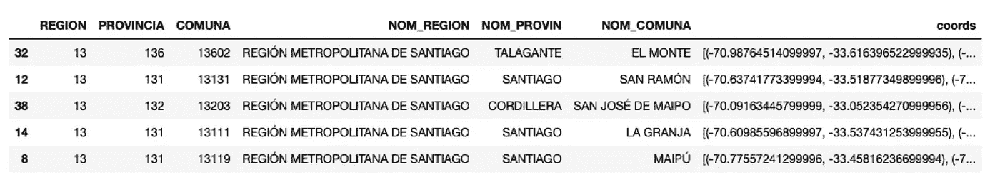

最后一列是用于创建特定地图形状的每个点的坐标、纬度和经度。

迷惑？让我们再深入挖掘一下。

我们如何定位圣地亚哥·科穆纳的身份？现在用熊猫很简单:

```
df[df.NOM_COMUNA == ‘SANTIAGO’]
```

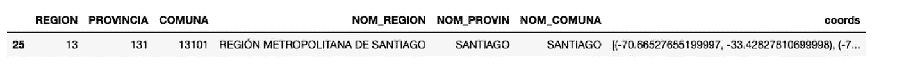

我们可以很容易地看到，25 正好是数据帧索引，也就是我们的 comuna 形状所在的位置。

通过简单的 Pandas 命令，您可以将索引(或 id)与 comuna 的名称相关联:

```
df.NOM_COMUNAOut:0 LAS CONDES
1 LO BARNECHEA
2 VITACURA
3 HUECHURABA
4 PUDAHUEL…49 ALHUÉ
50 LAMPA
51 TILTIL
```

## 6.绘制特定形状

最后，我们将看到什么是真正的形状。为此，我们应该创建一个函数来绘制它。我们将使用 Python MatPlotLib 库:

```
def plot_shape(id, s=None):
    """ PLOTS A SINGLE SHAPE """
    plt.figure()
    ax = plt.axes()
    ax.set_aspect('equal')
    shape_ex = sf.shape(id)
    x_lon = np.zeros((len(shape_ex.points),1))
    y_lat = np.zeros((len(shape_ex.points),1))
    for ip in range(len(shape_ex.points)):
        x_lon[ip] = shape_ex.points[ip][0]
        y_lat[ip] = shape_ex.points[ip][1] plt.plot(x_lon,y_lat) 
    x0 = np.mean(x_lon)
    y0 = np.mean(y_lat)
    plt.text(x0, y0, s, fontsize=10)
    # use bbox (bounding box) to set plot limits
    plt.xlim(shape_ex.bbox[0],shape_ex.bbox[2])
    return x0, y0
```

上面的函数做两件事:a)根据 comuna 的坐标绘制形状(多边形), b)计算并返回特定形状的中点(x0，y0)。这个中点也被用来定义在哪里印刷 comuna 的名字。

例如，对于我们著名的圣地亚哥的 comuna:

```
comuna = 'SANTIAGO'
com_id = df[df.NOM_COMUNA == comuna].index.get_values()[0]
plot_shape(com_id, comuna)
```

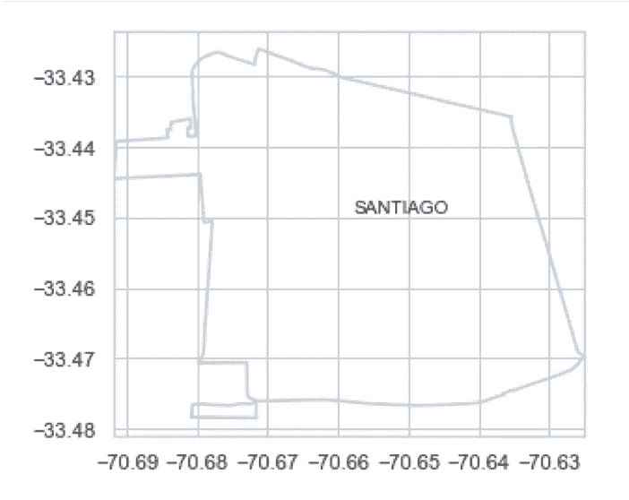

Santiago — Shape only

注意，我们必须知道形状 id(索引)才能绘制它，但是我们输入了 Comuna 的名称:SANTIAGO。使用 Pandas 很容易计算 id，正如您在前面代码的第二行所看到的。

## 7.绘制完整的地图

绘制单个形状基本上是为了解决这一小部分代码:

```
sf.shape(id)
```

现在，我们必须在同一张图上画出数据帧上的所有形状。为此，我们将使用以下函数:

```
def plot_map(sf, x_lim = None, y_lim = None, figsize = (11,9)):
    '''
    Plot map with lim coordinates
    '''
    plt.figure(figsize = figsize)
    id=0
    for shape in sf.shapeRecords():
        x = [i[0] for i in shape.shape.points[:]]
        y = [i[1] for i in shape.shape.points[:]]
        plt.plot(x, y, 'k')

        if (x_lim == None) & (y_lim == None):
            x0 = np.mean(x)
            y0 = np.mean(y)
            plt.text(x0, y0, id, fontsize=10)
        id = id+1

    if (x_lim != None) & (y_lim != None):     
        plt.xlim(x_lim)
        plt.ylim(y_lim)
```

默认情况下，上面的函数在一个给定的“df”文件上绘制所有的形状，包括它中间的形状 id。或者将绘制缩放的地图(无 id)。您可以更改打印或不打印 id 的功能。

**绘制全图:**

```
plot_map(sf)
```

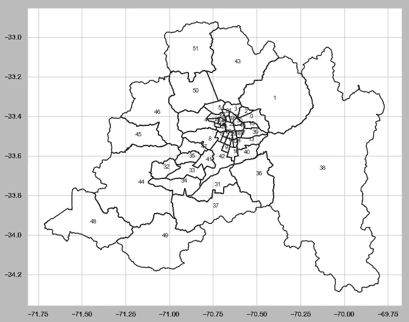

Full Map

**绘制地图:**

```
y_lim = (-33.7,-33.3) # latitude 
x_lim = (-71, -70.25) # longitudeplot_map(sf, x_lim, y_lim)
```

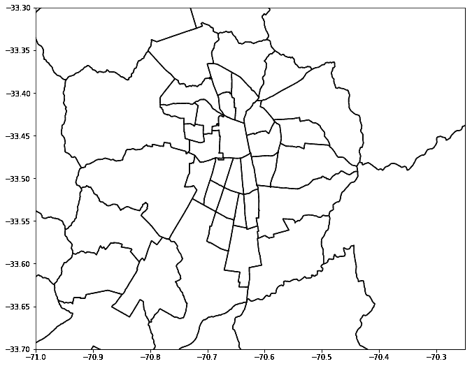

Full Map with Zoom

## 8.在完整的地图上绘制单个形状

我们可以“合并”前面的两个功能，并在完整的地图中“绘制”一个单一的形状。为此，让我们编写一个新函数，其中形状 id 现在是一个输入参数:

```
def plot_map2(id, sf, x_lim = None, y_lim = None, figsize=(11,9)):
    '''
    Plot map with lim coordinates
    '''

    plt.figure(figsize = figsize)
    for shape in sf.shapeRecords():
        x = [i[0] for i in shape.shape.points[:]]
        y = [i[1] for i in shape.shape.points[:]]
        plt.plot(x, y, 'k')

    shape_ex = sf.shape(id)
    x_lon = np.zeros((len(shape_ex.points),1))
    y_lat = np.zeros((len(shape_ex.points),1))
    for ip in range(len(shape_ex.points)):
        x_lon[ip] = shape_ex.points[ip][0]
        y_lat[ip] = shape_ex.points[ip][1]
    plt.plot(x_lon,y_lat, 'r', linewidth=3) 

    if (x_lim != None) & (y_lim != None):     
        plt.xlim(x_lim)
        plt.ylim(y_lim)
```

密谋圣地亚哥的《红色》中的 comuna:

```
plot_map2(25, sf, x_lim, y_lim)
```

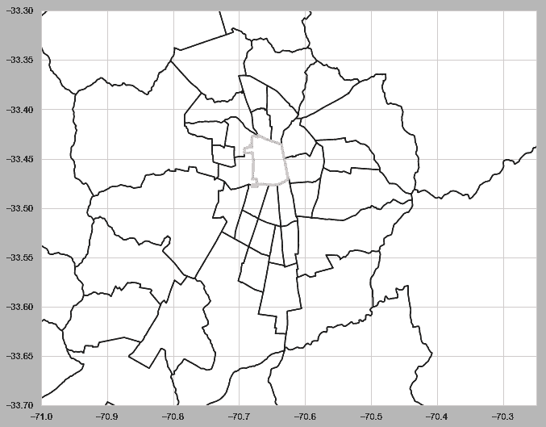

Santiago

如果我们想用特定的颜色“填充”一个形状呢？简单！为此，我们可以使用 plt.fill。该功能可以重写:

```
def plot_map_fill(id, sf, x_lim = None, 
                          y_lim = None, 
                          figsize = (11,9), 
                          color = 'r'):
    '''
    Plot map with lim coordinates
    '''

    plt.figure(figsize = figsize)
    fig, ax = plt.subplots(figsize = figsize) for shape in sf.shapeRecords():
        x = [i[0] for i in shape.shape.points[:]]
        y = [i[1] for i in shape.shape.points[:]]
        ax.plot(x, y, 'k')

    shape_ex = sf.shape(id)
    x_lon = np.zeros((len(shape_ex.points),1))
    y_lat = np.zeros((len(shape_ex.points),1))
    for ip in range(len(shape_ex.points)):
        x_lon[ip] = shape_ex.points[ip][0]
        y_lat[ip] = shape_ex.points[ip][1]
    ax.fill(x_lon,y_lat, color)

    if (x_lim != None) & (y_lim != None):     
        plt.xlim(x_lim)
        plt.ylim(y_lim)
```

用绿色(' g ')绘制“Las Condes”(id = 0)的 comuna:

```
plot_map_fill(0, sf, x_lim, y_lim, color='g')
```

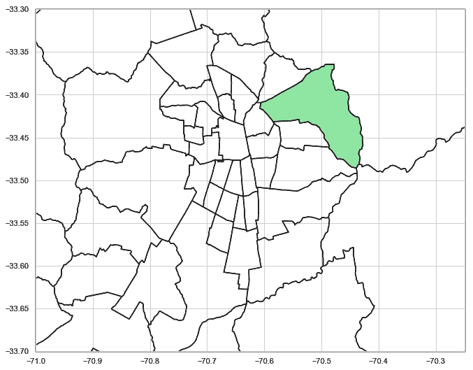

Las Condes

## 9.在完整地图上绘制多个形状

我们“艰难的地图之旅”的下一个自然步骤是创建一个选择了几个形状的地图。为此，我们将有一个 id 列表，并使用 For 循环用颜色填充每个 id，而不是用 id 作为输入参数。修改后的函数如下所示:

```
def plot_map_fill_multiples_ids(title, comuna, sf, 
                                               x_lim = None, 
                                               y_lim = None, 
                                               figsize = (11,9), 
                                               color = 'r'):
    '''
    Plot map with lim coordinates
    '''

    plt.figure(figsize = figsize)
    fig, ax = plt.subplots(figsize = figsize)
    fig.suptitle(title, fontsize=16) for shape in sf.shapeRecords():
        x = [i[0] for i in shape.shape.points[:]]
        y = [i[1] for i in shape.shape.points[:]]
        ax.plot(x, y, 'k')

    for id in comuna:
        shape_ex = sf.shape(id)
        x_lon = np.zeros((len(shape_ex.points),1))
        y_lat = np.zeros((len(shape_ex.points),1))
        for ip in range(len(shape_ex.points)):
            x_lon[ip] = shape_ex.points[ip][0]
            y_lat[ip] = shape_ex.points[ip][1]
        ax.fill(x_lon,y_lat, color)

        x0 = np.mean(x_lon)
        y0 = np.mean(y_lat)
        plt.text(x0, y0, id, fontsize=10)

    if (x_lim != None) & (y_lim != None):     
        plt.xlim(x_lim)
        plt.ylim(y_lim)
```

在上面的函数中，“comuna”现在是一个 id 列表:

```
comuna_id = [0, 1, 2, 3, 4, 5, 6]
plot_map_fill_multiples_ids("Multiple Shapes", 
                            comuna_id, sf, color = 'r')
```

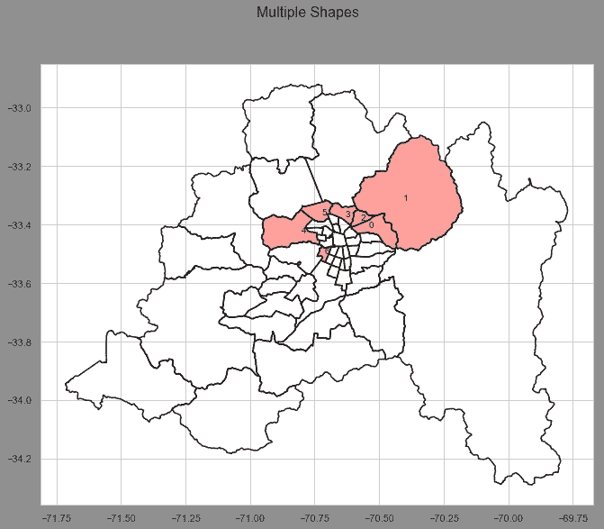

利用我们以前的 pandas 数据框架，让我们创建一个简单的函数，其中输入是 comuna 的名称，而不是它的 id:

```
def plot_comunas_2(sf, title, comunas, color):
    '''
    Plot map with selected comunes, using specific color
    '''

    df = read_shapefile(sf)
    comuna_id = []
    for i in comunas:
        comuna_id.append(df[df.NOM_COMUNA == i.upper()]
                         .index.get_values()[0])
    plot_map_fill_multiples_ids(title, comuna_id, sf, 
                                       x_lim = None, 
                                       y_lim = None, 
                                       figsize = (11,9), 
                                       color = color);
```

**绘制圣地亚哥大都市区南部城市:**

```
south = ['alhué', 'calera de tango', 'buin', 'isla de maipo', 'el bosque', 'paine', 'la granja', 'pedro aguirre cerda', 'lo espejo', 'puente alto', 'san joaquín', 'san miguel', 'pirque', 'san bernardo', 'san ramón', 'la cisterna', 'talagante', 'la pintana']plot_comunas_2(sf, 'South', south, 'c')
```

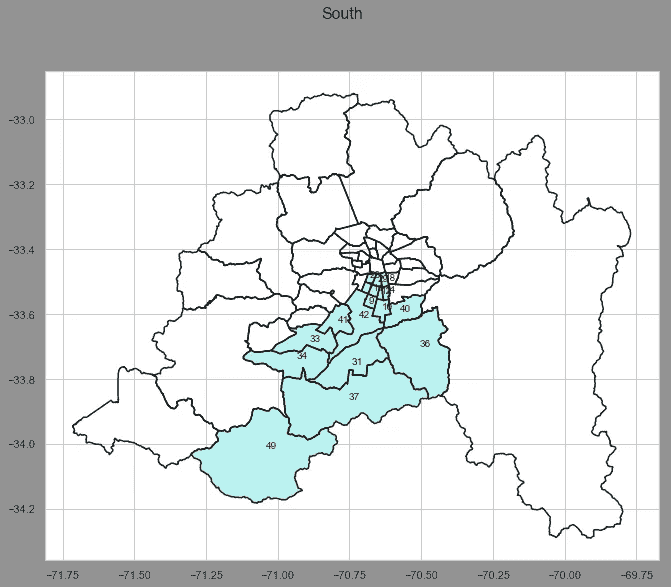

## 10.创建“热图”

一种非常有用的贴图类型是用颜色填充特定的形状，其“强度”与给定值成比例。这样，就有可能对特定地理区域的数据分布有一个总体的了解。例如，人口分布。

首先，我们将创建一个函数，一旦接收到一个数据列表，就会将它们拆分到“bin”上。每一颗豆子都会被赋予特定的颜色。就经验而言，通常 5 到 7 个箱对数据分布有很好的感觉。我们将使用 6 个箱子和与这些箱子相关的 4 个不同的调色板。您必须一次选择其中一个媒体夹。

```
def calc_color(data, color=None):
        if color   == 1: color_sq =  
                        ['#dadaebFF','#bcbddcF0','#9e9ac8F0',
                        '#807dbaF0','#6a51a3F0','#54278fF0']; 
                        colors = 'Purples';
        elif color == 2: color_sq = 
                        ['#c7e9b4','#7fcdbb','#41b6c4',
                        '#1d91c0','#225ea8','#253494']; 
                        colors = 'YlGnBu';
        elif color == 3: color_sq = 
                        ['#f7f7f7','#d9d9d9','#bdbdbd',
                        '#969696','#636363','#252525']; 
                        colors = 'Greys';
        elif color == 9: color_sq = 
                        ['#ff0000','#ff0000','#ff0000',
                        '#ff0000','#ff0000','#ff0000']
        else:            color_sq = 
                        ['#ffffd4','#fee391','#fec44f',
                        '#fe9929','#d95f0e','#993404']; 
                        colors = 'YlOrBr';
        new_data, bins = pd.qcut(data, 6, retbins=True,         labels=list(range(6)))
        color_ton = []
        for val in new_data:
            color_ton.append(color_sq[val]) 
        if color != 9:
            colors = sns.color_palette(colors, n_colors=6)
            sns.palplot(colors, 0.6);
            for i in range(6):
                print ("\n"+str(i+1)+': '+str(int(bins[i]))+
                       " => "+str(int(bins[i+1])-1), end =" ")
            print("\n\n   1   2   3   4   5   6")    
        return color_ton, bins;
```

函数 *plot_comunas()* 和*plot _ map _ fill _ multiples _ ids*都应该被修改以利用这种新的彩色方案:

```
def plot_comunas_data(sf, title, comunas, data=None, 
                      color=None, print_id=False):
    '''
    Plot map with selected comunes, using specific color
    '''

    color_ton, bins = calc_color(data, color)
    df = read_shapefile(sf)
    comuna_id = []
    for i in comunas:
        i = conv_comuna(i).upper()
        comuna_id.append(df[df.NOM_COMUNA == 
                            i.upper()].index.get_values()[0])
    plot_map_fill_multiples_ids_tone(sf, title, comuna_id, 
                                     print_id, 
                                     color_ton, 
                                     bins, 
                                     x_lim = None, 
                                     y_lim = None, 
                                     figsize = (11,9));
```

而且，

```
def plot_map_fill_multiples_ids_tone(sf, title, comuna,  
                                     print_id, color_ton, 
                                     bins, 
                                     x_lim = None, 
                                     y_lim = None, 
                                     figsize = (11,9)):
    '''
    Plot map with lim coordinates
    '''

    plt.figure(figsize = figsize)
    fig, ax = plt.subplots(figsize = figsize)
    fig.suptitle(title, fontsize=16)for shape in sf.shapeRecords():
        x = [i[0] for i in shape.shape.points[:]]
        y = [i[1] for i in shape.shape.points[:]]
        ax.plot(x, y, 'k')

    for id in comuna:
        shape_ex = sf.shape(id)
        x_lon = np.zeros((len(shape_ex.points),1))
        y_lat = np.zeros((len(shape_ex.points),1))
        for ip in range(len(shape_ex.points)):
            x_lon[ip] = shape_ex.points[ip][0]
            y_lat[ip] = shape_ex.points[ip][1]
        ax.fill(x_lon,y_lat, color_ton[comuna.index(id)])
        if print_id != False:
            x0 = np.mean(x_lon)
            y0 = np.mean(y_lat)
            plt.text(x0, y0, id, fontsize=10)
    if (x_lim != None) & (y_lim != None):     
        plt.xlim(x_lim)
        plt.ylim(y_lim) 
```

为了测试我们的新函数，让我们以之前圣地亚哥南部地区的形状列表为例，为每个形状关联一个常规值。我们将使用“调色板# 1(‘紫色’):

```
south = ['alhué', 'calera de tango', 'buin', 'isla de maipo', 'el bosque', 'paine', 'la granja', 'pedro aguirre cerda', 'lo espejo', 'puente alto', 'san joaquín', 'san miguel', 'pirque', 'san bernardo', 'san ramón', 'la cisterna', 'talagante', 'la pintana']data = [100, 2000, 300, 400000, 500, 600, 100, 2000, 300, 400, 500, 600, 100, 2000, 300, 400, 500, 600]print_id = True # The shape id will be printed
color_pallete = 1 # 'Purples'plot_comunas_data(sf, 'South', south, data, color_pallete, print_id)
```

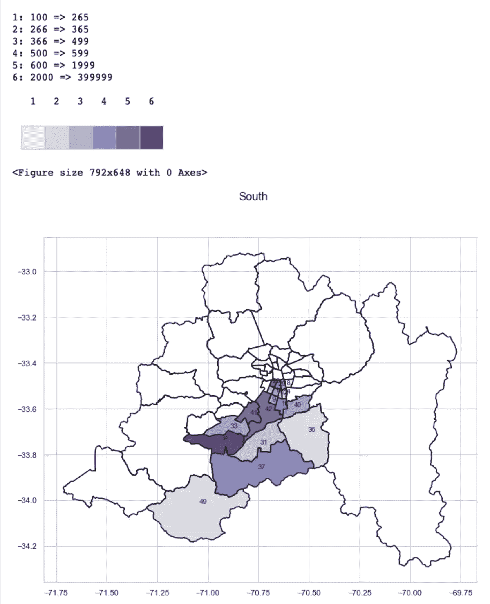

酷！不是吗？；-)

## 11.绘制真实数据

为了完成关于如何使用 Python 处理地图的概述，让我们从 2017 年智利人口普查中获取一些真实数据，并应用在第 10 部分开发的那些函数。

**读取数据集:**

```
census_17 = pd.read_excel('./data/CENSO_2017_COMUNAS_RM.xlsx')
census_17.shapeOut:
(52,7)
```

我们的数据集有 52 行，每一行都包含与圣地亚哥的每一个 comunas 相关的数据。

**查看数据集:**

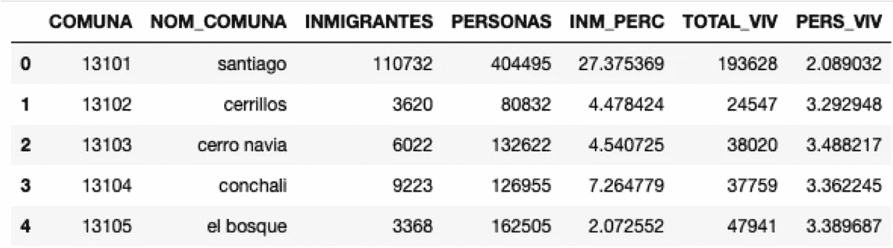

例如,“人物”一栏与居住在该特定社区的人数有关。“TOTAL_VIV”是那个 comuna 上的住宅总数，以此类推。

**绘图:**

让我们应用我们的地图功能来分析圣地亚哥大都市区的人口分布情况。

```
title = 'Population Distrubution on Santiago Metropolitan Region'
data = census_17.PERSONAS
names = census_17.NOM_COMUNAplot_comunas_data(sf, title, names, data, 4, True)
```

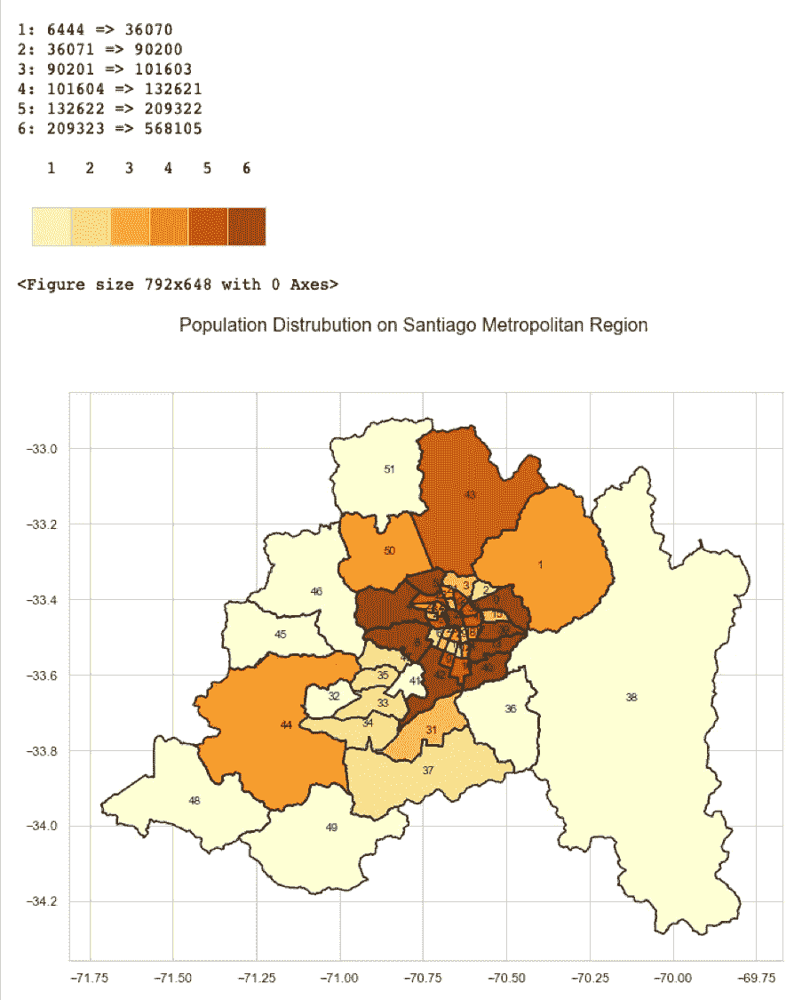

太好了！我们可以看到人口大量分布在都市圈的中心区域！东面(地图右边)，人口稀少，这是合乎逻辑的，因为这是伟大的安第斯山脉！西边和南边是农业区。

再来一个！让我们画出圣地亚哥大都会区移民占总人口的百分比:

```
title = 'Percentual of immigrants over total population'
data = census_17.INM_PERC
names = census_17.NOM_COMUNAplot_comunas_data(sf, title, names, data, 2, True)
```

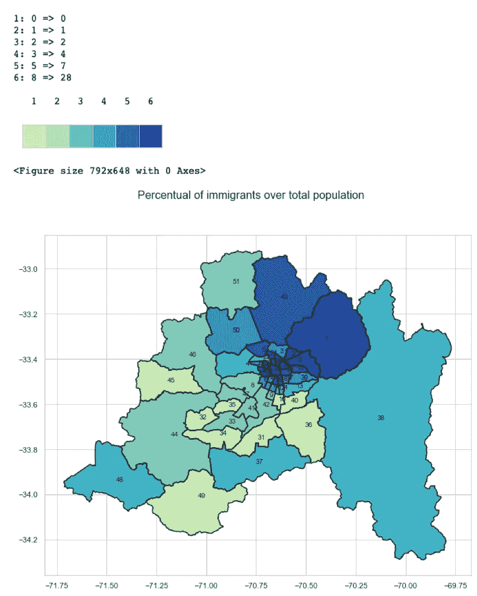

## 12.结论

您可以意识到，最终您可以使用本文开发的 3 个函数，只用一行代码创建一个地图:

```
plot_comunas_data() .... that calls:plot_map_fill_multiples_ids_tone() ... that calls:calc_color()
```

本文为 Santiago Matropolitan 地区开发的内容可以很容易地适用于互联网上的任何矢量地图！

例如，你可以去[美国人口普查局](https://www.census.gov/geo/maps-data/data/cbf/cbf_state.html)下载美国各州的地图边界形状文件。继圣地亚哥之后，

```
shp_path = "./cb_2017_us_state_5m/cb_2017_us_state_5m.shp"
sf = shp.Reader(shp_path)# Continental US
y_lim = (23, 50) # lat 
x_lim = (-128, -65) # longstate_id = [0, 10, 3, 5, 6, 7, 8, 30]
plot_map_fill_multiples_ids("US - States", state_id, sf, x_lim, 
                             y_lim, color = 'r', figsize = (15,9))
```

您可以绘制:

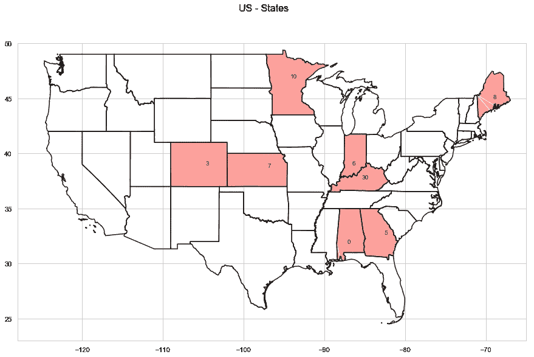

那都是乡亲们！

希望您对数据科学的奇妙世界有了更多的了解！

Jupyter 笔记本和本文使用的所有数据可以从我的 [GitHub](https://github.com/Mjrovai/Python4DS/tree/master/Vector_Mapping_Python) 下载。

我的下一篇文章再见！

来自世界南部的 Saludos！

马塞洛