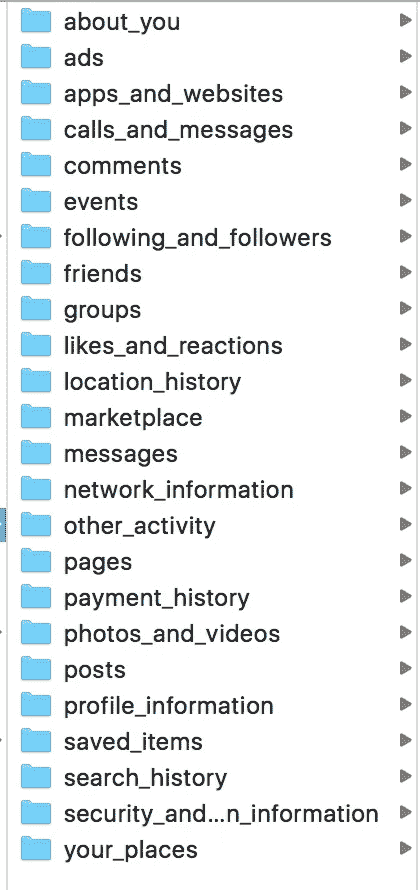
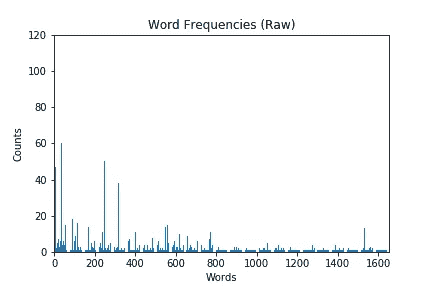
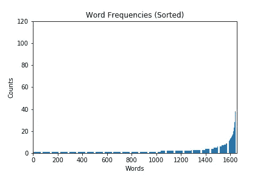
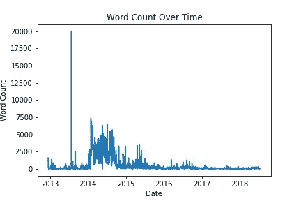
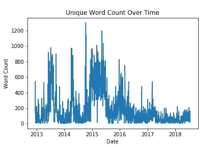

# 绘制我的脸书数据—第 1 部分:简单的 NLP

> 原文：<https://towardsdatascience.com/mapping-my-facebook-data-part-1-simple-nlp-98ce41f7f27d?source=collection_archive---------13----------------------->

NLP 看看我的写作风格(以及如何处理你自己的脸书数据！)


# 介绍

不久前，我被自己一天生成的文本数据量深深吸引住了。如果你像我一样，你可能会写很多东西。电子邮件。短信。脸书。也许你还有其他一些创造性的出路。也许你写日记或写音乐什么的。也许你是个学生，有一些写作作业。对我来说，我真的很想深入了解我正在生成的所有这些数据，并认为使用自然语言处理来分析这些数据会很酷。

这个系列将记录我是如何做的，如果你感兴趣的话，你也可以做同样的事情。

# 查找我的数据

当我仔细思考所有的数据时，我决定关注几个来源。他们是:

*   我的书面学校作业
*   我写的日记
*   我写的歌曲集
*   我的脸书数据(我的评论、帖子和聊天)

虽然对于我的整个项目，我使用了所有的资料来源，但对于这个系列，我只打算使用我在脸书的数据。

对于大多数数据，我只是把它放在一个文本文件中，然后就收工了。对于脸书的数据，我必须做更多的预处理。

## 如何获得你的脸书数据

我们如何真正得到我们的脸书数据？实际上，这比你想象的要简单。截至目前(2018 年 8 月 20 日)，您可以通过以下方式下载数据:

*   登录脸书
*   点击右上角朝下的三角形
*   单击设置
*   在左上角，第三个选项是“你的脸书信息”点击这个
*   下一个菜单中的选项#2 将是“下载您的信息”
*   从这里，您可以决定想要什么数据，什么时间段，什么格式

我选择下载所有的东西，而且是 JSON 格式的。当我的下载准备好了，我得到了一堆这样的文件夹:



装满了我要求的 JSON。

## 预处理您的脸书数据

我想下载我所有的脸书数据，但实际上我并不想要这个项目的所有脸书数据。对于这个项目，我只关心我的帖子、评论和聊天记录。为了帮助解决这个问题，我为其中的每一个都编写了一个预处理脚本，以便将我想要的内容转储到文本文件中。

首先，我处理了我的信息:

```
import os
import json
import datetime

chat_root = 'messages'
writing_dir = 'data/facebook_chat'

for f in os.listdir(chat_root):
    file = os.path.join(chat_root, f, 'message.json')
    data = json.load(open(file, 'r'))

    for msg in data['messages']:
        try:
            if msg['sender_name'] == 'Hunter Heidenreich':
                if msg['content'] != "You are now connected on Messenger.":
                    content = msg['content']
                    ts = datetime.datetime.fromtimestamp(msg['timestamp_ms'] / 1000)

                    filename = os.path.join(writing_dir,
                                            str(ts.year) + '.' + str(ts.month) + '.' + str(ts.day) + '.txt')

                    with open(filename, 'a+') as out_file:
                        out_file.write(content + '\n')
                        print('wrote.')
        except KeyError:
            pass
```

您将看到，我正在遍历 messages 文件夹中的所有子文件夹。我在那里做的是读取消息 JSON。对于每条可用的消息，我都会检查它是否是我发送的消息。如果不是脸书默认的“您现在已在 Messenger 上连接”那我要了。我给消息打上时间戳，然后将它添加到一个采用`year.month.day.txt`格式的文件中，这是我给所有文本文件打上时间戳的格式，这样我就可以记录词汇随时间的变化。

如果由于某种原因 JSON 的键不起作用，我就忽略它。

我对我写的两个帖子做了非常相似的事情:

```
import os
import datetime
import json

in_data = 'posts/your_posts.json'
writing_dir = 'data/facebook_posts'

data = json.load(open(in_data, 'r'))

for post in data['status_updates']:
    try:
        ts = datetime.datetime.fromtimestamp(post['timestamp'])
        post_text = post['data'][0]['post']

        filename = os.path.join(writing_dir, str(ts.year) + '.' + str(ts.month) + '.' + str(ts.day) + '.txt')

        with open(filename, 'a+') as out_file:
            out_file.write(post_text + '\n')
    except KeyError:
        print(post)
```

我的评论是:

```
import os
import datetime
import json

comment_path = 'comments/comments.json'
writing_dir = 'data/facebook_comments'

data = json.load(open(comment_path, 'r'))
for comment in data['comments']:
    try:
        for d in comment['data']:
            if d['comment']['author'] == "Hunter Heidenreich":
                ts = datetime.datetime.fromtimestamp(d['comment']['timestamp'])
                com = d['comment']['comment']

                filename = os.path.join(writing_dir, str(ts.year) + '.' + str(ts.month) + '.' + str(ts.day) + '.txt')

                with open(filename, 'a+') as out_file:
                    out_file.write(com + '\n')
    except KeyError:
        print(comment)
```

从那里，我准备好了我的脸书数据。

# 加载我们的数据

首先，我们将编写一个简单的函数来获取某个类别中所有文件的列表。这将使我们能够轻松地跟踪哪个是哪个，并且我们将在处理和分析数据时保留这些命名方案。

```
import os

def get_file_list(text_dir):
    files = []
    for f in os.listdir(text_dir):
        files.append(os.path.join(text_dir, f))
    return files

comments = 'data/facebook_comments'
posts = 'data/facebook_posts'
chats = 'data/facebook_chat'

comment_files = get_file_list(comments)
post_files = get_file_list(posts)
chat_files = get_file_list(chats)

all_files = comment_files + post_files + chat_files
```

在我们实际读入数据之前，我们将编写一个函数，用几种不同的方式对数据进行预处理。

```
import string

import nltk
from nltk.corpus import stopwords
from nltk.stem import SnowballStemmer
from nltk.stem import WordNetLemmatizer

def preprocess_text(lines):

    def _flatten_list(two_list):
        one_list = []
        for el in two_list:
          one_list.extend(el)
        return one_list

    translator = str.maketrans('', '', string.punctuation)
    upd = []
    for line in lines:
        upd.extend(nltk.sent_tokenize(line))
    lines = [line.translate(translator) for line in upd]
    lines = [nltk.word_tokenize(line) for line in lines]
    lines = [[word.lower() for word in line if word not in [
        '\'', '’', '”', '“']] for line in lines]

    raw = lines

    stop = [[word for word in line if word not in set(
        stopwords.words('english'))] for line in raw]

    snowball_stemmer = SnowballStemmer('english')
    stem = [[snowball_stemmer.stem(word) for word in line] for line in stop]

    wordnet_lemmatizer = WordNetLemmatizer()
    lemma = [[wordnet_lemmatizer.lemmatize(
        word) for word in line] for line in stop]

    raw = _flatten_list(raw)
    stop = _flatten_list(stop)
    stem = _flatten_list(stem)
    lemma = _flatten_list(lemma)

    return raw, stop, stem, lemma
```

我们在这里所做的是产生我们文本的 4 个变体。我们正在生产:

*   我们的原始数据去掉了标点符号，用了小写字母
*   删除了停用词的数据
*   我们的数据来源于
*   我们的数据被假设了

考虑到这一点，我们现在可以创建一个基本的对象来保存我们的文件数据数据，并允许使用聚合来自脸书的不同来源的写作发生在同一天:

```
class FileObject:
    def __init__(self):
        self._datetime = None

        self._lines = []

        self._raw = []
        self._stop = []
        self._stem = []
        self._lemma = []

    @property
    def lines(self):
        return self._lines

    def preprocess_text(self):
        self._raw, self._stop, self._stem, self._lemma = preprocess_text(
            self._lines)
```

现在让我们加载数据并对其进行预处理。我将演示聚合数据上的代码，但它也适用于其他输入文件列表:

```
all_text = {}

for f in all_files:
    base = os.path.basename(f)

    if base not in all_text:
        all_text[base] = FileObject()

    with open(f, 'r') as in_file:
        all_text[base]._lines += in_file.readlines()

for k, v in all_text.items():
    v.preprocess_text()
```

这可能需要很短的时间，但当我们完成后，我们将能够开始看看关于我们的文本的一些基本的东西！

# 我最喜欢的词是什么？

让我们从最基本的开始。我们把这些单词列表加载到各种资源中。让我们做一个统计，看看我们最常用的词是什么。让我们看看我们的 20 强。

我们可以这样写:

```
from collections import Counter

def file_objects_to_words(fo_text):
    raw, stop, stem, lemma = [], [], [], []
    for key, value in fo_text.items():
        raw.append(value._raw)
        stop.append(value._stop)
        stem.append(value._stem)
        lemma.append(value._lemma)
    return raw, stop, stem, lemma

def top_20_words(list_of_word_lists):
    full_count = Counter()

    for word_list in list_of_word_lists:
        for word in word_list:
            full_count[word] += 1

    return full_count.most_common(20)

raw, stop, stem, lemma = file_objects_to_words(all_text)
print('All words -- raw')
print(top_20_words(raw))
print('All words -- stop')
print(top_20_words(stop))
print('All words -- stem')
print(top_20_words(stem))
print('All words -- lemma')
print(top_20_words(lemma))

print('Chat words -- lemma')
_, _, _, lemma = file_objects_to_words(chat_text)
print(top_20_words(lemma))
print('Post words -- lemma')
_, _, _, lemma = file_objects_to_words(post_text)
print(top_20_words(lemma))
print('Comment words -- lemma')
_, _, _, lemma = file_objects_to_words(comment_text)
print(top_20_words(lemma))
```

我们将得到一个很好的输出:

```
All words -- raw
[('i', 47935), ('you', 43131), ('to', 24551), ('and', 20882), ('the', 18681), ('that', 16725), ('a', 15727), ('it', 15140), ('haha', 13516), ('me', 12597), ('like', 10149), ('so', 9945), ('im', 9816), ('but', 8942), ('do', 8599), ('is', 8319), ('of', 8266), ('just', 8154), ('be', 8092), ('my', 8017)]
All words -- stop
[('haha', 13516), ('like', 10149), ('im', 9816), ('na', 6528), ('yeah', 5970), ('dont', 5361), ('okay', 5332), ('good', 5253), ('know', 4896), ('would', 4702), ('think', 4555), ('thats', 4163), ('want', 4148), ('cause', 3922), ('really', 3803), ('get', 3683), ('wan', 3660), ('hahaha', 3518), ('well', 3332), ('feel', 3231)]
All words -- stem
[('haha', 13516), ('like', 10580), ('im', 9816), ('na', 6528), ('yeah', 5970), ('think', 5772), ('want', 5396), ('dont', 5364), ('okay', 5333), ('good', 5261), ('know', 5078), ('would', 4702), ('get', 4535), ('feel', 4270), ('that', 4163), ('caus', 3992), ('go', 3960), ('realli', 3803), ('make', 3727), ('wan', 3660)]
All words -- lemma
[('haha', 13516), ('like', 10207), ('im', 9816), ('na', 6530), ('yeah', 5970), ('dont', 5361), ('okay', 5333), ('good', 5254), ('know', 5038), ('would', 4702), ('think', 4631), ('want', 4419), ('thats', 4163), ('cause', 3934), ('get', 3901), ('really', 3803), ('wan', 3660), ('hahaha', 3518), ('feel', 3358), ('well', 3332)]
Chat words -- lemma
[('haha', 13464), ('like', 10111), ('im', 9716), ('na', 6497), ('yeah', 5957), ('okay', 5329), ('dont', 5316), ('good', 5226), ('know', 4995), ('would', 4657), ('think', 4595), ('want', 4384), ('thats', 4150), ('cause', 3913), ('get', 3859), ('really', 3760), ('wan', 3649), ('hahaha', 3501), ('feel', 3336), ('well', 3299)]
Post words -- lemma
[('game', 68), ('video', 41), ('check', 38), ('like', 36), ('birthday', 36), ('happy', 34), ('im', 33), ('noah', 29), ('song', 28), ('play', 24), ('music', 21), ('one', 20), ('get', 19), ('guy', 18), ('time', 18), ('made', 18), ('evans', 18), ('hey', 17), ('make', 17), ('people', 16)]
Comment words -- lemma
[('noah', 120), ('im', 67), ('like', 60), ('evans', 60), ('thanks', 51), ('game', 50), ('haha', 47), ('cote', 44), ('one', 43), ('coby', 40), ('wilcox', 38), ('would', 33), ('man', 31), ('dont', 29), ('really', 29), ('know', 28), ('think', 28), ('na', 24), ('want', 23), ('get', 23)]
```

我喜欢只看我的词条，所以这就是为什么我只记录我个人的来源。我觉得有趣的是，我在聊天中经常使用“哈哈”的变体。我的大部分评论都是某人的名字。

# 我的单个单词用法是什么样的？

那么，如果我们想用图表来表示我们的单个单词，看看我们的用法是如何从顶部单词到底部单词衰减的呢？我们可以编写一个一般的条形图函数，如下所示:

```
from matplotlib import pyplot as plt

def plot_bar_graph(x, y, x_label='X', y_label='Y', title='Title', export=False, export_name='default.png'):
    plt.bar(x, y)
    plt.xlabel(x_label)
    plt.ylabel(y_label)
    plt.title(title)
    plt.xlim(0, len(x))
    plt.ylim(0, max(y))

    if export:
        plt.savefig(export_name)

    plt.show()
```

从那里，我们可以修改我们的前 20 个函数，并可以将我们的注释引理列表直接输入到图形中:

```
def aggregate_words_counts(list_of_word_lists):
    full_count = Counter()

    for word_list in list_of_word_lists:
        for word in word_list:
            full_count[word] += 1

    return full_count

counter = aggregate_words_counts(lemma)
word_counts_raw = list(counter.values())
word_counts_sorted = sorted(word_counts_raw)

cap = len(word_counts_raw)

plot_bar_graph(range(len(word_counts_raw[:cap])), word_counts_raw[:cap],
                      x_label='Words', y_label='Counts', title='Word Frequencies (Raw)',
                      export=True, export_name='visualizations/word_freq_bar_raw.png')
plot_bar_graph(range(len(word_counts_sorted[:cap])), word_counts_sorted[-cap:],
                      x_label='Words', y_label='Counts', title='Word Frequencies (Sorted)',
                      export=True, export_name='visualizations/word_freq_bar_sorted.png')
```

我们得到了两张非常好的图表:



# 我的数据有哪些基本统计数据？

让我们根据数据生成一些基本的统计数据。让我们设置一个函数来创建一个表:

```
def plot_table(cell_data, row_labels=None, col_labels=None, export=False, export_name='default.png'):
    _ = plt.figure(figsize=(6, 1))

    _ = plt.table(cellText=cell_data, rowLabels=row_labels,
                  colLabels=col_labels, loc='center')

    plt.axis('off')
    plt.grid(False)

    if export:
        plt.savefig(export_name, bbox_inches='tight')

    plt.show()
```

然后生成要转储到该函数中的数据:

```
import numpy as np

def top_k_words(list_of_word_lists, k=10):
    full_count = Counter()

    for word_list in list_of_word_lists:
        for word in word_list:
            full_count[word] += 1

    return full_count.most_common(k)

raw, stop, stem, lemma = file_objects_to_words(all_text)

counter = aggregate_words_counts(lemma)
data = [[len(all_files)],
        [top_k_words(lemma, k=1)[0][0] + ' (' + str(top_k_words(lemma, k=1)[0][1]) + ')'],
        [top_k_words(lemma, k=len(list(counter.keys())))[-1][0] + ' (' + str(top_k_words(lemma, k=len(list(counter.keys())))[-1][1]) + ')'],
        [len(counter.items())],
        [np.mean(list(counter.values()))],
        [sum([len(word_list) for word_list in raw])],
        [sum([sum([len(w) for w in word_list]) for word_list in raw])]]
row_labels = ['Collection size: ', 'Top word: ', 'Least common: ', 'Vocab size: ', 'Average word usage count: ',
              'Total words: ', 'Total characters: ']

plot_table(cell_data=data, row_labels=row_labels,
                  export=True, export_name='visualizations/basic_stats_table.png')
```


这些只是我认为有趣的一些数据。这次我把所有的数据都放了进去，因为我觉得这是最有趣的。

我们可以看到，我在脸书有 2147 天的文本活动。

我最喜欢的词是“哈哈”(这并不奇怪)。

总共 19，508 个单词

我用了将近 400 万个字符。

这是大量的文本数据！

# 随着时间的推移，我的 Vocab 使用情况如何？

我想知道随着时间的推移，我的 vocab 使用情况如何变化。我们怎样才能产生这种效果呢？好吧，幸运的是我们给所有的文件都打上了时间戳！

首先，让我们创建我们的绘图函数:

```
def plot(x, y, x_label='X', y_label='Y', title='Title', export=False, export_name='default.png'):
    plt.plot(x, y)
    plt.xlabel(x_label)
    plt.ylabel(y_label)
    plt.title(title)

    if export:
        plt.savefig(export_name)

    plt.show()
```

现在让我们写一些函数来绘制我们的单词使用情况:

```
import datetime

def get_datetimes(list_of_files):
    base_files = [os.path.basename(f) for f in list_of_files]
    no_ext = [os.path.splitext(f)[0] for f in base_files]
    splits = [f.split('.') for f in no_ext]
    times = np.array(
        [datetime.datetime(int(t[0]), int(t[1]), int(t[2])) for t in splits])
    return times

def unique_vocab(word_list):
    cnt = Counter()
    for word in word_list:
        cnt[word] += 1
    return cnt

raws = []
names = []
for key, value in all_text.items():
    raws.append(value._raw)
    names.append(key)

raw_wc = [len(word_list) for word_list in raws]
labels = get_datetimes(names)

labels, raw_wc = zip(*sorted(zip(labels, raw_wc)))

plot(labels, raw_wc,
            x_label='Date', y_label='Word Count', title='Word Count Over Time',
            export=True, export_name='visualizations/word_count_by_time.png')

raw_wc_u = [len(list(unique_vocab(word_list).items())) for word_list in raws]
plot(labels, raw_wc_u,
            x_label='Date', y_label='Word Count', title='Unique Word Count Over Time',
            export=True, export_name='visualizations/unique_word_count_by_time.png')
```

我们开始吧:



我觉得真的很有意思，2013 年年中，我用了很多词。我不太确定我在做什么，但是当你把它分解成独特的词时，在我那天使用的 20，000 个词中，没有多少是非常独特的…

更不用说，在 2017 年后，你肯定可以看到我的脸书使用量下降。

我觉得这真的很酷！

# 包扎

我们做到了！对我们的一些脸书数据的基本分析。希望你从你的脸书数据中学到了一两个技巧，也许还有一些关于你自己的东西！我知道当我开始分析我自己的时候，我确实是这样想的。如果你有很酷的视觉效果或者你想分享的东西，给我留言吧！很好奇看看别人在自己的数据里发现了什么。

下一次，我想我们会尝试对我们的脸书数据进行一些情绪分析，看看我们是否能从中找到任何有趣的花絮。

如果你喜欢这篇文章，或者发现它在任何方面都有帮助，如果你给我一两美元来资助我的机器学习教育和研究，我会永远爱你！每一美元都让我离成功更近一步，我永远心存感激。

请继续关注更多的脸书 NLP 分析！

最初发布于 hunterheidenreich.com 的[。](http://hunterheidenreich.com/blog/map-my-writing-part-1/)