# 通过网络搜集 MapMyRun.com 和硒在 R

> 原文：<https://towardsdatascience.com/mapping-physical-activity-with-r-selenium-and-leaflet-ac3002886728?source=collection_archive---------16----------------------->

我们都知道锻炼是我们身心健康最重要的因素之一。随着新的一年即将到来，一个强有力的宣言是**锻炼更多！**一定会在很多分辨率排行榜上名列前茅。但是要弄清楚如何真正做到这一点是很困难的。虽然一月是[开设健身房会员最常见的月份](https://www.newsweek.com/2016/01/15/new-year-new-gym-new-you-january-412054.html)，受健身中心无处不在的*新年，新的我的刺激！在一些城市，这样的计划平均每年要花费 800 美元，这让许多美国人望而却步。一些人选择购买他们自己的设备，这种购买在新年[达到高峰](https://www.consumerreports.org/sports-exercise-equipment/best-places-to-buy-exercise-equipment/)，但这仍然会带来[可观的价格标签](https://www.treadmillreviews.net/used-vs-new-treadmills/)。这些障碍限制了锻炼的机会，增加了我们的健康不平等，这已经是世界上最糟糕的健康不平等了。*

这些经济限制，加上个人偏好等其他因素，导致许多人转向另一种选择:外出健身。近 6000 万人说他们在 2017 年慢跑或越野跑，比 2006 年增加了 60%，还有 1 亿 T2 人说他们出去散步是为了个人健康。虽然这是对大自然的奇妙利用，但它也带来了另一个问题:并不是所有的户外都同样美丽。大多数美国城市被划分为[高贫困和低贫困社区](https://www.citylab.com/equity/2016/12/the-persistent-inequality-of-neighborhoods/509408/)，中间几乎没有。马里兰大学的助理教授拉肖恩·雷博士说，高度贫困地区的人们不太可能锻炼，因为他们遭受犯罪的可能性更大。由于非洲裔美国人和西班牙裔美国人遭受极端贫困的可能性是白人的两倍多，这些邻里差异也导致了我们日益扩大的种族健康差距。


Photo by [Kate Trifo](https://unsplash.com/@katetrifo?utm_source=medium&utm_medium=referral) on [Unsplash](https://unsplash.com?utm_source=medium&utm_medium=referral)

多伦多大学教授理查德·佛罗里达写道，解决这些问题需要“大量投资来改善贫困社区”，但是这种彻底的改变很难实现。与其等待整个社区被彻底改造，我想知道我是否能在高贫困社区内或附近找到“绿洲”,作为居住在附近的个人的运动区。人们通常不知道藏在自家后院的宝藏，这项分析可以解决这个问题。这也有利于那些想要改变锻炼习惯的活跃人群。我在户外锻炼的一个主要原因是探索我所在城市的新领域，但在像巴尔的摩这样的地方，错误的转弯可能是危险的，我经常发现自己坚持自己熟悉的东西。有了这些内部信息，无畏的城市探险者可以更安全地进行他们的冒险。


Photo by [Erin White](https://unsplash.com/@dkmoneymomo?utm_source=medium&utm_medium=referral) on [Unsplash](https://unsplash.com?utm_source=medium&utm_medium=referral)

为了进行这项分析，我计算了在过去的四年里，巴尔的摩地区的每个 GPS 坐标在 [MapMyRun](http://mapmyrun.com) 上发布的一项锻炼中被包含的次数。我分析了近 20，000 次锻炼，这些锻炼是我用 [Selenium ChromeDriver](https://www.seleniumhq.org/) 刮下来的，在 R 中整理，并在 [Kaggle](https://www.kaggle.com/jessekerr/bmoresbestroutes) 上分享。然后我使用 Javascript 中的[传单](https://leafletjs.com/)库来映射数据。本文将展示如何做到这一点，并提供在另一个城市重复这一过程所需的所有步骤。这篇文章开头的地图绝不是一个成品，如果有传单或 Javascript 经验的人能帮助我扩展它的功能，我将不胜感激。要参与或分享反馈，请发推特给我 [@halfinit](https://twitter.com/halfinit) 或访问该项目的 [Github 资源库](https://github.com/Jesse-Kerr/MapMyRunRedone)。

# 获取数据

我选择使用安德玛旗下的路线追踪应用 MapMyRun 作为我的数据源，因为它有大量用户生成的巴尔的摩市和周边地区的锻炼数据。MapMyRun.com 的路线显示为覆盖在谷歌地图上的红色轨迹。这里有一个例子，2016 年 10 月 26 日发布的随机选择的 7.4 英里跑步。

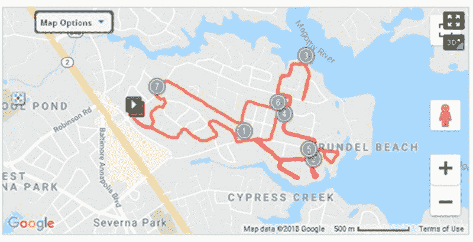

Run centered in Severna Park, Maryland.

虽然这 20，000 张路线图可以进行很好的罗夏测试，但我们需要的是作为其基础的数据，这些数据包含在一个 **GPX 文件中的一列 **GPS 坐标**中。**我们可以手动进入每次跑步的网页下载 GPX 文件，但使用 Selenium ChromeDriver 来自动化这个过程肯定更有效。如果您想按照代码进行操作，您需要在 Linux 虚拟机上运行的 Docker 容器中设置 Selenium。为了进行设置，以及获得浏览器自动化的基本背景，请查看我的教程。对于 webscraping 代码，对 HTML、CSS 和 Javascript 等 web 开发概念的基本理解将对您有所帮助。

# 在 R 中加载库并启动 Selenium

```
**# Load the necessary libraries** library(tidyverse)**# Contains many important functions including %>%** library(RSelenium)**# Allows you to call Selenium functions through R** library(rgdal) **# We will use this for reading in GPX files** library(beepr) **# Alerts you when R finishes a long analysis****# Load Selenium in R. You'll need to have started Selenium with the Docker Quickstart Terminal first- See** [**tutorial**](/an-introduction-to-web-browser-automation-with-selenium-and-docker-containers-c1bcbcb91540) **for info!)** **# Tell Selenium to download files to a specific directory in
# the Docker Linux OS.** eCaps <- list(chromeOptions =
 list(prefs = list(
  “profile.default_content_settings.popups” = 0L,
  “download.prompt_for_download” = FALSE,
  “download.default_directory” = “home/seluser/Downloads”
  )
 )
)**# Sets how long the driver should wait when searching for elements.** remDr$setTimeout(type = “implicit”, milliseconds = 100000)**# Sets how long it should wait for the page to load.** remDr$setTimeout(type = “page load”, milliseconds = 100000)**# Set up the remoteDriver as remDr. Include chromeOptions** remDr <- remoteDriver(remoteServerAddr = “192.168.99.100”, browserName= “chrome”, port=4445L, extraCapabilities = eCaps)**#Open remoteDriver** remDr$open()
```

现在我们在 r 中有一个到 Selenium ChromeDriver 的活动连接，在你的全局环境中，`remDr`应该是一个`object containing active binding`。

要在 MapMyRun 中做任何事情，我们首先需要登录我们的帐户，我们可以从 MapMyRun 主页访问它。

```
**#Navigate to MapMyRun homepage** remDr$navigate(“[https://www.mapmyrun.com](https://www.mapmyrun.com)")remDr$screenshot(display = TRUE)
```

在整个教程中，我使用`remDr$screenshot`函数来显示浏览器中正在发生的事情。如果你看到一个截图，这意味着它被调用了，尽管为了简洁起见我会把它排除在外。

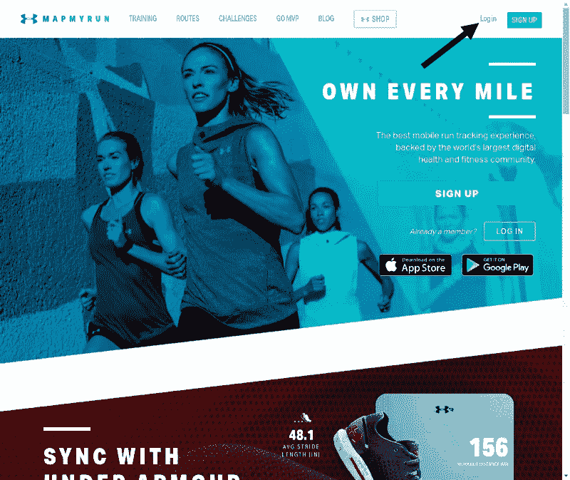

我们需要点击右上角的 Log in 链接，我们可以通过它的 **xpath** 来识别它。xpath 只是一个 web 元素的路径。一个**绝对 xpath** 从网页的根开始，并以`/`开始，而一个**相对 xpath** 从任何被选择的节点开始，并以`//`开始。这里，我使用从 HTML 文档的`header`开始的相对 xpath，所以我的 xpath 从`//header`开始。

```
login <- remDr$findElement(using = “xpath”, “//header/div[2]/nav[2]/ul/li[1]/a”)
```

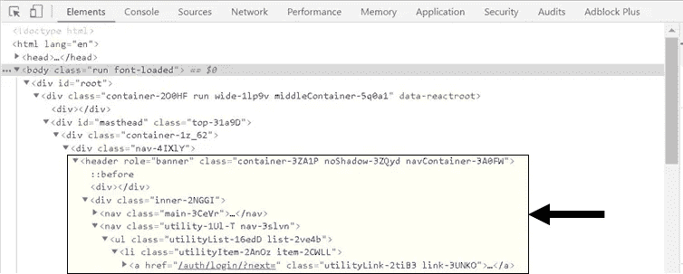

The HTML for MapMyRun’s homepage, with the relative xpath to the Log in Link highlighted.

现在我们告诉 ChromeDriver 点击 login 元素。

```
login$clickElement()
```

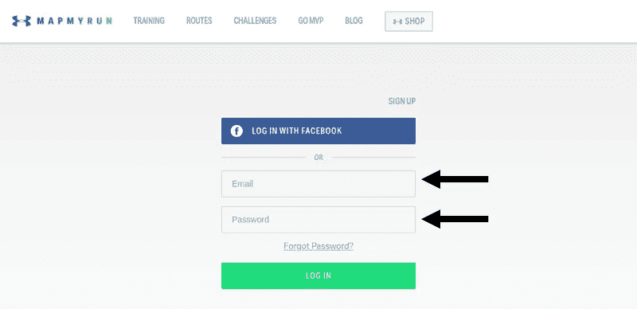

这将把我们带到登录页面，在这里我们需要输入我们的电子邮件和密码。但是它们的输入形式都是**输入元素**，那么我们如何区分它们呢？幸运的是，web 开发人员已经通过给每个元素赋予自己的**属性**解决了这个问题。[存在许多类型的属性](https://www.w3schools.com/tags/ref_attributes.asp)，但是我们将主要使用的三个是**名称、ID 和类别**。每个网页只使用一次 id，而类可以多次使用。姓名通常用在[表单](https://stackoverflow.com/questions/1397592/difference-between-id-and-name-attributes-in-html)中，就像我们的电子邮件/密码输入表单一样。


The HTML for the input form, with the name and ID of our input elements highlighted.

```
**# Either name or id will work to select the element.**
email <- remDr$findElement(using = ‘name’, value = “email”)password <- remDr$findElement(using = ‘id’, value = “password”)
```

使用`sendKeysToElement`功能输入电子邮件和密码。

```
email$sendKeysToElement(list(“Example@email.com”))password$sendKeysToElement(list(“Password”))
```

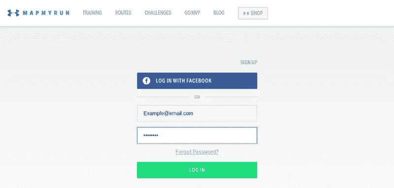

要单击登录按钮，我们可以通过它的类来选择它，它有多个类。为了处理 RSelenium 中的复合类，我们需要使用`css`作为我们的选择器。

```
login <- remDr$findElement(using = 'css', "[class='success-2jB0o button-2M08K medium-3PyzS button-2UrgI button-3ptrG']")login$clickElement()
```

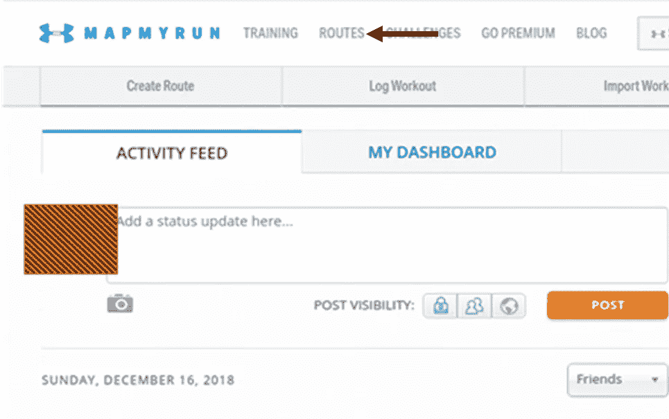

Some personal information blocked out

我们已经登录，并在我们的主页。要访问发布的路线，我们需要导航到查找路线页面，该页面位于左上方的路线下拉列表中。

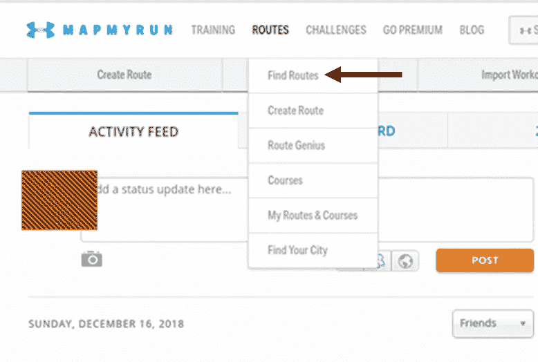

我用另一个相对 xpath 选择它。

```
findRoutes<- remDr$findElement(using = “xpath”,
“//header/div[1]/nav[1]/ul/li[2]/ul/li/a”)
```

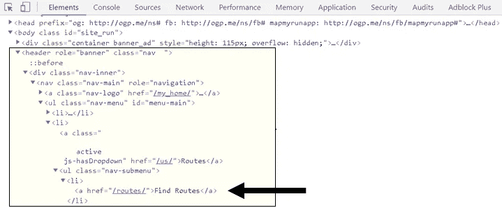

The HTML for our homepage, with the xpath to the Find Routes link highlighted.

```
findRoutes$clickElement()
```

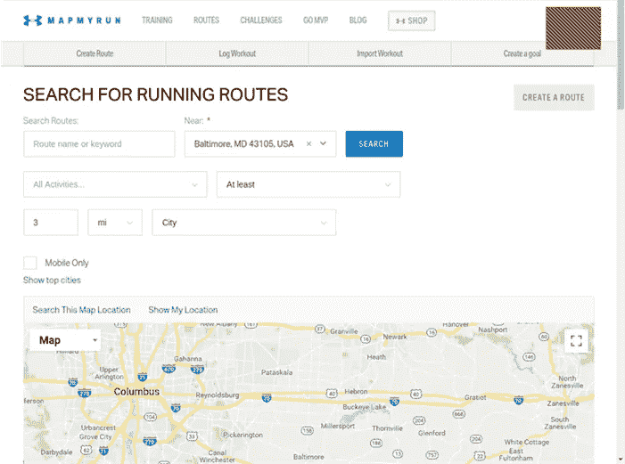

我们已经创建了 routes 页面，但是现在我们需要在 Near 部分输入我们的城市。MapMyRun 将为您提供一个默认位置(称为**占位符**，但这可能是错误的——在我的例子中，它将马里兰州的巴尔的摩与俄亥俄州的哥伦布的邮政编码组合在一起！我们将通过点击它旁边的`x`来清空它，这是一个带有类`“Select-clear”`的< span >。

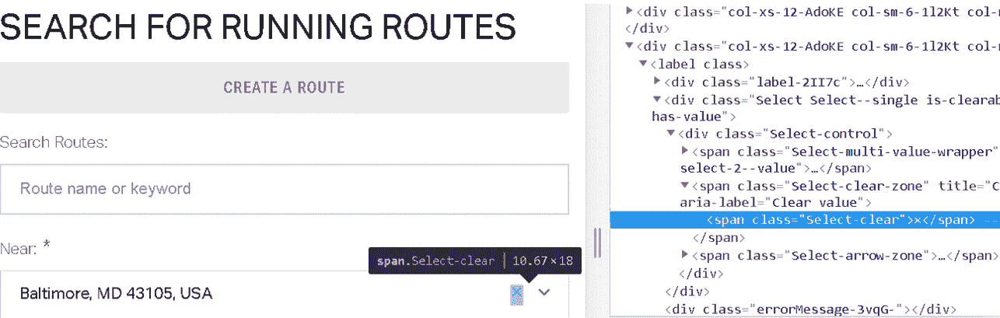

```
clear <- remDr$findElement(using = “class”, value=”Select-clear”)clear$clickElement()
```

由于 Near 元素没有惟一的 ID、名称或类，我们转而使用`findElements`找到页面上的所有元素，选择第二个元素，并使用 tab 键发送我们的城市信息进行自动填充。

```
**# Find all input elements with findElements.**
inputElements <- remDr$findElements(using = “css”, value=”input”) **# Choose the second one.** city <- inputElements[[2]]**# Send city info and the code for the tab key, uE004.** city$sendKeysToElement(list(“Baltimore, MD, 21231”, “\uE004”))
```


还有一点:我们希望获得所有上传的活动，而不仅仅是三英里以上的活动。

```
distance <- remDr$findElement(using = “name”, value = “distanceMinimum”)distance$sendKeysToElement(list(key = “backspace”, “0”))
```

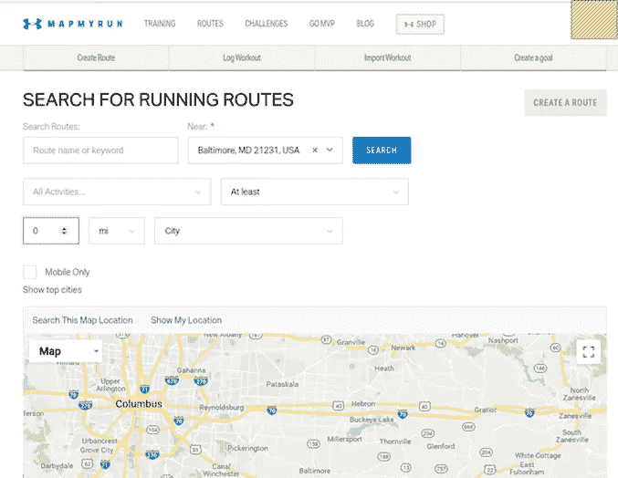

我们现在可以单击 search 按钮，它有一个复合类。

```
searchButton <- remDr$findElement(using = "css", "[class = 'primary-xvWQU button-2M08K medium-3PyzS']")searchButton$clickElement()**#Scroll down the page to see the results.** webElem <- remDr$findElement(“css”, “body”)
webElem$sendKeysToElement(list(key = “end”))
```


HTML 表格中间的每个链接都是指向保存运行数据的网页的链接。

我们需要一个功能，将下载 20 个链接(这是 HTML 元素)，按下一步按钮，并重复。我用一个 while 循环来完成这个操作，只要页面底部有一个“上一步”和“下一步”按钮，这个循环就会持续下去，当它下载完所有的锻炼数据时就会结束。由于这些按钮都是带有类`pageLink-3961h`的元素，我告诉 ChromeDriver 只要有两个这样的元素就继续下载。

```
**# Initialize a starter matrix** runs <- as.tibble(matrix(nrow = 20))**# Start the while loop** while (length(remDr$findElements(using = ‘xpath’,
  “//a[@class= ‘pageLink-3961h’]/span”)) == 2){**# Find the 20 links on the page that contain “routes/view”.** links <- remDr$findElements(‘xpath’, “//a[contains([@href](http://twitter.com/href), ‘routes/view’)]”)**# Save these in the runs starter matrix** for (i in 1:length(links)){
  runs<- links[[i]]
  runs<- runs$getElementAttribute(“href”)
  runs[i,1] <- paste(runs, sep=””)
}**# Add 20 more empty rows to the matrix to put the next set of links in.** runs <- rbind(as.tibble(matrix(nrow = 20)), runs)**# Click the next button** next<- remDr$findElement(using = ‘xpath’,
“//a[@class= ‘pageLink-3961h’][2]/span”)next$clickElement()**# Wait to make sure the webpage fully loads.** Sys.sleep(10)
}
```

在`runs`数据框架中，我们现在有一个 20，000 个网址的列表，每个网址都链接到一个跑步者的网页。我们需要另一个循环来告诉 Selenium 打开每个 URL，将其导出为 GPX 文件，然后重复。

```
for (i in 1:20000){

  **# Navigate to this URL.** remDr$navigate(paste0(runs[i,]))**# Finds the element with the ID “export_this_route”** exportRoute <- remDr$findElement(using = "id", value = "export_this_route")
```

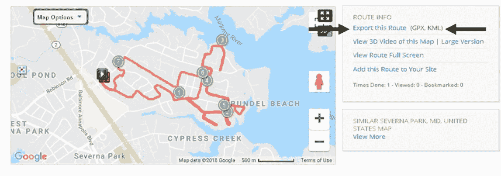

The web element with ID of “export_this_route”.

点击这个元素应该会打开一个下拉菜单，但是并不总是有效。所以我使用了一个 while 循环:只要下拉菜单(它有 ui_widget_overlay 的类)没有打开，就一直点击。

```
while(length(remDr$findElements(using= “xpath”,
“//div[[@class](http://twitter.com/class)=’ui-widget-overlay’]”))==0){

  exportRoute$clickElement()
}
```

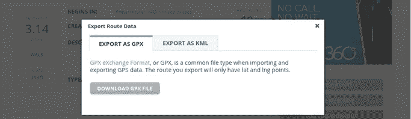

The dropdown that appears after clicking “Export This Route”.

我们想点击“下载 GPX 文件”按钮。我们可以通过查看 HTML 来找出它的 ID。

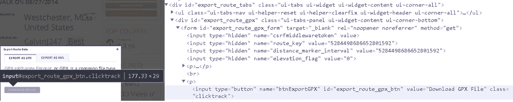

The button has an ID of “export_route_gpx_btn”

```
gpxButton<- remDr$findElement(
    using = "id", value = "export_route_gpx_btn")gpxButton$clickElement()**# End the for loop** }
```

这些 GPX 文件将位于您在启动 Selenium 时确定的文件夹中。

# 结论

下载完这些 GPX 文件后，我对坐标进行了合并、归一化和对数变换。然后，我将数据发送给 Javascript，并使用传单标记集群插件来创建地图。但是这部分的分析将不得不放在另一篇文章中。你可以在 [Kaggle](https://www.kaggle.com/jessekerr/bmoresbestroutes) 上查看或使用数据集，也可以在这里查看地图[。感谢您的阅读，记得关注并发微博给我](https://bmoresbestroutes.herokuapp.com/) [@halfinit](https://twitter.com/halfinit) ！