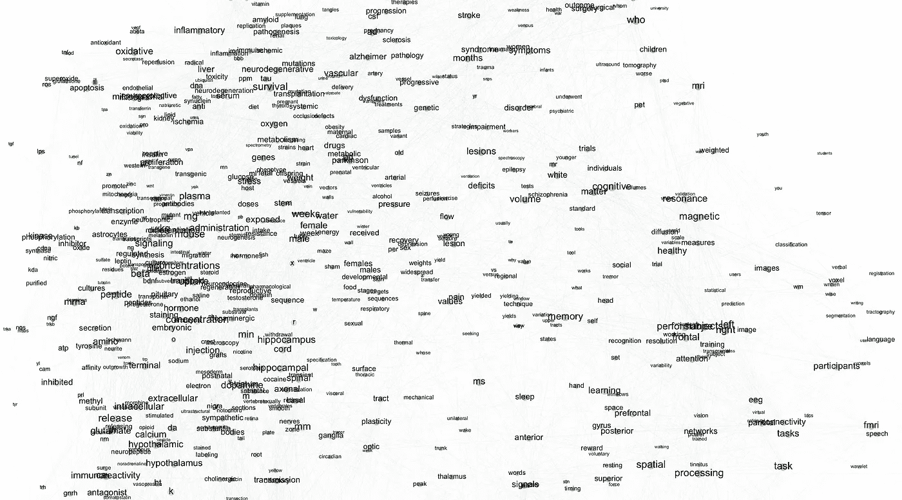
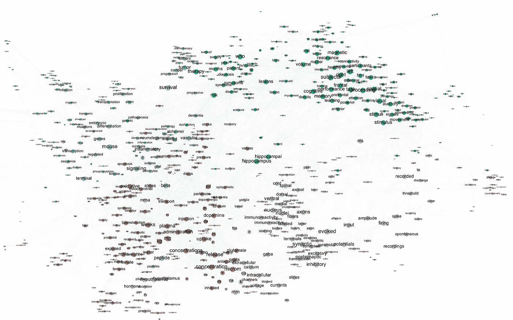
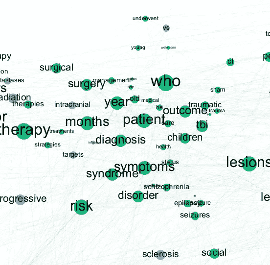
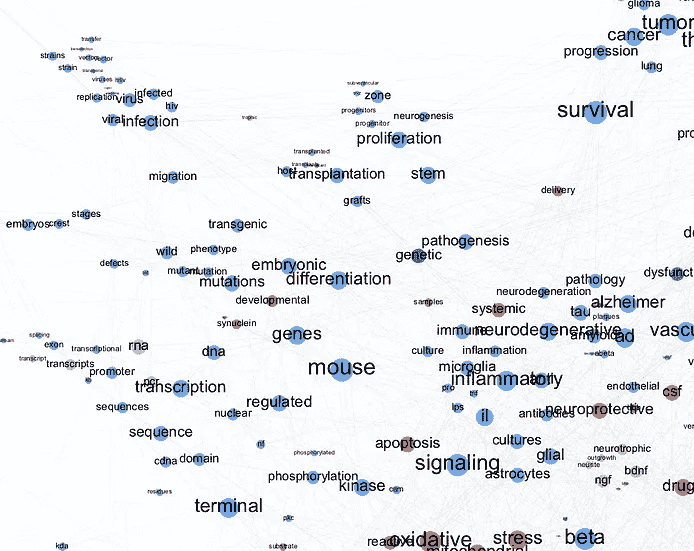
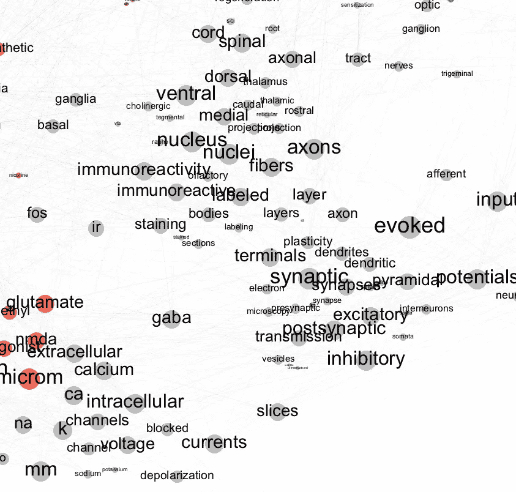
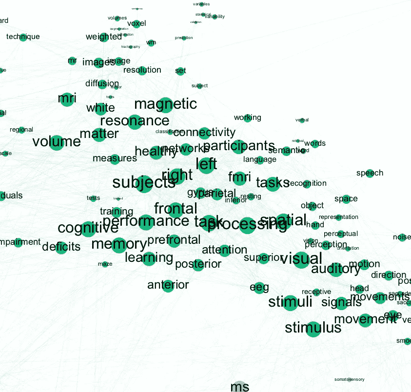

# 绘制神经科学的图景

> 原文：<https://towardsdatascience.com/mapping-the-landscape-of-neuroscience-s-bc14628e8713?source=collection_archive---------7----------------------->

关于现代神经科学研究，对 100 多万篇文章的分析能告诉我们什么

神经科学是一个多样化的科学领域，由不同的学科组成:生物学、心理学、计算机科学、语言学等等。脑科学的主要目标是了解神经系统。然而，通向这一崇高目标的道路因领域而异。这种多样性源于这样一个事实，即大脑(或一般的神经系统)是已知宇宙中最复杂的器官，包含许多层次的动力学和复杂性。

所有这些多样性使得神经科学的语义界限更加难以界定。我们能不能用一种数据驱动的方法来阐明这样的边界，而不是被动地思考这样的边界可能是什么？

# **地图**

让我们通过重新使用人类最伟大的发明之一:地图来解决这个问题。它们的主要功能是在一个有限的空间内概括感兴趣的世界，而不是像高度详细的卫星图像那样将真实世界复制到最后的细节。换句话说，地图仅仅是近似值，它突出了感兴趣的特定部分，而忽略了不相关的部分。因此，所有的地图都是有目的的。例如，纽约市的地图可能会突出显示[街区](https://www.nyctourist.com/images/maps/map_hoods4.gif)、[地铁系统](https://pixel.nymag.com/imgs/daily/intelligencer/2016/05/26/26-subway-map-1.nocrop.w536.h2147483647.jpg)、[自行车路线](http://www.nyc.gov/html/dot/images/bicyclists/2015-bike-map.jpg)或[旅游景点](https://www.pinterest.com/pin/284008320225777134/)。虽然这些地图都不是纽约的准确代表，但它们都很有用。

我们能否重新利用绘制城市地图的概念来制作类似“神经科学地图”的东西？自然语言处理(NLP)领域提供了很有前途的工具，可以让我们更进一步，剩下的就交给我们自己的创造力了。

首先，我们应该考虑将自由文本(从 PubMed 神经科学文章数据库中抓取的超过 1M 的文章摘要)转换为更结构化的表示，以便于操作。从技术上来说，我们将通过构建一个[文档术语矩阵(DTM)](https://en.wikipedia.org/wiki/Document-term_matrix) ，把摘要转换成一个[向量空间表示](https://en.wikipedia.org/wiki/Vector_space_model)。《DTM》的行里有所有的报纸，列里有单项选择。每个单元格的值代表一个单词 j 在文档 I 中出现的次数，因为我们会有一个非常大的词汇量，所以这个矩阵中的大部分值都被设置为零(这使得它成为一个[稀疏矩阵](https://en.wikipedia.org/wiki/Sparse_matrix))。使用这个矩阵，我们可以应用许多基本的数学技巧来回答我们的一些问题，如找到相似的单词、找到相似的论文、将论文分组(找到子字段)或对单词做同样的事情，等等。

正如我前面提到的，地图是根据一个特定的目标创建的，我有两个不同的目标或者两个地图。第一张地图将把潜在的语义可变性分成一个简单的范围。你可以把第一张地图想象成简单的语义罗盘。第二张图总结了单词相似度结构:什么单词和什么单词最相似，哪组单词和哪组最相似。这两张地图将在解开现代神经科学研究中潜在的语义景观方面相互补充。

# 故事 1——提取语义指南针

如果你要决定适用于研究领域的最简单(也是最通用)的标准，你可能会从基础研究开始，从应用研究开始。这些行中的数据驱动标准可以帮助我们阐明哪些维度或信息在整个词汇表中最具区分性。

[对应分析](https://en.wikipedia.org/wiki/Correspondence_analysis)是一种定量方法，将任何给定单词的信息压缩成简单的频谱，同时保留任何相似单词的映射。

Map 1: [Correspondence Analysis](https://en.wikipedia.org/wiki/Correspondence_analysis) results

如果你仔细观察上面的地图，你会发现单词分成两大组:右组和左组。我们可以通过查看这些单词所属的类别来确定这些组的身份。对我来说，右组主要是关于认知成像研究，而左组主要是关于更基本的方法(分子和遗传)。稍微缩小一下，最有鉴别能力的标准可能更多的是关于研究工具，而不是被调查问题的性质(诚然，有时可能很难将两者分开)。

# 故事 2——揭示底层结构

虽然上面的地图作为一幅大图是有用的(并且在数学上更容易分析)，但它没有告诉我们底层的结构。如果我们把最相似的单词放在一起，利用我们所拥有的关于单词共现的信息，我们可能能够展示一个更准确和信息更丰富的画面。

Map 2: A network visualization of most common terms colored by the group they are most connected to.

在这里，我们看到一个更底层的结构。正如我们已经知道的，这个领域可以分成许多子域。也就是说，有一个临床神经科学集群(绿色)，一个认知神经科学集群(绿色)，一个神经生理学集群(灰色)和一个分子神经科学集群(红色)——以及更精细的集群。请注意，如果我对共现次数使用较低的阈值，可以显示更多的单词，但这可能会使网络更难正确可视化。

Close-ups.

虽然第二张图比前一张图更主观(也更不科学)，但它仍然有助于显示构成现代神经科学研究的大的子领域。

[乔治·博克斯曾经说过](https://en.wikipedia.org/wiki/All_models_are_wrong)“所有的模型都是错的，但有些是有用的。”根据这个美丽的引用，我们也可以声称，每个可视化的故事只说明了关于要分析的数据的本质的一部分真相。希望这篇文章是有用的和有价值的。

感谢阅读。