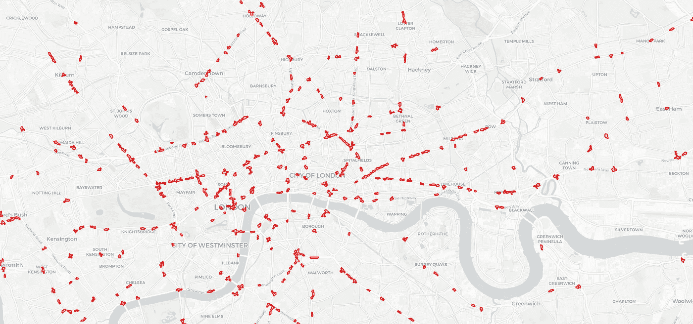

# 英国交通事故热点地图

> 原文：<https://towardsdatascience.com/mapping-the-uks-traffic-accident-hotspots-632b1129057b?source=collection_archive---------14----------------------->

Photo by [Chris Lawton](https://unsplash.com/@chrislawton?utm_source=medium&utm_medium=referral) on [Unsplash](https://unsplash.com?utm_source=medium&utm_medium=referral)

在寻找一些有趣的地理数据时，我偶然发现了英国政府发布的[道路安全数据](https://data.gov.uk/dataset/cb7ae6f0-4be6-4935-9277-47e5ce24a11f/road-safety-data)。这是一个非常全面的道路事故数据集，包括事件的地理坐标，以及其他相关数据，如当地的天气情况，能见度，警察出勤等。早在 2009 年就有可用的数据，一直到 2016 年，所以这是一个非常有趣的数据集，可以用于地理和机器学习目的。

当我看到这些数据时，我立即想到在地图上可视化它。也许有可能找出交通事故密度较高的地区？由于一年的数据量巨大，仅 2016 年就超过 136，000 个点，将所有的点都转储到交互式地图中的天真方法被证明是不可能的。根据我的经验，这对于一个交互式网络地图来说太多了。这里需要另一种方法，显而易见的想法是为此探索基于密度的聚类算法。

与将整个输入空间划分为互补区域或聚类的其他聚类算法相反，这里我们只关注交通事故密度较高的区域，而将所有其他点作为噪声丢弃。对于这些高密度区域中的每一个，我们将创建一个地理围栏，作为其周围的包络，并使用它作为其中包含的点的图形表示。这种新的地理实体(多边形)可以存储在地理数据库中，以后可以用于在英国非常繁忙的街道上行驶时提供驾驶辅助。想象一下你的车辆 GPS 系统的一个额外功能，它会通知你进入一个道路事故热点，就像它警告你不要靠近高速摄像机一样。我打赌你在那里会试着开车更安全，不是吗？

让我们想象一下，我们的任务是使用来自英国政府的数据来实现这样一个系统。我们必须以某种方式将这一长串地理位置转换成地理围栏，将道路事故地理密度较高的区域圈起来。有了[地理围栏](https://en.wikipedia.org/wiki/Geo-fence)——一种用地理坐标表示的多边形——我们可以很容易地测试你的车辆是否正在接近一个这样的热点，如果它已经进入或离开它。

# 基于密度的聚类

因此，为了检测事故热点，我们必须找到事故位置密度高的区域，并在每个区域周围绘制一个多边形。首先，我们必须澄清我们所说的密度是什么，以及如何测量它。此外，我们必须了解如何处理低密度区域。

> 基于密度的数据分析技术背后的基本思想是，感兴趣的数据集代表来自未知概率密度函数(PDF)的样本，该函数描述了负责产生观察数据的一种或多种机制。[1]

这里，我们将聚类定义为包围高密度区域的区域，而所有其他点将被视为噪声，因此从分析中丢弃。有几种算法可以处理这种类型的数据，我为本文选择的算法是 [DBSCAN](https://en.wikipedia.org/wiki/DBSCAN) [2]。

> 我们识别聚类的主要原因是，在每个聚类内，我们都有一个典型的点密度，该密度远高于聚类外的密度。此外，噪声区域内的密度低于任何聚类中的密度。[2]

你可以在这里阅读关于这个聚类算法[的很好的描述，并且本文中使用的实现是由](/how-dbscan-works-and-why-should-i-use-it-443b4a191c80)[scikit-learn](http://scikit-learn.org/stable/modules/generated/sklearn.cluster.DBSCAN.html)【3】提供的。注意，有两个非常重要的参数需要设置:聚类点之间的最小距离( *eps* )和每个聚类的最小点数( *minPts* )。为了更好地理解这些参数如何工作以及它们如何影响聚类结果，您可以在笔记本单元格上单独设置它们:

这里， *minPts* 参数被创造性地命名为 *num_samples* 。这些参数决定了什么属于一个聚类，什么被认为是噪声，因此这些参数将对最终聚类集的数量和大小产生直接影响。

运行 DBSCAN 实际上非常简单:

One-liner for running DBSCAN. See the GitHub repository for more information.

在对数据运行 DBSCAN 之后，我们得到了一个集群及其对应点的集合。噪声点用聚类号-1 标记，并从我们的分析中排除。

# 气泡

现在是用这些数据做有趣事情的时候了，在本文中，我们将使用每个星团的云的形状来绘制地理围栏。有几种策略可以做到这一点，比如绘制一个[凸包](https://en.wikipedia.org/wiki/Convex_hull)或者甚至一个[凹包](http://ubicomp.algoritmi.uminho.pt/local/concavehull.html)，但是这里我将使用一个非常简单的方法，可以称为“聚结气泡”。这个想法很简单:在每个点周围画一个圆，然后将它们合并在一起。像这样:

The “coalescing bubbles” process of geofence calculation.

这是一个两步的过程，我们首先将所有的位置点“膨胀”成一个给定半径的圆，然后将所有的圆合并成一个多边形。创建圆(*缓冲*)代码如下:

投影代码需要在米(我们用于圆半径的单位)和地理坐标(纬度和经度对)之间进行转换。至于半径，我们使用一个比 *eps* 小 0.6 倍的值，以避免出现非常大的圆。

让我们看看这在代码中是如何工作的。首先，我们必须根据聚类标识符对点进行分组。记住噪声点用-1 标记。

现在我们可以开始冒泡过程。为了提高效率，我使用了 *shapely* 中的 [*cascaded_union*](http://toblerity.org/shapely/manual.html#cascading-unions) 函数。

Bubble creation process

现在，我们可以使用上面创建的列表创建一个地理数据框架，并简单地绘制它。就像这样简单:

Create a geopandas GeoDataFrame and plot it.

最后，我们可以用两行代码将整个事情发送到一个交互式地图:

Show the interactive map.

完整代码可在相关的 [GitHub repo](https://github.com/joaofig/uk-accidents) 中获得。尽情享受吧！

London traffic accident hotspots example using data between 2015 and 2016.

# **所需包**

为了运行笔记本，您必须首先安装几个包，即 geopandas 和所有依赖项。这不是一个简单的任务，但幸运的是 Geoff Boeing 在他出色的博客文章[在 Windows 上使用 geo pandas](https://geoffboeing.com/2014/09/using-geopandas-windows/)中为我们简化了这个任务。

你还需要安装[笛卡尔](https://pypi.org/project/descartes/)包来渲染地图上的多边形。

最后，你还需要[mple leaf](https://pypi.org/project/mplleaflet/)，在浏览器上渲染交互式地图。

# **参考文献**

[1] [用于数据聚类、可视化和异常值检测的分层密度估计](https://dl.acm.org/citation.cfm?doid=2808688.2733381)

[2][sci kit-learn:Python 中的机器学习](http://jmlr.csail.mit.edu/papers/v12/pedregosa11a.html)，Pedregosa *等人*，JMLR 12，第 2825–2830 页，2011。

[3] Ester，m .，Kriegel，H.P .等人(1996)一种用于在带有噪声的大型空间数据库中发现聚类的基于密度的算法。KDD，226–231

[4] [用 Python 制作地图](http://michelleful.github.io/code-blog/2015/07/15/making-maps/)，米歇尔·富尔伍德