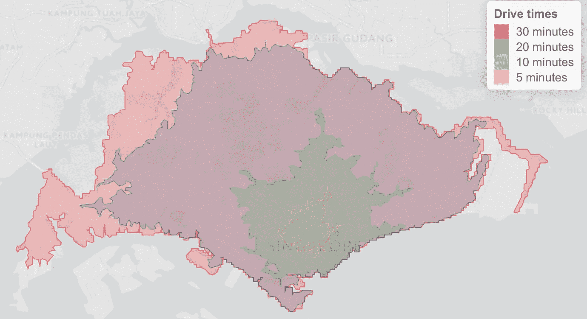
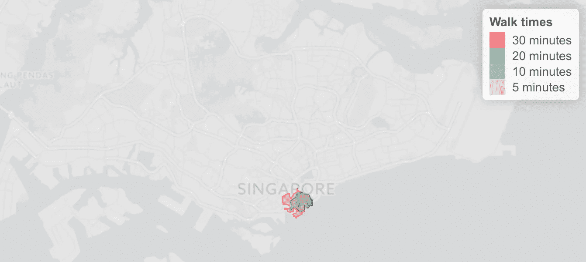

# 将旅行时间映射到新加坡的各个地方

> 原文：<https://towardsdatascience.com/mapping-travel-time-to-places-in-singapore-56cbdd2042c7?source=collection_archive---------4----------------------->

今天我正在玩 rmapzen 包来创建一些等时图。

等时线地图描绘了通过不同的交通方式到达特定位置的旅行时间相等的等值线。

在这里，我画出了开车去果园的时间和步行去海湾花园的时间。

Driving time to Ion Orchard

Walking time to Garden By the Bay

可以很好地利用等时线地图:例如，通过将等时线地图与地区/邮政编码 shapefile 重叠来缩小搜索范围，以查找公共交通 x 分钟内的工作场所，或者找出医疗保健设施覆盖最少的区域，教育部门覆盖最多的区域等。我还没有弄清楚是否可以用 rmapzen 创建多个等时线，来描绘到不同位置的旅行距离的轮廓。

这是我的[# 100 日项目](https://medium.com/@yanhann10)的第 38 天，在外出旅行几周后，我开始了数据科学和视觉故事讲述。完整的代码在我的 [github](https://github.com/yanhann10/opendata_viz) 上。感谢阅读，欢迎反馈。